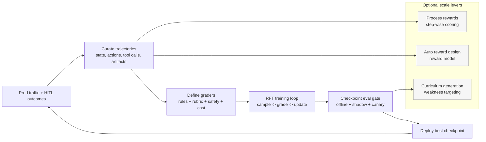

# Domain-Specific Agentic RL (RFT) for measurable lift

##

### What this is (and why it’s different from “fine-tuning for style”)

* **Agentic RL**: optimize the *whole workflow policy* (think: tool calls + intermediate decisions + long-horizon strategy), not just response text.
* Key pain it addresses: **long-horizon credit assignment** (good/bad outcomes happen many steps later). The survey highlights approaches like mixing **process-level signals** with final outcome rewards, and preference optimization over multi-step segments to improve strategic coherence.
* **OpenAI RFT** operationalizes this as: write a **numeric grader**, upload prompts (+ validation split), run RFT, monitor checkpoints, deploy the best checkpoint—optimized for the metric you actually care about.

### When to use RFT (decision rubric)

Use RFT when you have:

* **Clear success criteria**: experts can agree what “good” looks like (low ambiguity).
* **A gradeable output**: you can build a deterministic grader, LLM-based rubric grader, or multi-grader stack.
* **Headroom**: evals show the base system isn’t already at floor/ceiling performance.

Don’t use RFT when:

* The task is fundamentally subjective and experts don’t converge (rewrite the task or tighten the rubric).

### The “Agentic RL Training Flywheel” (portfolio diagram)

Why those optional levers matter:

* **Process-based supervision** improves learning signals in long workflows (denser feedback than end-only rewards).
* The survey also describes scaling patterns like **automating reward design** (via explorer trajectories + reward models) and **automated curriculum generation** that targets weaknesses to prevent overfitting and accelerate learning.

### Implementation blueprint (RFT-ready)

**1) Define “policy surface” (what you actually want to optimize)**

* Tool calls (which tool, when, with what args)
* Plan quality (task decomposition, ordering, stopping)
* Risk posture (ask clarifying questions vs proceed)
* Output format correctness (schemas, constraints)

**2) Data: capture trajectories, not just prompts**
Minimum logging schema:

* `context snapshot` (summaries, retrieved docs, constraints)
* `action sequence` (tool calls + intermediate outputs)
* `final output` (user-visible artifact)
* `outcome` (success label, KPI proxy, human approval)
* `cost` (tokens, tool cost, latency)

**3) Graders: stack them (multi-grader strategy)**
OpenAI supports multiple grader types (string checks, similarity, score-model grader, python execution) and **multigraders** to combine them.

A practical grader stack for agentic workflows:

* **Correctness**: deterministic checks, schemas, unit tests, invariants
* **Process quality**: rubric scoring (step order, assumption hygiene)
* **Safety & compliance**: policy checks, red flags, PII rules
* **Efficiency**: penalize tool spam, token waste, latency outliers

**4) Train and gate like production software**

* Baseline evals → RFT → checkpoint evals → shadow deploy → canary → full rollout.
* Adopt eval-driven iteration (OpenAI explicitly recommends eval-driven development + logging + automation).

### Failure modes & mitigations (RFT-specific)

* **Reward hacking**: model optimizes grader loopholes
  Mitigation: adversarial evals, holdout graders, random audits, multi-grader redundancy.
* **Over-optimization / narrow generalization**: wins on training rubric, loses in real traffic
  Mitigation: realistic traffic evals + shadow testing + drift monitors; curriculum refresh.
* **Process collapse** (e.g., verbose CoT, tool spam, premature stopping)
  Mitigation: efficiency penalties + stop-condition grading + tool budget constraints.
* **Safety regression** from pushing task success too hard
  Mitigation: safety grader is *non-negotiable* gate; rollout requires passing safety suite.

### Governance posture (how you keep control)

* **Permissions & approvals**: restrict tool scopes; require HITL for high-impact actions.
* **Audit trails**: log prompts/contexts/tool calls/outputs/grades/checkpoint IDs.
* **Rollout strategy**: offline → shadow → canary with automatic rollback on KPI/safety thresholds.
* **Change management**: every new grader/rubric is a “policy change” → version it, review it, and re-run regression.

---