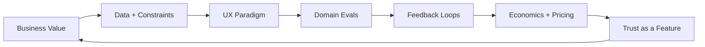
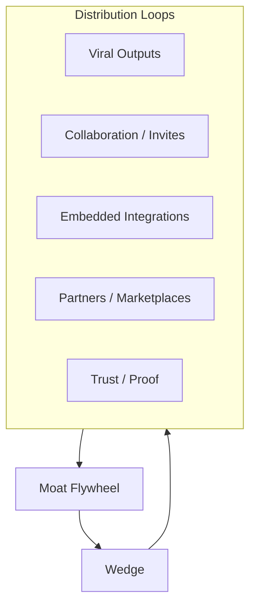
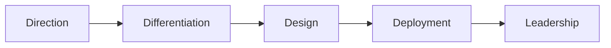

# Agentic AI Product + Business Strategy Playbook
**How to pick winning agent wedges, design adoption + distribution loops, price safely, and govern rollout**

> **Audience:** CTOs • Product Leaders • AI Engineers • Founders • Consulting Tech Leads  
> **Promise:** Build agentic products that **ship**, **stick**, and **scale** — with **trust** and **unit economics** that survive contact with reality.

<strong>North Star:</strong> Solve a workflow with measurable business value → pick a defensible wedge → design compounding loops → align pricing to “cost per successful outcome” → ship with trust, governance, and safe rollouts.

---

## Sidebar TOC
<aside class="toc">
<ul>
  <li><a href="#tldr">TL;DR</a></li>
  <li><a href="#positioning">Positioning: what makes an agent product different</a></li>
  <li><a href="#cards">Playbook cards</a></li>
  <li><a href="#framework">The 7-step AI Strategic Lens</a></li>
  <li><a href="#moats">Moats: data, distribution, trust</a></li>
  <li><a href="#distribution">3-layer distribution framework</a></li>
  <li><a href="#economics">Unit economics + pricing</a></li>
  <li><a href="#roadmap">Roadmap: from pilot to moat flywheel</a></li>
  <li><a href="#trust">Trust, risk, and governance posture</a></li>
  <li><a href="#metrics">Metrics that matter</a></li>
  <li><a href="#templates">Templates (copy/paste)</a></li>
</ul>
</aside>

---

## TL;DR
- Lead with **workflow ROI**, not model capability.
- Pick an **agent wedge** where the user *already pays* (time, money, compliance, risk).
- Win with **UX scaffolding**: guidance, approvals, guardrails, and “undo.”
- Distribution must be designed (loops), not hoped for (launches).
- Price around **cost per successful outcome** and include human review in the math.
- Ship with **trust as a feature**: transparency, auditability, safe rollout.

---

## Positioning: what makes an agentic product different
Agentic products are not “chatbots with tools.” They are **workflow systems** where the model:
- makes intermediate decisions,
- calls tools/APIs,
- iterates under constraints,
- and produces artifacts/results.

**Product implication:** the UI must clearly communicate:
- *what the system did*,
- *why it did it*,
- *what it plans to do next*,
- and *where the user can intervene*.

---

## Playbook cards (3 grids)

### Grid 1 — Strategy & wedge

### 🎯 Pick the wedge
Choose a workflow with clear value, clear ownership, and repeatable patterns.

### 🧩 Choose the UX paradigm
Copilot, Autopilot (with approvals), or Background agent.

### 🧱 Build moats early
Data, distribution, and trust — engineered, not hoped for.

### Grid 2 — Growth & distribution

### 🔁 Loop-based growth
Every output, collaboration, or integration can be distribution.

### 🧲 Workflow integration
Become invisible inside an existing workflow (where budgets already exist).

### 🧠 Compounding feedback
Capture corrections + outcomes → improve quality and defensibility.

### Grid 3 — Economics & governance

### 💰 AI economics aligned
Price to “cost per successful outcome,” not tokens.

### 🛡️ Trust as a feature
Guardrails, explainability, audit trails, and safety UX.

### 🚦 Safe rollout
Flags → canaries → A/B → rollback → kill switch.

---

## The 7-step AI Strategic Lens

<strong>Show the full 7-step framework + checklists</strong>

### Step 1 — Start with business value (not models)
- Pick a workflow where **time saved**, **errors reduced**, or **risk avoided** is measurable.
- Identify the economic buyer + who feels pain daily.

**Heuristic:** if you can’t write the ROI equation in one line, it’s not ready.

### Step 2 — Map your data flows (and constraints)
- What data exists today? Who owns it? What is sensitive?
- What are the “gold labels” (human decisions/outcomes) you can learn from?

### Step 3 — Choose your AI UX paradigm
- **Copilot:** user decides, agent assists (best for trust and early stage)
- **Supervised autopilot:** agent proposes/executes with approvals
- **Autopilot:** agent executes end-to-end with monitoring + audits (rare early)

### Step 4 — Build domain-specific evals
- Your moat is not “the model,” it’s your **definition of quality** and **how you measure it**.

### Step 5 — Design compounding feedback loops
- Capture corrections, approvals, and outcomes to improve:
  - relevance,
  - tool policies,
  - safety behavior,
  - and domain accuracy.

### Step 6 — Align business model to AI economics
- Optimize and price around: **cost per successful outcome** (incl. review time).

### Step 7 — Make trust a feature
- Safe actions, clear boundaries, auditability, and graceful fallback are not “compliance tasks.”
They’re why users adopt.

---

## Moats: data, distribution, trust

<strong>Show “3 moats” playbook + pitfalls</strong>

### 1) Data moat (compounding advantage)
- Proprietary outcomes, correction logs, or domain datasets
- Better evaluation sets and failure replays than competitors

**Pitfall:** collecting data without a plan to turn it into quality + retention.

### 2) Distribution moat (compounding reach)
- Built-in loop: every artifact, share, integration, or workflow output drives new usage.
- Community and ecosystems can act as channels.

**Pitfall:** “We’ll market it later” — for AI, distribution is part of product design.

### 3) Trust moat (hardest to copy)
- Reliable outputs, safe tool actions, transparent reasoning boundaries
- Compliance posture + audit trails
- Human oversight and rollback options for high-impact actions

**Pitfall:** trust debt accumulates faster than tech debt in AI.

---

## 3-layer distribution framework (wedge → loops → moat)

<strong>Show distribution layers + loop catalog</strong>

### Layer 1 — Wedge (why users try it)
- A narrow, high-frequency workflow with clear benefit.
- “First success within 5 minutes” onboarding.

### Layer 2 — Loops (why usage spreads)
Choose at least one loop you can measure:

- **Viral output loops:** every output is shareable distribution
- **Collaborative workflow loops:** one user naturally invites another
- **Embedded distribution loops:** integrate where users already work
- **Community loops:** users become channels
- **Partner / marketplace leverage:** platforms as multipliers
- **Trust loops:** more usage → more confidence → more adoption

### Layer 3 — Moat flywheel (why competitors can’t catch up)
- Data + evals improve quality
- Quality increases adoption and trust
- Distribution expands data collection and coverage

**Loop KPI examples**
- share rate per artifact
- invite conversion rate
- integration activation rate
- retention by workflow
- time-to-first-success

---

## Unit economics + pricing (cost per successful outcome)

<strong>Show pricing patterns + unit economics worksheet</strong>

### The core unit metric
**Cost per successful outcome** = (LLM + tool + infra + review labor) / successful tasks

Where “success” must be defined by your domain evals and user acceptance.

### Pricing patterns that work well for agentic products
- **Per seat** + usage guardrails (good for copilots)
- **Per workflow / module** (ties to value)
- **Per outcome** (hard but powerful)
- **Hybrid:** seat + outcome cap + overage

### Dangerous patterns
- pure “token-based pricing” visible to end users (misaligned incentives)
- unlimited autopilot without budgets or approvals (runaway cost and risk)

### Quick economics checklist
- [ ] p95 cost/task known for top 3 workflows
- [ ] human review minutes included
- [ ] guardrails reduce expensive failures
- [ ] budgets and stop rules in place
- [ ] pricing aligns with buyer’s value metric

---

## Roadmap: from pilot → differentiation → deployment → leadership

<strong>Show 5-phase roadmap</strong>

### Phase 1 — Direction
- workflow selection, ROI hypothesis, buyer/user alignment
- data access + security posture

### Phase 2 — Differentiation
- define domain evals, quality bar, and failure replays
- choose wedge and UX paradigm

### Phase 3 — Design
- UX scaffolding, guardrails, approvals, artifact workflows
- instrumentation and dashboards

### Phase 4 — Deployment
- pilot → canary → expansion
- capture outcomes and corrections (feedback loop)

### Phase 5 — Leadership
- scale teams + process
- evolve governance, compliance, partner strategy
- iterate on moats and loop optimization

---

## Trust, risk, and governance posture

<strong>Show governance posture checklist</strong>

### Permissioning & approvals
- deny-by-default tool access; explicit allowlists per role and environment
- read-only defaults; staged writes; “dry run” modes
- HITL for high-impact actions; interrupt + resume

### Auditability
- immutable logs: tool calls, approvals, versions, trace IDs
- reproducible configurations (prompt/model/tool policy hashes)

### Rollout strategy
- feature flags + progressive exposure
- canary cohorts + A/B tests for major behavior changes
- automated rollback on KPI regressions
- always-on kill switch for risky tools

### Risk model (simple)
- **Low-risk:** suggestions, drafts, summaries
- **Medium-risk:** internal tickets, code PRs, analytics
- **High-risk:** external comms, customer changes, financial actions, deletions
- **Critical:** regulated decisions (employment, credit, healthcare) → heavy oversight

---

## Metrics that matter (not vanity metrics)

<strong>Show KPIs by stage</strong>

### Adoption & retention
- time-to-first-success
- workflow retention (not “chat sessions”)
- user trust signals (acceptance rate, edits, overrides)

### Quality & safety
- domain eval pass rate
- groundedness / citation validity rate (where relevant)
- safety incident rate + severity
- intervention rate (HITL triggers)

### Economics
- p50/p95 cost per successful outcome
- margin per workflow
- cost spikes by tool and by cohort

### Operations
- latency per step; tool failure rates; loop count distribution
- regression rate from releases; rollback frequency

---

## Templates (copy/paste)

<strong>Show 1-page Agentic Product PRD + ROI worksheet</strong>

### 1-page Agentic Product PRD
- **ICP / user / buyer**
- **Workflow + “job to be done”**
- **Why agent (vs chatbot / automation)**
- **UX paradigm** (copilot / supervised autopilot / autopilot)
- **Tools + permissions + approvals**
- **Trust & safety UX** (guardrails, undo, explanations, audit)
- **Metrics** (adoption, quality, safety, economics)
- **Distribution loops** (which loop(s), KPI targets)
- **Rollout plan** (flags → canary → A/B → rollback)
- **Owner + on-call + incident playbook**

### ROI worksheet (fast)
- Baseline minutes per task × tasks/week × fully-loaded cost
- Error cost / risk cost avoided
- Review minutes required
- p95 cost per successful outcome
- Payback period and margin

---

### Notes for your site
- Collapsibles use HTML `
` / `
` (widely supported).  
- Mermaid diagrams require Mermaid rendering in your Markdown/MDX pipeline.

<a href="#top">Back to top ↑</a>
