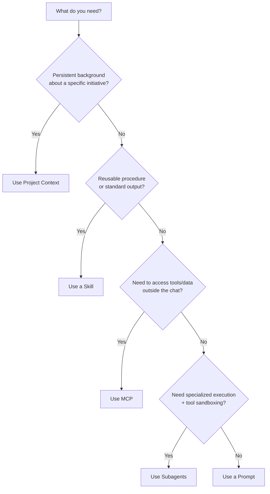
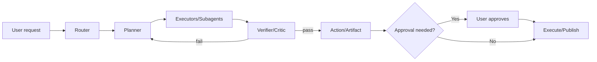
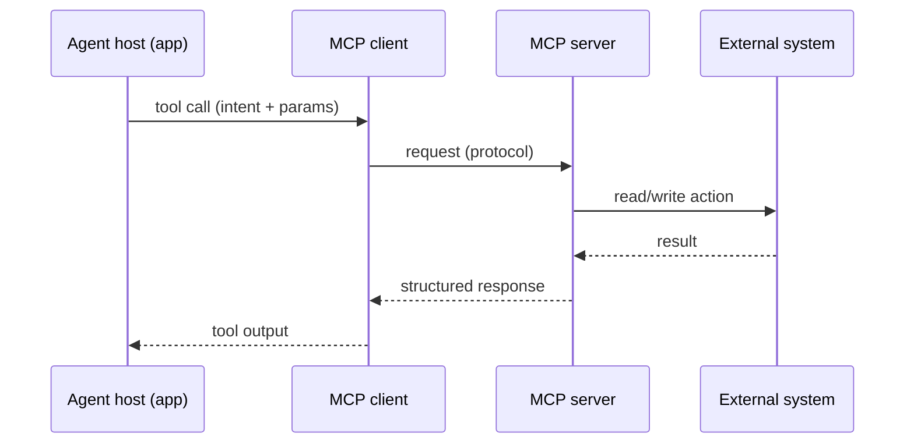

# Agentic Workflow Building Blocks Playbook
**Skills × MCP × Project Context × Subagents**  
*Portfolio-ready guide for senior engineers, tech leads, CTOs, and PMs (updated: 2025-12-20)*

> **Goal:** Build agentic workflows that are **reliable, governable, and scalable** by separating *what the agent knows* (context), *what it can do* (skills/subagents), and *what it can access* (MCP).

---

## The 60‑second mental model

### 1) Four layers that make agents work in production
```mermaid
flowchart TB
  U[User intent] --> P[Prompting & UX]
  P --> C[Project Context\n(static + retrieved)]
  C --> K[Skills\n(procedures + scripts + templates)]
  K --> E[Subagents\n(execution roles + permissions)]
  E --> T[MCP servers\n(data + tools)]
  T --> O[Outputs\nartifacts + actions]
  O --> Obs[Observability\ntraces + evals + audit]
  Obs --> K
  Obs --> E
```

### 2) One sentence each
- **Project Context**: persistent *background* for a workspace (docs, specs, knowledge base).
- **Skills**: reusable *procedures* and optional code/tools that load **on demand**.
- **Subagents**: specialized “workers” with **isolated context** and **tool permissions**.
- **MCP**: standardized connectors to **external data/tools** (your systems of record).

---

## Picking the right building block (decision cheatsheet)

### Decision tree


### Comparison table
| Component | What it is | Best for | Loads when | Key risk | Primary control |
|---|---|---|---|---|---|
| Prompt | in-chat instructions | one-off tasks, steering | each turn | inconsistency | prompt hygiene |
| Project Context | persistent workspace knowledge | long-running initiatives | always available in project | context bloat | curation + retrieval |
| Skill | packaged procedure + assets/scripts | standardizing outputs; institutional knowledge | **on-demand** | bad triggering / stale SOP | versioning + evals |
| Subagent | specialized worker agent | specialization, parallelism, permissioning | when invoked / routed | runaway actions | tool allowlists + HITL |
| MCP server | tool/data connector | secure access to systems | when tool invoked | data exfil / injection | auth + scopes + audit |

---

## How to design an agentic workflow (repeatable process)

### Step 1 — Map the workflow as “verbs”
Start from the end: **what artifacts/actions** must exist for the user to say *“this helped”*?

**Template**
- **Outcome**: (artifact/action)
- **User decision points**: (where human should choose)
- **Agent verbs**: (plan, search, draft, compute, validate, publish)
- **Quality bars**: (accuracy, tone, formatting, policy)
- **Constraints**: (time, cost, privacy, tools)

### Step 2 — Split responsibilities cleanly
Use this as a default split:

| Concern | Default home |
|---|---|
| Long-lived background (PRDs, codebase, policies, domain docs) | **Project Context** |
| “How we do this here” SOPs (style guides, checklists, validations) | **Skills** |
| Tool access (Drive, Jira, DBs, GitHub, internal APIs) | **MCP** |
| Specialized execution (reviewer, researcher, data analyst, builder) | **Subagents** |
| One-time steering and ambiguity resolution | **Prompts/UX** |

### Step 3 — Design for **progressive disclosure**
Keep the “always loaded” portion small; load deep details only when needed.

**Practical pattern**
- Skill metadata: tight trigger description, scope, boundaries
- SKILL.md body: workflow steps + validation + error handling
- Linked files: deep references, examples, checklists
- Scripts: deterministic operations (extract, transform, verify)

### Step 4 — Pick an orchestration pattern
Choose the simplest pattern that reliably clears your quality bar:

1. **Router**: classify → pick tool/skill/subagent
2. **Planner–Executor**: plan steps → execute with tools
3. **Critic / Reviewer**: generate → review → patch
4. **Human-in-the-loop**: propose → approve → execute



---

## Skills playbook (how to encode “institutional knowledge”)

### What makes a skill trigger reliably
**Write the description like a routing spec**, not like marketing copy.

**Checklist**
- ✅ includes *verbs* (extract, redline, draft, compute)
- ✅ includes *inputs* (PDF, docx, CSV, repo)
- ✅ includes *outputs* (table, patch, PRD, deck)
- ✅ includes **boundaries** (not for X; requires Y)

### SKILL.md template (drop-in)
```markdown
---
name: <kebab-case-name>
description: >
  Use when <trigger conditions>.
  Capabilities: <verbs>.
  Inputs: <types>.
  Outputs: <formats>.
  Boundaries: <what not to do>.
version: 0.1.0
owner: <team/person>
---

# <Display title>

## Success criteria
- ...

## Workflow
1. ...
2. ...

## Validation & self-checks
- ...

## Error handling
- ...

## Safety & boundaries
- ...

## References
- [link to internal doc]
- [link to examples]
```

### Skill portfolio strategy (what to showcase)
Build 6–10 “signature” skills that prove real-world competence:
- **Artifact generators**: PRDs, ADRs, RCA, runbooks, test plans
- **QA/verification**: rubric-based review, policy checks, linting gates
- **Domain SOPs**: “how we ship”, “how we deploy”, “how we evaluate”

---

## Project Context playbook (context engineering without bloat)

### Curate context as *products*, not dumps
**Your goal is recall precision**, not maximum ingestion.

**Three-tier context**
1. **Always-on**: glossary, system overview, constraints, guardrails
2. **Retrieval-first**: long docs, code, historical decisions
3. **User-provided per task**: new artifacts, ad-hoc attachments

### Context “source of truth” pattern
- Keep a **single canonical** “Project Overview” doc.
- Keep a **Decision Log** (ADRs) for why choices were made.
- Version important assets; link instead of copy/paste.

---

## Subagents playbook (specialization + safe autonomy)

### When subagents are worth it
Use them when you need at least one of:
- parallelism (research + build + QA at once)
- permission sandboxing (read-only reviewer)
- context isolation (don’t pollute main thread)
- stronger role priors (e.g., “security engineer”)

### Subagent configuration template
```yaml
name: code-reviewer
description: Reviews code changes for security, correctness, and style. Use automatically after edits.
tools:
  - read
  - grep
  - git
# omit write/edit to keep it safe
policy:
  autonomy: advise_only
  requires_approval_for: []
```

### Autonomy levels (simple rubric)
| Level | Agent does | Use when | Controls |
|---|---|---|---|
| 0 | suggest only | regulated/high risk | reviewer-only subagents |
| 1 | draft artifacts | medium risk | “approve to apply” |
| 2 | execute reversible actions | low-medium risk | allowlist + rollback |
| 3 | execute + iterate | low risk, high trust | strong eval gates |

---

## MCP playbook (tools + data integration)

### MCP in one picture


### What to put behind MCP (rules of thumb)
- ✅ systems of record (Drive, Jira, GitHub, DBs)
- ✅ deterministic operations (search, fetch, create ticket, run query)
- ✅ actions requiring auditing (approve, publish, deploy)

Avoid MCP for:
- ❌ “procedures” better expressed as **Skills**
- ❌ high-entropy reasoning (keep in model)

### Security baseline for MCP
- **Auth**: per-user, short-lived tokens where possible
- **Scopes**: least privilege per server/tool
- **Logging**: request/response metadata + actor
- **Prompt-injection posture**: treat tool outputs as untrusted text; sanitize and validate

---

## Failure modes & mitigations (what breaks, how you catch it)

| Failure mode | What it looks like | Detection | Constraint | Regression prevention |
|---|---|---|---|---|
| Bad routing | wrong skill/tool/subagent chosen | route-trace + confusion matrix | stronger descriptions, router thresholds | golden routing tests |
| Context overload | hallucinations, ignoring key facts | retrieval hit-rate, “missing citation” checks | progressive disclosure; summarize | context unit tests |
| Tool misuse | wrong params; unsafe actions | tool-call logs; canary tool runs | allowlists; approval gates | contract tests for tools |
| Prompt injection via MCP | tool output hijacks instructions | anomaly detection; “instruction in data” scans | treat output as data; strip/quote | red-team corpus + eval |
| Non-deterministic output | flaky artifacts | variance tests; diff-based checks | structured outputs + validators | snapshot tests |
| Silent quality regressions | “felt fine” but worse | human rating drift; eval dashboards | staged rollout + holdouts | CI eval gates |

### Minimal eval harness (practical)
- **Routing eval**: (intent → correct block)
- **Artifact eval**: rubric + lint + schema validate
- **Tool eval**: mocked server responses + contract tests
- **Safety eval**: adversarial prompts + data injection cases

---

## Governance posture (permissions, approvals, audit, rollout)

### Permissioning model (default)
- **Humans** own: policy decisions, publishing, irreversible actions
- **Agents** own: drafting, searching, analysis, reversible edits

### Approval gates (common)
1. **Before tool execution** (deploy, send, purchase, write to prod)
2. **Before artifact publish** (PRD, customer email, legal doc)
3. **Before scope expansion** (new connectors, new permissions)

### Audit trails (what to log)
- who asked → what agent did → which tools → which data sources → output hashes
- prompt/skill versions used
- approvals (who, when, what changed)

### Rollout strategy (safe defaults)
- **Shadow mode** → **Advisor mode** → **Limited execute** → **Full execute**
- feature flags per tool / per tenant
- canaries with small user cohort + fast rollback

---

## Build checklist (end-to-end)

### Before you ship
- [ ] workflow map + success metrics
- [ ] context curation + “source of truth” doc
- [ ] 3–5 core skills with crisp triggers
- [ ] subagents with least-privilege tool access
- [ ] MCP servers scoped + audited
- [ ] eval harness (routing + artifact + tool + safety)
- [ ] incident plan (kill switch, rollback, comms)

### After you ship
- [ ] observe: traces, cost, latency, tool failures
- [ ] collect failure cases → regression set
- [ ] skill/changelog governance
- [ ] quarterly pruning of stale skills/context

---

## A concrete “reference architecture” you can describe in interviews
```mermaid
flowchart TB
  UI[Chat UI\n+ artifact panel] --> Orchestrator[Orchestrator\n(router + planner)]
  Orchestrator -->|load| Project[Project Context\n(KB + RAG)]
  Orchestrator -->|load| SkillLib[Skill Library\n(SKILL.md + scripts)]
  Orchestrator --> SA1[Subagent: Researcher]
  Orchestrator --> SA2[Subagent: Builder]
  Orchestrator --> SA3[Subagent: Reviewer]
  SA1 --> MCP1[MCP: Web/Search + Docs]
  SA2 --> MCP2[MCP: Repo/CI + Build]
  SA3 --> MCP3[MCP: Policy + Security]
  Orchestrator --> Obs[Tracing + Evals + Audit]
  Obs --> SkillLib
  Obs --> Project
```

---

## References (for your portfolio page)
- Uploaded sources: Anthropic Skills posts and engineering writeups (see file links in this chat).
- Web sources: official MCP spec & docs, and Anthropic docs/blogs (see citations in chat response).
