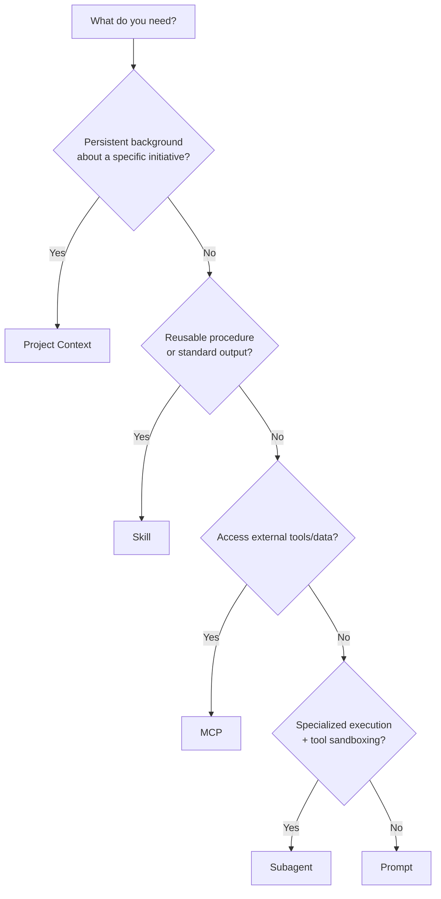
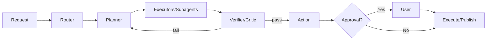
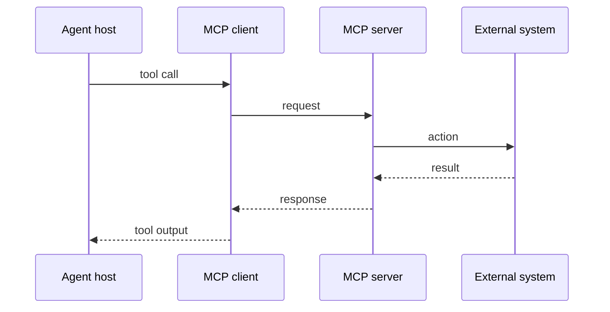

<!-- ========================= -->
<!-- Hero -->
<!-- ========================= -->

# 🧩 Agentic Workflows Playbook  
**Skills × MCP × Project Context × Subagents**  
Build agents that are *reliable, governable, and scalable*—without turning your prompt into a monolith.

**Audience:** Senior engineers, tech leads, CTOs, PMs  
**Use it for:** Designing agent architecture, capability packaging, tool integration, and safe autonomy

---

<!-- ========================= -->
<!-- Sidebar TOC (sticky) -->
<!-- ========================= -->

<nav class="toc">
  <strong>On this page</strong>
  <ul>
    <li><a href="#mental-model">Mental model</a></li>
    <li><a href="#choosing-blocks">Choosing the right building block</a></li>
    <li><a href="#design-process">Workflow design process</a></li>
    <li><a href="#skills">Skills playbook</a></li>
    <li><a href="#context">Project Context playbook</a></li>
    <li><a href="#subagents">Subagents playbook</a></li>
    <li><a href="#mcp">MCP playbook</a></li>
    <li><a href="#failure-modes">Failure modes & mitigations</a></li>
    <li><a href="#governance">Governance posture</a></li>
    <li><a href="#checklists">Ship checklists</a></li>
    <li><a href="#reference-architecture">Reference architecture</a></li>
  </ul>
</nav>

---

<!-- ========================= -->
<!-- Card Grid 1: Mental Model -->
<!-- ========================= -->

## 🧠 Mental model {#mental-model}

<div class="card-grid">

<div class="card">

### 🔩 The 4 layers
```mermaid
flowchart TB
  U[User intent] --> P[Prompting & UX]
  P --> C[Project Context\n(static + retrieved)]
  C --> K[Skills\n(procedures + scripts + templates)]
  K --> E[Subagents\n(execution roles + permissions)]
  E --> T[MCP servers\n(data + tools)]
  T --> O[Outputs]
  O --> Obs[Observability\ntraces + evals + audit]
  Obs --> K
  Obs --> E
```

</div>

<div class="card">

### 🧾 One sentence each
- **Project Context**: persistent *background* for a workspace  
- **Skills**: reusable *procedures* + optional scripts (load on-demand)  
- **Subagents**: specialized workers with isolated context + tool permissions  
- **MCP**: standardized connectors to external data & tools  

</div>

<div class="card">

### 🎯 Your north-star
Agents are production-ready when they:
- **route correctly** (right tool/skill/agent)
- **cite and validate** (no silent guesses)
- **operate safely** (least privilege + approvals)
- **improve over time** (failure capture → regression evals)

</div>

</div>

---

<!-- ========================= -->
<!-- Card Grid 2: Choosing Blocks -->
<!-- ========================= -->

## 🧭 Choosing the right building block {#choosing-blocks}

<div class="card-grid">

<div class="card">

### 🌳 Decision tree


</div>

<div class="card">

### 📊 Quick comparison
| Component | Best for | Main control |
|---|---|---|
| Prompt | one-off steering | prompt hygiene |
| Project Context | long-running initiative knowledge | curation + retrieval |
| Skill | standardizing outputs + SOPs | versioning + evals |
| Subagent | specialization + permissions | allowlists + HITL |
| MCP | tool/data integration | auth + scopes + audit |

</div>

<div class="card">

### ⚠️ Anti-patterns
- stuffing **procedures** into project context  
- turning a single skill into “everything” 
- giving subagents broad write permissions by default  
- using MCP for *reasoning* instead of *access*

</div>

</div>

---

<!-- ========================= -->
<!-- Card Grid 3: Design Process -->
<!-- ========================= -->

## 🧱 Workflow design process {#design-process}

<div class="card-grid">

<div class="card">

### 1) Map outcomes → verbs
- Outcome artifact/action
- Human decision points
- Agent verbs (plan/search/draft/validate/publish)
- Quality bars
- Constraints (cost/privacy/time)

</div>

<div class="card">

### 2) Split responsibilities
| Concern | Default home |
|---|---|
| background | Project Context |
| SOPs | Skills |
| tool access | MCP |
| execution roles | Subagents |
| ambiguity | UX/Prompts |

</div>

<div class="card">

### 3) Pick orchestration
Router → Planner/Executor → Reviewer → HITL  


</div>

</div>

---

<!-- ========================= -->
<!-- Collapsibles: Deep Dives -->
<!-- ========================= -->

## 📦 Deep dives (expand as needed)

<details id="skills">
<summary><strong>🧰 Skills playbook</strong> — encode “how we do this”</summary>

### What makes a skill trigger reliably
- include verbs + inputs + outputs + boundaries  
- treat description like a routing spec

### SKILL.md template
```markdown
---
name: <kebab-case-name>
description: >
  Use when <trigger conditions>.
  Capabilities: <verbs>.
  Inputs: <types>.
  Outputs: <formats>.
  Boundaries: <what not to do>.
version: 0.1.0
owner: <team/person>
---

# <Display title>

## Success criteria
- ...

## Workflow
1. ...
2. ...

## Validation & self-checks
- ...

## Error handling
- ...

## Safety & boundaries
- ...
```

### Portfolio strategy
Build 6–10 signature skills:
- PRD/ADR/RCA/runbook generators  
- rubric-based reviewers  
- domain SOPs (shipping, deploy, incident)  

</details>

<details id="context">
<summary><strong>📚 Project Context playbook</strong> — persistent background, not a dumping ground</summary>

### Three-tier context
1. Always-on: glossary, overview, constraints, guardrails  
2. Retrieval-first: long docs, code, history  
3. Per-task: new artifacts, uploads  

### Source-of-truth pattern
- one canonical “Project Overview” 
- decision log (ADRs)  
- version assets; link instead of copy  

</details>

<details id="subagents">
<summary><strong>🧑‍🤝‍🧑 Subagents playbook</strong> — specialization + safe autonomy</summary>

### Use subagents when you need:
- parallelism  
- permission sandboxing  
- context isolation  
- strong role priors  

### Subagent template
```yaml
name: code-reviewer
description: Reviews code changes for security, correctness, and style.
tools: [read, grep, git]
policy:
  autonomy: advise_only
```

### Autonomy rubric
| Level | Agent does | Control |
|---|---|---|
| 0 | suggest only | reviewer-only |
| 1 | draft artifacts | approve-to-apply |
| 2 | reversible actions | allowlist + rollback |
| 3 | execute + iterate | eval gates |

</details>

<details id="mcp">
<summary><strong>🔌 MCP playbook</strong> — tools + data integration</summary>

### Sequence


### Put behind MCP
- systems of record (Drive/Jira/GitHub/DB)  
- deterministic ops (search/fetch/create ticket/run query)  
- auditable actions (publish/deploy)  

### Security baseline
- per-user auth  
- least-privilege scopes  
- tool-call logging  
- treat tool outputs as untrusted text  

</details>

---

<!-- ========================= -->
<!-- Failure Modes + Governance -->
<!-- ========================= -->

## 🧯 Failure modes & mitigations {#failure-modes}

| What breaks | Detection | Constraint | Prevent regression |
|---|---|---|---|
| bad routing | route traces | better descriptions + thresholds | golden routing tests |
| context overload | missing-citation checks | progressive disclosure | context unit tests |
| tool misuse | tool-call audits | allowlists + approval gates | contract tests |
| injection via MCP | anomaly scans | sanitize + validate | red-team corpus |
| flaky outputs | variance tests | schemas + validators | snapshot tests |
| silent regressions | eval dashboards | staged rollout | CI eval gates |

---

## 🛡️ Governance posture {#governance}

**Default:** Humans own irreversible actions; agents own drafting & reversible ops.

**Approval gates**
1) before executing tool actions (deploy/send/write prod)  
2) before publishing artifacts  
3) before expanding permissions/connectors  

**Audit trails**
- actor → tool calls → data sources → output hashes  
- skill/prompt versions  
- approvals (who/when/what changed)  

**Rollout**
Shadow → Advisor → Limited execute → Full execute  
Feature flags + canaries + fast rollback

---

## ✅ Ship checklists {#checklists}

**Before launch**
- [ ] workflow map + metrics  
- [ ] context curation + “source of truth” doc  
- [ ] core skills with crisp triggers  
- [ ] subagents least privilege  
- [ ] MCP scopes + logging  
- [ ] eval harness (routing/artifact/tool/safety)  
- [ ] kill switch + rollback plan  

**After launch**
- [ ] trace cost/latency/tool failures  
- [ ] capture failure cases → regression set  
- [ ] skill governance (owner + changelog)  
- [ ] prune stale context/skills quarterly  

---

## 🏗️ Reference architecture {#reference-architecture}

```mermaid
flowchart TB
  UI[Chat UI\n+ artifact panel] --> O[Orchestrator\n(router + planner)]
  O --> C[Project Context\n(KB + RAG)]
  O --> S[Skill Library\n(SKILL.md + scripts)]
  O --> A1[Subagent: Research]
  O --> A2[Subagent: Build]
  O --> A3[Subagent: Review]
  A1 --> M1[MCP: Docs/Search]
  A2 --> M2[MCP: Repo/CI]
  A3 --> M3[MCP: Policy/Security]
  O --> Obs[Tracing + Evals + Audit]
  Obs --> S
  Obs --> C
```

---

### 🔗 Downloads / reuse
- Use this page as-is, or copy into your site markdown renderer.
- The “standard playbook” markdown is also available as a standalone file (see downloadable link in chat).
