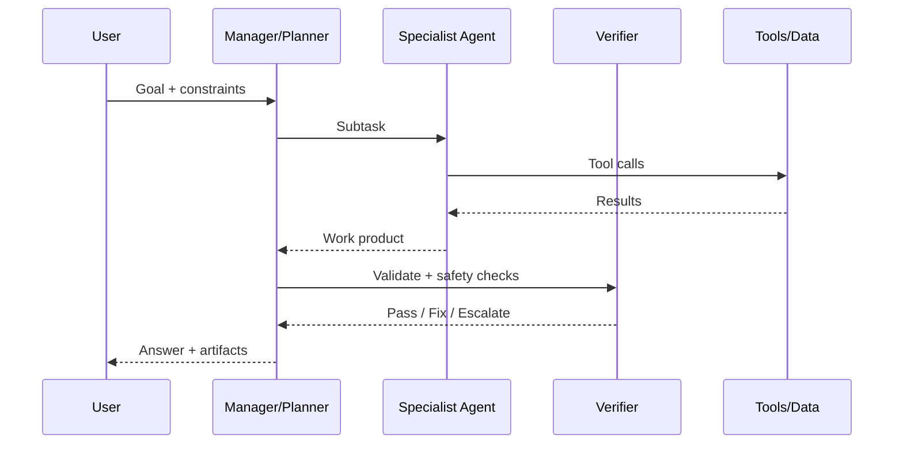

<a id="top"></a>

# Technical Playbook — Building Effective Agentic AI Systems
**Production patterns for reliability, safety, evals, observability, and governance**

> **Audience:** Senior Tech Leads • CTOs • AI/MLOps Engineers • Product Leaders  
> **Promise:** Ship the *smallest* agent that solves the job — and make it **safe, observable, and governable**.

<div class="callout">
<strong>North Star:</strong> Start with minimum autonomy. Treat tools as product. Add guardrails + evals + tracing. Govern rollouts with canaries + kill switches.
</div>

---

## Sidebar TOC
<aside class="toc">
<ul>
  <li><a href="#tldr">TL;DR</a></li>
  <li><a href="#should-this-be-an-agent">Should this be an agent?</a></li>
  <li><a href="#agent-stack">Agent stack (4 primitives)</a></li>
  <li><a href="#cards">Playbook cards</a></li>
  <li><a href="#orchestration">Orchestration ladder</a></li>
  <li><a href="#tools">Tools are product</a></li>
  <li><a href="#mcp">MCP integration</a></li>
  <li><a href="#guardrails">Guardrails + HITL</a></li>
  <li><a href="#observability">Observability</a></li>
  <li><a href="#evals">Evals (AgentOps)</a></li>
  <li><a href="#failure-modes">Failure modes & mitigations</a></li>
  <li><a href="#governance">Governance posture</a></li>
  <li><a href="#templates">Templates</a></li>
</ul>
</aside>

---

<a id="tldr"></a>
## TL;DR
- Start with the **minimum autonomy** that solves the job.
- Treat **tools as product**: strict contracts, permissions, budgets, idempotency.
- Add **guardrails + HITL** by default for high-impact actions.
- Ship with **tracing + evals** like you ship with tests + monitoring.
- Build an explicit **failure → replay → regression** loop.
- Govern rollouts with **feature flags + canaries + kill switches**.

---

<a id="should-this-be-an-agent"></a>
## Should this be an “agent”?
Use an agent when the job requires **multi-step decisions + tool use + iteration**, not “one prompt → one response.”

### The 3-box filter (agent-ready use case)
A use case is agent-ready only if it is:
- **Valuable** (measurable ROI: time, cost, risk, revenue)
- **Executable** (tools/data exist and can be accessed safely)
- **Governable** (you can bound impact + audit actions)

If any box fails: start with deterministic workflows, automation, or a single-shot assistant.

---

<a id="agent-stack"></a>
## Agent stack (4 primitives)
Agents are engineered from **four primitives**:

1. **Instructions** — what “good” means (testable, structured)
2. **Tools** — how it acts (APIs, DBs, file ops, MCP)
3. **Memory/Data** — what it knows (session, RAG, long-term)
4. **Orchestration** — how it plans/loops (routing, planners, subagents)

```mermaid
flowchart TB
  U[User] --> UI[Copilot UI]
  UI --> R[Agent Runtime]

  subgraph R[Agent Runtime]
    I[Instructions\n(system prompt + policies)]
    O[Orchestrator\n(router/planner)]
    T[Tools\n(functions/APIs/MCP)]
    M[Memory\n(session + RAG + long-term)]
    V[Verifier & Guardrails\nvalidate + stop rules]
  end

  I --> O
  O --> T
  O --> M
  O --> V
  T --> W[(World / Systems)]
  W --> T
  R --> Obs[Observability\ntraces + metrics]
  R --> E[Evals\nCI + staging + prod]
```

<div class="callout">
<strong>Mental model:</strong> every failure maps to one primitive. Fix the primitive — don’t just tweak prompts.
</div>

---

<a id="cards"></a>
## Playbook cards (3 grids)

### Grid 1 — Core mental models
<div class="card-grid">
<div class="card">

### 🧠 Autonomy ladder
Start simple; earn autonomy via eval evidence.

</div>
<div class="card">

### 🧩 Four primitives
Instructions • Tools • Memory • Orchestration.

</div>
<div class="card">

### 🔍 Glass-box agents
Traces + metrics + replayability from day 1.

</div>
</div>

### Grid 2 — Reliability & safety
<div class="card-grid">
<div class="card">

### 🛡️ Layered guardrails
Input → tool gating → output validation → stop rules.

</div>
<div class="card">

### ✅ Tool contracts
Typed IO, strict parsing, budgets, idempotency, rollback.

</div>
<div class="card">

### 🧪 Evals as a pipeline
CI → staging → prod monitoring; failures become tests.

</div>
</div>

### Grid 3 — Governance & rollout
<div class="card-grid">
<div class="card">

### 🔐 Least privilege
Deny-by-default tools, role-based capabilities, scoped creds.

</div>
<div class="card">

### 👤 HITL approvals
Interrupt + resume for high-risk actions; clear escalation.

</div>
<div class="card">

### 🚦 Safe shipping
Flags → canaries → A/B → rollback → kill switch.

</div>
</div>

---

<a id="orchestration"></a>
## Orchestration ladder (start simple)
<details>
<summary><strong>Show ladder + when to use each level</strong></summary>

**Rule:** Don’t build a multi-agent “society” until you’ve proven a single agent fails.

| Level | Pattern | Use when | Main risk |
|---:|---|---|---|
| 1 | Single-call + tools | one step + action | brittle prompts |
| 2 | Prompt chaining | fixed steps | latency |
| 3 | Routing | distinct categories → specialist flows | misroutes |
| 4 | Parallelization | speed or confidence | cost |
| 5 | Orchestrator–workers | dynamic decomposition | coordination bugs |
| 6 | Evaluator–optimizer loops | quality-critical outputs | loops + latency |

✅ Use multi-agent when you need:
- specialization (domain experts)
- parallel research or parallel checks
- independent verification / debate
- strict permission boundaries by role

⚠️ Avoid multi-agent when:
- the task is short and linear
- you lack evals/observability (you’ll ship chaos faster)

### Two stable patterns
1) **Manager–Worker** (manager decomposes, workers execute, manager synthesizes)  
2) **Handoffs** (control transfers to specialist agents)



</details>

---

<a id="tools"></a>
## Tools are product (Tool Contracts + ACI)
<details>
<summary><strong>Show tool contract checklist + ACI heuristics</strong></summary>

If the agent can call it, you need a **tool contract**:
- strict schema (typed inputs/outputs)
- permissioning (least privilege)
- budgets (rate limits, token caps, cost caps)
- retries/timeouts + idempotency
- audit logs + rollback plan

### ACI (Agent–Computer Interface) heuristics
- make tool names unambiguous
- embed examples + edge cases in tool descriptions
- return structured errors, not prose
- minimize “free-form” tool results

</details>

---

<a id="mcp"></a>
## MCP integration (tool/data plane)
<details>
<summary><strong>Show when MCP helps + security posture</strong></summary>

Use MCP when you have **many tools × many agents** and want:
- standard interfaces to tools/resources
- portability across runtimes
- centralized governance for tool access

Security posture:
- treat MCP servers as prod services (authn/authz, allowlists, logging)
- assume tool outputs can be malicious (prompt injection is real)
- validate everything at boundaries

</details>

---

<a id="guardrails"></a>
## Guardrails + Human-in-the-Loop (default stance)
<details>
<summary><strong>Show layered guardrails + HITL trigger policy</strong></summary>

Layer guardrails:
- **Failure-resistant input**: injection, policy, relevance checks
- **Tool gating**: allowlists + approvals for high-risk actions
- **Output validation**: PII/policy/format/schema checks
- **Stop rules**: loop caps, timeout, budget caps

### HITL trigger policy (example)
Require approval when:
- action is irreversible (payments, deletes, emails)
- tool result indicates high uncertainty
- safety classifier flags elevated risk
- agent exceeds retry/loop thresholds

</details>

---

<a id="observability"></a>
## Observability: make it a glass box
<details>
<summary><strong>Show minimum instrumentation + trace schema</strong></summary>

Minimum instrumentation:
- traces: generations, tool calls, handoffs, guardrails decisions
- step-level latency + cost (tokens, tool runtime)
- outcome labels: success/failure + reason codes

### Minimum trace schema
- run_id, agent_version, model_id, prompt_hash
- steps[]: tool_name, args_hash, status, retries, latency_ms
- totals: tokens_in/out, cost_estimate, p95 latency
- safety: flags, approvals, escalations

</details>

---

<a id="evals"></a>
## Evals: CI + staging + prod monitoring (AgentOps)
<details>
<summary><strong>Show 3-tier pipeline + failure→regression loop</strong></summary>

Agents need **scenario-driven, multi-metric** evals.

### 3-tier pipeline
1. **CI (every PR):** fast unit + golden tests  
2. **Staging/canary:** full suite + adversarial + rubric  
3. **Production:** A/B for major changes + continuous monitoring

```mermaid
flowchart LR
  PR[PR/Commit] --> CI[CI evals\n(unit + golden)]
  CI --> STG[Staging/Canary\nfull suite + rubric]
  STG --> PROD[Prod\nA/B + monitoring]
  PROD --> FAIL[Failures/Incidents]
  FAIL --> REG[Failure replays\nnew regression tests]
  REG --> CI
```

</details>

---

<a id="failure-modes"></a>
## Failure modes & mitigations (what breaks + what to do)
<details>
<summary><strong>Show failure taxonomy + detect/constrain/prevent</strong></summary>

### Failure modes (common + expensive)
| Category | What breaks | Typical symptom |
|---|---|---|
| Prompt injection | tool misuse, data exfiltration | agent follows hidden instructions |
| Tool hallucination | fake tool calls or invalid args | runtime exceptions, partial outputs |
| Excessive agency | “does too much” | unexpected actions, high cost |
| RAG brittleness | wrong context retrieved | confident wrong answers |
| Looping / thrashing | endless refine/retry | runaway latency + spend |
| Schema drift | tools change, outputs break | silent corruption |
| Multi-agent conflict | inconsistent outputs | contradictions |
| Data leakage | PII/secrets in outputs | compliance incidents |
| Non-determinism | flaky behavior | eval instability |

### Detect (signals you can automate)
- **Trace anomalies:** loop count spikes, tool retry spikes, sudden tool mix changes
- **Policy flags:** injection indicators, sensitive data detectors
- **Validators:** JSON schema checks, unit checks, citation checks
- **Canary alarms:** error rate, p95 latency, cost/task, intervention rate

### Constrain (make the blast radius small)
- **Least privilege tool allowlists** (per agent/subagent)
- **High-risk tool approvals** (interrupt + resume)
- **Budgets:** max steps, max tokens, max tool calls, max cost
- **Sandbox tools:** read-only mode, dry-run, staged writes
- **Idempotency keys** for side effects
- **Structured outputs** + strict parsing + rejection on failure

### Prevent regression (make failures non-repeatable)
- add every incident as a **failure replay** test case
- maintain **adversarial eval packs** (injection, jailbreak, data leakage)
- run evals in CI and block releases on key KPI regressions
- track deltas by agent_version + prompt_hash

### Failure postmortem template
- Incident summary + impact
- Reproduction trace (run_id)
- Root cause: instructions / tools / memory / orchestration
- Mitigation shipped
- New regression tests added
- Rollback/kill-switch criteria updated

</details>

---

<a id="governance"></a>
## Governance posture (permissions, approvals, audit, rollout)
<details>
<summary><strong>Show governance checklist</strong></summary>

### Permissions model (capability-based)
- tool access is granted per **role** and **environment** (dev/staging/prod)
- separate read vs write tools (read-only by default)
- scoped credentials (time-bound tokens, per-tenant access)
- deny-by-default + explicit allowlists

### Approvals & escalation
- define risk tiers: low/medium/high/critical
- enforce HITL for high-impact tools
- escalation routes: human reviewer → domain owner → security/compliance

### Audit trails (non-negotiable)
Store immutable logs:
- prompts (or prompt hashes), tool args hashes
- tool results metadata (status, size, source)
- approval decisions (who/when/why)
- model + agent versions
- full trace IDs for replay

### Rollout strategy (safe shipping)
- feature flags for progressive exposure
- canary releases on small traffic segments
- A/B tests for major behavior changes
- automated rollback when KPIs breach thresholds
- always-on “kill switch” for risky tools

**Rollout checklist**
- [ ] canary cohort defined
- [ ] KPIs + thresholds defined (quality, cost, safety, latency)
- [ ] rollback + kill switch tested
- [ ] audit logs verified
- [ ] incident on-call + playbook ready

</details>

---

<a id="templates"></a>
## Templates (copy/paste)
<details>
<summary><strong>Show one-page Agent Spec</strong></summary>

### One-page Agent Spec (required for each workflow)
- Goal / non-goals
- Autonomy level (1–6)
- Tools allowed + risk ratings + approval policy
- Memory policy (none/session/RAG/long-term)
- Budgets (steps/tokens/tool calls/cost)
- Stop conditions
- Evals plan (CI/staging/prod)
- Observability plan (trace schema + dashboards)
- Rollout plan (flags/canary/kill switch)
- Ownership + on-call

</details>

---

### Notes for your site
- The collapsible sections use HTML `<details>` / `<summary>` (widely supported in GitHub/GitLab-style Markdown renderers).  
- Mermaid diagrams require Mermaid rendering enabled in your Markdown/MDX pipeline.

<a href="#top">Back to top ↑</a>
