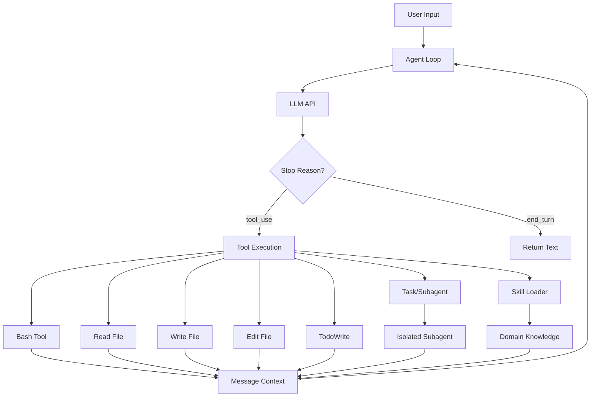
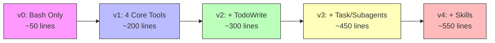
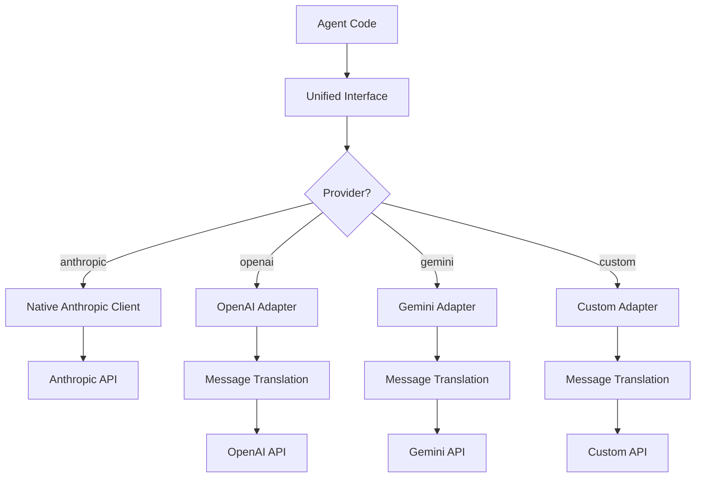
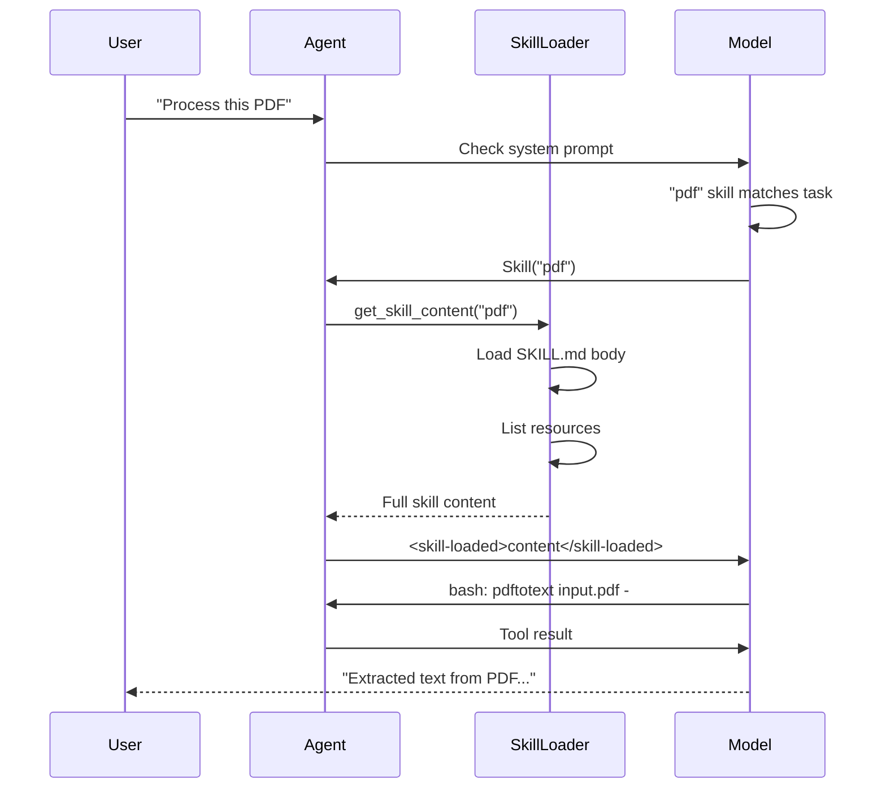
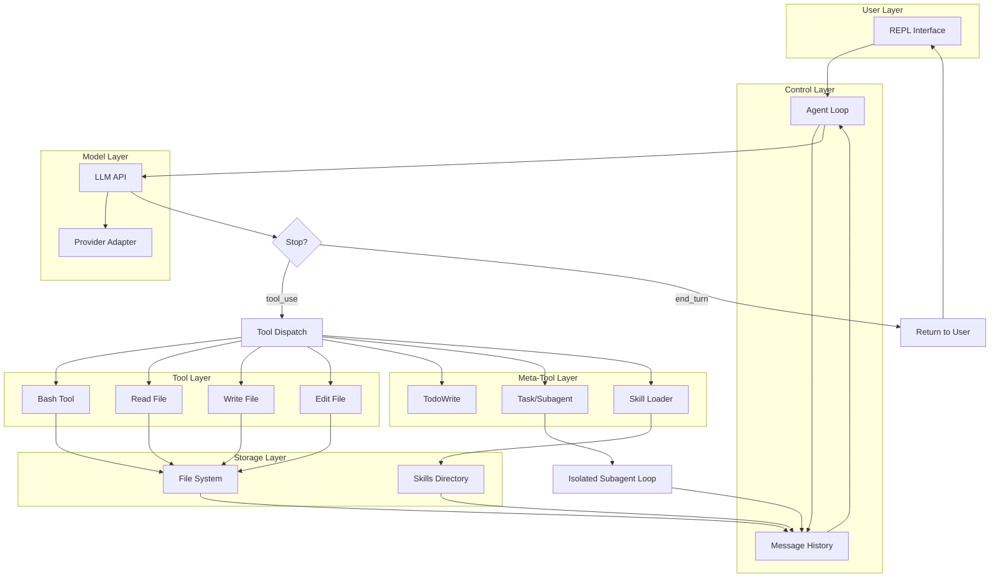
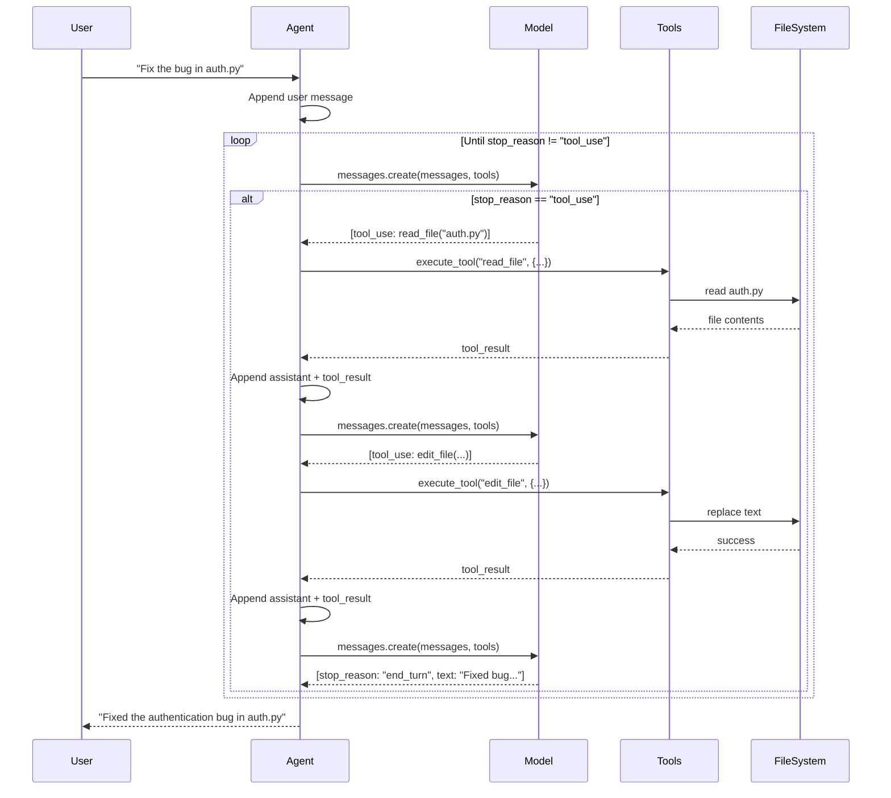
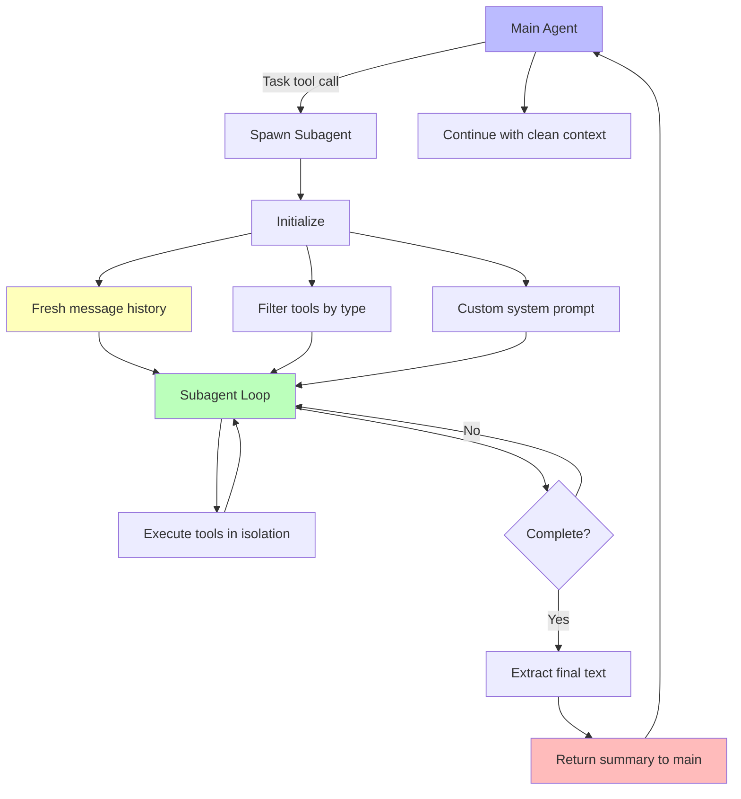
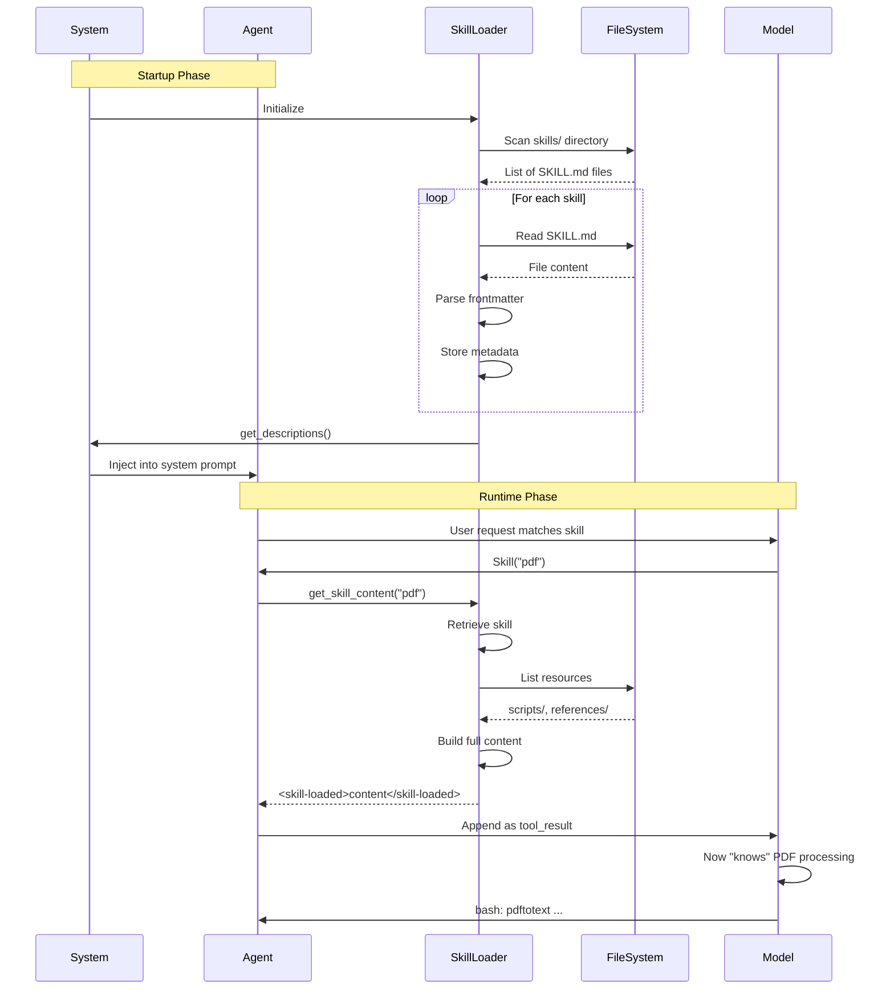
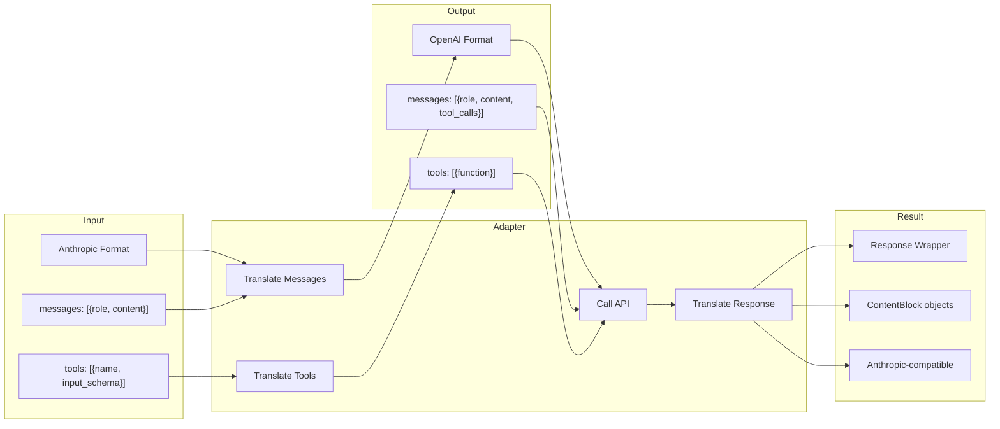
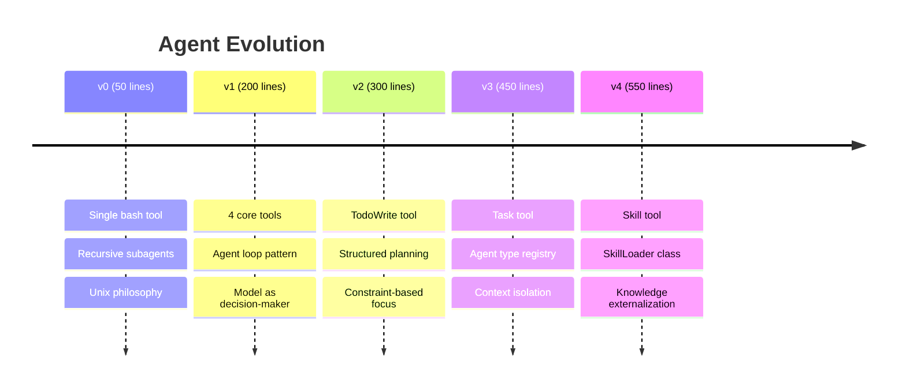

# Learn Claude Code: Comprehensive Repository Documentation

**A complete technical deep-dive into building AI coding agents from first principles**

---

## Table of Contents

1. [Executive Summary](#executive-summary)
2. [Project Philosophy](#project-philosophy)
3. [Architecture Overview](#architecture-overview)
4. [Progressive Version Evolution](#progressive-version-evolution)
5. [Complete Code Walkthrough](#complete-code-walkthrough)
6. [Multi-Provider Support](#multi-provider-support)
7. [Skills System](#skills-system)
8. [Design Patterns](#design-patterns)
9. [Mermaid Diagrams](#mermaid-diagrams)
10. [Configuration & Setup](#configuration--setup)
11. [Use Cases & Examples](#use-cases--examples)

---

## Executive Summary

**Learn Claude Code** is an educational repository that demystifies modern AI coding agents (like Claude Code, Cursor, Kode) by building progressively more sophisticated implementations from scratch.

### Key Statistics
- **5 progressive versions** (v0-v4): 50 → 200 → 300 → 450 → 550 lines
- **Total codebase**: ~2,800 lines across 11 Python files
- **Core insight**: "The model is 80%. Code is 20%"
- **License**: MIT
- **Languages**: English + Chinese documentation

### What It Teaches
1. **v0**: A single bash tool is sufficient for a complete agent
2. **v1**: The core agent loop in 200 lines (4 tools)
3. **v2**: Structured planning via explicit todo tracking
4. **v3**: Subagents with isolated context for task decomposition
5. **v4**: Skills mechanism for domain expertise injection

---

## Project Philosophy

> **"The model is 80%. Code is 20%"**

Modern AI agents work because the underlying model is trained to be an agent. The code's job is simple:
1. Provide tools (capabilities)
2. Run the loop (model decides what to do next)
3. Stay out of the way

This repository proves that agent systems are fundamentally simple. The complexity we see in production agents (Claude Code, Cursor) is polish, safety, and UX—not fundamental architecture.

### Core Principles

**1. Progressive Disclosure**
- Each version adds exactly ONE concept
- No feature creep, no over-engineering
- Learn by building, not by reading

**2. Model as Decision Maker**
Traditional chatbot: User → Model → Text Response
Agent system: User → Model → [Tool → Result]* → Response

The asterisk matters! The model calls tools repeatedly until the task is complete.

**3. Constraints Enable**
- Max 20 todos → prevents infinite lists
- One in_progress → forces focus
- Tool schemas → structured execution

Good constraints aren't limitations—they're scaffolding that enables complex behavior.

---

## Architecture Overview

### High-Level System Architecture



### Component Hierarchy

```
┌─────────────────────────────────────────────────┐
│            User Interface (REPL)                │
└─────────────────────────────────────────────────┘
                      ↓
┌─────────────────────────────────────────────────┐
│            Agent Loop (Core)                    │
│  • Message management                           │
│  • Tool dispatch                                │
│  • Stop reason handling                         │
└─────────────────────────────────────────────────┘
                      ↓
┌──────────────────┬──────────────────┬───────────┐
│   Tool Layer     │  Provider Layer  │ Meta Layer│
│  • bash          │  • Anthropic     │ • Todo    │
│  • read_file     │  • OpenAI        │ • Task    │
│  • write_file    │  • Gemini        │ • Skill   │
│  • edit_file     │  • Custom        │           │
└──────────────────┴──────────────────┴───────────┘
```

---

## Progressive Version Evolution

### Version Comparison Matrix

| Feature | v0 | v1 | v2 | v3 | v4 |
|---------|----|----|----|----|-----|
| **Lines of Code** | 50 | 200 | 300 | 450 | 550 |
| **bash tool** | ✅ | ✅ | ✅ | ✅ | ✅ |
| **read_file** | ❌ | ✅ | ✅ | ✅ | ✅ |
| **write_file** | ❌ | ✅ | ✅ | ✅ | ✅ |
| **edit_file** | ❌ | ✅ | ✅ | ✅ | ✅ |
| **TodoWrite** | ❌ | ❌ | ✅ | ✅ | ✅ |
| **Task (Subagent)** | ⚠️ | ❌ | ❌ | ✅ | ✅ |
| **Skill** | ❌ | ❌ | ❌ | ❌ | ✅ |
| **Agent Registry** | ❌ | ❌ | ❌ | ✅ | ✅ |
| **SkillLoader** | ❌ | ❌ | ❌ | ❌ | ✅ |
| **Multi-Provider** | ✅ | ✅ | ✅ | ✅ | ✅ |

⚠️ v0 implements subagents via recursive bash calls, not a Task tool

### Evolution Flow Diagram



---

## Complete Code Walkthrough

### v0: Bash is All You Need (~50 lines)

**Core Insight**: Unix philosophy—everything is a file, everything can be piped. Bash provides access to all functionality.

**Key Innovation**: Subagents via recursive self-calls through bash:
```bash
python v0_bash_agent.py "explore the codebase and summarize"
```

**Architecture**:
```python
# One tool definition
TOOL = [{
    "name": "bash",
    "description": "Execute shell command. Can spawn subagents via:
                   python v0_bash_agent.py 'task description'",
    "input_schema": {...}
}]

# The complete agent loop
def chat(prompt, history=None):
    history.append({"role": "user", "content": prompt})

    while True:
        response = client.messages.create(model=MODEL, system=SYSTEM,
                                         messages=history, tools=TOOL)

        if response.stop_reason != "tool_use":
            return extract_text(response)

        # Execute tools and append results
        results = [execute_bash(tc.input["command"]) for tc in tool_calls]
        history.append({"role": "assistant", "content": response.content})
        history.append({"role": "user", "content": results})
```

**Complete v0 Code**: [See v0_bash_agent.py in repository]

---

### v1: Model as Agent (~200 lines)

**Core Insight**: The model IS the agent. Give it 4 tools and it can do anything.

**The Four Essential Tools**:
1. **bash**: Run any command (git, npm, python, etc.)
2. **read_file**: Read file contents with optional line limits
3. **write_file**: Create/overwrite files
4. **edit_file**: Surgical text replacement

**Tool Implementation Pattern**:
```python
def safe_path(p: str) -> Path:
    """Ensure path stays within workspace (security)"""
    path = (WORKDIR / p).resolve()
    if not path.is_relative_to(WORKDIR):
        raise ValueError(f"Path escapes workspace: {p}")
    return path

def run_bash(command: str) -> str:
    """Execute with safety checks and timeout"""
    dangerous = ["rm -rf /", "sudo", "shutdown"]
    if any(d in command for d in dangerous):
        return "Error: Dangerous command blocked"

    result = subprocess.run(command, shell=True, cwd=WORKDIR,
                          capture_output=True, text=True, timeout=60)
    return (result.stdout + result.stderr).strip()[:50000]

def run_edit(path: str, old_text: str, new_text: str) -> str:
    """Replace exact text in file (surgical edit)"""
    fp = safe_path(path)
    content = fp.read_text()
    if old_text not in content:
        return f"Error: Text not found"
    # Replace only first occurrence for safety
    fp.write_text(content.replace(old_text, new_text, 1))
    return f"Edited {path}"
```

**The Agent Loop** (the heart of everything):
```python
def agent_loop(messages: list) -> list:
    """
    This is the CORE pattern ALL coding agents share:

    while True:
        response = model(messages, tools)
        if no tool calls: return
        execute tools, append results, continue
    """
    while True:
        # Step 1: Call the model
        response = client.messages.create(
            model=MODEL,
            system=SYSTEM,
            messages=messages,
            tools=TOOLS,
            max_tokens=8000
        )

        # Step 2: Extract tool calls
        tool_calls = [b for b in response.content if b.type == "tool_use"]

        # Step 3: If no tool calls, task is complete
        if response.stop_reason != "tool_use":
            messages.append({"role": "assistant", "content": response.content})
            return messages

        # Step 4: Execute each tool
        results = []
        for tc in tool_calls:
            output = execute_tool(tc.name, tc.input)
            results.append({
                "type": "tool_result",
                "tool_use_id": tc.id,
                "content": output
            })

        # Step 5: Append and continue
        messages.append({"role": "assistant", "content": response.content})
        messages.append({"role": "user", "content": results})
```

**Why This Works**:
1. Model decides which tools, in what order, when to stop
2. Tool results provide feedback for next decision
3. Conversation history maintains context across turns
4. No hard-coded logic—model orchestrates everything

---

### v2: Structured Planning (~300 lines)

**Core Insight**: Make plans visible. Without explicit tracking, agents lose focus on multi-step tasks.

**The Problem** (Context Fade):
```
v1: "I'll do A, then B, then C" (invisible, in model's "head")
    After 10 tool calls: "Wait, what was I doing?"
```

**The Solution** (TodoWrite):
```
v2:
  [ ] Refactor auth module
  [>] Add unit tests         ← Currently working on this
  [ ] Update documentation
```

**TodoManager Implementation**:
```python
class TodoManager:
    """
    Manages structured task list with enforced constraints.

    Constraints (not arbitrary—these are guardrails):
    • Max 20 items: Prevents infinite task lists
    • One in_progress: Forces focus on one thing
    • Required fields: content, status, activeForm
    """

    def __init__(self):
        self.items = []

    def update(self, items: list) -> str:
        """Validate and update todo list"""
        validated = []
        in_progress_count = 0

        for item in items:
            content = item.get("content", "").strip()
            status = item.get("status", "pending").lower()
            active_form = item.get("activeForm", "").strip()

            # Validation
            if not content or not active_form:
                raise ValueError("content and activeForm required")
            if status not in ("pending", "in_progress", "completed"):
                raise ValueError(f"invalid status '{status}'")

            if status == "in_progress":
                in_progress_count += 1

            validated.append({"content": content,
                            "status": status,
                            "activeForm": active_form})

        # Enforce constraints
        if len(validated) > 20:
            raise ValueError("Max 20 todos allowed")
        if in_progress_count > 1:
            raise ValueError("Only one task can be in_progress")

        self.items = validated
        return self.render()

    def render(self) -> str:
        """Render as human-readable text"""
        lines = []
        for item in self.items:
            if item["status"] == "completed":
                lines.append(f"[x] {item['content']}")
            elif item["status"] == "in_progress":
                lines.append(f"[>] {item['content']} ← {item['activeForm']}")
            else:
                lines.append(f"[ ] {item['content']}")

        completed = sum(1 for t in self.items if t["status"] == "completed")
        lines.append(f"\n({completed}/{len(self.items)} completed)")
        return "\n".join(lines)
```

**Tool Definition**:
```python
{
    "name": "TodoWrite",
    "description": "Update the task list. Use to plan and track progress.",
    "input_schema": {
        "type": "object",
        "properties": {
            "items": {
                "type": "array",
                "items": {
                    "type": "object",
                    "properties": {
                        "content": {"type": "string"},
                        "status": {"enum": ["pending", "in_progress", "completed"]},
                        "activeForm": {"type": "string"}
                    },
                    "required": ["content", "status", "activeForm"]
                }
            }
        }
    }
}
```

**Key Insight**: Structure constrains AND enables. The constraints (max 20, one in_progress) actually ENABLE complex task completion by providing focus.

---

### v3: Subagent Mechanism (~450 lines)

**Core Insight**: Process isolation = Context isolation. Spawn subtasks to keep main context clean.

**The Problem** (Context Pollution):
```
Single-Agent History:
  [exploring...] cat file1.py → 500 lines
  [exploring...] cat file2.py → 300 lines
  ... 15 more files ...
  [now refactoring...] "Wait, what did file1 contain?"
```

**The Solution** (Subagents):
```
Main Agent History:
  [Task: explore codebase]
    → Subagent explores 20 files (in its own context)
    → Returns ONLY: "Auth in src/auth/, DB in src/models/"
  [now refactoring with clean context]
```

**Agent Type Registry**:
```python
AGENT_TYPES = {
    "explore": {
        "description": "Read-only agent for exploring code, finding files",
        "tools": ["bash", "read_file"],  # No write access
        "prompt": "Search and analyze, never modify. Return concise summary."
    },
    "code": {
        "description": "Full agent for implementing features",
        "tools": "*",  # All tools
        "prompt": "Implement the requested changes efficiently."
    },
    "plan": {
        "description": "Planning agent for design strategies",
        "tools": ["bash", "read_file"],  # Read-only
        "prompt": "Analyze and output a numbered plan. Do NOT make changes."
    }
}
```

**Task Tool Implementation**:
```python
def run_task(description: str, prompt: str, agent_type: str) -> str:
    """
    Execute subagent with isolated context.

    Key steps:
    1. Create isolated message history (no parent context!)
    2. Use agent-specific system prompt
    3. Filter tools based on agent type
    4. Run same query loop as main agent
    5. Return ONLY final text (not intermediate details)
    """
    config = AGENT_TYPES[agent_type]

    # Agent-specific system prompt
    sub_system = f"""You are a {agent_type} subagent.
    {config["prompt"]}
    Complete the task and return a clear, concise summary."""

    # Filtered tools
    sub_tools = get_tools_for_agent(agent_type)

    # ISOLATED message history (the key!)
    sub_messages = [{"role": "user", "content": prompt}]

    # Run the same agent loop (silently)
    while True:
        response = client.messages.create(
            model=MODEL,
            system=sub_system,
            messages=sub_messages,
            tools=sub_tools,
            max_tokens=8000
        )

        if response.stop_reason != "tool_use":
            break

        # Execute tools and append to subagent's history
        results = [execute_tool(tc.name, tc.input) for tc in tool_calls]
        sub_messages.append({"role": "assistant", "content": response.content})
        sub_messages.append({"role": "user", "content": results})

    # Return only the final text summary
    return extract_text(response)
```

**Typical Flow**:
```
User: "Refactor auth to use JWT"

Main Agent:
  1. Task(explore): "Find all auth-related files"
     → Subagent reads 10 files in isolation
     → Returns: "Auth in src/auth/login.py, uses sessions"

  2. Task(plan): "Design JWT migration"
     → Subagent analyzes structure
     → Returns: "1. Add jwt lib 2. Create utils 3. Update login"

  3. Task(code): "Implement JWT tokens"
     → Subagent writes code
     → Returns: "Created jwt_utils.py, updated login.py"

  4. Summarize to user
```

---

### v4: Skills Mechanism (~550 lines)

**Core Insight**: Knowledge externalization. Store domain expertise in editable files, not model parameters.

**The Paradigm Shift**:
```
Traditional AI:
  Knowledge → Model parameters
  To add skills: Collect data → Train → Deploy
  Cost: $10K-$1M+, Timeline: Weeks

Skills System:
  Knowledge → SKILL.md files
  To add skills: Write a markdown file
  Cost: Free, Timeline: Minutes
```

**Tools vs Skills**:
| Concept | What it is | Example |
|---------|------------|---------|
| **Tool** | What model CAN do | bash, read_file, write |
| **Skill** | How model KNOWS to do | PDF processing, MCP dev |

**Progressive Disclosure**:
```
Layer 1: Metadata (always loaded)      ~100 tokens/skill
         name + description only

Layer 2: SKILL.md body (on trigger)    ~2000 tokens
         Detailed instructions

Layer 3: Resources (as needed)         Unlimited
         scripts/, references/, assets/
```

**SKILL.md Format**:
```markdown
---
name: pdf
description: Process PDF files. Use when reading, creating, or merging PDFs.
---

# PDF Processing Skill

## Reading PDFs

Use pdftotext for quick extraction:
```bash
pdftotext input.pdf -
```

For programmatic access, use PyMuPDF:
```python
import fitz
doc = fitz.open("input.pdf")
text = "\n".join(page.get_text() for page in doc)
```

## Creating PDFs
...
```

**SkillLoader Implementation**:
```python
class SkillLoader:
    """
    Loads and manages skills from SKILL.md files.

    A skill is a FOLDER containing:
    - SKILL.md (required): YAML frontmatter + markdown
    - scripts/ (optional): Helper scripts
    - references/ (optional): Documentation
    - assets/ (optional): Templates, files
    """

    def __init__(self, skills_dir: Path):
        self.skills_dir = skills_dir
        self.skills = {}
        self.load_skills()

    def parse_skill_md(self, path: Path) -> dict:
        """Parse SKILL.md into metadata and body"""
        content = path.read_text()

        # Match YAML frontmatter between --- markers
        match = re.match(r"^---\s*\n(.*?)\n---\s*\n(.*)$",
                        content, re.DOTALL)
        if not match:
            return None

        frontmatter, body = match.groups()

        # Parse YAML-like frontmatter
        metadata = {}
        for line in frontmatter.strip().split("\n"):
            if ":" in line:
                key, value = line.split(":", 1)
                metadata[key.strip()] = value.strip()

        return {
            "name": metadata["name"],
            "description": metadata["description"],
            "body": body.strip(),
            "path": path,
            "dir": path.parent
        }

    def load_skills(self):
        """Scan directory and load all SKILL.md files"""
        for skill_dir in self.skills_dir.iterdir():
            skill_md = skill_dir / "SKILL.md"
            if skill_md.exists():
                skill = self.parse_skill_md(skill_md)
                if skill:
                    self.skills[skill["name"]] = skill

    def get_skill_content(self, name: str) -> str:
        """Get full skill content for injection"""
        skill = self.skills[name]
        content = f"# Skill: {skill['name']}\n\n{skill['body']}"

        # List available resources
        for folder in ["scripts", "references", "assets"]:
            folder_path = skill["dir"] / folder
            if folder_path.exists():
                files = list(folder_path.glob("*"))
                if files:
                    content += f"\n\n{folder}: {', '.join(f.name for f in files)}"

        return content
```

**Cache-Preserving Injection** (Critical for cost efficiency):
```python
def run_skill(skill_name: str) -> str:
    """
    Load skill and inject into conversation.

    Why tool_result instead of system prompt?
    • System prompt changes invalidate cache (20-50x cost!)
    • Tool results append to end (prefix unchanged, cache hit)

    This is how production systems stay cost-efficient.
    """
    content = SKILLS.get_skill_content(skill_name)

    # Wrap in tags so model knows it's skill content
    return f"""<skill-loaded name="{skill_name}">
{content}
</skill-loaded>

Follow the instructions in the skill above."""
```

**System Prompt Integration**:
```python
SYSTEM = f"""You are a coding agent at {WORKDIR}.

**Skills available** (invoke with Skill tool when task matches):
{SKILLS.get_descriptions()}  # Layer 1: metadata only

Rules:
- Use Skill tool IMMEDIATELY when task matches a skill
- Skills provide detailed domain expertise
- Follow skill instructions precisely
"""
```

---

## Multi-Provider Support

The repository supports multiple AI providers through an elegant adapter pattern.

### Provider Architecture



### OpenAIAdapter Pattern

**The Elegant Trick**: `self.messages = self`

This allows agent code to call:
```python
client.messages.create(...)
```

Which resolves to:
```python
adapter.create(...)
```

**Complete Adapter Implementation**:

```python
class OpenAIAdapter:
    """
    Adapts OpenAI client to look like Anthropic client.

    Key Magic: self.messages = self
    Allows: client.messages.create(...) → adapter.create(...)
    """

    def __init__(self, openai_client):
        self.client = openai_client
        self.messages = self  # Duck typing magic!

    def create(self, model: str, system: str, messages: List[Dict],
               tools: List[Dict], max_tokens: int = 8000):
        """
        Core translation: Anthropic → OpenAI → Anthropic
        """
        # 1. Convert Messages (Anthropic → OpenAI)
        openai_messages = [{"role": "system", "content": system}]

        for msg in messages:
            if msg["role"] == "user":
                if isinstance(msg["content"], str):
                    openai_messages.append({"role": "user",
                                          "content": msg["content"]})
                elif isinstance(msg["content"], list):
                    # Tool results: user role in Anthropic, tool role in OpenAI
                    for part in msg["content"]:
                        if part.get("type") == "tool_result":
                            openai_messages.append({
                                "role": "tool",
                                "tool_call_id": part["tool_use_id"],
                                "content": part["content"]
                            })

            elif msg["role"] == "assistant":
                # Anthropic: text and tool_use in blocks
                # OpenAI: text in content, tools in tool_calls
                text_parts = []
                tool_calls = []

                for part in msg["content"]:
                    if part["type"] == "text":
                        text_parts.append(part["text"])
                    elif part["type"] == "tool_use":
                        tool_calls.append({
                            "id": part["id"],
                            "type": "function",
                            "function": {
                                "name": part["name"],
                                "arguments": json.dumps(part["input"])
                            }
                        })

                assistant_msg = {"role": "assistant"}
                if text_parts:
                    assistant_msg["content"] = "\n".join(text_parts)
                if tool_calls:
                    assistant_msg["tool_calls"] = tool_calls

                openai_messages.append(assistant_msg)

        # 2. Convert Tools (Anthropic → OpenAI)
        openai_tools = []
        for tool in tools:
            openai_tools.append({
                "type": "function",
                "function": {
                    "name": tool["name"],
                    "description": tool["description"],
                    "parameters": tool["input_schema"]
                }
            })

        # 3. Call OpenAI API
        response = self.client.chat.completions.create(
            model=model,
            messages=openai_messages,
            tools=openai_tools if openai_tools else None,
            max_tokens=max_tokens
        )

        # 4. Convert Response (OpenAI → Anthropic)
        message = response.choices[0].message
        content_blocks = []

        if message.content:
            content_blocks.append(ContentBlock("text", text=message.content))

        if message.tool_calls:
            for tool_call in message.tool_calls:
                content_blocks.append(ContentBlock(
                    "tool_use",
                    id=tool_call.id,
                    name=tool_call.function.name,
                    input=json.loads(tool_call.function.arguments)
                ))

        # Map stop reasons: OpenAI → Anthropic
        finish_reason = response.choices[0].finish_reason
        stop_reason = {
            "tool_calls": "tool_use",
            "stop": "end_turn"
        }.get(finish_reason, finish_reason)

        return ResponseWrapper(content_blocks, stop_reason)
```

### Provider Factory

```python
def get_provider():
    """Get provider from environment"""
    return os.getenv("AI_PROVIDER", "anthropic").lower()

def get_client():
    """Return client conforming to Anthropic interface"""
    provider = get_provider()

    if provider == "anthropic":
        from anthropic import Anthropic
        return Anthropic(api_key=os.getenv("ANTHROPIC_API_KEY"))

    else:
        from openai import OpenAI

        if provider == "openai":
            api_key = os.getenv("OPENAI_API_KEY")
            base_url = "https://api.openai.com/v1"
        elif provider == "gemini":
            api_key = os.getenv("GEMINI_API_KEY")
            base_url = "https://generativelanguage.googleapis.com/v1beta/openai/"
        else:
            # Generic OpenAI-compatible provider
            api_key = os.getenv(f"{provider.upper()}_API_KEY")
            base_url = os.getenv(f"{provider.upper()}_BASE_URL")

        raw_client = OpenAI(api_key=api_key, base_url=base_url)
        return OpenAIAdapter(raw_client)

def get_model():
    """Return model name from environment"""
    return os.getenv("MODEL_NAME")
```

---

## Skills System

### Available Skills

The repository includes 4 example skills for learning:

1. **agent-builder**: Meta-skill for building new agents
2. **code-review**: Systematic code review methodology
3. **mcp-builder**: Model Context Protocol server development
4. **pdf**: PDF processing techniques

### Skill Directory Structure

```
skills/
├── agent-builder/
│   ├── SKILL.md              # Core instructions
│   ├── scripts/
│   │   └── init_agent.py     # Scaffolding script
│   └── references/
│       └── patterns.md       # Best practices
├── code-review/
│   └── SKILL.md
├── mcp-builder/
│   ├── SKILL.md
│   └── references/
│       └── mcp-spec.md
└── pdf/
    └── SKILL.md
```

### Creating Custom Skills

**Template SKILL.md**:
```markdown
---
name: your-skill-name
description: Brief description of when to use this skill (shown in system prompt)
---

# Your Skill Name

## Overview
What this skill helps with

## Common Patterns

### Pattern 1: Task Type
```bash
# Example command
command --flag argument
```

Explanation of what this does and when to use it.

### Pattern 2: Another Task
```python
# Example code
import library
result = library.function(params)
```

## Best Practices
- Key consideration 1
- Key consideration 2

## Troubleshooting
Common issues and solutions
```

**Skill Loading Flow**:


---

## Design Patterns

### 1. The Agent Loop Pattern

**Universal across all coding agents**:
```python
while True:
    response = model(messages, tools)
    if response.stop_reason != "tool_use":
        return response.text
    results = execute(response.tool_calls)
    messages.append(results)
```

This pattern appears in:
- Claude Code
- Cursor Agent
- Kode CLI
- OpenAI Assistants
- All custom agents in this repo

### 2. Adapter Pattern

**Making incompatible interfaces compatible**:
```python
class OpenAIAdapter:
    def __init__(self, client):
        self.client = client
        self.messages = self  # Duck typing

    def create(self, **anthropic_params):
        openai_params = translate(anthropic_params)
        openai_response = self.client.call(**openai_params)
        return translate_back(openai_response)
```

### 3. Progressive Disclosure Pattern

**Load information in layers**:
```
Layer 1 (Always): Metadata (~100 tokens)
    ↓ (When triggered)
Layer 2 (On-demand): Full instructions (~2000 tokens)
    ↓ (If needed)
Layer 3 (As-needed): Resources (unlimited)
```

Applied in:
- Skills system (metadata → SKILL.md → resources)
- File reading (limit parameter for large files)
- Tool results (truncation to 50KB)

### 4. Context Isolation Pattern

**Process isolation = Context isolation**:
```python
def run_subagent(task):
    # Fresh history, no parent context
    sub_messages = [{"role": "user", "content": task}]

    # Run isolated loop
    while not done:
        response = model(sub_messages, filtered_tools)
        # ... execute tools in isolation ...

    # Return only summary
    return final_text
```

### 5. Constraint-Based Design

**Constraints enable complex behavior**:
```python
class TodoManager:
    MAX_ITEMS = 20           # Prevents infinite lists
    MAX_IN_PROGRESS = 1      # Forces focus
    REQUIRED_FIELDS = [      # Ensures structure
        "content",
        "status",
        "activeForm"
    ]
```

### 6. Cache-Preserving Injection

**Keep system prompt stable for cache hits**:
```python
# Wrong: Modifies system prompt (cache invalidated)
system_prompt += skill_content

# Right: Inject as tool result (cache preserved)
return {
    "type": "tool_result",
    "content": f"<skill-loaded>{skill_content}</skill-loaded>"
}
```

---

## Mermaid Diagrams

### Complete Agent System Architecture



### Message Flow (Tool Call Sequence)



### Subagent Execution Flow



### Skill Loading Mechanism



### Multi-Provider Translation



### Version Evolution Timeline



---

## Configuration & Setup

### Installation

```bash
# Clone repository
git clone https://github.com/shareAI-lab/learn-claude-code
cd learn-claude-code

# Install dependencies
pip install -r requirements.txt

# Configure environment
cp .env.example .env
# Edit .env with your API credentials
```

### Environment Configuration

**File: `.env`**
```bash
# Provider Selection
AI_PROVIDER=anthropic  # Options: anthropic, openai, gemini, custom

# Model Selection
MODEL_NAME=claude-sonnet-4-5-20250929  # Or gpt-4, gemini-pro, etc.

# Anthropic Configuration
ANTHROPIC_API_KEY=sk-ant-...
ANTHROPIC_BASE_URL=https://api.anthropic.com  # Optional

# OpenAI Configuration
OPENAI_API_KEY=sk-...
OPENAI_BASE_URL=https://api.openai.com/v1  # Optional

# Gemini Configuration
GEMINI_API_KEY=...
GEMINI_BASE_URL=https://generativelanguage.googleapis.com/v1beta/openai/

# Custom OpenAI-compatible provider
# CUSTOM_API_KEY=...
# CUSTOM_BASE_URL=https://api.custom.com/v1
```

### Dependencies

**File: `requirements.txt`**
```
anthropic>=0.25.0    # Anthropic Claude API
openai>=1.0.0        # OpenAI/Gemini support
python-dotenv>=1.0.0 # Environment variables
pygame==2.5.2        # Visual feedback (examples)
numpy==1.24.3        # Numerical operations
```

### Running Agents

```bash
# v0: Minimal (bash only)
python v0_bash_agent.py

# Interactive mode
>> explore this repository
>> create a summary file

# Subagent mode (called by parent)
python v0_bash_agent.py "analyze the codebase structure"

# v1: Core 4 tools
python v1_basic_agent.py

# v2: With todos
python v2_todo_agent.py

# v3: With subagents
python v3_subagent.py

# v4: With skills
python v4_skills_agent.py
```

### Creating New Agents

**Using the agent-builder skill**:
```bash
# Scaffold a new agent project
python skills/agent-builder/scripts/init_agent.py my-agent

# With specific complexity
python skills/agent-builder/scripts/init_agent.py my-agent --level 0  # v0
python skills/agent-builder/scripts/init_agent.py my-agent --level 1  # v1
python skills/agent-builder/scripts/init_agent.py my-agent --level 2  # v2
python skills/agent-builder/scripts/init_agent.py my-agent --level 3  # v3
python skills/agent-builder/scripts/init_agent.py my-agent --level 4  # v4
```

**Manual approach**:
```bash
# Start from any version
cp v1_basic_agent.py my_custom_agent.py

# Edit to add custom tools
# Modify TOOLS list
# Implement tool handlers
# Update system prompt
```

---

## Use Cases & Examples

### Example 1: Simple File Analysis

**User**: "Count the lines in all Python files"

**v1 Agent Response**:
```
> bash
  find . -name "*.py" -type f

./v0_bash_agent.py
./v1_basic_agent.py
./v2_todo_agent.py
./v3_subagent.py
./v4_skills_agent.py
./provider_utils.py

> bash
  find . -name "*.py" -exec wc -l {} +

  190 ./v0_bash_agent.py
  420 ./v1_basic_agent.py
  531 ./v2_todo_agent.py
  623 ./v3_subagent.py
  783 ./v4_skills_agent.py
  242 ./provider_utils.py
 2789 total

Found 6 Python files with a total of 2,789 lines of code.
```

### Example 2: Multi-Step Refactoring

**User**: "Refactor the authentication system to use JWT tokens"

**v2 Agent Response**:
```
> TodoWrite

[ ] Explore current auth implementation
[ ] Design JWT integration strategy
[ ] Implement JWT utilities
[ ] Update login endpoint
[ ] Update authentication middleware
[ ] Add tests
[ ] Update documentation

(0/7 completed)

> read_file
  src/auth/login.py

[reads file content]

[>] Explore current auth implementation <- Reading authentication code

[continues through each task, updating todos as it progresses]

[x] Explore current auth implementation
[x] Design JWT integration strategy
[>] Implement JWT utilities <- Creating jwt_utils.py
[ ] Update login endpoint
[ ] Update authentication middleware
[ ] Add tests
[ ] Update documentation

[final state]

[x] Explore current auth implementation
[x] Design JWT integration strategy
[x] Implement JWT utilities
[x] Update login endpoint
[x] Update authentication middleware
[x] Add tests
[x] Update documentation

(7/7 completed)

Completed JWT migration. Changes:
- Created src/auth/jwt_utils.py with token generation/validation
- Updated src/auth/login.py to issue JWT tokens
- Modified middleware to verify JWT instead of sessions
- Added test coverage in tests/test_auth.py
- Updated docs/authentication.md with JWT flow
```

### Example 3: Complex Research Task

**User**: "Analyze the codebase and create an architecture diagram"

**v3 Agent Response**:
```
> Task
  [explore] Explore codebase structure

  [explore] Explore codebase structure ... 12 tools, 8.3s
  [explore] Explore codebase structure - done (12 tools, 8.3s)

Found 5 main components:
- v0-v4: Progressive agent implementations
- provider_utils: Multi-provider support layer
- skills/: Domain expertise modules
- docs/: Technical documentation
- articles/: Social media content

> Task
  [plan] Design architecture visualization

  [plan] Design architecture visualization ... 3 tools, 2.1s
  [plan] Design architecture visualization - done (3 tools, 2.1s)

Plan:
1. Create Mermaid diagram showing component hierarchy
2. Include data flow between components
3. Highlight version evolution
4. Document in ARCHITECTURE.md

> write_file
  ARCHITECTURE.md

[creates comprehensive diagram]

Created architecture documentation with Mermaid diagrams showing:
- System component hierarchy
- Message flow between layers
- Version evolution timeline
- Multi-provider architecture
```

### Example 4: Using Skills

**User**: "Extract text from this PDF file"

**v4 Agent Response**:
```
> Loading skill: pdf

  Skill loaded (2847 chars)

Now I know how to process PDFs. Let me extract the text.

> bash
  pdftotext document.pdf -

[PDF text content appears]

> write_file
  extracted_text.txt

Wrote 1523 bytes to extracted_text.txt

Successfully extracted text from document.pdf using pdftotext.
Output saved to extracted_text.txt.
```

### Example 5: Provider Switching

**Same agent, different providers**:

```bash
# Use with Claude
export AI_PROVIDER=anthropic
export MODEL_NAME=claude-sonnet-4-5-20250929
python v4_skills_agent.py

# Switch to GPT-4
export AI_PROVIDER=openai
export MODEL_NAME=gpt-4-turbo
python v4_skills_agent.py  # Same code, different model!

# Switch to Gemini
export AI_PROVIDER=gemini
export MODEL_NAME=gemini-pro
python v4_skills_agent.py  # Still the same code!
```

---

## Key Takeaways

### What This Repository Teaches

1. **Agents Are Simple**: The core loop is ~20 lines. Everything else is tools and polish.

2. **Model Is The Brain**: Give it tools and it orchestrates. No hard-coded logic needed.

3. **Constraints Enable**: Max 20 todos, one in_progress → enables complex tasks through focus.

4. **Context Is Precious**: Subagents isolate exploration from implementation.

5. **Knowledge As Code**: Skills externalize domain expertise into editable files.

6. **Abstraction Enables**: One codebase, multiple providers via adapter pattern.

### Production vs Learning

**This Repo (Learning)**:
- ~550 lines max
- 4-7 tools
- Basic safety
- Educational focus

**Production Agents (Claude Code, Kode)**:
- ~50,000+ lines
- 20+ tools
- Enterprise safety
- Permission systems
- Progress tracking
- Error recovery
- Context optimization
- Credential management

**But the core is the same**: The agent loop pattern, tool execution, and model orchestration.

### Next Steps

**For Learners**:
1. Run each version (v0-v4) to see evolution
2. Modify tools to add custom capabilities
3. Create custom skills for your domain
4. Build agents for specific workflows

**For Builders**:
1. Fork and customize for your use case
2. Add domain-specific tools
3. Implement safety guardrails
4. Deploy with production providers

**For Production**:
- Use [Kode CLI](https://github.com/shareAI-lab/Kode) (full-featured open source)
- Use [Claude Code](https://claude.ai/code) (official Anthropic)
- Install [shareAI-skills](https://github.com/shareAI-lab/shareAI-skills) (production skills)

---

## Appendix: Complete File Listings

### Project Structure

```
learn-claude-code/
├── v0_bash_agent.py           # 190 lines
├── v0_bash_agent_mini.py      # 16 lines (compression demo)
├── v1_basic_agent.py          # 420 lines
├── v2_todo_agent.py           # 531 lines
├── v3_subagent.py             # 623 lines
├── v4_skills_agent.py         # 783 lines
├── provider_utils.py          # 242 lines
├── requirements.txt
├── .env.example
├── .gitignore
├── LICENSE
├── README.md
├── README_zh.md
├── skills/
│   ├── agent-builder/
│   │   ├── SKILL.md
│   │   ├── scripts/
│   │   │   └── init_agent.py
│   │   └── references/
│   ├── code-review/
│   │   └── SKILL.md
│   ├── mcp-builder/
│   │   ├── SKILL.md
│   │   └── references/
│   └── pdf/
│       └── SKILL.md
├── docs/
│   ├── v0-bash-is-all-you-need.md
│   ├── v0-Bash就是一切.md
│   ├── v1-model-as-agent.md
│   ├── v1-模型即代理.md
│   ├── v2-structured-planning.md
│   ├── v2-结构化规划.md
│   ├── v3-subagent-mechanism.md
│   ├── v3-子代理机制.md
│   ├── v4-skills-mechanism.md
│   └── v4-Skills机制.md
└── articles/
    ├── v0文章.md
    ├── v1文章.md
    ├── v2文章.md
    ├── v3文章.md
    ├── v4文章.md
    └── 上下文缓存经济学.md
```

### Quick Reference: Tool Comparison

| Tool | v0 | v1 | v2 | v3 | v4 | Purpose |
|------|----|----|----|----|-----|---------|
| bash | ✅ | ✅ | ✅ | ✅ | ✅ | Execute shell commands |
| read_file | ❌ | ✅ | ✅ | ✅ | ✅ | Read file contents |
| write_file | ❌ | ✅ | ✅ | ✅ | ✅ | Create/overwrite files |
| edit_file | ❌ | ✅ | ✅ | ✅ | ✅ | Surgical text replacement |
| TodoWrite | ❌ | ❌ | ✅ | ✅ | ✅ | Structured task tracking |
| Task | ⚠️ | ❌ | ❌ | ✅ | ✅ | Spawn isolated subagents |
| Skill | ❌ | ❌ | ❌ | ❌ | ✅ | Load domain expertise |

⚠️ = Implemented via bash recursion

### Quick Reference: Agent Types (v3+)

| Type | Tools | Read | Write | Purpose |
|------|-------|------|-------|---------|
| explore | bash, read_file | ✅ | ❌ | Safe exploration |
| code | all tools | ✅ | ✅ | Full implementation |
| plan | bash, read_file | ✅ | ❌ | Design without changes |

---

## Conclusion

**Learn Claude Code** proves that modern AI coding agents are built on simple, elegant patterns:

1. **The Loop**: Model calls tools until done
2. **The Tools**: bash + read + write + edit = 90% of capabilities
3. **The Meta**: Todo + Task + Skill = complex behavior

The code is 20%. The model is 80%. Our job is to provide tools and stay out of the way.

**Model as Agent. That's the whole secret.**

---

## Resources

- **Repository**: https://github.com/shareAI-lab/learn-claude-code
- **Production Agent**: [Kode CLI](https://github.com/shareAI-lab/Kode)
- **Production Skills**: [shareAI-skills](https://github.com/shareAI-lab/shareAI-skills)
- **Official Spec**: [Agent Skills Spec](https://github.com/anthropics/agent-skills)
- **Author**: [@baicai003](https://x.com/baicai003)
- **License**: MIT

---

*Documentation generated: 2026-01-23*
*Repository version: Latest*
*Total analysis: Complete codebase exploration*
