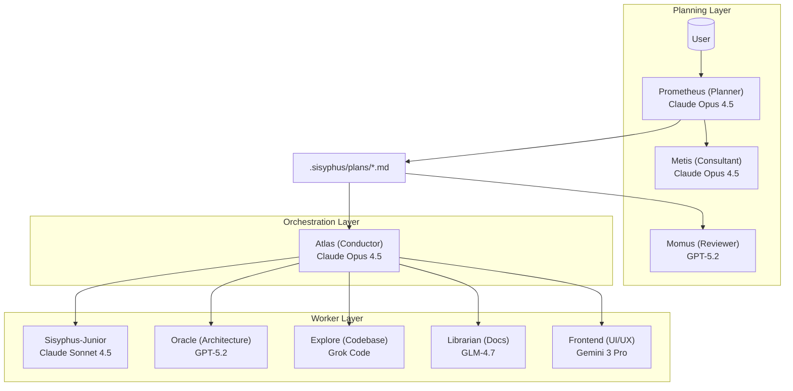

# Oh My OpenCode Sisyphus: Multi-Agent Orchestration Framework

## Overview

Oh My OpenCode Sisyphus is a sophisticated plugin for [OpenCode](https://github.com/sst/opencode) that transforms a single AI agent into a coordinated development team through intelligent orchestration, specialized agents, and separation of planning from execution. Named after the Greek mythological figure condemned to roll a boulder uphill eternally, Sisyphus embodies the relentless, continuous work ethic that AI agents must maintain to complete tasks.

**Core Philosophy**: Human intervention during agentic work is fundamentally a failure signal. The system should complete work autonomously, producing code indistinguishable from that written by senior engineers.

---

## How It Works

### Architecture: Three-Layer Orchestration

Oh My OpenCode implements a three-layer architecture that separates planning, orchestration, and execution:



### 1. Planning Layer: Prometheus + Metis + Momus

**Prometheus (The Strategic Planner)**
- **Role**: Acts as an intelligent interviewer and strategic consultant
- **Model**: Claude Opus 4.5
- **Constraint**: READ-ONLY mode - can only create/modify markdown files in `.sisyphus/` directory
- **Process**:
  1. **Interview Mode**: Instead of immediately planning, collects context through conversation
  2. **Intent Classification**: Identifies whether work is refactoring, new feature, debugging, etc.
  3. **Context Collection**: Investigates codebase via `explore` and `librarian` agents
  4. **Draft Creation**: Continuously records discussion in `.sisyphus/drafts/`
  5. **Plan Generation**: Creates detailed work plan in `.sisyphus/plans/{name}.md`

**Metis (The Plan Consultant)**
- **Role**: Pre-planning analysis and gap detection
- **Function**: Catches what Prometheus missed - hidden intentions, ambiguities, over-engineering patterns
- **Purpose**: Externalizes implicit knowledge that Prometheus might assume but not document

**Momus (The Plan Reviewer)**
- **Role**: High-precision plan validation (activated in "high accuracy" mode)
- **Validation Criteria**:
  - Clarity: Does each task specify WHERE to find implementation details?
  - Verification: Are acceptance criteria concrete and measurable?
  - Context: Sufficient context to proceed without >10% guesswork?
  - Big Picture: Clear purpose, background, and workflow?
- **Behavior**: REJECTS plans until 100% compliant - no retry limit

### 2. Orchestration Layer: Atlas

**Atlas (The Conductor)**
- **Role**: Coordinates work execution without doing implementation itself
- **Model**: Claude Opus 4.5 with Extended Thinking (32k budget)
- **Responsibilities**:
  - Read plans and build task dependency maps
  - Delegate tasks to specialized agents
  - Accumulate wisdom across tasks
  - Verify results independently (never trust subagent claims)
  - Manage parallel execution when tasks are independent

**What Atlas CAN do**:
- ✅ Read files to understand context
- ✅ Run commands to verify results
- ✅ Use `lsp_diagnostics` to check for errors
- ✅ Search patterns with grep/glob/ast-grep

**What Atlas MUST delegate**:
- ❌ Writing/editing code files
- ❌ Fixing bugs
- ❌ Creating tests
- ❌ Git commits

**Wisdom Accumulation System**:
After each task, Atlas extracts learnings and categorizes them into:
- **Conventions**: Code patterns, naming schemes, architectural styles
- **Successes**: What worked well, efficient approaches
- **Failures**: What failed, anti-patterns encountered
- **Gotchas**: Edge cases, tricky dependencies
- **Commands**: Useful bash commands, test procedures

These learnings are passed to ALL subsequent tasks, preventing repeated mistakes.

### 3. Worker Layer: Specialized Agents

**Sisyphus-Junior (The Workhorse)**
- **Model**: Claude Sonnet 4.5
- **Role**: Focused task execution
- **Constraints**:
  - Cannot delegate (blocked from task/delegate_task tools)
  - Cannot modify plan files (READ-ONLY)
  - Must pass `lsp_diagnostics` before completion
  - Obsessive todo tracking enforced by system

**Oracle (Architecture/Debugging)**
- **Model**: GPT-5.2
- **Role**: Strategic reasoning, complex architecture decisions, debugging
- **Permission**: Read-only consultation

**Librarian (Documentation/OSS)**
- **Model**: GLM-4.7 Free
- **Role**: Multi-repo analysis, official documentation lookup, OSS implementation examples
- **Tools**: Context7 MCP (docs), grep.app MCP (GitHub search)

**Explore (Fast Codebase Grep)**
- **Model**: Grok Code / Gemini 3 Flash / Haiku (context-dependent)
- **Role**: Blazing fast codebase exploration and contextual grep
- **Permission**: Read-only

**Frontend (UI/UX Engineer)**
- **Model**: Gemini 3 Pro
- **Role**: Frontend development with strong design aesthetic
- **Philosophy**: Designer-turned-developer - crafts stunning UI/UX without mockups

---

## Two Modes of Operation

### Mode 1: Ultrawork ("Just Do It" Mode)

**Usage**: Include `ultrawork` or `ulw` in your prompt

```
ulw add authentication to my Next.js app
```

**What Happens**:
1. Agent automatically explores codebase to understand patterns
2. Researches best practices via specialized agents
3. Implements following existing conventions
4. Verifies with diagnostics and tests
5. Keeps working until complete

**When to Use**: Quick work, complex tasks where explaining full context is tedious

**Keywords that Activate Features**:
- `ultrawork` / `ulw`: Max performance mode - parallel agents, background tasks, aggressive exploration
- `search` / `find`: Parallel exploration mode
- `analyze` / `investigate`: Deep analysis mode
- `ultrathink`: Extended thinking mode (activates 32k reasoning budget)

### Mode 2: Prometheus Planning ("Precise Orchestration")

**Usage**: Press **Tab** to enter Prometheus mode, then run `/start-work`

**Workflow**:
1. **Interview Phase**: Prometheus asks clarifying questions while researching your codebase
2. **Plan Generation**: Creates detailed work plan with tasks, acceptance criteria, guardrails
3. **Optional Review**: Momus validates plan in high-accuracy mode
4. **Execution**: Run `/start-work` - Atlas orchestrates specialized sub-agents
5. **Verification**: Each task verified independently
6. **Learning Accumulation**: Wisdom passed across tasks
7. **Progress Tracking**: Survives session interruptions via `boulder.json` state file

**When to Use**:
- Multi-day or multi-session projects
- Critical production changes
- Complex refactoring spanning many files
- When you want documented decision trail

---

## Core Mechanisms

### 1. Category-Based Delegation

Instead of hardcoding model names (which creates distributional bias), tasks are delegated by **semantic category**:

| Category | Model | Use Case |
|----------|-------|----------|
| `visual-engineering` | Gemini 3 Pro | Frontend, UI/UX, design, styling |
| `ultrabrain` | GPT-5.2 Codex | Deep logical reasoning, complex architecture |
| `artistry` | Gemini 3 Pro | Highly creative tasks, novel ideas |
| `quick` | Claude Haiku 4.5 | Trivial tasks - typo fixes, single-file changes |
| `unspecified-low` | Claude Sonnet 4.5 | General tasks, low effort |
| `unspecified-high` | Claude Opus 4.5 | General tasks, high effort |
| `writing` | Gemini 3 Flash | Documentation, prose, technical writing |

**Why Categories Matter**: Model names create bias - "GPT-5.2" knows its limitations. "ultrabrain" means "think strategically" without implementation details leaking.

### 2. Skills System

Skills provide domain-specific instructions that prepend to agent prompts:

**Built-in Skills**:
- **playwright**: Browser automation (web scraping, testing, screenshots)
- **git-master**: Atomic commits, rebase/squash, history search
- **frontend-ui-ux**: Designer-turned-developer persona with strong aesthetic direction

**Usage**:
```
delegate_task(category="visual-engineering", skills=["frontend-ui-ux"], prompt="...")
delegate_task(category="general", skills=["playwright"], prompt="...")
```

### 3. Todo Continuation Enforcer

The "boulder pushing" mechanism that keeps agents working:

```
[SYSTEM REMINDER - TODO CONTINUATION]

You have incomplete todos! Complete ALL before responding:
- [x] Implement user service
- [ ] Add validation ← IN PROGRESS
- [ ] Write tests

DO NOT respond until all todos are marked completed.
```

This prevents the common failure mode where agents claim to be "done" prematurely.

### 4. Background Agent Execution

Run multiple agents in parallel like a real dev team:

```
# Launch in background
delegate_task(agent="explore", background=true, prompt="Find auth implementations")

# Continue working...
# System notifies on completion

# Retrieve results when needed
background_output(task_id="bg_abc123")
```

### 5. Context Injection & Memory

**Directory AGENTS.md**:
Auto-injects hierarchical context when reading files:
```
project/
├── AGENTS.md              # Project-wide context
├── src/
│   ├── AGENTS.md          # src-specific context
│   └── components/
│       ├── AGENTS.md      # Component-specific context
│       └── Button.tsx     # Reading this injects all 3
```

**Conditional Rules**:
Rules from `.claude/rules/` injected when glob patterns match:
```markdown
---
globs: ["*.ts", "src/**/*.js"]
description: "TypeScript/JavaScript coding rules"
---
- Use PascalCase for interface names
- Use camelCase for function names
```

### 6. Ralph Loop Integration

Built-in `/ralph-loop` command for self-referential development:

```
/ralph-loop "Build a REST API with authentication"
```

Continuously works toward goal, detects `<promise>DONE</promise>` for completion.

---

## Built-in Tools & MCPs

### LSP Tools (IDE Features for Agents)
- `lsp_diagnostics`: Get errors/warnings before build
- `lsp_rename`: Rename symbol across workspace
- `lsp_goto_definition`: Jump to symbol definition
- `lsp_find_references`: Find all usages

### AST-Grep Tools
- `ast_grep_search`: AST-aware code pattern search (25 languages)
- `ast_grep_replace`: AST-aware code replacement

### Built-in MCPs
- **websearch** (Exa AI): Real-time web search
- **context7**: Official documentation lookup
- **grep_app**: Ultra-fast GitHub code search

### Session Tools
- `session_list`: List all OpenCode sessions
- `session_read`: Read messages from a session
- `session_search`: Full-text search across sessions

---

## State Management & Persistence

### Plan Files
```
.sisyphus/
├── drafts/              # Interview conversation drafts
├── plans/               # Generated work plans
│   └── {name}.md
└── notepads/            # Per-plan accumulated wisdom
    └── {plan-name}/
        ├── learnings.md
        ├── decisions.md
        ├── issues.md
        └── verification.md
```

### Progress Tracking
- **boulder.json**: Tracks current plan and session ID for resume
- **Todo State**: Externalized in files, not chat memory
- **Session Resumability**: Work continues across interruptions

---

## Key Heuristics & Best Practices

### From the Ultrawork Manifesto

1. **Human Intervention = Failure Signal**: If you need to babysit the agent, the system has failed
2. **Indistinguishable Code**: Agent output should be indistinguishable from senior engineer code
3. **Token Cost vs Productivity**: Higher token usage acceptable for 10x-100x productivity gains
4. **Minimize Human Cognitive Load**: Human provides intent, agent handles everything else
5. **Predictable, Continuous, Delegatable**: Work like a compiler - markdown in, working code out

### Operational Guidelines

- **Keep dev agents lean**: Save context for code; planning agents can be heavier
- **Many small tasks**: Prefer many small tasks over branching mega-prompts (less context entropy)
- **Checklists/gates as safety rails**: Don't "trust the model" - verify everything
- **Backpressure is non-negotiable**: Tests/build/lint keep agents honest
- **Separate planning from building**: Never mix the two
- **Single plan principle**: No matter how large the task, one plan file prevents context fragmentation

---

## Configuration

### Config File Locations
1. `.opencode/oh-my-opencode.json` (project)
2. `~/.config/opencode/oh-my-opencode.json` (user)

Supports JSONC (comments + trailing commas).

### Example Configuration

```jsonc
{
  "$schema": "https://raw.githubusercontent.com/code-yeongyu/oh-my-opencode/master/assets/oh-my-opencode.schema.json",

  // Agent overrides
  "agents": {
    "oracle": {
      "model": "openai/gpt-5.2"
    },
    "Sisyphus": {
      "model": "anthropic/claude-opus-4-5",
      "temperature": 0.3
    }
  },

  // Custom categories
  "categories": {
    "data-science": {
      "model": "anthropic/claude-sonnet-4-5",
      "temperature": 0.2,
      "prompt_append": "Focus on data analysis, ML pipelines, and statistical methods."
    }
  },

  // Background task concurrency
  "background_task": {
    "defaultConcurrency": 5,
    "providerConcurrency": {
      "anthropic": 3,
      "openai": 5,
      "google": 10
    }
  },

  // Disable specific features
  "disabled_hooks": ["comment-checker"],
  "disabled_agents": ["multimodal-looker"],
  "disabled_skills": ["playwright"],
  "disabled_mcps": ["websearch"]
}
```

---

## Commands

| Command | Description |
|---------|-------------|
| `/init-deep` | Initialize hierarchical AGENTS.md knowledge base |
| `/ralph-loop` | Start self-referential development loop until completion |
| `/ulw-loop` | Start ultrawork loop - max intensity mode |
| `/cancel-ralph` | Cancel active Ralph Loop |
| `/refactor` | Intelligent refactoring with LSP, AST-grep, TDD verification |
| `/start-work` | Execute Prometheus-generated plan |

---

## Hooks System

Oh My OpenCode includes 25+ hooks that intercept lifecycle events:

**Events**: `PreToolUse`, `PostToolUse`, `UserPromptSubmit`, `Stop`

**Notable Hooks**:
- **keyword-detector**: Activates ultrawork/search/analyze modes from keywords
- **todo-continuation-enforcer**: Forces agents to complete todos (the "boulder pushing")
- **comment-checker**: Prevents excessive AI comments
- **thinking-block-validator**: Prevents API errors from malformed thinking blocks
- **session-recovery**: Recovers from session errors
- **grep-output-truncator**: Dynamically truncates output based on context window
- **directory-agents-injector**: Auto-injects AGENTS.md hierarchy
- **rules-injector**: Injects conditional rules from `.claude/rules/`
- **ralph-loop**: Manages continuous loop execution

---

## Installation

### For Humans

Copy this prompt to your LLM agent:

```
Install and configure oh-my-opencode by following the instructions here:
https://raw.githubusercontent.com/code-yeongyu/oh-my-opencode/refs/heads/master/docs/guide/installation.md
```

### For LLM Agents

```bash
curl -s https://raw.githubusercontent.com/code-yeongyu/oh-my-opencode/refs/heads/master/docs/guide/installation.md
```

---

## When to Use Oh My OpenCode Sisyphus

### Best Fit For

1. **High autonomy requirements**: Want agents to work for hours without intervention
2. **Complex multi-session projects**: Work that spans days/weeks with interruptions
3. **Multi-model orchestration**: Need different models for different expertise (frontend, backend, architecture)
4. **Quality-critical work**: Production code where "good enough" isn't acceptable
5. **Large codebases**: Need intelligent exploration and context management
6. **Iterative refinement**: Tasks requiring continuous improvement until perfect

### Not Ideal For

1. **Simple one-off tasks**: Overkill for single-file changes
2. **Exploratory coding**: When you're still figuring out what to build
3. **Strict budget constraints**: Uses more tokens for higher quality
4. **OpenCode beginners**: Requires understanding of OpenCode concepts first

---

## Comparison with Other Approaches

### vs BMAD
- **BMAD**: Structured SDLC roles (PM, Architect, QA, Dev) with human checkpoints
- **Sisyphus**: Orchestrated agent swarm with minimal human intervention
- **Trade-off**: BMAD has more control gates; Sisyphus has more autonomy

### vs Claude Autonomous Harness
- **Harness**: Two-agent pattern (Initializer + Coding) with test inventory as truth
- **Sisyphus**: Multi-agent orchestration with plan files as truth
- **Trade-off**: Harness emphasizes security/sandboxing; Sisyphus emphasizes specialization

### vs Ralph Loop
- **Ralph**: Simple continuous loop with file-based memory (fresh context every iteration)
- **Sisyphus**: Built-in `/ralph-loop` command PLUS orchestration layer
- **Trade-off**: Ralph is simpler; Sisyphus adds planning and multi-agent delegation

### vs Gas Town
- **Gas Town**: Massive parallelism (10-30 agents) with merge queue orchestration
- **Sisyphus**: Moderate parallelism with intelligent task delegation
- **Trade-off**: Gas Town for scale; Sisyphus for quality and precision

---

## Decision Framework

**Choose Oh My OpenCode Sisyphus when:**

| Criterion | Evaluation |
|-----------|------------|
| **Task Complexity** | Multi-step, requires planning |
| **Code Quality Requirements** | Production-ready, indistinguishable from human |
| **Human Availability** | Want to delegate and walk away |
| **Project Duration** | Multi-day or multi-session |
| **Model Diversity Needs** | Different expertise for different tasks |
| **Budget Flexibility** | Higher token usage acceptable for quality |

**Decision Flow**:
1. Simple task? → Standard OpenCode
2. Complex + lazy? → `ulw` mode
3. Complex + precise? → Prometheus planning + `/start-work`
4. Massive parallel work? → Consider Gas Town instead

---

## Further Reading

- [Oh My OpenCode GitHub](https://github.com/code-yeongyu/oh-my-opencode)
- [Ultrawork Manifesto](https://github.com/code-yeongyu/oh-my-opencode/blob/master/docs/ultrawork-manifesto.md)
- [Understanding Orchestration System](https://github.com/code-yeongyu/oh-my-opencode/blob/master/docs/guide/understanding-orchestration-system.md)
- [Features Documentation](https://github.com/code-yeongyu/oh-my-opencode/blob/master/docs/features.md)
- [Configuration Guide](https://github.com/code-yeongyu/oh-my-opencode/blob/master/docs/configurations.md)
