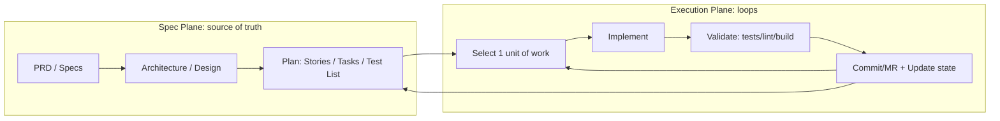
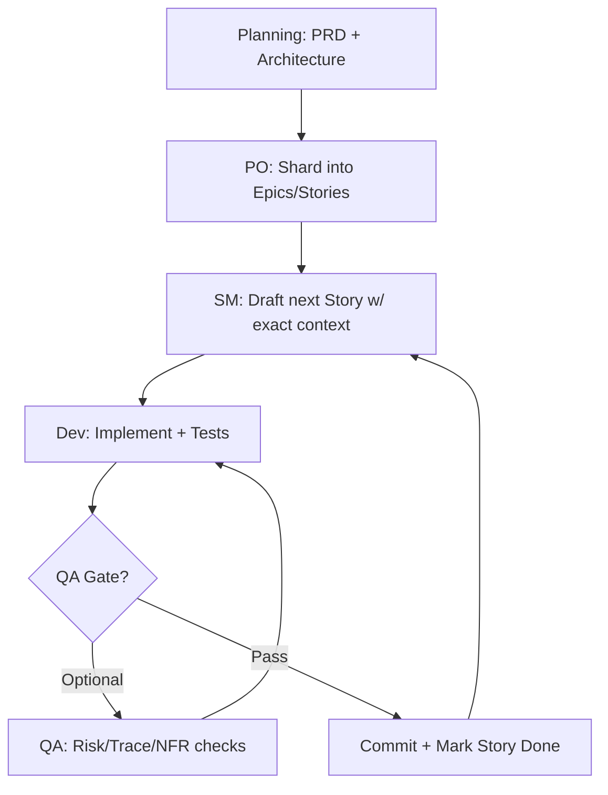
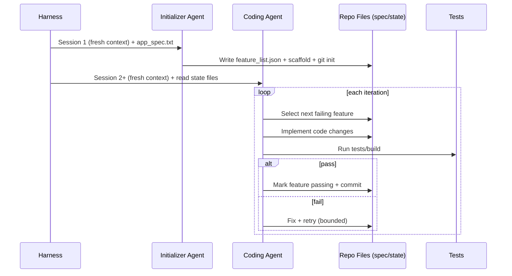
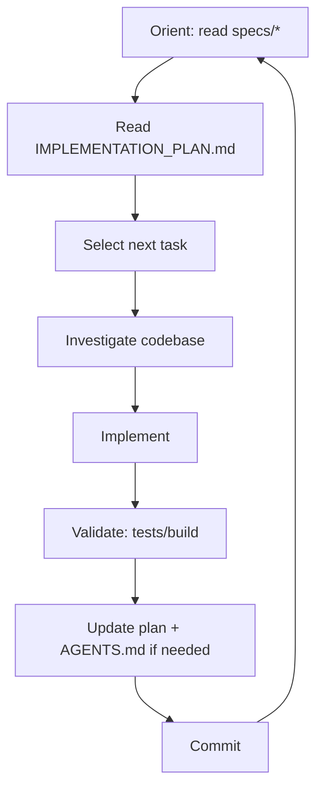

# Spec-driven development with coding agents 


Different *control-system designs* for turning **specs → incremental code changes**, with different answers to:

* **Where does truth live?** (PRD/story files, a task list, a test list, a merge queue)
* **How do we keep agents “smart”?** (fresh contexts, constrained tasks, checklists, backpressure)
* **How do we ship safely?** (QA gates, tests, sandboxing, merge orchestration)

Below is a concise playbook for each approach + a decision framework.

---

## A shared mental model: Spec Plane vs Execution Plane

Think of the system as two planes:

* **Spec Plane (slow, human-aligned):** PRD/architecture/stories/specs/plan files become the “API” for the agent(s).
* **Execution Plane (fast, machine):** loops that pick *one unit of work*, implement, validate, commit/merge, and update state.



The four approaches differ mainly in **what S3 is** (stories vs task list vs test list vs merge queue) and how heavily they instrument the Execution Plane.

---

## 1) BMad (BMAD): “SDLC as a prompt framework” (roles + workflows + artifacts)

### How it works

BMAD is a **natural-language framework**: agents are personas with explicit dependencies (tasks/templates/checklists/data), and workflows prescribe a **planning phase** followed by an **execution cycle**. 

Key moves:

1. **Planning (often in Web UI):**

   * Analyst/PM/UX/Architect/QA/PO collaborate to produce **PRD + architecture** (and optionally QA strategy).
   * PO runs a master checklist and ensures alignment. 

2. **Shard the plan (critical):**

   * PO shards PRD + architecture into **epics/stories** so each dev iteration is small and explicit. 

3. **Core dev cycle in IDE (Scrum loop):**

   * SM drafts the next story with very specific context.
   * Dev implements sequential tasks + tests.
   * Optional QA mid-checks + final gate; then commit; mark story done; repeat. 

4. **Architectural core concept: “Dependencies + Bundles”**

   * The “brain” lives in `bmad-core/` (agents, tasks, templates, checklists, KB).
   * Tooling can bundle teams into `dist/` for web UIs vs lean agent files for IDEs. 

### Why it’s spec-driven

* Specs are **first-class artifacts** (PRD/architecture/stories) and the workflow enforces that **execution pulls from sharded specs**, not ad-hoc chat state. 
* Templates embed generation instructions while keeping output clean (separation of concerns). 

### BMAD’s core heuristics (the “rules that make it work”)

* **Keep dev agents lean** (save context for code; planning agents can be heavier). 
* Prefer **many small tasks** over branching mega-prompts (less context entropy). 
* Use **checklists/gates** as the safety rail, not “trust the model.” 

### BMAD “control loop” diagram (condensed)



### Example: minimal story “spec unit” (what Dev consumes)

```md
# Story: Add Checkout Coupon Validation

## Context
- Related Epic: Pricing & Promotions
- Relevant modules: src/pricing/, src/checkout/

## Acceptance Criteria
- Invalid coupons rejected with code COUPON_INVALID
- Expired coupons rejected with COUPON_EXPIRED
- Tests: unit + one e2e

## Tasks (ordered)
1) Add validator in src/pricing/coupons.ts
2) Wire into checkout apply flow
3) Add unit tests
4) Add e2e scenario
```

**Best fit:** teams that want **SDLC structure + human-in-loop controls**, especially for non-trivial systems and multi-stakeholder planning.

---

## 2) Claude Code Autonomous Agents: “Long-running harness + persistent progress”

### How it works

This approach is less “SDLC roles” and more **agent runtime engineering**.

The demo harness uses a **two-agent pattern**: 

1. **Initializer Agent (Session 1):**

   * Reads `app_spec.txt`
   * Generates a big `feature_list.json` (e.g., 200 test cases)
   * Sets up project structure + git 

2. **Coding Agent (Sessions 2+):**

   * Picks features one-by-one
   * Implements, marks passing in `feature_list.json`
   * Commits progress
   * Each session starts with a fresh context window; progress lives in files + git 

It also explicitly designs a **defense-in-depth security model** (sandboxing + filesystem restrictions + bash allowlist). 

And the Python entry point shows the harness wrapper around repeated runs (resume by rerunning the command). 

### Why it’s spec-driven

The spec becomes a **test inventory** (`feature_list.json`) and that inventory is the truth:

* the agent doesn’t “remember” what’s done—**the file says what’s done**
* validation is builtin: a feature isn’t done until it passes tests and is recorded

### Harness mental model: “Agent is a function; harness is the product”

Anthropic’s long-running harness guidance (attached) emphasizes that most reliability comes from the *wrapper*:

* checkpointing/progress files
* resumability
* tool safety boundaries
* clear stop/resume semantics
* guardrails around bash/file operations 

### Sequence diagram



### Mini harness loop (pseudo)

```python
while not done(feature_list):
    task = pick_next(feature_list)
    apply_patch(task)
    ok = run_tests()
    if ok:
        mark_done(task); git_commit()
    else:
        triage_failure(); patch_again()
```

**Best fit:** when you want **a mostly autonomous “app builder”** that can run for hours, with strong emphasis on **resumability + safety boundaries + file-based progress**.

---

## 3) Ralph Loop: “Fresh context every iteration + file-based memory”

### How it works (core loop)

Ralph is a deliberately simple **continuous loop**:

> read plan → pick task → implement → test → commit → clear context → repeat 

Key files (the “state store”): 

* `specs/*` (requirements)
* `IMPLEMENTATION_PLAN.md` (prioritized task list)
* `AGENTS.md` (operational learnings / how to run)
* `PROMPT.md` (instructions)

Two modes use the *same mechanism*: 

* **PLANNING:** gap analysis (specs vs code) → update plan only (often 1–2 iterations)
* **BUILDING:** implement from plan → validate (backpressure) → update plan → commit

The BUILDING loop lifecycle is explicitly enumerated (Orient → Read plan → Select → Investigate → Implement → Validate → Update plan/agents → Commit). 

### Why it works (the “Ralph physics”)

* **Fresh context** keeps the model in its “smart zone” (less drift).
* **File-based memory** persists learnings without bloating context.
* **Backpressure** (tests/build) forces self-correction. 

### Ralph loop diagram



### Minimal `IMPLEMENTATION_PLAN.md` pattern

```md
# Implementation Plan

## Now (highest priority)
- [ ] Add coupon validator + unit tests
- [ ] Wire validator into checkout
- [ ] Add e2e scenario

## Later
- [ ] Add admin UI for coupons
- [ ] Add metrics + alerts

## Notes / Discoveries
- checkout flow uses applyPromotion() in src/checkout/apply.ts
```

**Best fit:** solo devs / small teams who want **maximum throughput with minimal orchestration**, and who are disciplined about **tests + commits + keeping the plan accurate**.

---

## 4) Gas Town: "Multi-agent swarm + merge queue + patrol automation"

### How it works

Gas Town is an **orchestrator for many Claude Code instances**—meant for stage-7/8 "I can manage 10–30 agents" workflows.

Core concept: scale the Execution Plane by adding **roles** and **merge mechanics**:

* **Town (HQ) + Rigs (projects)**: rigs are repos under management.
* **Mayor**: the main interface/concierge.
* **Polecats**: ephemeral swarm workers that generate MRs.
* **Refinery**: resolves the *merge queue problem* and merges changes safely to main, one at a time.
* **Witness**: watches polecats and unblocks them.
* **Deacon + Dogs (+ Boot)**: a patrol loop that keeps the system running (maintenance, plugins, nudges).

### Why it's spec-driven

In Gas Town, "spec" often becomes **work packets** that can be fanned out to a swarm:

* the *overseer* (you) supplies features/constraints
* the system compiles them into parallel MRs
* the merge queue + refinery enforce convergence to a coherent main branch

### Gas Town architecture (condensed)

```mermaid
flowchart LR
  O[Overseer (Human)] --> M[Mayor (front desk)]
  M --> SW[Swarm: Polecats (MRs)]
  SW --> MQ[Merge Queue]
  MQ --> R[Refinery (rebases/merges safely)]
  R --> MAIN[(main)]
  W[Witness] --> SW
  D[Deacon patrol loop] --> W
  D --> DG[Dogs: maintenance/plugins]
```

**Best fit:** high-parallelism work (many independent tasks), where merge conflicts + coordination become the bottleneck and you're ready to invest in orchestrator complexity.

---

## 5) Oh My OpenCode Sisyphus: "Three-layer orchestration + category-based delegation + wisdom accumulation"

### How it works

Oh My OpenCode Sisyphus is a **plugin for OpenCode** that transforms a single AI agent into a coordinated development team through intelligent orchestration. Named after the Greek figure condemned to eternally roll a boulder uphill, it embodies relentless, continuous work until completion.

Core architecture: **three-layer separation** of planning, orchestration, and execution:

1. **Planning Layer (Prometheus + Metis + Momus):**

   * **Prometheus**: Strategic planner in interview mode, researches codebase while collecting requirements
   * **Metis**: Pre-planning consultant that catches hidden intentions, ambiguities, and over-engineering patterns
   * **Momus**: Plan reviewer for high-accuracy mode (rejects plans until 100% compliant)
   * Output: detailed work plan in `.sisyphus/plans/{name}.md`

2. **Orchestration Layer (Atlas):**

   * **Atlas**: The conductor - delegates tasks, accumulates wisdom, verifies results (never trusts subagent claims)
   * CANNOT write code - MUST delegate to specialized agents
   * Manages parallel execution when tasks are independent
   * Passes accumulated learnings to all subsequent tasks

3. **Worker Layer (Specialized Agents):**

   * **Sisyphus-Junior**: Focused task executor (Sonnet 4.5), cannot delegate, must pass diagnostics
   * **Oracle**: Architecture/debugging (GPT-5.2), read-only
   * **Librarian**: Documentation/OSS research (GLM-4.7), multi-repo analysis
   * **Explore**: Fast codebase grep (Grok Code / Gemini Flash / Haiku)
   * **Frontend**: UI/UX specialist (Gemini 3 Pro), designer-turned-developer

**Two modes of operation**:

* **Ultrawork mode (`ulw`)**: "Just do it" - agent figures everything out autonomously
* **Prometheus mode (Tab → `/start-work`)**: Interview → plan → orchestrated execution with full verification

### Why it's spec-driven

Specs are **plan files + accumulated wisdom**:

* Plans live in `.sisyphus/plans/*.md` with tasks, acceptance criteria, constraints
* Wisdom accumulates in `.sisyphus/notepads/{plan-name}/` (learnings, decisions, issues, verification)
* `boulder.json` tracks progress across sessions (resume anytime)
* Todo state externalized in files, enforced by system reminders ("boulder pushing")

The plan is the contract; Atlas orchestrates execution; wisdom ensures consistency.

### Sisyphus "control loop" diagram

```mermaid
flowchart TB
    U[User: Describe work] --> P{Mode?}
    P -->|ultrawork/ulw| A[Auto-explore + plan + execute]
    P -->|Tab key| PROM[Prometheus: Interview mode]

    PROM --> I[Research codebase + ask questions]
    I --> MET[Metis: Gap analysis]
    MET --> PF[Generate plan file]
    PF --> MOM{High accuracy?}
    MOM -->|Yes| REV[Momus: Validate plan]
    REV -->|REJECT| PF
    REV -->|OKAY| SW[/start-work]
    MOM -->|No| SW

    SW --> ATL[Atlas: Read plan + build task map]
    ATL --> DEL[Delegate to specialized agents]
    DEL --> JUN[Junior: Execute task]
    JUN --> VER[Atlas: Verify independently]
    VER -->|Fail| DEL
    VER -->|Pass| WIS[Accumulate wisdom]
    WIS --> NT{More tasks?}
    NT -->|Yes| DEL
    NT -->|No| DONE[Final report + completion]

    A --> ATL
```

### Key mechanisms (what makes it unique)

1. **Category-based delegation** (not model names):

   * `visual-engineering` → Gemini 3 Pro (frontend/UI)
   * `ultrabrain` → GPT-5.2 (complex reasoning)
   * `quick` → Haiku (trivial tasks)
   * Eliminates distributional bias from model names

2. **Todo Continuation Enforcer**:

   * System reminder forces agents to complete ALL todos before responding
   * The "boulder pushing" mechanism - prevents premature "done" claims

3. **Wisdom accumulation**:

   * Conventions, successes, failures, gotchas, commands extracted after each task
   * Passed forward to ALL subsequent agents
   * Prevents repeated mistakes, ensures consistency

4. **Background agents**:

   * Run multiple agents in parallel (e.g., GPT debugging while Claude implements)
   * Configurable concurrency limits per provider/model

5. **Context injection**:

   * Hierarchical AGENTS.md (directory-specific context)
   * Conditional rules from `.claude/rules/` (glob-based)
   * LSP + AST-grep tools for refactoring

6. **Built-in Ralph Loop**:

   * `/ralph-loop` command for continuous development until `<promise>DONE</promise>`
   * Integrates Ralph's fresh-context philosophy with orchestration

### Example: minimal plan file (what Atlas consumes)

```md
# Plan: Add Checkout Coupon Validation

## Intent: New Feature

## Background
Users need coupon validation at checkout. Current flow has no validation.

## Tasks

- [ ] **Task 1**: Add validator in src/pricing/coupons.ts
  - **Expected Outcome**: CouponValidator class with validate() method
  - **Acceptance Criteria**: Rejects invalid/expired coupons with correct error codes
  - **Reference**: See src/pricing/discounts.ts:42 for similar pattern

- [ ] **Task 2**: Wire validator into checkout flow
  - **Dependencies**: Task 1
  - **Expected Outcome**: Checkout calls validator before applying coupon
  - **Files to Modify**: src/checkout/apply.ts

- [ ] **Task 3**: Add unit tests
  - **Expected Outcome**: 95%+ coverage for CouponValidator
  - **Test Cases**: Invalid coupon, expired coupon, valid coupon

- [ ] **Task 4**: Add e2e scenario
  - **Expected Outcome**: E2E test for full checkout flow with coupons
  - **Reference**: tests/e2e/checkout.spec.ts:100 for pattern

## Constraints
- MUST NOT modify existing discount logic
- MUST preserve current checkout UX
- MUST handle edge cases: null coupons, malformed codes

## Verification
- All unit tests pass
- E2E test passes
- lsp_diagnostics shows zero errors
- No regressions in existing checkout tests
```

**Best fit:** teams that want **maximum autonomy + multi-model orchestration + quality-critical output**, willing to invest in token budget for production-ready code indistinguishable from human work. Ideal for multi-session projects with interruptions.

---

# Differences & trade-offs (the practical comparison)

### What "spec" is in each approach

* **BMAD:** PRD/architecture → sharded epics/stories (SDLC artifacts)
* **Claude Autonomous Harness:** `app_spec.txt` → **feature_list.json** (test inventory)
* **Ralph:** `specs/*` → **IMPLEMENTATION_PLAN.md** (task inventory)
* **Gas Town:** features → **parallel MRs** + merge-queue convergence
* **Sisyphus:** `.sisyphus/plans/*.md` (detailed work plans) + `.sisyphus/notepads/` (accumulated wisdom)

### Autonomy vs Control (rule of thumb)

* **Most controlled:** BMAD (human checkpoints + roles + gates)
* **Balanced control:** Ralph (simple loop, you control the plan and accept "smart zone" constraints)
* **Balanced autonomy:** Sisyphus (interview mode for planning, orchestrated execution with verification)
* **Most autonomous single-thread:** Claude harness (long-running agent with strong state + safety wrapper)
* **Most autonomous at scale:** Gas Town (swarm + patrol + merge machinery)

### Complexity budget

* **BMAD:** medium (framework + workflow discipline)
* **Ralph:** low (a loop + a few files)
* **Sisyphus:** medium–high (multi-agent orchestration, category system, wisdom accumulation)
* **Claude harness:** medium–high (proper sandboxing, tool allowlists, resumability engineering)
* **Gas Town:** very high (orchestrator, many roles, merge queue, maintenance loops)

### Unique strengths

* **BMAD:** SDLC structure + stakeholder alignment
* **Ralph:** Maximum simplicity + fresh context every iteration
* **Sisyphus:** Multi-model orchestration + quality-critical output + wisdom accumulation
* **Claude harness:** Long-running autonomy + strong safety boundaries
* **Gas Town:** Massive parallelism + merge conflict resolution

### Failure modes (and the built-in antidotes)

* **Context drift / hallucinated completion**

  * Ralph/Claude: fresh context + file state + tests/backpressure
  * BMAD: sharded stories + QA/PO gates
  * Sisyphus: todo continuation enforcer + wisdom accumulation + independent verification by Atlas

* **Merge conflicts / mainline instability**

  * Gas Town: Refinery + MQ
  * Others: sequential work, smaller diffs
  * Sisyphus: parallel execution when tasks are independent, dependency tracking in plans

* **Unsafe tool usage**

  * Claude harness: sandbox + allowlist
  * BMAD/Ralph: usually rely on IDE tool permissions; you can copy the allowlist idea
  * Sisyphus: permission system per agent (edit/bash/webfetch allow/deny/ask)

* **Agent stops halfway / claims "done" prematurely**

  * Ralph: fresh context forces re-evaluation
  * BMAD: QA/PO gates catch incomplete work
  * Sisyphus: todo continuation enforcer (system reminder blocks response until all todos complete)
  * Claude: feature_list.json tracks what's actually passing tests

* **Model selection bias / suboptimal performance**

  * Most: hardcode model names (creates distributional bias)
  * Sisyphus: category-based delegation ("ultrabrain" not "GPT-5.2") eliminates model self-awareness

---

# When to choose which (decision framework)

Use these questions to guide your choice:

## Q1) Is your bottleneck "figuring out what to build" or "shipping lots of code changes"?

* **Figuring out what to build / aligning stakeholders** → **BMAD**
* **Shipping code changes fast** → go to Q2

## Q2) What's your code quality requirement vs autonomy preference?

* **Production-critical + want indistinguishable-from-human quality** → **Sisyphus**
  * Especially if you need multi-model orchestration (different expertise for different tasks)
  * Acceptable higher token usage for quality
  * Multi-session projects with interruptions

* **Good quality + maximum autonomy + willing to engineer harness** → go to Q3

## Q3) Is your work mostly sequential or massively parallel?

* **Sequential, one change at a time** → **Ralph** or **Claude harness**

  * If you want **simplicity + tight loop discipline + fresh context** → Ralph
  * If you want **autonomy + long runs + strong safety wrapper** → Claude harness

* **Moderate parallelism (2-5 streams) + need model diversity** → **Sisyphus**
  * Background agents for research while main agent implements
  * Category-based delegation to optimal models per task type

* **Massively parallel (10+ streams) + merge becomes the bottleneck** → **Gas Town**

## Quick Decision Matrix

| Criterion | BMAD | Ralph | Sisyphus | Claude Harness | Gas Town |
|-----------|------|-------|----------|----------------|----------|
| **Stakeholder alignment needs** | ✅ Strong | ⚠️ Weak | ⚠️ Weak | ⚠️ Weak | ⚠️ Weak |
| **Code quality requirements** | ⭐⭐⭐ | ⭐⭐ | ⭐⭐⭐⭐⭐ | ⭐⭐⭐ | ⭐⭐ |
| **Autonomy level** | Low | Medium | High | Very High | Very High |
| **Setup complexity** | Medium | Low | Medium-High | Medium-High | Very High |
| **Token efficiency** | Medium | High | Medium-Low | Medium | Low |
| **Multi-model orchestration** | ❌ | ❌ | ✅ Strong | ❌ | ⚠️ Possible |
| **Resume after interruption** | Manual | Manual | ✅ Automatic | ✅ Automatic | ✅ Automatic |
| **Parallel execution** | Manual | No | ✅ Smart | No | ✅✅ Massive |
| **Learning curve** | Medium | Low | Medium-High | High | Very High |
| **Best for** | Requirements phase | Solo dev speed | Production quality | Long automation | Scale |

---

# Common patterns across all 5 (the "portable best practices")

1. **Externalize state** (never trust chat memory)

   * plan files, feature/test lists, story shards, MR queues, wisdom/learnings
   * BMAD: epics/stories
   * Ralph: IMPLEMENTATION_PLAN.md
   * Sisyphus: .sisyphus/plans/*.md + notepads/
   * Claude harness: feature_list.json
   * Gas Town: MR queue

2. **Make the unit of work small**

   * BMAD: sharded stories
   * Ralph: one plan item
   * Sisyphus: one task from plan with clear acceptance criteria
   * Claude harness: one feature/test
   * Gas Town: one MR per polecat

3. **Backpressure is non-negotiable**

   * tests/build/lint are your "physics engine" that keeps agents honest
   * Sisyphus adds: lsp_diagnostics + independent verification by orchestrator

4. **Commit/merge is part of the loop**

   * "Done" must mean: validated + recorded in state + committed
   * Sisyphus: todo continuation enforcer blocks "done" claims until all todos complete

5. **Separate planning from building**

   * BMAD: planning workflow vs dev cycle
   * Ralph: PLANNING prompt vs BUILDING prompt
   * Sisyphus: **strongest separation** - Prometheus (planner, READ-ONLY) vs Atlas (orchestrator) vs Junior (executor)
   * Claude harness: Initializer vs Coding agent
   * Gas Town: implicit in work packet distribution

6. **Treat the harness/orchestrator as production software**

   * security boundaries, retries, resumability, observability
   * Sisyphus adds: permission system per agent, background task concurrency limits, session recovery hooks

7. **Accumulate and propagate learnings** (Sisyphus innovation)

   * After each task: extract conventions, successes, failures, gotchas
   * Pass wisdom forward to ALL subsequent tasks
   * Prevents repeated mistakes, ensures consistency
   * Portable to other frameworks via notepad/learnings files

---

# A practical "starter blueprint" you can adapt (works for any of the 5)

## Universal Structure (works with all approaches)

```text
/specs/                      # requirements (Ralph-style) or PRD shards (BMAD-style)
/docs/                        # PRD, architecture, decision logs
/plan/IMPLEMENTATION_PLAN.md  # task list (Ralph-style)
/plan/feature_list.json       # test inventory (Claude harness-style)
AGENTS.md                     # operating guide + learnings (all approaches)
PROMPT.md                     # system instructions (planning/building)
/scripts/loop.sh              # re-run harness
```

## Sisyphus-Specific Structure

```text
.sisyphus/
├── drafts/                  # Interview conversation drafts (Prometheus)
├── plans/                   # Generated work plans
│   └── {plan-name}.md       # Detailed task list with acceptance criteria
├── notepads/                # Accumulated wisdom per plan
│   └── {plan-name}/
│       ├── learnings.md     # Conventions, patterns, successful approaches
│       ├── decisions.md     # Architectural choices and rationales
│       ├── issues.md        # Problems, blockers, gotchas encountered
│       ├── verification.md  # Test results, validation outcomes
│       └── problems.md      # Unresolved issues, technical debt
└── boulder.json             # Current plan + session ID for resume

.opencode/
└── oh-my-opencode.json      # Configuration: agents, categories, hooks

.claude/
├── rules/                   # Conditional rules (glob-based injection)
├── skills/                  # Custom skills
└── settings.json            # Claude Code compatibility hooks
```

## Minimal loop script examples

**Ralph-style (fresh context)**:

```bash
#!/usr/bin/env bash
set -euo pipefail
# 1) Start agent with PROMPT.md + AGENTS.md + specs + plan
# 2) Agent implements ONE task, runs tests, updates plan, commits
# 3) Script exits; rerun for next iteration (fresh context)
```

**Sisyphus-style (orchestrated)**:

```bash
#!/usr/bin/env bash
set -euo pipefail
# Option 1: Ultrawork mode (auto-plan + execute)
# opencode "ulw implement feature X"

# Option 2: Prometheus planning + orchestrated execution
# Step 1: opencode "@plan implement feature X" (interview mode)
# Step 2: opencode "/start-work" (Atlas orchestrates)
# Resumes automatically via boulder.json if interrupted
```

---

