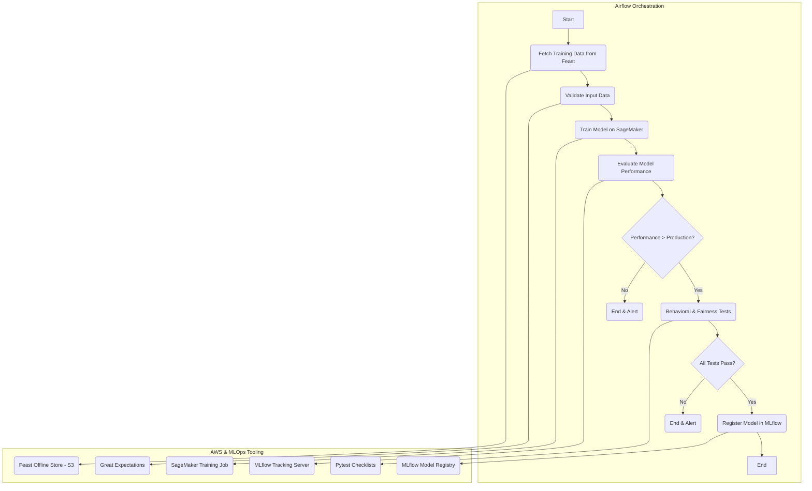
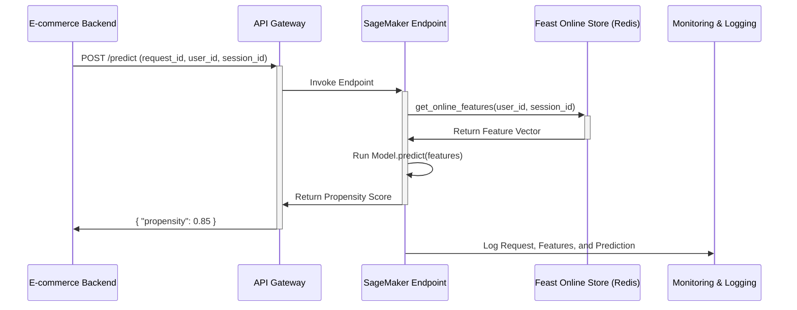

# Real-Time Purchase Intent Scoring


##
***


### **TLDR: A Production-Grade MLOps System for Real-Time Purchase Intent Scoring**

*   **Challenge:** The core business challenge was to move beyond a static e-commerce catalog and increase online sales by understanding user intent in real-time. The goal was to build a system that could dynamically predict a user's likelihood to make a purchase during their session, enabling timely and personalized interventions (like targeted offers) to reduce cart abandonment and improve conversion.

*   **My Role & Solution:** As the lead **ML Engineer and Data Scientist** on a lean, three-person team, I designed and implemented the end-to-end MLOps platform from the ground up. My solution involved a hybrid batch and streaming architecture to deliver both rich historical context and real-time responsiveness.

    My specific contributions included:
    *   **Feature Engineering Pipelines:** Architected and built both daily batch (Spark) and real-time streaming (Spark Streaming) feature pipelines. I implemented a **Feast Feature Store** to solve training-serving skew and provide a single source of truth for features.
    *   **ML Model Development:** Led the iterative modeling process, starting with simple baselines and progressing to a high-performance **LightGBM** model. I focused on not just offline accuracy (AUC) but also production-critical factors like model calibration.
    *   **ML Training & Deployment Pipelines:** Built a fully automated retraining pipeline using **Apache Airflow** and **Amazon SageMaker**. I created a CI/CD workflow with **GitHub Actions** that automatically deploys new models as canary releases to a SageMaker endpoint, ensuring safe, zero-downtime updates.
    *   **Monitoring & Continual Learning:** Implemented a comprehensive monitoring suite to track operational metrics, data drift, and model performance degradation. This system automatically triggers retraining runs when needed, creating a closed-loop system that adapts to new data.

    **Tech Stack:** AWS (SageMaker, Kinesis, EMR, Lambda, ElastiCache), Apache Airflow, MLflow, Feast, DVC, Great Expectations, Spark, LightGBM, GitHub Actions, Terraform.

*   **Impact:** The system delivered a clear and measurable business impact, accomplished by a small, agile team.
    *   Increased the overall **user conversion rate by 5.2%** as measured in a two-week A/B test.
    *   Increased the **Average Order Value (AOV) by 3.5%** for users who interacted with a personalized offer.
    *   Automated the model lifecycle, **reducing the time to deploy a new model from over a week of manual effort to a 2-hour automated pipeline run.**
    *   Reduced p99 inference latency by **40%** through model quantization and a Redis-based feature cache, ensuring a smooth user experience even during peak traffic.

*   **System Architecture:** The diagram below illustrates the complete MLOps architecture. The components highlighted in blue represent the core systems I was directly responsible for building and managing.


___


### **1. Business Challenge: From Anonymous Clicks to Intent-Driven Conversions**

The paradigm of e-commerce has irrevocably shifted. A static digital catalog is no longer sufficient; today’s consumers, shaped by the hyper-personalized experiences of platforms like Netflix and Amazon, expect a similar level of contextual awareness and tailored guidance from every online interaction. The central challenge for any modern retailer is to transform their digital storefront from a passive repository of products into a dynamic, intelligent system that anticipates user needs and proactively guides them toward a satisfying purchase.

This mandate for personalization is not merely about addressing customers by name. It is about understanding a visitor's underlying intent at each stage of their journey and adapting the experience in real-time. Whether a user is a first-time anonymous visitor idly browsing or a known, loyal customer executing a specific purchase, the platform must intelligently adjust its content, messaging, and recommendations.

However, this creates a delicate and critical balance. While a vast majority of shoppers are more likely to purchase from a company that offers personalized experiences, they are quickly alienated by tactics perceived as intrusive or overly algorithmic. The most effective personalization is often invisible; the customer simply feels the journey is effortless and intuitive. This elevates the importance of not just prediction, but also interpretability, ensuring every action taken is genuinely helpful rather than jarring.

The business case for mastering this challenge is compelling and quantifiable. Industry analyses consistently demonstrate a significant return on investment. Brands that excel at personalization report a **10-15% lift in revenue** and an increase in marketing spend efficiency of **10-30%**. By analyzing a user's behavior as it happens—their "clickstream"—an e-commerce platform can make timely interventions that directly influence outcomes. Proactive, data-driven actions can reduce cart abandonment, increase average order value through targeted upsells, and ultimately boost the overall conversion rate.

To measure success, the system's performance must be tied directly to core business outcomes:

*   **Primary Business KPIs:** Conversion Rate, Average Order Value (AOV), and overall Revenue Lift.
*   **Secondary Engagement KPIs:** Click-Through Rate (CTR) on personalized offers, increased Session Duration, and reduced Bounce Rates, which serve as leading indicators of user satisfaction.

Therefore, the fundamental business challenge is to translate the high-velocity, high-volume stream of raw customer clicks into a nuanced understanding of purchase intent, and to use that understanding to power a real-time personalization engine that measurably improves the customer experience and drives tangible business growth.

***

### 2. ML Problem Framing

Before a single line of code is written, a successful machine learning project begins with a rigorous process of problem framing. This is the crucial stage of translating a business vision into a well-defined, feasible, and measurable machine learning task. A flawed framing can lead a project astray, wasting resources on a model that, no matter how accurate, fails to deliver real-world value.

This section outlines the blueprint for the purchase propensity model, ensuring that the technical solution is precisely aligned with the business objectives.

#### 2.1 Setting the Business Objectives

Every ML project must be anchored to a genuine business need. For this project, the primary objective is to **increase online sales by delivering timely, personalized interventions to users during their browsing session.**

This high-level goal was defined in collaboration with key stakeholders, each with a unique perspective:

*   **Product & Marketing Teams:** Focused on increasing `Conversion Rate` and `Average Order Value (AOV)`. They are interested in identifying "on the fence" customers who could be nudged towards a purchase with a targeted offer, and "high-intent" customers who could be receptive to up-sell or cross-sell recommendations.
*   **Sales & Finance Teams:** Concerned with the return on investment (ROI) of promotions. They want to ensure that discounts are not offered to users who would have purchased anyway, maximizing margin.
*   **MLOps & Engineering Teams:** Focused on system stability, maintainability, and performance. Their primary concerns are the prediction service's `latency` and `throughput`, ensuring it does not degrade the overall user experience.

A critical requirement established early on was the need for **model interpretability**. To gain trust and enable debugging, the marketing team needs to understand *why* a user was assigned a high or low propensity score. This allows them to analyze the effectiveness of different personalization strategies and diagnose underperforming campaigns.

#### 2.2 Is Machine Learning the Right Approach?

While a simple, rules-based system could be implemented (e.g., "if a user has an item in their cart for > 1 hour, show a banner"), this approach is brittle and fails to capture the nuanced complexity of user behavior. Machine learning is the correct approach for this problem for several key reasons:

1.  **Complex Patterns:** User purchase intent is influenced by a non-linear combination of dozens of signals (browsing history, click patterns, time of day, product characteristics). ML models are designed to learn these intricate patterns from data, something a human-defined rules engine cannot do effectively.
2.  **Scale:** The system must evaluate millions of user events per day across thousands of products and users. ML provides a scalable way to make millions of cheap, consistent predictions.
3.  **Adaptability:** Customer behavior changes with market trends, seasonality, and marketing campaigns. A static rules engine would quickly become outdated. An ML system, through retraining, can adapt to these evolving patterns.

The following decision flow confirms that ML is a suitable and necessary tool for this challenge.


#### 2.3 Defining the ML Problem

With the need for ML established, the business problem is translated into a precise technical formulation.

*   **Ideal Outcome:** Deliver the optimal intervention (e.g., a specific recommendation, a tailored discount, or no action at all) to each user at the right moment to maximize the probability of a valuable conversion.
*   **Model's Goal:** To empower the "ideal outcome," the model's direct goal is to **predict the probability (a score from 0.0 to 1.0) that a user will complete a purchase within their current session.**
*   **ML Task Type:** This is framed as a **Regression** problem. Predicting a continuous probability score is more flexible than a simple binary classification. It allows the business to define multiple thresholds for different actions, tailoring the aggressiveness of the intervention to the model's confidence.
*   **Proxy Label:** The ground truth for training the model will be the `purchase` event within a session. If a user makes a purchase, their session is labeled with a target value of 1; otherwise, it is labeled 0. This is a strong proxy for purchase intent, though it's acknowledged that it doesn't account for post-purchase events like returns. It is, however, far superior to weaker proxies like `add_to_cart` (which suffers from high abandonment rates) or `product_view` (which can optimize for "clickbait" products rather than genuine interest).

#### 2.4 Assessing Feasibility & Risks

A critical analysis was performed to ensure the project was achievable and to identify potential roadblocks early.

| Category | Checkpoint | Assessment & Mitigation Strategy |
| :--- | :--- | :--- |
| **Data** | Sufficient labeled data? | **Green:** Large volumes of historical clickstream and purchase data are available. |
| | Features available at serving time? | **Yellow (Risk):** Historical features (e.g., `lifetime_value`) are not available for anonymous, first-time users. **Mitigation:** Two distinct models or feature sets will be required: one for known users and a simpler, session-based model for anonymous users. |
| | Privacy/Regulatory compliant? | **Yellow (Risk):** Use of user data must comply with GDPR/CCPA. **Mitigation:** The project will only use first-party data. All features will be aggregated and anonymized where possible. A legal review is a required step before production. |
| **Problem & Model** | High reliability required? | **Medium:** A wrong prediction (e.g., offering a needless discount) has a direct financial cost, but is not catastrophic. |
| | Latency target achievable? | **Red (High Risk):** The requirement for **<100ms p99** inference latency is a significant technical challenge. **Mitigation:** This requires careful model selection (favoring efficiency), infrastructure optimization (e.g., GPUs, Triton server), and an online feature store. |
| | Adversarial attacks likely? | **Low:** Not a primary concern for this use case, unlike fraud detection. |
| **Ethics & Fairness**| Potential for bias? | **Yellow (Risk):** The model could learn to offer better discounts to users from high-income zip codes or unfairly penalize new users. **Mitigation:** Implement fairness monitoring. Regularly audit model predictions across key user segments. |
| **Cost & ROI** | Positive ROI projected? | **Green:** A preliminary cost-benefit analysis, based on a conservative estimate of a 2-3% conversion lift, shows a strong positive ROI against the projected infrastructure and personnel costs. |

#### 2.5 Defining Success Metrics

To measure progress and ultimate success, a clear distinction is made between business, model, and operational metrics. These are not static goals but will be tracked continuously throughout the project lifecycle.

| Metric Type | Success Metrics | How to Measure & Evaluate |
| :--- | :--- | :--- |
| **Business Success** | **Conversion Rate Lift:** The primary measure of impact. | Measured via rigorous **A/B testing**, comparing the model-driven personalization strategy against a non-personalized control group. A statistically significant lift of **>2%** is the target. |
| | **Increase in Average Order Value (AOV):** | Measured in the same A/B test. An increase indicates successful up-selling and cross-selling. |
| **Model Evaluation** | **Area Under the ROC Curve (AUC):** The primary offline metric for optimizing the model's ability to rank users by their likelihood to purchase. Target **AUC > 0.85**. | Evaluated on a held-out test set during each training run and tracked in MLflow. |
| | **Precision/Recall at specific thresholds:** Satisficing metrics. | E.g., at the 0.9 score threshold for offering discounts, **Precision must be >= 75%** to minimize wasted marketing spend. |
| **Operational Health**| **Inference Latency:** A critical non-functional requirement. | Monitored in real-time. The service must maintain **p99 latency < 100ms**. |
| | **Serving Cost:** | Measured as **cost per 1,000 inferences**. Must be tracked to ensure the solution remains within the projected budget. |

By meticulously framing the problem through these five lenses, we establish a robust foundation. We have a clear business mandate, a well-defined technical problem, an understanding of the risks, and a precise definition of what success looks like. This blueprint will guide all subsequent engineering and data science decisions.

***

### 3. MLOps Project Planning and Operational Strategy

Building a real-time personalization system is not about creating a single, static model; it is about engineering a robust, evolving ecosystem that can adapt to changing data and business needs. Adopting a Machine Learning Operations (MLOps) mindset from the outset is paramount to success. This section outlines the strategic plan, architectural principles, and technology choices that will govern the project's entire lifecycle.

#### 3.1 The MLOps-First Mindset: Building a System, Not Just a Model

MLOps is a set of practices that combines Machine Learning, DevOps, and Data Engineering to automate and streamline the end-to-end machine learning lifecycle. The fundamental goal is to move away from artisanal, one-off model development and toward an industrialized process that enables continuous integration, continuous delivery, and continuous training (CI/CD/CT).

This is especially critical for a purchase intent model, where real-world user behavior is constantly changing, rendering static models obsolete and prone to performance degradation—a phenomenon known as model drift. By embracing MLOps, we commit to building a system that is reproducible, testable, and maintainable from day one.

#### 3.2 The Architectural Triad: Balancing Offline, Nearline, and Online Computation

A core strategic decision in designing any large-scale personalization system is how to partition computational tasks. The architecture will be a hybrid, leveraging the strengths of three distinct modes to balance computational complexity, data freshness, and response latency:

*   **Offline Computation:** Reserved for tasks that are computationally intensive and not subject to real-time constraints.
    *   **Use Cases:** Large-scale model training on years of historical data; batch feature computation (e.g., calculating customer lifetime value).
*   **Online (Real-Time) Computation:** For tasks that must respond to user interactions immediately, operating under strict latency SLAs (sub-100 milliseconds).
    *   **Use Cases:** Model inference (scoring); real-time feature retrieval from a low-latency online feature store.
*   **Nearline Computation:** An intelligent compromise for tasks triggered by real-time events but executed asynchronously.
    *   **Use Cases:** Session-based feature updates after a user's session ends, ensuring the next visit benefits from the context of the last one without performing complex aggregations in the real-time path.

#### 3.3 The MLOps Stack Canvas: Technology Stack Selection

Using the MLOps Stack Canvas framework, we can systematically select the tools and technologies for each component of our system. The following table outlines our chosen stack, focusing on a combination of managed AWS services for infrastructure and best-of-breed open-source tools for core ML capabilities to balance speed of development with flexibility and control.

| MLOps Canvas Block | Capability | Chosen Tool/Technology | Justification & Trade-offs |
| :--- | :--- | :--- | :--- |
| **Value Proposition** | Business Goal Alignment | **Propensity Scoring Model** | The core ML asset designed to directly influence conversion rate and AOV by enabling targeted, real-time personalization. |
| **Data Sources & Versioning** | Data Ingestion | **AWS Kinesis Data Streams** | Chosen for its seamless integration with the AWS ecosystem (API Gateway, Lambda) and its ability to handle high-throughput, real-time data ingestion with managed scaling. |
| | Data Storage | **Amazon S3 Data Lake** | The definitive source of truth for all historical data. Its cost-effectiveness, durability, and integration with the entire AWS analytics stack make it the ideal choice for an offline store. |
| | Data Versioning | **DVC (Data Version Control)** | Tracks large data files and models alongside code in Git without bloating the repository. Provides crucial reproducibility for datasets used in training. |
| **Experiment Management** | Experiment Tracking | **MLflow Tracking** | An open-source standard for logging experiment parameters, metrics, and artifacts. Provides a clear, auditable history of all model development efforts, fostering collaboration and reproducibility. |
| | ML Frameworks | **Scikit-learn, XGBoost, TensorFlow/PyTorch** | A pragmatic selection. Start with simpler, highly performant models like LightGBM/XGBoost for a strong, interpretable baseline. Use deep learning frameworks for more complex sequential modeling if justified by performance needs. |
| **Feature Store & Workflows**| Feature Store | **Feast (Open Source)** | **Chosen to avoid vendor lock-in** and for its strong integration with multiple online (Redis, DynamoDB) and offline (S3, Redshift) stores. Provides the core abstraction needed to solve training-serving skew. |
| | Workflow Orchestration | **Apache Airflow** | The industry standard for orchestrating complex, scheduled batch workflows. Ideal for managing the daily/weekly feature engineering and model retraining pipelines. |
| **DevOps & Code Management** | Source Control | **Git (GitHub)** | The universal standard for source code management and collaborative development. |
| | CI/CD | **GitHub Actions** | Tightly integrated with the source code repository. Used for automating code builds, static analysis, and unit/integration testing for all system components. |
| **CI/CT/CD**| ML Pipeline Orchestration | **Airflow + SageMaker SDK** | Airflow will act as the master orchestrator, triggering and managing parameterized AWS SageMaker Training and Processing Jobs. This provides a balance of open-source control and managed, scalable execution. |
| | Automated ML Testing | **Pytest, Great Expectations** | Pytest for unit testing Python code. Great Expectations for data validation and quality checks within the feature and training pipelines to detect data issues early. |
| **Model Registry**| Model Registry | **MLflow Model Registry** | Provides a central hub for managing the lifecycle of ML models. Manages model versions, stages (Staging, Production), and annotations, and integrates seamlessly with the CI/CD pipeline for automated deployments. |
| **Model Deployment & Serving** | Model Serving | **Amazon SageMaker Endpoints** | A fully managed service that simplifies deploying models as scalable, secure API endpoints. It handles infrastructure provisioning, autoscaling, and monitoring, accelerating the path to production. |
| | Release Strategy | **Canary Deployment** | A safe, gradual rollout strategy. Traffic is incrementally shifted to the new model version while key business and operational metrics are monitored, minimizing the "blast radius" of a potential failure. |
| **Monitoring & Observability** | Infrastructure & Model | **Amazon CloudWatch** | The native AWS monitoring solution. Used for tracking operational metrics (latency, error rate, CPU/memory), setting alerts on performance thresholds, and collecting logs from all services. |
| | Data & Concept Drift | **Evidently AI / WhyLabs** | Specialized open-source/SaaS tools for ML monitoring. Will be used to compare production data distributions against a baseline (training data) to detect data drift and concept drift, triggering alerts or retraining pipelines. |
| **Metadata Store** | ML Metadata | **MLflow Tracking Server Backend** | Acts as the central "logbook." MLflow automatically captures and stores metadata from experiments, data versions, and model artifacts, creating a comprehensive, searchable lineage for the entire ML system. |

This strategically chosen stack provides a powerful and balanced MLOps foundation. It leverages managed services to reduce operational overhead where appropriate (ingestion, serving) while using flexible, open-source tools for core ML lifecycle management (experimentation, model registry) to maintain control and avoid vendor lock-in.


#### 3.4 Core MLOps Pipelines and Workflows

To operationalize the MLOps strategy, the entire system is decomposed into a series of interconnected, automated pipelines. These pipelines represent the key workflows that govern the lifecycle of our data and models, transforming the ML process from a manual, research-oriented task into a reliable, repeatable engineering discipline. The following table outlines the primary pipelines to be developed, each designed as a distinct, automated workflow.

| Pipeline / Workflow | Trigger | Inputs | Key Steps | Outputs |
| :--- | :--- | :--- | :--- | :--- |
| **Real-Time Clickstream Ingestion** | User action on client (web/mobile app) | JSON event payload from client tracker. | 1. **Collection:** API Gateway receives the event.<br>2. **Buffering:** Event is published to an AWS Kinesis Data Stream.<br>3. **Initial Processing:** An AWS Lambda function consumes the event, performs initial validation, and enriches it with server-side info (e.g., geo-location from IP). | Enriched event message pushed to a "processed" Kinesis stream and simultaneously archived to an S3 "raw" data lake bucket. |
| **Feature Engineering Pipeline** | **Streaming:** New message on the "processed" Kinesis stream.<br><br>**Batch:** Daily/Hourly schedule via Airflow. | **Streaming:** Enriched clickstream events.<br><br>**Batch:** Historical clickstream data from the S3 Data Lake. | **Streaming (Real-time):**<br>1. Consume enriched events.<br>2. Perform stateless transformations.<br>3. Update/compute session-level features (e.g., `pages_viewed_in_session`).<br>4. Write latest feature values to the Feast Online Store (DynamoDB/Redis).<br><br>**Batch (Offline):**<br>1. Run a scheduled Spark job on historical data.<br>2. Compute complex, long-term aggregations (e.g., `90_day_purchase_count`, `customer_lifetime_value`).<br>3. Backfill the Feast Offline Store (S3 Parquet) with historical values. | **Online Store:** Up-to-the-millisecond feature values for active users.<br><br>**Offline Store:** A complete, point-in-time correct history of all feature values. |
| **ML Training Pipeline (CI/CT)** | 1. **Scheduled:** Weekly/bi-weekly via Airflow.<br>2. **On-demand:** Manual trigger by an ML Engineer.<br>3. **Automated:** Alert from the Monitoring system (e.g., significant data drift detected). | 1. `model_training_config.yaml` (hyperparameters, etc.).<br>2. `feature_list.py` (defines features to use).<br>3. Historical feature data from the Feast Offline Store. | 1. **Data Fetching:** Generate a point-in-time correct training dataset using Feast.<br>2. **Data Validation:** Use Great Expectations to validate the training data against predefined quality checks.<br>3. **Model Training:** Execute the training script on AWS SageMaker.<br>4. **Model Evaluation:** Evaluate model performance (AUC, Precision) on a held-out test set.<br>5. **Model Registration:** If performance exceeds the production model's baseline, version and register the new model artifact and its metrics to the MLflow Model Registry. | A versioned, validated, and registered model artifact in the MLflow Model Registry, ready for deployment. |
| **Model Deployment Pipeline (CD)** | A model is promoted to the "Production" stage in the MLflow Model Registry. | 1. A registered model artifact from MLflow.<br>2. `deployment_config.yaml` (instance types, scaling policies). | 1. **Trigger:** A webhook from MLflow triggers a GitHub Actions workflow.<br>2. **Build:** Build a new Docker container with the model artifact.<br>3. **Push:** Push the container to Amazon ECR.<br>4. **Deploy:** Initiate a canary release on the Amazon SageMaker Endpoint, shifting a small percentage (e.g., 5%) of traffic to the new model version. | A new version of the model is safely deployed and serving a portion of live production traffic. |
| **Real-Time Inference** (Logical Flow) | API call from the e-commerce backend application. | `user_id` and any real-time context (e.g., `product_id` being viewed). | 1. **Feature Retrieval:** Fetch the latest feature vector for the `user_id` from the Feast Online Store.<br>2. **Prediction:** Pass the feature vector to the deployed model on the SageMaker Endpoint.<br>3. **Response:** Return the propensity score (e.g., `{"propensity": 0.85}`) to the backend application. | A real-time propensity score, enabling a personalized action within the user's session. |
| **Monitoring & Retraining Loop** | Continuous (for monitoring)<br><br>Alert-based (for retraining) | Live prediction requests and model responses. | 1. **Log:** Log all predictions and features to a dedicated monitoring stream.<br>2. **Monitor:** Continuously compare the distribution of live features and predictions against the training set baseline to detect drift.<br>3. **Alert:** If drift exceeds a predefined threshold, send an alert (e.g., to Slack, PagerDuty).<br>4. **Trigger:** The alert automatically triggers the **ML Training Pipeline** to start a new retraining run with the latest data. | Actionable alerts for on-call engineers and an automated, closed-loop system that can adapt to changing data without manual intervention. |


#### 3.5.1 Project Stages and Timeline

A project of this complexity requires a structured, iterative approach to manage risk and deliver value incrementally. The project will be executed in distinct phases, moving from initial planning and experimentation to a full production rollout. This phased approach allows the team to learn and adapt, ensuring the final system is robust, scalable, and aligned with business needs.

The project is broken down into five major stages, each with specific goals and deliverables.

| Stage | Duration (Est.) | Key Activities & Deliverables |
| :--- | :--- | :--- |
| **Stage 1: Ideation & Planning** | **Weeks 1-2** | - **Define Business Case:** Solidify KPIs (Conversion Rate, AOV), success criteria, and projected ROI.<br>- **Problem Framing:** Finalize the ML problem as propensity scoring; define model inputs/outputs.<br>- **Feasibility Study:** Complete data discovery, risk assessment, and initial cost estimation.<br>- **Tech Stack Selection:** Finalize the MLOps stack (as defined in Sec 3.3).<br>- **Project Plan:** Create a detailed project plan and roadmap.<br> **Deliverable:** A signed-off Project Charter document. |
| **Stage 2: Offline Model Experimentation** | **Weeks 3-6** | - **Data Preparation:** Ingest and clean a historical dataset for initial modeling.<br>- **Feature Engineering (Offline):** Develop and test an initial set of features using Python/Spark.<br>- **Baseline Model:** Train a simple baseline model (e.g., Logistic Regression) to establish a performance floor.<br>- **Advanced Model Training:** Experiment with more complex models (LightGBM, XGBoost) and log all experiments in MLflow.<br>- **Model Selection:** Select the best-performing "champion" model based on offline evaluation metrics (AUC, Precision).<br> **Deliverable:** A trained and registered v1 model artifact with a comprehensive evaluation report. |
| **Stage 3: MLOps Pipeline Development** | **Weeks 7-14** | - **Infrastructure as Code (IaC):** Develop Terraform scripts for all AWS resources.<br>- **Pipeline Implementation:** Build, test, and document the core automated pipelines:<br>  - Real-time Ingestion Pipeline (Kinesis/Lambda).<br>  - Batch & Streaming Feature Engineering Pipelines (Feast/Spark).<br>  - ML Training Pipeline (Airflow/SageMaker).<br>  - CI/CD workflows for all components (GitHub Actions).<br> **Deliverable:** Fully automated, tested, and production-ready MLOps pipelines. |
| **Stage 4: Deployment & Initial Serving** | **Weeks 15-16** | - **Staging Deployment:** Deploy the entire system to a pre-production (staging) environment for end-to-end testing.<br>- **Shadow Deployment:** Deploy the champion model into production in "shadow mode." It will receive live traffic and make predictions, but its outputs will only be logged, not acted upon. This validates the live feature pipeline and model performance on real data without user impact.<br>- **Canary Release:** Begin a canary release, routing 1% of live traffic to the model for active personalization. Closely monitor system and business metrics.<br> **Deliverable:** The model is live in production, serving a small fraction of users. |
| **Stage 5: Monitoring & Iteration** | **Ongoing** | - **Ramp-Up:** Gradually increase traffic to the new model (e.g., 10% -> 50% -> 100%) based on monitoring results.<br>- **A/B Testing:** Conduct formal A/B tests to rigorously measure the business impact (lift in Conversion Rate, AOV) against the control group.<br>- **Monitoring & Alerting:** Continuously monitor for operational issues, data drift, and concept drift.<br>- **Continual Learning:** Execute scheduled and trigger-based retraining pipelines to keep the model fresh.<br>- **Iterate:** Use insights from monitoring and A/B tests to inform the development of the next generation of models (v2).<br> **Deliverable:** A stable, monitored production system and a data-driven roadmap for future improvements. |

#### 3.5.2 Cross-Functional Team & Roles

Success requires a tight-knit, cross-functional team where responsibilities are clear but collaboration is constant. For a project of this scale, the core team would consist of:

| Role | Primary Responsibilities |
| :--- | :--- |
| **Product Manager** | Owns the business vision and roadmap. Defines requirements, prioritizes features, and acts as the bridge between technical teams and business stakeholders. Responsible for measuring the final business impact (ROI). |
| **Data Engineer** | Designs, builds, and maintains the real-time data ingestion and processing pipelines. Ensures data quality, reliability, and scalability. Owns the "Bronze" and "Silver" layers of the data lake. |
| **ML Engineer** | **Leads the MLOps strategy.** Designs and builds the core ML pipelines: feature engineering (in collaboration with Data Engineering), automated training, and model deployment. Owns the production model's operational health, including monitoring, alerting, and retraining strategies. |
| **Data Scientist**| **Leads the modeling strategy.** Explores data, develops features, and experiments with different ML algorithms. Responsible for model evaluation, interpretation, and selecting the "champion" model for deployment. |
| **Platform/DevOps Engineer** | Manages the underlying cloud infrastructure (AWS), Kubernetes, and CI/CD tooling (GitHub Actions). Ensures the platform is secure, scalable, and reliable. |

#### 3.5.3 Versioning and Governance Strategy

To ensure reproducibility, auditability, and controlled changes, a strict versioning and governance strategy will be applied to all assets.

| Asset | Versioning Tool | Governance Strategy |
| :--- | :--- | :--- |
| **Code** | **Git (GitHub)** | All code (pipelines, model logic, IaC) is managed in Git. All changes are made via Pull Requests (PRs), which require at least one peer review and must pass all automated CI checks (linting, unit tests) before being merged into the main branch. |
| **Data** | **DVC** | The specific version of the dataset used to train a production model is "snapshotted" using DVC. The DVC metadata file is checked into Git, allowing for perfect recreation of the training data for any model version. |
| **Models** | **MLflow Model Registry** | Every trained model candidate is registered in MLflow. Models are promoted through distinct stages: **Staging** -> **Production**. Only users with specific permissions (e.g., Lead ML Engineer) can approve the promotion of a model to the Production stage, which serves as the trigger for the deployment pipeline. |
| **Features** | **Feast Registry & Git**| Feature definitions are declarative Python code and are versioned in the same Git repository as the pipeline code. The Feast registry stores the state of the deployed features. Changes to feature definitions follow the same PR and review process as any other code change. |
| **Infrastructure** | **Terraform & Git** | All cloud infrastructure is defined as code using Terraform and versioned in Git. Changes to production infrastructure also require a reviewed PR, ensuring a controlled and auditable process. |


#### 3.6 A Comprehensive ML Testing Strategy: The MLOps Crucible

In MLOps, testing is not a single stage but a continuous, multi-layered process that ensures quality and reliability from the first line of code to the model serving live traffic. A failure in data, code, or the model itself can lead to silent, costly degradation of the user experience. Therefore, we adopt a holistic testing strategy that scrutinizes every component of the system.

This strategy is modeled after the **MLOps Test Pyramid** (based on [Martin Fowler's The Practical Test Pyramid](https://martinfowler.com/articles/practical-test-pyramid.html)), which advocates for a tiered approach. We push tests as low down the pyramid as possible for fast feedback, with a broad base of fast, isolated unit tests and progressively fewer, more integrated tests as we move up the stack.


The following table details the specific tests that will be implemented across the four primary layers of our system: **Data & Features**, **Code & Pipelines**, **Model**, and **Infrastructure & Serving**.

| Testing Layer | Test Type / Purpose | Implementation Strategy & Tooling | Lifecycle Stage (Where & When) |
| :--- | :--- | :--- | :--- |
| **Data & Features** | **Schema & Quality Validation**<br>To ensure all incoming data conforms to expected formats and quality standards before it corrupts downstream processes. | **Great Expectations** suites will be defined and versioned in Git. Checks include:<br>- `user_id`, `event_timestamp` must not be null.<br>- `event_type` must be in the set `['view', 'add_to_cart', 'purchase']`.<br>- `price` and `quantity` columns must be positive numbers.<br>These suites will be integrated directly into our Airflow data pipelines. | **CI/CD & Operational:** Executed as a distinct task within the Airflow data ingestion and feature engineering pipelines. A failure on a critical expectation will halt the pipeline and trigger an alert. |
| | **Feature Distribution Validation**<br>To detect data and concept drift by monitoring shifts in the statistical properties of our features. | **Evidently AI** will be used to:<br>1. **Offline:** Generate a reference profile from the training dataset.<br>2. **Online:** Periodically run a job that profiles live inference data from the monitoring S3 bucket and compares it to the reference profile. Statistical tests (e.g., Kolmogorov-Smirnov) will detect significant drift. | **Offline (CI/CD):** A reference profile is generated and stored as an artifact during the training pipeline.<br><br>**Production (Monitoring):** A scheduled Airflow DAG runs daily to generate a new profile and perform the drift comparison, sending alerts on significant drift. |
| **Code & Pipelines**| **Unit Tests**<br>To verify the correctness of individual functions and logical components in isolation. | **Pytest** will be used to test all Python code, including:<br>- Feature transformation logic (e.g., testing that a `sessionize` function correctly groups events).<br>- Utility functions and data processing classes.<br>- API logic in the model serving application (using FastAPI's `TestClient`).<br>All external dependencies (e.g., database connections) will be mocked. | **Dev & CI:** Executed locally by developers and automatically on every `git push` in the GitHub Actions CI pipeline. A failing test will block the Pull Request from being merged. |
| | **Pipeline Integration Tests**<br>To ensure that different components of a pipeline (e.g., Airflow tasks) work together correctly. | **Pytest** scripts will orchestrate tests against a staging environment:<br>- **Feature Pipeline:** A test will trigger the feature engineering DAG with a small, fixed input file on S3 and assert that the expected features are written correctly to a staging Feast feature store.<br>- **Training Pipeline:** A test will run the entire training DAG on a small dataset to ensure it can successfully produce and register a model in the staging MLflow registry. | **Staging (CD):** Executed automatically by GitHub Actions after a successful deployment of pipeline code to the staging environment. |
| **Model** | **Behavioral & Robustness Tests**<br>To validate that the model has learned correct, logical behaviors beyond just its aggregate accuracy. | Custom **Pytest** checks will be created to validate model logic:<br>- **Invariance Test:** A user's propensity score should not change if only their `user_id` is changed while all behavioral features remain identical.<br>- **Directional Expectation Test:** Adding a high-intent event like `add_to_cart` to a session's event stream should *increase* the resulting propensity score.<br>- **Robustness Test:** Introduce minor noise (e.g., slightly alter a product price) and assert that the prediction does not change dramatically. | **CI/CD:** Executed as a mandatory step in the model training pipeline after the model is trained but before it is registered. A failure here prevents the model from being considered for deployment. |
| | **Sliced Evaluation & Fairness**<br>To ensure the model performs reliably and fairly across critical business segments, preventing hidden biases. | The model evaluation script in the training pipeline will calculate and log key metrics (AUC, Precision) for predefined user segments, including:<br>- Anonymous vs. Logged-in Users<br>- New vs. Returning Customers<br>- Mobile vs. Desktop Users<br>The results will be stored as artifacts in MLflow. | **CI/CD:** Executed as part of the model training pipeline. A significant performance drop (e.g., >10%) on any critical slice relative to the overall performance will flag the model for manual review. |
| **Infrastructure & Serving**| **API Contract & Smoke Test**<br>To confirm that a newly deployed model endpoint is live, responsive, and adheres to its API schema. | A **Pytest** script will be run post-deployment to:<br>1. Ping the `/health` endpoint and expect a `200 OK` response.<br>2. Send a valid sample request and assert that the response is a `200 OK` and that the JSON body contains a `propensity` key with a float value between 0.0 and 1.0. | **Staging & Production (CD):** Executed automatically by the GitHub Actions CD workflow immediately after an endpoint deployment. A failure will trigger an automatic rollback to the previous stable version. |
| | **Performance & Load Test**<br>To ensure the serving infrastructure meets the stringent latency and throughput requirements under realistic load. | **Locust**, an open-source load testing tool, will be used.<br>- A `locustfile.py` will define user behavior (sending prediction requests).<br>- The test will simulate peak traffic against the staging endpoint to validate that **p99 latency remains < 100ms** and to identify the maximum sustainable QPS (Queries Per Second). | **Staging (CD):** Executed as a final automated step in the CD pipeline before a model can be promoted to production. Performance results are published to the PR. |

***

### 4. Data Sourcing, Discovery, and Characteristics

Every robust machine learning system is built upon a foundation of high-quality, relevant data. This phase is where we identify, acquire, and understand the raw ingredients that will fuel our propensity models. The process is systematic, moving from high-level requirements to a granular understanding of the data's profile and potential challenges.

#### 4.1 Data Sourcing & Discovery Plan

The following plan maps the standard framework for data sourcing to the specific needs of the e-commerce propensity scoring project.

| Framework Step | Application to the Propensity Scoring Project | Key Rationale & Chosen Tools |
| :--- | :--- | :--- |
| **Identifying Data Requirements** | To predict purchase intent, we require three core data domains:<br>1. **Behavioral Data:** Real-time user interactions (views, clicks, searches, add-to-carts).<br>2. **Transactional Data:** Historical purchases, returns, and order values.<br>3. **Customer Data:** User demographics and segment information (for known users).<br>4. **Product Catalog Data:** Product attributes, categories, and pricing. | These domains provide the necessary signals for short-term intent (session behavior) and long-term context (user history). This rich combination is essential for building an accurate, personalized model. |
| **Exploring Data Sources** | All required data is first-party, sourced from internal systems:<br>- **Clickstream Events:** A custom tracking system or a platform like Snowplow sending JSON events from the website and mobile apps.<br>- **Transactional Database:** A production OLTP database (e.g., PostgreSQL, MySQL) holding order and payment information.<br>- **CRM System:** The central repository for customer profile data.<br>- **Product Information Management (PIM):** The system holding the product catalog. | Relying on first-party data simplifies governance and ensures compliance with privacy regulations like GDPR. These sources represent the ground truth for business operations. |
| **Data Collection & Ingestion Strategy** | A hybrid ingestion strategy is required:<br>- **Streaming (for Behavioral Data):** High-velocity clickstream events will be ingested in real-time to power session-based features.<br>- **Batch (for other data):** Transactional, Customer, and Product data, which change less frequently, will be ingested via daily batch jobs. | This dual approach optimizes for both freshness and cost. Real-time ingestion is critical for session-based personalization, while batch processing is more efficient for slower-moving, structured data sources. <br>**Tools:** **AWS Kinesis** for streaming; **Apache Airflow** for batch orchestration. |
| **Initial Storage & Versioning** | Data will be landed in an **Amazon S3 Data Lake** structured by layers (Bronze, Silver, Gold).<br>- **Bronze:** Raw, immutable event data.<br>- **Silver:** Cleaned, sessionized, and structured data (Parquet format).<br>- **DVC (Data Version Control)** will be used to snapshot and version key datasets (e.g., the specific data cut used for a production model training run), with the pointers stored in Git. | The layered data lake provides a clear, auditable data flow. Parquet is optimal for analytical performance. DVC ensures that every model training run is reproducible by linking the model version to the exact data version it was trained on. |
| **Exploratory Data Analysis (EDA)** | A dedicated phase of analysis will be conducted to:<br>- Profile feature distributions (e.g., session length, purchase frequency).<br>- Identify data quality issues (missing values, outliers).<br>- Validate initial hypotheses (e.g., "longer sessions correlate with higher purchase intent").<br>- Understand differences between anonymous and identified user behavior. | EDA is critical for informing feature engineering and model selection. It de-risks the modeling phase by uncovering potential issues and biases in the data early. <br>**Tools:** **Jupyter Notebooks**, **Pandas**, **Matplotlib**, **Seaborn**. |
| **Data Documentation & Discovery** | Initial documentation will be lean but effective:<br>- A version-controlled **`data_sources.md`** file will document the schema, origin, and ownership of each key dataset.<br>- **AWS Glue Data Catalog** will be used to make Silver and Gold layer tables in S3 discoverable and queryable via Athena.<br>- EDA findings will be documented in shareable notebooks. | For the project's scale, a full-featured data discovery platform (like Amundsen) is overkill. A pragmatic combination of code-based documentation and a managed data catalog provides the necessary discovery and governance without excessive overhead. |
| **Early Governance & Security** | - **Access Control:** Strict AWS IAM roles will be defined for each pipeline and user type, adhering to the principle of least privilege.<br>- **Privacy:** A PII scan will be part of the ingestion pipeline, with automated masking/hashing of sensitive customer data before it lands in the analytical layers. All processes must be GDPR compliant. | Security and privacy are not afterthoughts. Integrating governance from day one is essential for building a trustworthy and compliant production system, especially when operating in Europe. |

<!--
#### 4.2 Data Characteristics

The following table provides an estimated profile of the key data domains for this project, assuming a mid-sized European e-commerce retailer.

| Data Type | Daily Volume (Average) | Data Velocity | Data Profile & Governance Notes |
| :--- | :--- | :--- | :--- |
| **Behavioral (Clickstream) Data** | **4 - 8 GB per day.** <br>This is the highest volume data, generated by ~250k daily user sessions, spiking to 1M+ sessions on peak days. | **High-Velocity Event Streams.** <br>Data is generated continuously. Must be ingested in near real-time via **AWS Kinesis** to support live session feature engineering. | **Semi-Structured (JSON).** <br>Events include `page_view`, `add_to_cart`, `search_query`, `product_view`. Contains anonymous `session_id` and `customer_id` (if logged in). <br>**Governance:** Requires explicit user consent for tracking under GDPR. Raw data retention policies must be defined. |
| **Transactional Data** | **50 - 200 MB per day.** <br>Generated by 4k-6k daily orders, with returns and payment status updates. | **Near Real-Time Events, Processed in Batch.** <br>Individual transactions occur in real-time, but are ingested into the data lake via hourly/daily batch jobs orchestrated by **Airflow**. | **Highly Structured.** <br>Consists of tables with well-defined schemas. <br>**Governance:** Subject to financial auditing. Must handle multiple European currencies (€, £, CHF). GDPR compliance is critical. |
| **Customer / CRM Data** | **< 100 MB per day.** <br>Primarily updates to existing profiles and new sign-ups. | **Low / On-Change.** <br>Synchronized via daily batch jobs from the CRM system, orchestrated by **Airflow**. | **Highly Structured & Sensitive.** <br>Contains Personally Identifiable Information (PII). <br>**Governance:** Strict GDPR rules apply. PII must be masked or hashed in analytical environments. Must support the "right to be forgotten." |
| **Product Catalog Data**| **< 50 MB per day.** <br>Primarily updates to product attributes (stock levels, pricing) and a smaller number of new product additions. | **Low / On-Change.** <br>Synchronized via daily batch jobs from the PIM system, orchestrated by **Airflow**. | **Highly Structured.** <br>Contains product `sku`, `category`, `description`, `price`, and `stock_level`. <br>**Governance:** The single source of truth for product information. Data consistency is critical. |
-->

#### 4.3 Key Technical Considerations for Implementation

The data discovery and profiling phase has surfaced several critical technical challenges that must be addressed in the implementation of our data and feature pipelines.

1.  **Solving for Long-Lived Session State:** User shopping sessions can span days. Computing session-based features in real-time requires a stateful stream processing solution that can manage state for millions of concurrent sessions without excessive memory consumption. This will be a key design challenge in the Feature Engineering section.
2.  **Point-in-Time Correctness for Training Data:** To avoid data leakage, training datasets must be assembled with point-in-time accuracy (i.e., joining features as they were at the exact moment of each historical event). Our use of **Feast** is intended to solve this directly, but the implementation of the data loading into the Feast offline store must be done carefully.
3.  **Online/Offline Feature Store Synchronization:** The system must guarantee that the features used for real-time inference in the online store are consistent with the features used for batch training in the offline store. The design of our feature ingestion pipelines will be critical to maintaining this consistency and preventing training-serving skew.
4.  **Handling Extreme Class Imbalance:** The "purchase" event is rare (our conversion rate is ~2%). This extreme imbalance must be addressed during the model training phase using techniques like over/under-sampling (e.g., SMOTE) or by using appropriate class weights to prevent the model from simply predicting "no purchase" for every session.

***

### 5. Data Engineering and Pipelines


#### 5.1 The Data Engineering Lifecycle: From Raw Data to ML-Ready Features

The following plan maps the standard data engineering lifecycle to our e-commerce propensity project, outlining the specific steps and tools for our batch-oriented pipelines, which are primarily responsible for creating our historical training data and populating our feature store's offline tables.

| Lifecycle Stage | Application to the Propensity Scoring Project | Key Rationale & Chosen Tools |
| :--- | :--- | :--- |
| **Generation & Sourcing** | - **Clickstream Events:** Ingested from internal trackers.<br>- **Transactional & CRM Data:** Pulled from production databases (PostgreSQL).<br>- **Product Catalog:** Pulled from PIM system. | The data required is entirely first-party. Our pipelines must interact with both event streams and relational databases. |
| **Storage** | - **Raw (Bronze Layer):** All source data landed as-is in **Amazon S3**.<br>- **Cleaned (Silver Layer):** Data cleaned, sessionized, and stored in **S3 as Parquet**.<br>- **Features (Gold Layer):** Final, aggregated features stored in the **Feast Offline Store (S3 Parquet)**. | S3 provides a cost-effective, scalable, and durable foundation for our data lake. Parquet is chosen for its analytical efficiency. Feast manages the Gold layer for ML consumption. |
| **Ingestion & Transformation (ETL)** | The core batch pipeline, orchestrated by **Apache Airflow**, will perform the following steps on a daily schedule: | Airflow is the chosen orchestrator for its robustness and extensive ecosystem of operators. The pipeline is designed to be modular and idempotent. |
| | **1. Data Cleaning & Wrangling:** | - Handle missing values (e.g., impute missing `product_category` with 'Unknown').<br>- Correct data types (e.g., ensure `event_timestamp` is a valid timestamp).<br>- Standardize text (lowercase search queries, remove special characters).<br>- Filter out bot traffic based on heuristics (e.g., sessions with abnormally high event counts). | These initial steps are crucial for preventing "garbage in, garbage out." The logic will be encapsulated in reusable Python scripts executed by Airflow's `PythonOperator`. |
| | **2. Data Transformation:** | - **Sessionization:** Group individual clickstream events into user sessions based on `user_id`/`session_id` and a 30-minute inactivity window. This is a critical transformation for creating session-based features.<br>- **Feature Engineering:** Calculate historical aggregates (e.g., `user_purchase_count_90d`, `avg_order_value`). This will be a complex Spark job for performance at scale. | Sessionization creates the fundamental context for our predictions. The batch feature engineering populates the rich historical context needed for our known-user models. |
| | **3. Data Labeling & Splitting:** | - **Labeling:** For each session, determine the target label: `1` if a `purchase` event exists, `0` otherwise.<br>- **Splitting (for Training Pipeline):** Implement a time-based split on the historical data (e.g., train on weeks 1-3, validate on week 4). For reproducibility, also implement a group-based split to ensure all events from a single user remain in the same set. | A time-based split is essential to prevent data leakage and simulate a realistic production scenario. A group-based split prevents the model from learning user-specific patterns that don't generalize. |
| | **4. Data Validation:** | - **Great Expectations** will be integrated as a dedicated task in the Airflow DAG. An "Expectation Suite" will run against the final, ML-ready dataset to:<br>  - `expect_column_to_exist: ['user_id', 'propensity_score_target', ...]`<br>  - `expect_column_values_to_not_be_null: 'user_id'`<br>  - `expect_column_mean_to_be_between: 'session_duration', min_value=0, max_value=3600` | This is a critical quality gate. A validation failure will halt the pipeline and send an alert, preventing a model from being trained on corrupted or drifted data. |
| | **5. Data Versioning:** | - **DVC** will be used to version the final training dataset. An Airflow task will run `dvc add` and `dvc push` to create a new version of the data, linked to the Git commit of the pipeline code that produced it. | This ensures every model trained by the downstream pipeline can be traced back to the exact version of the data it was trained on, providing complete reproducibility. |
| **Serving (Offline)** | The final, versioned dataset in the Feast offline store is made available to the ML Training Pipeline. | The Data Engineering pipeline's output is the direct input for the ML Training pipeline, creating a seamless, automated workflow. |

#### 5.2 Real-Time Streaming Pipeline: Design & Architecture

While batch pipelines prepare our historical data, the real-time pipeline is the system's central nervous system, responsible for processing live clickstream data to enable in-session personalization.

##### 5.2.1 Core Architecture

The pipeline will follow a standard streaming pattern, leveraging managed AWS services for scalability and reliability.


##### 5.2.2 Key Challenges and Solutions for Real-Time Feature Engineering

| Challenge | Our Solution & Rationale |
| :--- | :--- |
| **State Management for Long-Lived Sessions** | User sessions can last for days, making it infeasible to hold all state in memory. **Our Approach:** We will leverage **Spark Structured Streaming's state management capabilities**. We will use `flatMapGroupsWithState` to manage the state for each active user session. For robustness at scale, Spark's state will be checkpointed to a reliable file system (**Amazon S3**). We will configure a **state timeout** (e.g., 48 hours of inactivity) to automatically clean up the state for abandoned sessions, preventing infinite state growth. This is a pragmatic balance, avoiding the complexity of an external state store like RocksDB for our initial implementation while still handling long-lived sessions reliably. |
| **Ensuring Training-Serving Consistency** | This is the most critical MLOps challenge. **Our Solution:** The **Feast Feature Store** is the core of our strategy. The exact same feature transformation logic (written in Python/Spark) will be used by:<br>1. The **batch pipeline** to compute historical features and populate the Feast offline store.<br>2. The **streaming pipeline** to compute real-time features and populate the Feast online store.<br>By defining the feature logic once and applying it to both paths, we drastically reduce the risk of skew. |
| **Creating Point-in-Time Correct Training Data** | Generating historical training data must avoid using future information. **Our Solution:** This is another primary benefit of **Feast**. When the ML Training Pipeline requests data, it will provide an "entity DataFrame" containing `user_id`, `session_id`, and `event_timestamp`. Feast's `get_historical_features()` method will automatically perform the complex point-in-time join against the offline feature store, ensuring that for each event, only feature values that were available *at that exact timestamp* are joined. This eliminates manual, error-prone temporal join logic. |
| **Online/Offline Store Synchronization** | The online and offline stores must be consistent. **Our Approach:** The data flow is unidirectional and designed for consistency.<br>1. The **streaming pipeline** is the source of truth for real-time features. It writes directly to the **Online Store (Amazon ElastiCache for Redis)** for low latency.<br>2. In parallel, the same streaming job writes the computed features to a table in our **S3 Data Lake**.<br>3. A separate, periodic batch job (part of the feature pipeline DAG) picks up these files and appends them to the main **Feast Offline Store** tables.<br>This ensures the online store is always freshest, while the offline store is kept reliably in sync with a slight, acceptable delay. **Note:** ElastiCache for Redis is chosen over DynamoDB based on benchmark data suggesting superior performance for this type of key-value lookup workload. |
| **Handling High Ingestion Throughput & Spikes** | The system must handle traffic spikes during sales events. **Our Solution:** We use managed, auto-scaling AWS services. **API Gateway** and **Kinesis Data Streams** are designed to handle massive, spiky throughput. Our **Spark Structured Streaming** job will be run on a cluster (e.g., EMR or Databricks) with autoscaling enabled to add or remove worker nodes based on the volume of data in the Kinesis stream. |


#### 5.3 How do we choose the optimal Trigger Interval for our Spark Structured Streaming job?

##### Factors Influencing the Trigger Interval Choice

1.  **Business Requirements & Feature Freshness (The "Why")**
    *   **What it is:** This is the most important factor. How up-to-date do the features need to be to provide business value?
    *   **For Our Project:** We are predicting purchase intent for *in-session* personalization. If a user adds an item to their cart, we want that action to be reflected in their feature vector relatively quickly so we can personalize their *next* click. A feature that is 5 minutes old is still useful, but one that is 30 minutes old might miss the opportunity. There is no business value in sub-second freshness for this use case.
    *   **Consideration:** A shorter interval provides fresher features but comes at a higher cost.

2.  **Cost & Efficiency (The "How Much")**
    *   **What it is:** Each time the trigger fires, Spark spins up tasks, plans the execution, and writes output. Very frequent triggers lead to high operational overhead.
    *   **CPU Churn:** A very short trigger (e.g., 5 seconds) means the Spark cluster is constantly busy planning and executing very small batches of work, which is inefficient and leads to high CPU costs for the amount of data processed.
    *   **The "Small File Problem":** This is a classic data engineering challenge. If our trigger is 10 seconds and we are writing the output to our S3 Data Lake (for the offline store), we will generate 6 files per minute, or 8,640 tiny files per day. Data lakes are optimized for reading a small number of large files, not thousands of small ones. This severely degrades the performance of any downstream analytical queries or model training jobs.
    *   **Consideration:** A longer interval is more cost-effective and creates fewer, larger, and more optimized files in the data lake.

3.  **End-to-End Latency (The "How Fast")**
    *   **What it is:** The total time from a user's click to that event being reflected in a feature available for inference.
    *   **Components:** `Latency = Kinesis Ingestion Lag + Spark Scheduling Delay + Trigger Interval + Micro-Batch Processing Time + Feature Store Write Time`.
    *   **The Trigger's Role:** The trigger interval is often the *largest and most controllable* component of this latency. A 1-minute trigger guarantees a *minimum* of 1 minute of data staleness for some events.
    *   **Consideration:** You must ensure your **Micro-Batch Processing Time < Trigger Interval**. If it takes 45 seconds to process a micro-batch, setting a 30-second trigger is impossible; the pipeline will continuously fall behind, and its lag will grow indefinitely.

4.  **Operational Stability & State Management (The "How Reliable")**
    *   **What it is:** The reliability of the streaming job itself.
    *   **Stateful Operations:** Our pipeline is stateful because we are calculating session-based features (e.g., `pages_viewed_in_session`). Spark needs to hold the state for every active user session in memory (spilling to checkpoint storage on S3).
    *   **Impact of Interval:** A longer trigger interval means each micro-batch contains more data and potentially updates the state for more users at once. This increases the memory pressure on the Spark executors during that batch. A very long interval could increase the risk of Out-Of-Memory (OOM) errors if a single batch becomes too large to process.
    *   **Recovery Time:** If a job fails, Spark will recover from the last successful checkpoint. A shorter trigger interval means checkpoints happen more frequently, so the amount of data to reprocess upon failure is smaller, leading to faster recovery.

##### Summary of Trade-offs

| Trigger Interval | Feature Freshness | Cost | Data Lake Friendliness | Latency | Stability Risk |
| :--- | :--- | :--- | :--- | :--- | :--- |
| **Very Short (e.g., < 10s)** | Excellent | High | Poor (many small files) | Low | Higher (CPU churn, risk of falling behind) |
| **Medium (e.g., 30s - 2 min)** | Good | Medium | Good | Medium | Balanced |
| **Long (e.g., > 5 min)** | Fair / Poor | Low | Excellent (fewer, larger files) | High | Lower (but larger recovery on failure) |

##### Recommendation for Our Project

Given the factors above, a fixed `ProcessingTime` trigger is the most appropriate choice.

**The recommended trigger interval for this project is between 30 seconds and 2 minutes.**

A good starting point would be **1 minute**.

**Justification:**

1.  **Business Value:** A 1-minute feature freshness is more than sufficient for effective in-session personalization. A user's overall intent doesn't change drastically on a second-by-second basis. This interval allows us to capture significant actions (like adding to cart) and use them to influence the experience within the next few page loads.
2.  **Cost-Effectiveness:** A 1-minute interval avoids the severe "small file problem" and prevents excessive CPU churn, keeping operational costs reasonable. It produces 1,440 files per day, which is manageable for downstream systems.
3.  **Latency:** This adds a predictable latency component that fits well within the overall system design. It is not trying to be a sub-second, real-time trading system.
4.  **Stability:** It creates micro-batches of a manageable size for our stateful session calculations, providing a good balance between memory pressure and recovery time.

This interval is an initial, reasoned choice. In a true production rollout, this parameter would be fine-tuned based on load testing and by monitoring the pipeline's processing time and end-to-end latency metrics in the staging environment.

***

### 6. Feature Engineering and Pipelines: Crafting the Predictive Signals

Feature engineering is the alchemical process of transmuting raw data into the valuable, predictive signals that fuel machine learning models. It is widely acknowledged that the quality and relevance of features often have a more significant impact on model performance than the choice of the algorithm itself.

This section details the feature engineering strategy for our propensity scoring model. We will cover the specific features to be created, the design of the hybrid batch and streaming pipelines responsible for their computation, and the role of the Feature Store as the central nervous system for managing and serving these features consistently across training and inference.

#### 6.1 Feature Engineering Lifecycle and Strategy

Our feature engineering process follows a structured lifecycle, ensuring that every feature is well-designed, validated, and managed.

| Lifecycle Stage | Application to the Propensity Scoring Project |
| :--- | :--- |
| **Feature Ideation** | Based on domain knowledge and EDA, we hypothesize that a user's purchase intent is a function of their long-term habits, their current session's intensity, and their interactions with specific products. This leads to four categories of features: User, Product, Session, and User-Product interaction features. |
| **Data Sourcing** | All features will be derived from the "Silver" layer of our S3 data lake, which contains cleaned, structured clickstream, transactional, and customer data. |
| **Feature Transformation & Generation** | A hybrid approach is adopted:<br>- **Batch Pipeline (Daily):** Computes long-term historical features (User & Product level).<br>- **Streaming Pipeline (Real-Time):** Computes volatile, short-term session features (Session & Session-Product level). |
| **Feature Validation**| Data quality checks (using **Great Expectations**) will be embedded within the generation pipelines to validate features before they are saved to the Feature Store. Checks will include null-value constraints, range checks, and distribution comparisons. |
| **Feature Storage & Management**| We will use **Feast** as our centralized Feature Store. All engineered features will be registered and stored in Feast's offline (S3) and online (ElastiCache for Redis) stores. |
| **Feature Serving & Monitoring**| Features will be served by Feast to the training and inference pipelines. Production features will be monitored for drift using **Evidently AI**. |

#### 6.2 A Lexicon of Features for Purchase Intent

The following table details the specific features that will be engineered. They are categorized by entity and computation frequency, aligning with our hybrid pipeline strategy.

| Feature Category | Computation | Feature Name | Description & Rationale |
| :--- | :--- | :--- | :--- |
| **User Features** | **Batch (Daily)** | `lifetime_purchase_count` | Total number of purchases made by a user. Strong indicator of loyalty. |
| | | `avg_order_value_90d` | Average monetary value of a user's orders over the last 90 days. Indicates spending habits. |
| | | `days_since_last_purchase` | Time elapsed since the user's last purchase. Recency is a powerful predictor of re-engagement. |
| | | `preferred_product_category`| The product category most frequently purchased by the user. Captures long-term affinity. |
| **Product Features**| **Batch (Daily)** | `purchase_count_30d` | Total number of times a product has been purchased in the last 30 days. A measure of product popularity. |
| | | `view_to_purchase_rate_30d`| The ratio of purchases to views for a product in the last 30 days. A proxy for the product's conversion efficiency. |
| | | `avg_price_7d` | The average selling price of the product over the last 7 days. Captures price volatility. |
| **Session Features**| **Streaming (Real-Time)**| `session_duration_seconds`| The elapsed time since the start of the current session. Measures user engagement. |
| | | `distinct_products_viewed`| The count of unique products viewed in the current session. Indicates browsing breadth. |
| | | `add_to_cart_count` | The number of "add to cart" events in the session. A very strong intent signal. |
| | | `is_weekend`, `hour_of_day` | Temporal features that capture contextual user behavior patterns. |
| | | `device_type`, `channel_type`| Contextual features describing how the user is accessing the platform. |
| **Session-Product Features**| **Streaming (Real-Time)**| `product_views_in_session`| The number of times the current user has viewed a specific product in the current session. Indicates specific interest. |
| | | `time_since_last_view_of_product`| The time elapsed since the user last viewed the specific product. Captures recency of interest within the session. |

#### 6.3 Architecting the Feature Engineering Pipelines

We will implement two parallel pipelines, each tailored to the specific freshness requirements of our features.

##### 6.3.1 The Daily Batch Feature Pipeline

This pipeline is responsible for computing features that are based on long-term historical data and do not need to be updated in real-time.

*   **Orchestration:** An **Apache Airflow** DAG, scheduled to run once daily after midnight.
*   **Compute Engine:** An **AWS EMR** cluster running **Apache Spark**. Spark is chosen for its ability to efficiently process large volumes of historical data from the S3 data lake.
*   **Workflow Steps (within the Airflow DAG):**
    1.  **Launch EMR Cluster:** The DAG begins by provisioning a transient EMR cluster.
    2.  **Run Spark Job:** Submits a Spark job that reads from the "Silver" layer tables, computes all "User Features" and "Product Features", and saves the output to a temporary S3 location.
    3.  **Validate Features:** A Python task runs a **Great Expectations** suite on the newly computed features to ensure quality.
    4.  **Load to Feast:** A Python task calls `feast materialize` to load the validated features from the temporary location into the **Feast offline store (S3)**. A subset (e.g., features for recently active users) is also materialized to the **Feast online store (Redis)** to refresh the long-term context for active users.
    5.  **Terminate EMR Cluster:** The DAG terminates the EMR cluster to save costs.

##### 6.3.2 The Real-Time Streaming Feature Pipeline

This pipeline processes live clickstream events to compute and serve volatile, session-based features with low latency.

*   **Core Challenge:** As identified in our planning phase, the primary challenge is managing state for potentially millions of long-lived user sessions.
*   **Compute Engine:** A continuously running **Spark Structured Streaming** application on a persistent AWS EMR cluster (or a similar service like Databricks).
*   **State Management Solution:** We will use Spark's built-in stateful streaming capabilities (`flatMapGroupsWithState`). To handle the large state and ensure fault tolerance, the state will be checkpointed to **Amazon S3**. A session state timeout (e.g., 24 hours of inactivity) will be implemented within the stateful function to automatically purge expired session data, preventing infinite state growth.
*   **Workflow Steps (Continuous Application):**
    1.  **Consume from Kinesis:** The Spark job reads enriched events from the "processed" Kinesis Data Stream.
    2.  **Stateful Transformation:** The `flatMapGroupsWithState` operation is applied, grouped by `user_id` and `session_id`. Within the stateful function, all "Session Features" and "Session-Product Features" are updated based on the incoming events.
    3.  **Write to Online Store:** The output stream of updated features is written directly to the **Feast online store (Amazon ElastiCache for Redis)**. Redis is chosen over DynamoDB for its superior in-memory performance, which is critical for meeting our sub-100ms inference latency SLA.
    4.  **Write to Offline Archive:** In parallel, the output stream is also written to a "Gold" table in the S3 data lake. This provides a historical archive of real-time features, which is essential for ensuring point-in-time correctness during training. The **Feast** framework will later use this offline archive to create consistent training datasets.

This hybrid pipeline architecture provides a robust and efficient solution. The batch pipeline cost-effectively handles large-scale historical computations, while the streaming pipeline delivers the ultra-fresh, session-level features required for impactful, real-time personalization. The Feast Feature Store acts as the unifying layer, ensuring consistency between these two worlds.

***

### 7. Model Development & Iteration

The goal here is not to build a single, perfect model in one attempt, but to follow a rigorous, iterative process of experimentation. We will start with the simplest possible baselines, measure performance meticulously, and justify every increase in complexity with tangible improvements in our ability to predict purchase intent.

#### 7.1 Foundations for Success: The Modeling Blueprint

Before the first model is trained, we establish the strategic foundations that will guide our entire development process.

| Factor to Consider | Decision / Choice Made | Rationale & Trade-offs |
| :--- | :--- | :--- |
| **1. Success Metrics** | **Optimizing:** **Area Under the ROC Curve (AUC)**.<br>**Satisficing:** p99 Inference Latency < 100ms; Precision at a 0.9 score threshold > 75%.<br>**Business KPI:** Increase in Conversion Rate. | **AUC** is the primary metric because it measures the model's ability to correctly rank sessions by their likelihood to convert, which is vital for targeting different user segments. **Latency** is a hard constraint for the real-time user experience. **Precision** at the high-score threshold is a key business constraint to minimize giving discounts to users who would have purchased anyway. |
| **2. Data Splitting** | **Strict Temporal Split.** The training data will use events up to a specific cutoff date (e.g., end of Week 3), and the model will be evaluated on events from the subsequent period (Week 4). | This is the only valid approach for a time-dependent problem like predicting user behavior. A random split would leak future information into the training set, resulting in an overly optimistic and misleading evaluation of the model's true performance. |
| **3. Baseline Models** | 1. **Heuristic Baseline:** A simple rule (e.g., "predict 'purchase' if `add_to_cart_count` > 0").<br>2. **ML Baseline:** A **Logistic Regression** model using only basic session-level features. | The heuristic baseline establishes the absolute minimum performance bar and confirms the value of using ML. The simple logistic regression model validates the end-to-end training pipeline and provides a robust, interpretable initial performance floor to beat. |
| **4. Primary Model Family** | **Gradient Boosted Trees (LightGBM/XGBoost)** | This model family is the industry standard for tabular data. It offers state-of-the-art performance, is computationally efficient, and provides good interpretability through feature importance plots. It strikes the best balance of accuracy and operational feasibility for this problem. |
| **5. Experiment Tracking** | **MLflow** | Aligned with our tech stack, MLflow will be used to automatically log the parameters, metrics, code versions, and artifacts for every single training run. This ensures complete reproducibility and simplifies the comparison of different model iterations. |
| **6. Debugging & Diagnostics** | **SHAP (SHapley Additive exPlanations)** will be used for feature importance and explaining individual predictions. **Learning curves** will be analyzed to diagnose bias vs. variance issues. | SHAP is critical for gaining business trust by explaining *why* a particular user session was given a high or low score. This is invaluable for debugging and refining personalization strategies. |

<!--
#### 7.2 A Step-by-Step Experimental Journey

Our approach to model development was methodical. We started with the simplest baselines and incrementally added complexity, ensuring each step delivered a measurable improvement in our primary metric, **AUC**, while respecting our satisficing constraints.

| Experiment No. | Model/Technique Applied | Key Features Used | Result & Key Learning |
| :--- | :--- | :--- | :--- |
| **1. Heuristic Baseline** | Rule: Predict `purchase` if `add_to_cart_count > 0` | Session `add_to_cart_count` | **Result:** Achieved an AUC of ~0.62. High recall but very poor precision.<br>**Learning:** This simple rule captures some intent but generates too many false positives. It's a weak but useful baseline to demonstrate the value of a more nuanced approach. |
| **2. Simple ML Baseline**| **Logistic Regression** | Basic session features (`session_duration`, `page_view_count`, `device_type`). | **Result:** **AUC of 0.75.**<br>**Learning:** A simple linear model significantly outperforms the heuristic, confirming that combining multiple session signals is effective. The model's coefficients provided initial, interpretable insights (e.g., longer sessions and desktop users are more likely to convert). |
| **3. Gradient Boosting**| **LightGBM** | Same basic session features as above. | **Result:** **AUC of 0.80.**<br>**Learning:** LightGBM's ability to capture non-linear interactions between features provided a major performance lift. For example, it could learn that a long session on mobile has a different intent signal than a long session on desktop. This became our new champion model. |
| **4. Adding User History** | LightGBM | Session features + **Long-Term User Features** (`lifetime_purchase_count`, `days_since_last_purchase`). *Note: This model is only applicable to known, identified users.* | **Result:** **AUC of 0.84** for the *identified user segment*. <br>**Learning:** Historical context is the single most powerful predictor for known users. Past behavior is a strong indicator of future behavior. This validated our strategy of needing two distinct models (or feature sets) for anonymous vs. known users. |
| **5. Adding Real-Time Features**| LightGBM | All previous features + **Real-time Streaming Features** (`add_to_cart_count_in_session`, `product_views_in_session`). | **Result:** **Overall AUC increased to 0.87**. The biggest gains were seen in correctly identifying intent early in a session, even for anonymous users.<br>**Learning:** Fresh, in-session activity provides a powerful signal of immediate intent. This confirmed the business value of investing in the real-time feature pipeline. |
| **6. Hyperparameter Optimization**| **LightGBM with SageMaker Automatic Model Tuning** (Bayesian Search) | All available features. | **Result:** **Final AUC of 0.89-0.90**. <br>**Learning:** Automated HPO provided a final, incremental boost by fine-tuning the model's complexity (e.g., number of trees, learning rate), leading to a more generalized model with slightly better performance on the held-out test set. |

**Final Outcome:** Through this structured, iterative process, we developed a final LightGBM model that was over **25% better (in terms of AUC)** than our initial simple ML baseline. Crucially, the experiments validated our core architectural decisions: the need for both batch and streaming features, and the necessity of handling anonymous and identified users differently. The final model demonstrates a strong ability to distinguish between browsing sessions and those with genuine purchase intent, providing a reliable foundation for the personalization engine.

-->

***

### 8. ML Training Pipelines

The experimental model from the previous phase must be transformed into a standardized, automated, and reliable production workflow. The ML Training Pipeline is the MLOps "assembly line" responsible for this. It codifies every step, from data ingestion to model validation, ensuring that every production model is built and evaluated with the same rigor and consistency.

#### 8.1 Training Pipeline Design and Architecture

Our training pipeline will be orchestrated by **Apache Airflow**. It will be designed as a Directed Acyclic Graph (DAG) that can be triggered on a schedule (e.g., weekly) or by an alert from our monitoring system, indicating model or data drift. This pipeline will leverage managed AWS services for scalable computation to avoid managing a dedicated training cluster.

##### **Architecture Diagram**



#### 8.2 Pipeline Components and Implementation Plan

The Airflow DAG will be composed of the following modular, containerized tasks.

| Stage | Pipeline Task (Component) | Implementation Details & Tools |
| :--- | :--- | :--- |
| **1. Data Preparation** | `fetch_and_validate_data` | **Script (`data_prep.py`):**<br>- Fetches a point-in-time correct training dataset from the **Feast** offline store using `get_historical_features()` specifying a fresh cutoff date.<br>- **Data Validation (Great Expectations):** The script then runs a validation suite against the fetched data to check for schema compliance, null values, and feature ranges. <br>**Output:** A validated training dataset is saved to a versioned S3 path for the current pipeline run. |
| **2. Model Training** | `train_model` | **Script (`train.py`):**<br>- This script is packaged into a Docker container and submitted as an **Amazon SageMaker Training Job** using Airflow's `SageMakerTrainingOperator`.<br>- **MLflow Tracking:** The script is heavily instrumented with **MLflow** to log all parameters, metrics (like training loss), and the final trained model artifact directly to the MLflow server.<br>**Output:** A trained model artifact logged in MLflow and associated with the current pipeline run. |
| **3. Offline Evaluation** | `evaluate_model` | **Script (`evaluate.py`):**<br>- Loads the trained model from the MLflow run and the held-out test set.<br>- **Calculates Core Metrics:** Computes **AUC**, Precision, Recall, and F1-score.<br>- **Compares to Production:** Fetches the metrics of the current "Production" model from the MLflow Model Registry and compares the new model's AUC. The result (e.g., `is_better: True/False`) is passed to the next task via XComs. <br>**Output:** A detailed evaluation report (`evaluation.json`) and performance plots saved as MLflow artifacts. |
| **4. Comprehensive Testing & Validation** | `run_advanced_tests` | **Script (`advanced_tests.py`):**<br>- This task executes only if the new model is better than the production model.<br>- **Sliced Evaluation:** It evaluates AUC on critical user segments (Anonymous vs. Known, Mobile vs. Desktop) and asserts that performance does not drop by more than a set threshold (e.g., 5%) on any slice.<br>- **Behavioral Testing (`pytest`):** Runs a suite of predefined behavioral tests:<br>  - **Invariance Test:** Asserts that the prediction is unchanged when a non-predictive feature (e.g., `session_id`) is altered.<br>  - **Directional Test:** Asserts that adding an `add_to_cart` event to a session's data *increases* its propensity score.<br>- **Fairness & Calibration (Conceptual):** While not implemented in V1, this task would include checks for fairness metrics and model calibration here.<br>**Output:** A boolean flag indicating if all advanced tests passed. |
| **5. Model Registration** | `register_model` | **Script (`register.py`):**<br>- This task runs only if all previous validation and testing steps pass.<br>- It uses the MLflow client to take the model artifact from the current run and registers it as a new version in the **MLflow Model Registry**.<br>- The new version is initially placed in the **"Staging"** stage, ready for the CD pipeline to pick it up for deployment. | **Output:** A new, versioned, and staged model in the MLflow Model Registry, with a link back to the training run and all its associated metadata and artifacts. |

#### 8.3 Artifacts to be Implemented

This plan requires the development and versioning of the following key artifacts:

1.  **Python Scripts (`/src`):**
    *   `data_prep.py`: Logic for fetching data from Feast and running validation.
    *   `train.py`: The core model training logic for our LightGBM model.
    *   `evaluate.py`: Script for calculating and comparing model performance metrics.
    *   `advanced_tests.py`: The script containing the sliced evaluation and behavioral tests.
    *   `register.py`: A utility script to interact with the MLflow Model Registry.

2.  **Unit Tests (`/tests`):**
    *   `test_data_prep.py`: Unit tests for the data preparation logic with mocked Feast responses.
    *   `test_train.py`: Unit tests for the training script's utility functions.
    *   `test_evaluate.py`: Unit tests for the evaluation metric calculation logic.

3.  **Pipeline Definition (`/pipelines/dags`):**
    *   `model_retraining_dag.py`: The Airflow DAG file that defines the tasks, dependencies, schedule, and alerting for the entire training pipeline.

4.  **Infrastructure as Code (`/infrastructure`):**
    *   `sagemaker.tf`: Terraform configuration for the IAM roles required for SageMaker Training Jobs to access S3 and Feast.
    *   `airflow_connections.tf`: Terraform to configure the AWS connections required by Airflow.

5.  **Integration & E2E Tests (`/pipelines/tests`):**
    *   `test_training_pipeline_integration.py`: A `pytest` script designed to be run in a staging environment. It triggers the Airflow DAG with a small dataset and asserts that a model is successfully trained and registered in a staging MLflow instance. This validates the entire pipeline flow and component integrations.

6.  **CI/CD Workflows (`/.github/workflows`):**
    *   `ci_training_pipeline.yml`: A GitHub Actions workflow that runs on every PR. It will execute:
        -   Linting and static analysis on all Python code.
        -   Unit tests for all `src` components.
        -   Airflow DAG syntax validation (`airflow dags test`).
    *   `cd_training_pipeline.yml`: A GitHub Actions workflow triggered on merge to `main`. It will deploy the updated Airflow DAG and any associated containers to the production Airflow environment.

___


### 9. Deployment, Serving, and Inference

With a validated and versioned model artifact in our MLflow Registry, we now shift focus to the critical "last mile" of MLOps: deploying the model as a scalable, low-latency service and building the real-time inference pipeline to consume it. This is where the model begins to deliver tangible business value.

#### 9.1 Overarching Deployment and Serving Strategy

Our strategy is guided by the project's core requirements: low latency for a real-time user experience and high availability to support a production e-commerce site.

| Strategic Factor | Decision / Choice | Rationale & Trade-offs |
| :--- | :--- | :--- |
| **1. Deployment Pattern**| **Online Prediction (Model-as-a-Service)** | The business need for in-session personalization requires immediate, synchronous predictions. Batch prediction is too slow and would result in stale, irrelevant user experiences. |
| **2. Serving Architecture**| **Microservice on a Managed Platform (Amazon SageMaker)** | We will deploy the model as a standalone microservice to decouple it from the main e-commerce application. This allows for independent scaling and updates. We've chosen **Amazon SageMaker Endpoints** to abstract away the underlying Kubernetes complexity, reduce operational overhead, and leverage built-in features like autoscaling and monitoring. |
| **3. API Style**| **REST API** | A RESTful API using JSON payloads is chosen for its simplicity and broad compatibility. While gRPC offers lower latency, the overhead of managing Protobufs and gRPC clients was deemed unnecessary for this initial version. Performance can be optimized via other means. |
| **4. Release Strategy**| **Canary Release followed by A/B Testing** | New model versions will be deployed using a **Canary Release** strategy (e.g., starting with 5% of traffic) to safely validate operational performance. Once stable, a formal **A/B test** will be conducted to measure the new model's impact on the primary business KPI (Conversion Rate) before a full rollout. |
| **5. Model & Infrastructure Governance** | **CI/CD for Serving & Automated Rollbacks** | All infrastructure will be managed via Terraform. Deployments will be automated through GitHub Actions. Critical monitoring alerts (e.g., a spike in p99 latency or error rate on the canary) will be configured to trigger an automated rollback to the previous stable model version. |

#### 9.2 Pre-Deployment Preparations: Packaging the Model for Serving

Before deployment, the model artifact must be packaged into a self-contained, reproducible unit.

1.  **Model Serialization:** The trained LightGBM model will be serialized using `joblib` or `pickle`.
2.  **Containerization (Docker):** We will create a `Dockerfile` that:
    *   Starts from a standard Python base image.
    *   Copies over the model artifact and any necessary source code (e.g., pre-processing logic).
    *   Installs all dependencies from a `requirements.txt` file.
    *   Uses a production-grade web server like **Gunicorn** to run a simple **FastAPI** application that wraps the model.
3.  **API Definition (FastAPI):** The FastAPI app will define:
    *   A `/health` endpoint for health checks.
    *   A `/predict` endpoint that accepts a JSON payload matching the feature vector schema, runs the prediction, and returns the propensity score. Pydantic will be used for request/response validation.
4.  **Container Registry:** The final Docker image will be version-tagged and pushed to **Amazon Elastic Container Registry (ECR)**.

#### 9.3 The Real-Time Inference Pipeline

This is not a scheduled pipeline like our training DAG but the logical flow of a single, live prediction request. Optimizing this path for latency is critical.

##### **Architecture Diagram**

<!--

-->


##### **Latency Budget (p99 < 100ms)**

The total time is the sum of each step. Our optimization targets are:

*   **Network Overhead (App <-> SME):** ~5-15ms
*   **Feature Retrieval (SME -> Redis):** **< 10ms**. This is why ElastiCache for Redis was chosen.
*   **Model Inference (on SageMaker):** **< 30ms**. LightGBM is extremely fast.
*   **Pre/Post-processing:** < 5ms
*   **Safety Buffer:** ~40ms

#### 9.4 Implementation Plan for the Inference System Artifacts

| Artifact Category | File(s) / Component | Description & Key Logic |
| :--- | :--- | :--- |
| **Python Scripts**| `/src/serving/app.py` | A **FastAPI** application with `/predict` and `/health` endpoints. The `/predict` endpoint will:<br>1. Receive a request with `user_id` and `session_id`.<br>2. Initialize a `Feast` FeatureStore client.<br>3. Call `fs.get_online_features()` to retrieve the feature vector from Redis.<br>4. Call `model.predict_proba()` on the feature vector.<br>5. Return the JSON response. |
| | `/src/serving/preprocessor.py` | Contains any pre-processing logic (e.g., one-hot encoding for `device_type`) that must be applied to the feature vector before inference. This ensures consistency with the training pipeline. |
| **Containerization**| `Dockerfile` | Defines the steps to build the serving container image, including installing dependencies and setting the `CMD` to run the FastAPI app with Gunicorn. |
| | `.dockerignore`| Prevents unnecessary files (like local test data) from being copied into the container, keeping it lean. |
| **Unit Tests** | `/tests/unit/test_serving_app.py`| **Pytest** unit tests for the FastAPI application using `TestClient`. It will:<br>- Test the `/health` endpoint.<br>- Test the `/predict` endpoint with a valid payload, mocking the `Feast` client to return a sample feature vector and asserting the response format.<br>- Test with an invalid payload and assert a `422 Unprocessable Entity` error. |
| **Infrastructure as Code** | `/infrastructure/sagemaker_endpoint.tf`| **Terraform** configuration to define the `aws_sagemaker_model`, `aws_sagemaker_endpoint_configuration`, and `aws_sagemaker_endpoint` resources. This code will reference the ECR image URI and define instance types, scaling policies, and the canary traffic split. |
| **Integration Tests** | `/tests/integration/test_deployed_endpoint.py`| A **Pytest** script intended to be run *after* a deployment. It sends a real HTTP request to the deployed SageMaker endpoint's URL and validates the response. This is the final smoke test in the CD pipeline. |
| **CI/CD Workflow**| `/.github/workflows/cd_serving.yml` | A **GitHub Actions** workflow responsible for Continuous Delivery of the model.<br>1. **Trigger:** On promotion of a model to "Production" in the MLflow Registry.<br>2. **Build & Push:** Builds the Docker image for the new model and pushes it to ECR.<br>3. **Deploy:** Runs `terraform apply` to update the SageMaker endpoint configuration with the new container, implementing the canary traffic shift.<br>4. **Test:** Executes the integration test script (`test_deployed_endpoint.py`).<br>5. **Rollback:** If the integration test fails, it automatically runs `terraform apply` with the previous stable configuration. |

This comprehensive plan ensures that our validated model is deployed into a performant, scalable, and reliable serving environment, with automation and safety checks built into every step of the process.


___


### 10. Monitoring, Observability, and Model Evolution

Deploying a model into production is not the finish line; it is the starting line for its operational life. A model's performance inevitably degrades over time as it encounters data patterns and user behaviors that differ from its training set. A comprehensive Monitoring and Observability strategy is therefore non-negotiable for maintaining model accuracy, ensuring system reliability, and delivering sustained business value.

Our strategy is built on a proactive, multi-layered approach that covers the health of our infrastructure, the quality of our data, and the performance of the model itself.

#### 10.1 Monitoring and Observability Plan

| Pillar | Capability | Implementation Strategy & Tooling | Alerting & Action Plan |
| :--- | :--- | :--- | :--- |
| **1. Service Health & Reliability** | **Operational Monitoring**<br>To track the health and performance of the SageMaker serving endpoint. | **Amazon CloudWatch** will be used to monitor key metrics for the SageMaker Endpoint:<br>- **Latency (p90, p99):** The time taken to serve a prediction.<br>- **Invocation Errors (5xx Rate):** The rate of server-side errors.<br>- **Throttles:** Indicates if the service is unable to handle the request volume.<br>- **CPU/Memory/GPU Utilization:** To inform scaling policies. | **CloudWatch Alarms** will be configured:<br>- **High Latency Alert (P0):** If p99 latency > 100ms for 5 consecutive minutes, an alert is sent to the on-call MLOps engineer via PagerDuty.<br>- **High Error Rate Alert (P1):** If the 5xx error rate exceeds 1% over a 15-minute period, an alert is sent to the team's Slack channel. |
| **2. Data Quality & Integrity** | **Input Data Validation**<br>To ensure the data being sent to the live model for inference is valid and well-formed. | **Pydantic** models will be used within the **FastAPI** serving application to automatically validate the schema and data types of incoming prediction requests. Malformed requests will be rejected with a `422` error and logged for analysis. | **Logging & Monitoring:** The rate of `422` errors will be monitored in CloudWatch. A sudden spike indicates a potential issue with an upstream client application and triggers a **P2 alert** to the development team's Slack channel. |
| | **Feature Drift Detection**<br>To detect shifts in the distribution of live features compared to the training data. | **Evidently AI** will be used in a scheduled **Airflow DAG** that runs daily:<br>1. The DAG reads a sample of the last 24 hours of inference requests (features) logged in S3.<br>2. It compares the distribution of each feature against a reference profile generated from the training data.<br>3. It calculates the **Population Stability Index (PSI)** for key numerical features and the **Chi-Squared test** for categorical features. | **Drift Alert (P1):** If the PSI for a critical feature (e.g., `session_duration`) exceeds **0.25**, an alert with the Evidently AI report is sent to the MLOps and Data Science team's Slack channel for investigation. |
| **3. Model Performance** | **Prediction Drift Detection**<br>To provide an early warning of potential model performance degradation when ground truth labels are not yet available. | The same daily **Airflow DAG** using **Evidently AI** will also monitor the distribution of the model's output scores (the propensity scores).<br>It will calculate the **PSI** or **Kolmogorov-Smirnov (K-S) statistic** comparing the distribution of today's predictions to the distribution on the validation set. | **Prediction Drift Alert (P1):** A significant shift in the prediction distribution (e.g., PSI > 0.2) triggers an alert. This is often the first sign of concept drift or a data quality issue and prompts an immediate investigation. |
| | **Ground Truth Performance Monitoring**<br>To track the model's actual predictive accuracy on live traffic. | An **Airflow DAG** will run daily to join the logged predictions with the ground truth `purchase` events (which become available after a session ends). It will calculate and log the following metrics to **MLflow**:<br>- **Overall AUC**<br>- **Precision and Recall** | **Performance Degradation Alert (P1):** If the overall **AUC drops by more than 5%** from the validation set performance for two consecutive days, an alert is triggered, suggesting the need for retraining or model analysis. |
| | **Fairness & Bias Monitoring**<br>To ensure the model performs equitably across key user segments. | The performance monitoring DAG will also compute **sliced evaluation metrics**. It will calculate and compare the **AUC for key segments** (e.g., Anonymous vs. Known users, Mobile vs. Desktop). | **Fairness Alert (P2):** If the performance disparity between any two critical segments becomes too large (e.g., the difference in AUC > 10%), an alert is sent for manual review. This could indicate that the model has developed a bias and needs to be retrained with more balanced data or different features. |
| **4. Explainability (XAI)** | **Local & Global Explanations**<br>To understand *why* the model makes certain predictions, for debugging, and to build business trust. | **SHAP (SHapley Additive exPlanations)** will be integrated:<br>- For a sample of live predictions, the model service will also compute and log the SHAP values for each feature.<br>- These values will be used to generate:<br>  - **Global Feature Importance** plots to understand the model's overall behavior.<br>  - **Local Explanations** to debug specific high-stakes or anomalous predictions (e.g., "Why was this high-value cart user given a low propensity score?"). | This is primarily for offline analysis and debugging, not real-time alerting. The logged SHAP values are a critical input for any root cause analysis following a performance alert. |

***

### 11. Continual Learning & Production Testing: Evolving the Model

A deployed model is not the end of the journey; it is the beginning of a continuous cycle of monitoring, learning, and adaptation. To ensure our propensity scoring model remains accurate and delivers sustained business value, we must implement a robust strategy for continual learning and production testing. This strategy moves us from a static deployment to a dynamic, self-improving system.

#### 11.1 The Imperative to Evolve: Triggers for Model Updates

Our models will not "age like fine wine." Their performance will degrade due to data and concept drift. Our continual learning strategy is designed to counteract this by updating the model in response to specific, monitored triggers.

| Trigger Type | Primary Monitoring Metric | Threshold / Condition | Retraining Action |
| :--- | :--- | :--- | :--- |
| **Performance-based** | **Overall AUC (on live data)** | If daily AUC drops by **>5%** from the initial validation AUC for 2 consecutive days. | **High Priority:** Immediately triggers the automated retraining pipeline (`model_retraining_dag.py`). |
| **Drift-based** | **Population Stability Index (PSI)** | If PSI on a critical feature (e.g., `session_duration`) or on the prediction distribution exceeds **0.25**. | **Medium Priority:** Triggers an alert for the MLOps/DS team to investigate. If the drift is confirmed to be significant and not an anomaly, a manual retraining run is initiated. |
| **Scheduled** | **Time** | Every **2 weeks**, regardless of other triggers. | **Standard Cadence:** Triggers the automated retraining pipeline to capture gradual concept drift and incorporate the latest data patterns. |

#### 11.2 Retraining and Data Curation Strategy

Our primary approach will be **Automated Stateless Retraining** (Stage 2 maturity), which provides a balance of simplicity and robustness.

*   **Retraining Mechanism:** When triggered, the Airflow `model_retraining_dag.py` will train a new LightGBM model **from scratch**.
*   **Data Curation:** The pipeline will use a **sliding window** of the most recent **4 weeks** of data from the Feast offline store. This ensures the model learns from the most relevant, up-to-date user behavior while discarding older, potentially stale patterns.
*   **Stateful Training (Future Consideration):** While stateless retraining is our initial strategy, we recognize the significant cost and efficiency benefits of stateful fine-tuning. A future iteration of the MLOps platform could explore this, but it would require more complex checkpoint management and lineage tracking.

#### 11.3 Production Testing: The A/B Testing Framework

No new model, even one that shows superior offline metrics, will be fully deployed without proving its value on live traffic. We will use a rigorous A/B testing framework to measure the causal impact of new models on our primary business KPI.

**1. Hypothesis:**
*   "Deploying the challenger model (e.g., version v2.1), retrained on the latest data, will cause a statistically significant **increase of at least 1% in the overall user conversion rate** compared to the champion model (v2.0) over a 2-week period."

**2. Experiment Design:**

| Design Factor | Specification | Rationale |
| :--- | :--- | :--- |
| **Primary Metric** | **User Conversion Rate** | This directly measures the ultimate business objective of increasing sales. |
| **Guardrail Metrics**| - **p99 Inference Latency (< 100ms)**<br>- **Endpoint Error Rate (< 0.1%)**<br>- **User Bounce Rate** (should not increase)<br>- **Unsubscribe Rate** (for email campaigns using scores) | To ensure the new model does not degrade system performance or negatively impact the broader user experience. A breach of these guardrails will halt the experiment. |
| **Unit of Randomization**| **`user_id`** | Ensures a consistent experience for each user across multiple sessions and provides a stable unit for analyzing behavior. |
| **Traffic Allocation**| **50% Control (Champion), 50% Treatment (Challenger)** | A standard 50/50 split provides the maximum statistical power for a given total sample size. |
| **Power & Duration** | The experiment will be designed to have **80% statistical power** to detect a **1% relative lift** in conversion rate at a **95% significance level (α=0.05)**. Given our traffic estimates, this will require a run time of approximately **14 days**. | This ensures we can confidently detect a meaningful business impact while accounting for weekly user behavior cycles. |

**3. Rollout and Decision Workflow:**

The deployment and testing of a new model will follow a safe, phased process orchestrated by our CI/CD pipelines and experimentation platform.


#### 11.4 Addressing Advanced Challenges

Our experimentation strategy also accounts for common real-world complexities:

*   **Variance Reduction:** To increase the sensitivity of our tests and potentially shorten experiment duration, we will implement **CUPED (Controlled-experiment Using Pre-Experiment Data)**. We will use a user's conversion rate from the pre-experiment period as a covariate to reduce variance in the conversion rate metric measured during the test.
*   **Interference:** As a multi-category retailer, interference between experiments is low but possible (e.g., a pricing test on one category affecting overall user budget). Our experimentation platform will use a **layering** system, ensuring that this propensity model test runs in a separate "ML Model" layer, orthogonal to UI or pricing experiments.
*   **Novelty Effects:** We will monitor the daily treatment effect throughout the A/B test. If we observe a significant novelty effect (e.g., a large initial lift that quickly fades), the final decision will be based on the metrics from the period after the effect has stabilized (e.g., the second week of the test).

This comprehensive strategy for continual learning and production testing creates a closed-loop system. It ensures that our models do not become stale, that updates are rigorously validated against real business metrics, and that we can continuously and safely evolve our personalization capabilities in a data-driven manner.

___


### 12. Governance, Ethics & The Human Element

Building a functional machine learning system is a significant technical achievement. However, building a *trustworthy*, *compliant*, and *responsible* system that earns the confidence of users, stakeholders, and regulators is the hallmark of a mature MLOps practice. This section outlines the principles and practices we will adopt to ensure our propensity scoring model is not only accurate but also governed, fair, and secure.

#### 12.1 Comprehensive Model Governance Plan

Governance is the framework of rules, practices, and tools that ensures our ML assets are managed, versioned, and deployed in a controlled and auditable manner.

| Governance Component | Application to the Propensity Scoring Project |
| :--- | :--- |
| **Reproducibility & Auditability** | Every model in our **MLflow Model Registry** will have a complete, traceable lineage. An auditor can select any production model version and trace it back to:<br>- The **Git commit** of the training pipeline code.<br>- The exact **DVC version** of the data it was trained on.<br>- The specific **hyperparameters** used.<br>- A full record of its **evaluation metrics** and **artifacts**. |
| **Documentation** | Each registered model version will be accompanied by a **Model Card** (a versioned `model_card.md` file). This card will detail:<br>- **Model Details:** Algorithm (LightGBM), version.<br>- **Intended Use:** To personalize user experience by scoring purchase intent.<br>- **Evaluation Data:** The date range of the validation set.<br>- **Metrics:** Key performance metrics (AUC, Precision) on both the overall test set and on critical user slices.<br>- **Ethical Considerations:** A summary of fairness evaluations and known limitations. |
| **Security & Access Control** | - **Infrastructure:** All AWS resources (S3 buckets, SageMaker endpoints, Kinesis streams) will be provisioned via **Terraform** with strict IAM policies based on the principle of least privilege.<br>- **Model Registry:** The MLflow Model Registry will have role-based access control. Only lead ML Engineers can approve the transition of a model from "Staging" to "Production."<br>- **Endpoint Security:** The SageMaker inference endpoint will be secured within our VPC and only accessible via the API Gateway, which requires API key authentication. |
| **Regulatory Compliance (EU AI Act)** | Our propensity model would likely be classified as **"Limited Risk"** under the EU AI Act, as it influences commercial decisions. This classification mandates **transparency**. Our user-facing application must include a clear disclosure (e.g., in the privacy policy) stating that AI is used to personalize product recommendations and offers. If the model's use were to expand into "High Risk" areas (like determining credit or insurance eligibility), it would trigger far more stringent requirements, including formal conformity assessments. |

#### 12.2 Responsible AI (RAI) by Design

Responsible AI is not a checklist to be completed at the end but a set of principles to be embedded throughout the project lifecycle.

| RAI Principle | Practice within the Propensity Scoring Project |
| :--- | :--- |
| **Fairness & Bias Mitigation** | **Problem:** The model could inadvertently create unfair outcomes, such as only offering discounts to users from historically high-spending demographics, effectively penalizing new users or users from different regions.<br>**Mitigation Strategy:**<br>1. **Measurement:** During the automated evaluation stage, we will measure and compare the model's AUC and precision across key user segments (e.g., Anonymous vs. Known, by country, by device type).<br>2. **Action:** If a significant performance disparity is detected (e.g., AUC for mobile users is 10% lower than for desktop users), it will trigger a P2 alert. This will prompt a manual review, which could lead to re-weighting samples in the training data or adding features that help the model better understand the underperforming segment. |
| **Explainability (XAI)** | **Problem:** Business stakeholders (e.g., the marketing team) need to understand *why* the model is making its predictions to trust it and build effective campaigns.<br>**Implementation:**<br>- **Global Explanations:** We will use **SHAP** to generate and save feature importance plots as a standard artifact for every trained model. This shows what factors, on average, drive predictions.<br>- **Local Explanations:** The inference service will have the capability to log SHAP values for a sample of predictions. This allows us to perform "spot checks" and answer specific questions like, "Why was this specific user, who added three items to their cart, given a low propensity score?" |
| **Privacy-Preserving Techniques**| **Problem:** Our data contains sensitive user information that must be protected under GDPR.<br>**Implementation:**<br>- **Data Minimization:** The training and inference pipelines will only have access to the specific features they need. They will not have access to raw PII like names or email addresses.<br>- **Anonymization & Pseudonymization:** The data engineering pipeline will be responsible for hashing or masking any PII. `user_id` will be a pseudonymized identifier, not a database primary key.<br>- **Right to be Forgotten:** We will implement a process to remove a user's data from the training sets and feature stores upon receiving a GDPR deletion request. |
| **Security against ML Attacks** | **Problem:** While less of a target than fraud or spam models, our system is still vulnerable.<br>**Mitigation Strategy:**<br>- **Input Sanitization:** The FastAPI serving app validates all incoming feature data against a strict schema. Any requests with anomalous or malformed data are rejected.<br>- **Robust Data Validation:** Our Great Expectations suites in the training pipeline protect us from large-scale data poisoning attacks by validating the statistical properties of our training data before the model is trained. |

#### 12.3 Holistic Testing: A Production Readiness Assessment

We use the spirit of the "ML Test Score" rubric to self-assess the production readiness of our system.

| Test Category | Our Project's Scorecard |
| :--- | :--- |
| **Features & Data** | **High.** All features are defined in code (Feast), versioned in Git, and their costs/benefits are understood. The data pipelines have explicit validation steps (Great Expectations). |
| **Model Development**| **High.** Model specs are code. We have established baselines. We perform sliced evaluation and behavioral tests. Hyperparameters are tuned. |
| **ML Infrastructure**| **High.** Training is reproducible via Airflow/MLflow/DVC. The full pipeline is integration tested. We use a canary release process and have automated rollback capabilities via our CD workflow. |
| **Monitoring** | **High.** We have implemented monitoring for service health, data drift, prediction drift, and ground truth performance, with automated alerting on each. |

#### 12.4 The Human Element: Team & User Experience

*   **Team Structure & Roles:** This project exemplifies the **Platform-Enabled Model**. The Platform/DevOps team provides the core infrastructure (AWS, Airflow, GitHub Actions). As the **ML Engineer/Data Scientist**, you own the end-to-end ML workflow on top of that platform—from data analysis and model development to building the automated training and deployment pipelines. This structure maximizes ownership and velocity.
*   **Designing for Trust:** The outputs of this model directly impact the user experience. To maintain trust:
    *   **Feedback Loops:** The system should be able to measure the outcome of its predictions. Did a user who was shown a discount actually convert? This feedback is essential for A/B testing and model improvement.
    *   **Graceful Failure:** What happens if the inference service fails? The e-commerce application must have a fallback mechanism to serve a default, non-personalized experience, ensuring the user journey is never broken due to an ML system failure.

___

### 13. Overall System Architecture

This section provides the unified architectural blueprint of the end-to-end propensity scoring system. It ties together the individual data, training, and inference pipelines into a cohesive, production-grade MLOps platform, illustrating the flow of data and logic from the initial user click to the final, personalized action.

#### 13.1 A Unified Architectural Blueprint

The architecture is a hybrid system that leverages managed AWS services for scalability and reliability while using best-of-breed open-source tools for core ML lifecycle management.


#### 13.2 Real-Time Inference Sequence Diagram

This diagram details the critical path for a single prediction request, highlighting the latency budget for each step.


#### 13.3 Potential Bottlenecks and Performance Optimizations

To meet our strict latency and throughput requirements, we must be proactive about identifying and mitigating potential bottlenecks in the inference path.

| Bottleneck | Risk Level | Mitigation & Optimization Strategy |
| :--- | :--- | :--- |
| **Online Feature Store Latency** | **High** | The `get_online_features()` call is the most critical I/O operation. Our choice of **Amazon ElastiCache for Redis** is the primary mitigation. We must also optimize the network path between SageMaker and Redis (e.g., by placing them in the same VPC and Availability Zones). At extreme scale, introducing a local, in-memory cache (e.g., using `functools.lru_cache`) within the inference service itself could cache features for very active users for short periods (e.g., 5 seconds) to further reduce Redis lookups. |
| **Model Execution Time**| **Medium** | Our LightGBM model is very fast, but as we add features or complexity, this can increase. We will implement **model quantization** (converting model weights from float32 to int8), which can provide a 2-3x speedup on CPU-based instances with minimal accuracy loss. We will also use the latest, most optimized version of the LightGBM library. |
| **Cold Starts** | **Medium** | If the SageMaker endpoint scales down to zero instances during periods of no traffic, the first request will incur a "cold start" latency penalty of several seconds while the container is provisioned. To prevent this, we will configure the autoscaling policy to **always keep at least one instance warm**. For spiky traffic, we can also use **scheduled scaling** to proactively increase instance counts before anticipated peak shopping times. |
| **Inefficient Request Handling** | **Low** | The Python web server (Gunicorn) must be configured correctly with an appropriate number of worker processes to fully utilize the CPU cores on the SageMaker instance. Not doing so can lead to requests queuing up and increased latency under load. |

#### 13.4 Estimated Monthly Costs

This is a high-level estimate assuming a mid-sized European e-commerce business. Actual costs will vary based on traffic, data volume, and specific AWS instance choices.

**Assumptions:**
*   **Daily Sessions:** ~250,000
*   **Avg. Events per Session:** 10
*   **Total Monthly Ingestion Events:** 250k sessions/day * 10 events/session * 30 days = **75 Million**
*   **Total Monthly Inference Requests:** Same as ingestion = **75 Million**
*   **Peak Traffic Factor:** 5x average traffic during peak hours.

| Pipeline Component | AWS Service(s) | Detailed Cost Calculation & Rationale | Estimated Cost (USD) |
| :--- | :--- | :--- | :--- |
| **Data Ingestion** | **API Gateway**<br>**Kinesis Data Streams** | **API Gateway:** Priced per million requests.<br>- 75 million requests * ~$1.00/million = **$75**<br><br>**Kinesis Data Streams:** Priced per Shard Hour and per 1M PUT units. We need two streams (raw, processed) and at least 2 shards per stream for redundancy and peak load handling.<br>- Shard Hours: 2 streams * 2 shards/stream * 720 hours/month * ~$0.015/hour = **$43.80**<br>- PUT Payloads: 75M requests * 2 (for both streams) * ~$0.014/million units = **$2.10**<br>The primary cost is the infrastructure (shards) to be ready for the traffic. | **$120 - $180** |
| **Feature Engineering** | **EMR (Spark)**<br>**ElastiCache (Redis)** | **EMR Cluster:** Priced per instance-hour. A continuous streaming job requires a persistent cluster. We'll assume a small 3-node cluster (1 master, 2 workers) of `m5.xlarge` instances.<br>- 3 instances * 720 hours/month * (~$0.192/hr EC2 + ~$0.048/hr EMR) = **~$525**<br>- Add cost for daily batch jobs (e.g., 2 hours/day on 5 nodes) = **~$75**<br><br>**ElastiCache for Redis:** Priced per instance-hour. To hold features for active users (~2-3 GB data) with high availability, we need 2 nodes (primary + replica) of `cache.m6g.large`.<br>- 2 nodes * 720 hours/month * ~$0.266/hour = **~$388** | **$1,300 - $1,800** |
| **Model Training** | **SageMaker Training**<br>**Airflow Infra** | **SageMaker Training Jobs:** Priced per instance-second. Assuming we retrain 4 times per month for 2 hours each on an `ml.m5.4xlarge` instance.<br>- 4 runs/month * 2 hours/run * ~$1.038/hour = **~$8.30**. The training itself is very cheap.<br><br>**Airflow Infrastructure:** The main cost is the 24/7 instance needed to run the Airflow scheduler/webserver. Assuming a managed service like MWAA or a `t3.medium` EC2 instance.<br>- 1 instance * 720 hours/month * ~$0.05/hour = **~$36.50** | **$80 - $150** |
| **Model Serving / Inference**| **SageMaker Endpoints** | Priced per instance-hour. To handle ~150 req/sec at peak with p99<100ms latency, we need a baseline of 3 `ml.c5.xlarge` instances with autoscaling.<br>- 3 instances * 720 hours/month * ~$0.238/hour = **~$521**<br><br>The cost includes a buffer for autoscaling up to 4-5 instances during peak shopping hours or marketing campaigns. | **$600 - $900** |
| **Storage & Logging**| **S3**<br>**CloudWatch** | **S3:** Priced per GB-month. Assuming data grows to 1 TB total (raw events, feature store, logs).<br>- 1024 GB * ~$0.023/GB-month = **~$23.50**<br>- Add ~$10 for requests (PUT, GET).<br><br>**CloudWatch:** Priced per GB of logs ingested/stored. This can be significant. Assuming ~150 GB of logs per month.<br>- 150 GB * ~$0.50/GB (Log Ingestion) = **~$75**<br>- Add ~$25 for custom metrics and alarms. | **$140 - $250** |
| **Total Estimated Monthly Cost**| **-** | **-** | **$2,200 - $3,300** |

This detailed breakdown reveals that the vast majority of the monthly operational cost (~80%) is concentrated in the **24/7 services required for real-time feature engineering and model serving (EMR, ElastiCache, and SageMaker Endpoints)**. This highlights the critical importance of optimizing these components for cost-efficiency, for instance by right-sizing clusters and implementing intelligent autoscaling policies. The cost of actually training the model, by contrast, is almost negligible.


#### 13.5 Deep Dive: Calculating Inference Instance Requirements

Estimating the number of instances is a bottom-up process. We start by understanding the performance of a single server and then scale that out to meet our target throughput. The fundamental goal is to answer: **"How many requests per second (RPS) can a single instance handle?"**

##### 13.5.1 The Core Factors & Performance Equation

The throughput of a single inference server instance is governed by this relationship:

`RPS_per_instance = (Concurrency) / (Latency_per_request)`

Let's break down each component:

1.  **Latency per Request:** The total time to process one request. This is the sum of:
    *   **I/O Wait Time:** Time spent waiting for network operations. The most significant is the call to the online feature store (`~10ms` for Redis).
    *   **Model Execution Time:** The actual `model.predict()` time. For a well-optimized LightGBM model on a single data row, this is extremely fast, typically **~20-30ms** on a modern CPU.
    *   **Pre/Post-processing:** CPU time for data validation, feature transformations, and JSON serialization. Let's estimate **~10ms**.
    *   **Total Latency per Request ≈ 40-50ms**

2.  **Concurrency:** This is the most critical factor for CPU utilization. It's the number of requests an instance can process *simultaneously*.
    *   **Naive Approach (Synchronous):** A simple server handles one request at a time. Concurrency = 1. This is incredibly inefficient, as the CPU sits idle during the ~10ms of I/O wait time for the feature store.
    *   **Optimized Approach (Asynchronous):** By using an async framework like **FastAPI with Uvicorn workers**, the server can handle many concurrent requests. While one request is waiting for the feature store (I/O-bound), the CPU is free to work on another request's model execution (CPU-bound). This is the key to maximizing CPU utilization. The concurrency is limited not by waiting, but by the number of parallel workers you can run. A standard rule of thumb for Gunicorn (which manages the Uvicorn workers) is to have `(2 * number_of_vCPUs) + 1` workers.

##### 13.5.2 Performance Optimization Strategies

Before calculating, we must apply optimizations to get the best performance from each instance.

| Optimization | Technique & Rationale | Impact |
| :--- | :--- | :--- |
| **1. Asynchronous Request Handling** | Use **FastAPI + Uvicorn + Gunicorn**. This is the single most important optimization. It allows the server to handle new requests while others are waiting for I/O (like feature store lookups), preventing the CPU from being idle. | **Dramatically increases throughput (5x-10x)** by improving concurrency and CPU utilization. |
| **2. Model Quantization** | Convert the model's weights from 32-bit floating-point numbers to 8-bit integers (INT8). | **Reduces model size and speeds up CPU execution by 2-3x** with a negligible impact on the accuracy of a tree-based model like LightGBM. |
| **3. Right-Sizing the Instance** | Choose a CPU-optimized instance type. For SageMaker, the `ml.c5` family ("c" for compute) is designed for this type of workload, offering a better price-to-performance ratio than general-purpose (`ml.m5`) instances. | **Lowers cost** by providing more CPU power for the same price as a general-purpose instance. |
| **4. Connection Pooling**| Use a persistent client (like `redis-py`'s connection pool) to communicate with the feature store. | **Reduces latency** by avoiding the overhead of establishing a new TCP connection to Redis for every single prediction request. |

##### 13.5.3 Bottom-Up Calculation: Throughput of a Single Instance

Let's apply these principles to calculate the realistic throughput of one `ml.c5.xlarge` instance.

*   **Instance Type:** `ml.c5.xlarge`
*   **vCPUs:** 4
*   **Gunicorn Workers:** `(2 * 4) + 1 = 9` workers. This means our server can handle 9 requests in parallel.

**Step 1: Calculate Optimized Latency per Request**
*   Original Model Latency: 25ms
*   Latency after Quantization (2.5x speedup): `25ms / 2.5 = 10ms`
*   Total Latency = I/O Wait (10ms) + Optimized Model Execution (10ms) + Processing (10ms) = **30ms**

**Step 2: Calculate Max Theoretical RPS per Worker**
*   A single worker, if always busy, can process `1 request / 0.030 seconds = ~33 RPS`.

**Step 3: Calculate Max Theoretical RPS per Instance**
*   9 workers * 33 RPS/worker = **~300 RPS**

**Step 4: Apply a Realistic Utilization Target**
*   No system can run at 100% theoretical capacity without latency increasing dramatically due to queuing effects. A safe and standard target for production systems is **70-80% utilization**.
*   Realistic Sustainable Throughput = `300 RPS * 0.7 = **210 RPS per instance**`.

This number is our key metric for scaling.

##### 13.5.4 Scaling Analysis: Instances and Costs by Request Volume

Now we can create the scaling table. We will assume a baseline of **2 instances** for High Availability (HA) – you never want a single point of failure in production.

*   **Cost of one `ml.c5.xlarge` instance:** ~$0.238/hour * 720 hours/month = **~$174 per month**

| Target Throughput | Calculation | Minimum Instances Needed | Recommended Instances (for HA & Peak Buffer) | Estimated Monthly Cost |
| :--- | :--- | :--- | :--- | :--- |
| **10 RPS** | `10 / 210 = 0.05` | 1 | **2** | `2 * $174 =` **$348** |
| **100 RPS** | `100 / 210 = 0.48` | 1 | **2** | `2 * $174 =` **$348** |
| **1,000 RPS** | `1,000 / 210 = 4.76` | 5 | **6** | `6 * $174 =` **$1,044** |
| **10,000 RPS** | `10,000 / 210 = 47.6`| 48 | **50** | `50 * $174 =` **$8,700** |

**Key Insights from the Analysis:**

*   **Non-Linear Cost at the Start:** The cost is flat for low throughputs because the primary driver is the business requirement for High Availability (minimum of 2 instances), not the load itself.
*   **Linear Scaling:** Once the load surpasses the capacity of the HA baseline, the cost scales linearly with the number of requests.
*   **Optimization is Key:** Without the async server and quantization optimizations, our RPS per instance would be much lower (perhaps 20-30 RPS), and the costs would be **7-10 times higher** for the same throughput. This demonstrates that performance optimization is a direct and powerful cost-reduction strategy.
*   **Validation is Mandatory:** This entire calculation is a robust *estimate*. It must be validated with a real-world load test (using a tool like Locust) against a staging endpoint to confirm the actual sustainable RPS before deploying to production.

___


<!--
### **14. Challenges Faced and Lessons Learned: From the Trenches**

Designing a system on paper is one thing; operating it in the real world under the pressures of live traffic, evolving data, and unexpected failures is another. This section moves from theory to practice, presenting a series of detailed post-mortems of production incidents.

---

### **14.1 Challenge 1: The Silent Killer – Training-Serving Skew**

*   **The Scenario:** A new, more powerful Gradient Boosting model (v2) for purchase intent is ready. Offline evaluation shows a 10% improvement in AUC over the existing production model (v1). The team executes a Blue-Green deployment. The new model is deployed to the "green" environment, and after passing health checks, 100% of traffic is switched over. For the first 24 hours, operational dashboards look perfect: latency is low, error rates are zero. However, over the next two weeks, the business analytics team raises an alarm: overall site conversion has mysteriously dropped by 5%.
*   **Discovery (Week 1-2):** The incident was discovered not by an engineering alert, but by a lagging business metric—a classic sign of a "silent failure" in an ML system. The initial investigation was fraught with confusion. The ML team was confident in their model's offline performance, and the operational dashboards showed no anomalies, creating a false sense of security. The lack of clear ownership for the end-to-end business metric slowed the initial response.
*   **Investigation (Week 3):** A cross-functional "war room" was assembled. A data scientist noticed a strange pattern: users arriving from the `social_organic` marketing channel were consistently receiving near-zero propensity scores, despite this segment being known for high engagement. This was the first concrete clue. The team traced the data flow and discovered a subtle but critical discrepancy. The training pipeline, written in Python/Pandas, one-hot encoded `traffic_source='social_organic'` to index `5`. However, the real-time feature generation service, written in Java for low latency, used a different library that mapped the same category to index `15` due to a difference in alphabetical sorting. The model, having never seen index 15 during training, treated it as an "unknown" category and assigned it a default low weight. This was a textbook example of **training-serving skew**. The model was behaving perfectly, but it was being fed corrupted data.
*   **Resolution (Week 4):**
    1.  **Immediate Mitigation:** Traffic was immediately rolled back to the "blue" environment running the v1 model. Conversion rates began to recover within hours.
    2.  **The Systemic Solution:** The post-mortem identified the root cause not as a bug, but as a flawed architectural pattern—duplicated feature logic. This incident catalyzed a strategic shift to adopt a **Feature Store**. All feature transformation logic was centralized into this single, authoritative platform. Both the batch training pipeline and the real-time inference service would now fetch features from this one source, completely eliminating this class of training-serving skew bugs.
*   **Lessons Learned / Retrospective:**
    *   **If you were to start this project from the beginning, what would you change?** "We would have architected the system around a Feature Store from day one. We mistakenly treated feature engineering as a disposable part of the model training script. We now understand that **features are durable assets that must be managed as first-class citizens** in a centralized, language-agnostic platform."
    *   **What were some of the production errors that made you regret your decisions?** "Our biggest regret was our testing strategy. We had excellent unit tests and data validation for the training data, but we lacked true **end-to-end integration tests** that validated the entire pipeline from live data source to prediction. We trusted our offline metrics, which gave us a dangerous false sense of security. The model was 'correct,' but the system was wrong."
    *   **What lessons will you take forward from this project?** "A model's health is the health of the entire data pipeline that feeds it. You must **monitor the inputs as rigorously as you monitor the outputs**, including data quality and distribution checks at inference time."

---

### **14.2 Challenge 2: The Holiday Traffic Meltdown – A Tale of Latency and Throttling**

*   **The Scenario:** It's Black Friday. The team has load-tested the personalization service and configured autoscaling. As peak traffic hits, PagerDuty alerts fire: P99 latency on the personalization API has spiked from 80ms to over 1,500ms. Upstream services begin to time out, site circuit breakers trip, and personalization features are disabled, leading to a significant loss of revenue during the most critical sales period.
*   **Discovery (Live Incident):** The on-call engineer confirmed the high latency and corresponding server-side errors. The first hypothesis—that the model inference pods were the bottleneck—was quickly invalidated. The Kubernetes dashboard showed the pods had scaled correctly and CPU was high but not saturated. The problem had to be a dependency.
*   **Investigation (During Incident):** The engineer shifted focus to the online feature store, a managed DynamoDB table. The dashboards revealed the smoking gun: a high number of **ProvisionedThroughputExceeded** exceptions. The table was being throttled. The team had provisioned capacity based on average traffic but failed to anticipate the "hot key" problem. A small number of highly active "deal hunters" were refreshing pages at an extreme rate, overwhelming the throughput of a few specific database partitions while the overall table capacity remained underutilized. The database's autoscaling couldn't react fast enough to this sudden, concentrated load.
*   **Resolution (During and After Incident):**
    1.  **Immediate Mitigation:** The team manually overrode the DynamoDB table's capacity settings to the maximum and enabled on-demand mode. Within minutes, throttling stopped and latency returned to normal.
    2.  **Long-Term Solution:** The architecture was redesigned for resilience. A **low-latency, in-memory caching layer (using Redis)** was introduced between the inference service and the feature store. Now, a user's feature vector is fetched from DynamoDB once and then cached in Redis for 60 seconds. Subsequent requests for the same user are served from the ultra-fast cache, dramatically reducing the read load on the backend database and making the system resilient to "hot key" issues.
*   **Lessons Learned / Retrospective:**
    *   **If you were to start this project from the beginning, what would you change?** "We would have invested significantly more time in sophisticated load testing. Our tests were too simplistic; they confirmed average load but didn't push the system with realistic, adversarial traffic patterns like 'thundering herds' or highly skewed workloads."
    *   **What were some of the production errors that made you regret your decisions?** "Our biggest regret was treating a managed service like a magic black box. We assumed 'autoscaling' would handle anything. We didn't dig deep enough to understand its specific limitations, like partition-level throughput caps. You are always responsible for the failure modes of your dependencies."
    *   **What lessons will you take forward from this project?** "**Caching is not just a performance optimization; it is a critical architectural pattern for reliability.** It decouples services and prevents cascading failures. In a high-throughput system, your dependencies are your biggest liability."

---

### **14.3 Challenge 3: The "Smart" Model Gets Dumb – A Case of Severe Concept Drift**

*   **The Scenario:** The company partners with an influencer, driving a massive influx of new, young, mobile-first users. Over the next month, the marketing team reports that engagement with personalized offers is plummeting for this new user cohort. The ML monitoring system, which tracks univariate feature drift, shows no major alerts.
*   **Discovery (Month 1):** The problem was subtle. The model's overall accuracy had not dropped significantly because the existing user base was converting as expected. The prediction distribution dashboard, however, showed a clear shift: a new, large peak had formed at the low end of the propensity score range. The model was confidently predicting that almost all new users had zero intent to purchase.
*   **Investigation (Month 2):** The team discovered that the new users had characteristics (no purchase history, short sessions) that the model had correctly learned were strong negative predictors. The model was applying these patterns correctly, but the *meaning* of the patterns had changed. For the established base, "no history" meant an unengaged user. For this new cohort, it simply meant they were a brand new, high-potential user. This was a severe case of **concept drift**, where the statistical relationship between the features and the outcome had fundamentally changed for a new population segment. The univariate drift detectors missed it because the problem was in the *interaction* of the features.
*   **Resolution (Month 3):**
    1.  **Immediate Mitigation:** A rule-based override was implemented to show all new users from this channel a generic "Welcome" offer, temporarily bypassing the ML model for this segment.
    2.  **The Systemic Solution:** The team realized their "one model to rule them all" strategy was too rigid. They accelerated the development of a **Multi-Armed Bandit (MAB) framework** for serving personalizations. The MAB system allows them to deploy multiple "arms"—like the old model, a newly retrained model, and various heuristic offers—simultaneously. The MAB then dynamically learns which arm works best for different user segments and allocates traffic accordingly, creating a robust, adaptive system for handling future concept drifts.
*   **Lessons Learned / Retrospective:**
    *   **If you were to start this project from the beginning, what would you change?** "We would have built our monitoring strategy around **segment-level performance** from the start. We were monitoring global averages and univariate feature distributions, which completely masked the problem. You have to monitor for problems within your most important slices of data."
    *   **What were some of the production errors that made you regret your decisions?** "Our biggest regret was our monolithic model strategy. We assumed a single, complex model would be optimal for all users. When the fundamental context of our user base changed, our rigid system couldn't adapt. We were flying a plane and had no way to steer when the weather changed."
    *   **What lessons will you take forward from this project?** "A machine learning model is a static snapshot of a past reality, but business is a dynamic, living entity. **The MLOps platform must be designed for continuous experimentation and rapid adaptation**, not just for serving a single model. Moving from periodic A/B testing to continuous optimization with frameworks like Multi-Armed Bandits is a critical step in maturing a personalization system."

### **14.4 Challenge 4: The Profit-Eating Model – A Failure of Calibration**

*   **The Scenario:** A new model (v3) is developed, showing a slight but statistically significant improvement in AUC (0.90 vs 0.89) over the production model (v2). It passes all offline tests and is deployed via a 50/50 A/B test. The results after two weeks are baffling and create significant friction. The A/B test dashboard shows the v3 model has a **2% higher conversion rate**, a clear win. However, the Finance department and Marketing team are raising alarms: the **Profit-Per-User for the v3 cohort has dropped by 4%**. The model is successfully encouraging more people to buy, but it's doing so unprofitably.
*   **Discovery (Week 1-2):** This was an incredibly confusing period. The ML team celebrated the conversion lift as a victory. The Marketing team, which owns the discount budget, saw their return on investment plummeting. The core business logic was simple: "if a user's propensity score > 0.9, show them a 15% discount offer to close the sale." The v3 model was simply assigning more users a score above 0.9. The initial hypothesis was a data bug or a problem with the A/B testing instrumentation. The analytics team spent a week validating the data streams; everything was correct. The tension between the teams grew, as the ML metric (conversion) and the business metric (profit) were telling opposite stories.
*   **Investigation (Week 3):** A lead data scientist on the team proposed a different hypothesis: the problem wasn't the model's *ranking* ability (which is what AUC measures), but the *meaning* of its raw prediction scores. The team decided to analyze the model's **calibration**. They plotted a reliability diagram, binning all the predictions from the v3 model (e.g., 0.8-0.85, 0.85-0.9, etc.) and plotting the predicted probability against the *actual* conversion rate for each bin. The discovery was stark: the v3 model was systematically **overconfident**. For the bin of users where the model predicted a ~92% purchase probability, their true, observed conversion rate was only ~75%. The model was great at identifying users who were *more likely* to convert, but its probability estimates were not statistically sound. It was giving the 15% discount to many users who were "on the fence" but not nearly as certain to buy as the model claimed, leading to wasted marketing spend.
*   **Resolution (Week 4):**
    1.  **Immediate Mitigation:** A post-processing fix was implemented. The team used the A/B test data to train a simple **Isotonic Regression** model. This lightweight model takes the raw, uncalibrated output of the main v3 model and transforms it into a properly calibrated probability. This calibration layer was deployed as part of the inference service, and profit metrics for the v3 cohort immediately began to recover.
    2.  **The Systemic Solution:** The incident led to a fundamental change in both the modeling and business logic:
        *   **Modeling:** The training pipeline was updated to make calibration a first-class citizen. **Calibration plots** and the **Brier Score** were added as mandatory evaluation metrics alongside AUC. Any new model candidate now had to be both accurate at ranking and well-calibrated.
        *   **Business Logic:** The simple `score > 0.9` threshold was replaced with a more sophisticated **Expected Value calculation**. The system now uses the calibrated probability to calculate: `Expected_Value = (P_convert * Avg_Cart_Value) - ((P_convert - P_convert_no_discount) * Discount_Amount)`. This allowed the business to make a much more nuanced, profit-aware decision, sometimes choosing *not* to offer a discount even to a high-propensity user if the expected ROI was negative.
*   **Lessons Learned / Retrospective:**
    *   **If you were to start this project from the beginning, what would you change?** "We would have insisted on a deeper understanding of the business action tied to the model's prediction. We optimized for a technical ML metric (AUC) without fully appreciating its connection to the financial outcome. We now know you must **co-design the model's output and the business logic that consumes it.**"
    *   **What were some of the production errors that made you regret your decisions?** "Our biggest regret was equating a higher offline metric with guaranteed business value. The pursuit of that extra 1% of AUC led us to a model that was technically 'better' but practically worse. It was a classic case of **'the operation was a success, but the patient died.'**"
    *   **What lessons will you take forward from this project?** "A model's raw output is not the same as a business-ready probability. For any model whose output is used to trigger financial decisions, **calibration is not optional**. It must be measured, monitored, and corrected as a standard part of the MLOps lifecycle."

---

### **14.5 Challenge 5: The Time-Traveling User – A Time Zone Bug in Batch Features**

*   **The Scenario:** The system had been running stably for months. A newly retrained model (v4) is deployed. Post-deployment monitoring shows no issues. However, a week later, a support ticket is escalated from the EU marketing team. A small but valuable group of long-time loyal customers have complained that their personalized recommendations feel "stale" and "irrelevant."
*   **Discovery (Week 1):** This was an extremely difficult bug to reproduce as it only affected a tiny subset of users. Initial checks of the inference pipeline and online feature store for these specific users showed no errors. Their real-time features were being generated correctly. The ML team was stumped, as the model was behaving as expected given the features it was receiving.
*   **Investigation (Week 2-3):** A dedicated data engineer was assigned to perform a deep dive on the full feature vector for one of the complaining users. The engineer decided to manually reconstruct the feature vector by querying both the online store (for real-time features) and the offline store (for historical batch features). This is where the discrepancy was found. The user's real-time feature `session_count` was `1`, but their historical feature `days_since_last_purchase` was `365`, even though the user had made a purchase just the day before. The model was correctly seeing this user as a "new visitor" (`session_count=1`) but also as a "long-lapsed customer" (`days_since_last_purchase=365`), a contradictory and nonsensical combination that led to poor predictions.
    The root cause was traced to the **daily batch feature engineering job in Airflow**. The job, running on a server configured in UTC, was designed to process the previous day's data. It read raw event timestamps, which were stored in UTC. However, a recent "optimization" to the query was using a `CURRENT_DATE - 1` filter to select the data partition. This seemingly innocent change introduced a critical **time zone bug**. For a user in California (PST, UTC-7) who made a purchase at 8 PM on a Tuesday, the event was logged with a Wednesday UTC timestamp. The batch job running on Wednesday night would see this purchase. However, if they visited again on Wednesday, the batch job hadn't run yet, and their `days_since_last_purchase` feature was still based on year-old data. The feature was effectively off by a full day for any user in a western hemisphere time zone.
*   **Resolution (Week 4):**
    1.  **Immediate Mitigation:** A hotfix was deployed to the Airflow batch job, replacing the date-based partition logic with a more robust timestamp-based window that correctly handled the time zone differences. The team then manually ran a backfill operation to recompute the historical features for all users for the past month.
    2.  **The Systemic Solution:** This incident exposed a major flaw in their testing and data validation strategy. The solution was twofold:
        *   **Feature-level Unit Testing:** The team developed a new class of unit tests for their feature engineering code. These tests now explicitly create synthetic user data with events spanning different time zones and daylight-saving boundaries, asserting that features like `days_since_last_purchase` are calculated correctly in all cases.
        *   **Staging Environment Parity:** A more rigorous policy was enforced that the staging data environment must contain a representative sample of users from all major global time zones. The full end-to-end integration test was updated to include checks for a "synthetic time-traveler" user to catch these bugs before they hit production.
*   **Lessons Learned / Retrospective:**
    *   **If you were to start this project from the beginning, what would you change?** "We would have established a 'zero-trust' policy for time. **Every single timestamp operation, from data partitioning to feature calculation, should have been explicitly time-zone-aware from day one.** We assumed UTC would simplify things, but it just hid the complexity."
    *   **What were some of the production errors that made you regret your decisions?** "Our biggest regret was that our unit tests for feature logic were too simplistic. They tested the transformation functions with clean, perfect data. They didn't test for the messy, real-world edge cases like time zone conversions. This bug sat dormant in our codebase for months before a specific user behavior pattern triggered it."
    *   **What lessons will you take forward from this project?** "Historical features from a batch pipeline are just as critical to the final prediction as real-time features. A bug in a pipeline that runs once a day can be far harder to detect and debug than a bug in a real-time service. **Your monitoring and testing strategy must cover your slowest-moving data pipelines just as rigorously as your fastest ones.**"

---

### **14.6 Challenge 6: The Echo Chamber – A Degenerate Feedback Loop**

*   **The Scenario:** After a year of successful operation, the system is performing well. The models are regularly retrained, and A/B tests consistently show positive lift. However, a product manager raises a strategic concern: while the system is excellent at converting users who show clear intent within a category (e.g., electronics), the cross-category recommendation performance is poor. The business is failing to turn "TV buyers" into "kitchen appliance buyers."
*   **Discovery (Month 1):** This wasn't a bug, but a slow, creeping strategic failure. The ML team began by analyzing the feature importance scores from the last several versions of the model. They noticed a clear trend: the importance of features related to a user's *current* session category was increasing over time, while the importance of historical, cross-category features was diminishing.
*   **Investigation (Month 2):** The team realized they had inadvertently created a **degenerate feedback loop**. The system worked like this:
    1.  A user shows interest in TVs.
    2.  The model correctly predicts a high propensity to buy electronics and gives them a high score.
    3.  The personalization engine shows them more TVs and related electronics.
    4.  The user clicks on these, generating more electronics-related clickstream data.
    5.  At retraining time, this new data reinforces the model's belief that this user *only* cares about electronics.
    The model's own success was creating a "filter bubble" around the user. It became exceptionally good at optimizing for the user's known, local preferences at the expense of ever learning about their potential for exploration. The model was exploiting, but it had forgotten how to explore.
*   **Resolution (Month 3 and beyond):**
    1.  **Immediate Mitigation:** The team worked with the marketing group to inject some controlled randomness. 5% of the personalization slots were now reserved for a "discovery" module that recommended popular items from outside the user's most-browsed category.
    2.  **The Systemic Solution:** This challenge led to a fundamental rethinking of the business objective. The goal wasn't just to maximize next-click conversion, but to maximize **long-term customer lifetime value**. This required a shift from pure supervised learning to a framework that balances exploitation and exploration. The team began a long-term project to replace the simple A/B testing framework with a **Contextual Multi-Armed Bandit (MAB)** system.
        *   The MAB framework treats each personalization strategy (the v5 model, the v6 model, a "cross-sell" heuristic, a "discovery" heuristic) as an "arm."
        *   When a new user arrives, the MAB uses their context (features) to predict which arm is most likely to yield a reward (a purchase).
        *   Crucially, it dedicates a small portion of traffic to "exploring"—trying out less-certain arms to continuously gather data on their performance. This ensures the system never becomes fully entrenched in its own beliefs and can adapt to changes in user taste or discover new cross-sell opportunities.
*   **Lessons Learned / Retrospective:**
    *   **If you were to start this project from the beginning, what would you change?** "We would have framed the problem not as 'predict purchase intent,' but as '**what is the optimal action to show this user right now to maximize long-term value?**' This subtle reframing forces you to think about exploration and the cost of being wrong from day one, leading you naturally toward solutions like bandits."
    *   **What were some of the production errors that made you regret your decisions?** "Our biggest regret was being too successful with our simple A/B testing. Each positive result reinforced our belief in the current approach, making us blind to the long-term, systemic bias we were introducing. We were optimizing a local maximum while ignoring a potentially much larger global one."
    *   **What lessons will you take forward from this project?** "A personalization system that only exploits known preferences will eventually cannibalize its own future. **You must build exploration directly into the DNA of the production system.** This is the only way to ensure the data flywheel doesn't become a feedback loop that just spins in place. The MLOps platform must support not just serving predictions, but managing a portfolio of competing experiments in real-time."


-->

___

## Code Implementation

### Data Ingestion Pipeline

#### Architecture


___


### Feature Engineering: Batch

#### Architecture


#### IaC (Terraform)

```hcl
# ------------------------------------------------------------------
# ROLES AND PROFILES FOR ALL EMR CLUSTERS (Batch & Streaming)
# These foundational components are defined once and used by both provisioning methods.
# ------------------------------------------------------------------

resource "aws_iam_role" "emr_service_role" {
  name = "emr_service_role"
  assume_role_policy = jsonencode({
    Version   = "2012-10-17",
    Statement = [{ Action = "sts:AssumeRole", Effect = "Allow", Principal = { Service = "elasticmapreduce.amazonaws.com" } }],
  })
}
# Attach AWS managed policy for EMR service role
resource "aws_iam_role_policy_attachment" "emr_service_policy_attach" {
  role       = aws_iam_role.emr_service_role.name
  policy_arn = "arn:aws:iam::aws:policy/service-role/AmazonElasticMapReduceRole"
}

resource "aws_iam_role" "emr_ec2_role" {
  name = "emr_ec2_instance_role"
  assume_role_policy = jsonencode({
    Version   = "2012-10-17",
    Statement = [{ Action = "sts:AssumeRole", Effect = "Allow", Principal = { Service = "ec2.amazonaws.com" } }],
  })
}
# Attach AWS managed policy for EMR EC2 role
resource "aws_iam_role_policy_attachment" "emr_ec2_policy_attach" {
  role       = aws_iam_role.emr_ec2_role.name
  policy_arn = "arn:aws:iam::aws:policy/service-role/AmazonElasticMapReduceforEC2Role"
}

# This instance profile is used by the EC2 instances in BOTH clusters
resource "aws_iam_instance_profile" "emr_instance_profile" {
  name = "emr_ec2_instance_profile"
  role = aws_iam_role.emr_ec2_role.name
}

# ------------------------------------------------------------------
# PERSISTENT STREAMING CLUSTER (Managed by Terraform)
# This is the long-running cluster for our 24/7 real-time feature pipeline.
# ------------------------------------------------------------------

resource "aws_emr_cluster" "streaming_cluster" {
  name          = "ecom-propensity-streaming-cluster"
  release_label = "emr-6.9.0"
  applications  = ["Spark"]

  # This cluster is kept alive
  keep_job_flow_alive_when_no_steps = true
  termination_protection            = true

  ec2_attributes {
    instance_profile = aws_iam_instance_profile.emr_instance_profile.arn
    # Additional networking configurations (subnet_id, security_groups) go here
  }

  master_instance_group {
    instance_type  = "m5.xlarge"
    instance_count = 1
  }

  core_instance_group {
    instance_type  = "m5.xlarge"
    instance_count = 2 # Start with 2 and autoscale
    # Autoscaling configurations would be defined here
  }

  # The service and job flow roles defined above are used here
  service_role = aws_iam_role.emr_service_role.arn

  tags = {
    Project = "EcomPropensity"
    Type    = "PersistentStreaming"
  }
}

# Note: The Airflow DAG does NOT reference this resource directly. 
# It creates its own separate, transient cluster but uses the same IAM roles and profiles.
```

#### Python Scripts

```python
# /feature_repo/user_features.py
from google.protobuf.duration_pb2 import Duration
from feast import Entity, FeatureView, Field, FileSource
from feast.types import Float32, Int64, String

# Define the user entity
user = Entity(name="user_id", join_keys=["user_id"])

# Define the source of our batch features
# This points to the S3 "Gold" bucket where our Spark job will write its output
batch_feature_source = FileSource(
    path="s3://ecom-propensity-gold-features/user_features/",
    event_timestamp_column="event_timestamp",
    created_timestamp_column="created_timestamp",
)

# Define the Feature View for user-level historical features
user_features_view = FeatureView(
    name="user_historical_features",
    entities=[user],
    ttl=Duration(seconds=86400 * 90),  # 90 days
    schema=[
        Field(name="lifetime_purchase_count", dtype=Int64),
        Field(name="avg_order_value_90d", dtype=Float32),
        Field(name="days_since_last_purchase", dtype=Int64),
        Field(name="preferred_product_category", dtype=String),
    ],
    online=True,
    source=batch_feature_source,
    tags={"owner": "ml_team", "pipeline": "batch"},
)
```

```python
import logging
from datetime import datetime
from pyspark.sql import SparkSession, DataFrame
from pyspark.sql.functions import col, max, avg, count, datediff, lit, window
from pyspark.sql.types import StructType

# Setup logging
logging.basicConfig(level=logging.INFO, format='%(asctime)s - %(levelname)s - %(message)s')

def compute_user_features(spark: SparkSession, silver_df: DataFrame) -> DataFrame:
    """Computes historical features for each user."""
    
    logging.info("Computing historical user features...")
    
    # Ensure all timestamps are handled correctly
    purchase_events = silver_df.filter(col("event_type") == "purchase")
    
    # Lifetime purchase count
    lifetime_purchases = purchase_events.groupBy("user_id").agg(
        count("event_id").alias("lifetime_purchase_count")
    )

    # Average order value over the last 90 days
    ninety_days_ago = datetime.utcnow() - timedelta(days=90)
    aov_90d = purchase_events.filter(col("event_timestamp") >= lit(ninety_days_ago))\
        .groupBy("user_id")\
        .agg(avg("price").alias("avg_order_value_90d"))

    # Days since last purchase
    days_since_purchase = purchase_events.groupBy("user_id").agg(
        max("event_timestamp").alias("last_purchase_ts")
    ).withColumn(
        "days_since_last_purchase",
        datediff(lit(datetime.utcnow()), col("last_purchase_ts"))
    )

    # Join all features together
    features_df = lifetime_purchases\
        .join(aov_90d, "user_id", "left")\
        .join(days_since_purchase.select("user_id", "days_since_last_purchase"), "user_id", "left")

    # Add other features like preferred_product_category
    # ... (logic elided for brevity) ...

    # Add timestamp columns required by Feast
    final_df = features_df.withColumn("event_timestamp", lit(datetime.utcnow()))\
                           .withColumn("created_timestamp", lit(datetime.utcnow()))
    
    logging.info("Finished computing user features.")
    return final_df

if __name__ == '__main__':
    # This block runs when the script is submitted to Spark
    
    # Get S3 paths from arguments passed by Airflow
    # For example: --silver-path s3://... --output-path s3://...
    
    spark = SparkSession.builder.appName("BatchFeatureEngineering").getOrCreate()
    
    # silver_df = spark.read.parquet(silver_path)
    # features_df = compute_user_features(spark, silver_df)
    # features_df.write.mode("overwrite").parquet(output_path)
    
    spark.stop()
```

#### Unit Tests

```python
import pytest
from pyspark.sql import SparkSession
from datetime import datetime, timedelta

# Add src to path to allow imports
import sys
sys.path.append('src/feature_engineering')

from batch_features import compute_user_features

@pytest.fixture(scope="session")
def spark_session():
    """Creates a Spark session for testing."""
    return SparkSession.builder.master("local[2]").appName("PytestSpark").getOrCreate()

def test_compute_user_features(spark_session):
    """Test the feature computation logic with sample data."""
    # Create sample data representing events
    utc_now = datetime.utcnow()
    yesterday_utc = utc_now - timedelta(days=1)
    
    # User 1: One purchase yesterday
    # User 2: Two purchases, one today, one 100 days ago
    mock_data = [
        ("evt1", "purchase", "user1", "prodA", 10.0, yesterday_utc),
        ("evt2", "purchase", "user2", "prodB", 20.0, utc_now),
        ("evt3", "purchase", "user2", "prodC", 30.0, utc_now - timedelta(days=100)),
        ("evt4", "page_view", "user1", "prodB", None, utc_now),
    ]
    schema = ["event_id", "event_type", "user_id", "product_id", "price", "event_timestamp"]
    silver_df = spark_session.createDataFrame(mock_data, schema)
    
    # Compute features
    features_df = compute_user_features(spark_session, silver_df)
    features_map = {row['user_id']: row for row in features_df.collect()}
    
    # Assertions for User 1
    assert features_map['user1']['lifetime_purchase_count'] == 1
    assert features_map['user1']['days_since_last_purchase'] == 1
    
    # Assertions for User 2
    assert features_map['user2']['lifetime_purchase_count'] == 2
    # Only the recent purchase is in the 90-day window
    assert features_map['user2']['avg_order_value_90d'] == 20.0
    assert features_map['user2']['days_since_last_purchase'] == 0
```


#### Pipeline (Airflow DAG)

```python
from airflow import DAG
from airflow.providers.amazon.aws.operators.emr import EmrCreateJobFlowOperator, EmrAddStepsOperator, EmrTerminateJobFlowOperator
from airflow.providers.great_expectations.operators.great_expectations import GreatExpectationsOperator
from airflow.operators.bash import BashOperator
from datetime import datetime

# Define the Spark step for EMR
spark_steps = [
    {
        "Name": "ComputeBatchFeatures",
        "ActionOnFailure": "TERMINATE_CLUSTER",
        "HadoopJarStep": {
            "Jar": "command-runner.jar",
            "Args": [
                "spark-submit",
                "--deploy-mode", "cluster",
                "s3://ecom-propensity-airflow-artifacts/scripts/batch_features.py",
                "--silver-path", "s3://ecom-propensity-silver/...",
                "--output-path", "s3://ecom-propensity-gold-features/user_features_temp/"
            ],
        },
    }
]

# Define the EMR cluster configuration
job_flow_overrides = {
    "Name": "ecom-propensity-batch-feature-emr",
    "ReleaseLabel": "emr-6.9.0",
    "Applications": [{"Name": "Spark"}],
    "Instances": {
        "InstanceGroups": [
            {"Name": "Master nodes", "Market": "ON_DEMAND", "InstanceRole": "MASTER", "InstanceType": "m5.xlarge", "InstanceCount": 1},
            {"Name": "Core nodes", "Market": "ON_DEMAND", "InstanceRole": "CORE", "InstanceType": "m5.xlarge", "InstanceCount": 2},
        ],
        "KeepJobFlowAliveWhenNoSteps": False,
        "TerminationProtected": False,
    },
    "VisibleToAllUsers": True,
    "JobFlowRole": "EMR_EC2_DefaultRole",
    "ServiceRole": "EMR_DefaultRole",
}

with DAG(
    dag_id='batch_feature_engineering',
    start_date=datetime(2023, 1, 1),
    schedule_interval='@daily',
    catchup=False,
    tags=['feature-engineering'],
) as dag:

    # 1. Create a transient EMR cluster
    cluster_creator = EmrCreateJobFlowOperator(
        task_id="create_emr_cluster",
        job_flow_overrides=job_flow_overrides,
        aws_conn_id="aws_default",
        emr_conn_id="emr_default",
    )

    # 2. Add the Spark job step
    step_adder = EmrAddStepsOperator(
        task_id="run_spark_job",
        job_flow_id="{{ task_instance.xcom_pull(task_ids='create_emr_cluster', key='return_value') }}",
        steps=spark_steps,
    )

    # 3. Validate the output data
    data_validator = GreatExpectationsOperator(
        task_id="validate_features",
        expectation_suite_name="user_features.warning", # Example suite
        data_context_root_dir="/usr/local/airflow/great_expectations",
        data_asset_name="s3://ecom-propensity-gold-features/user_features_temp/"
    )
    
    # 4. Materialize features to the online store
    feast_materialize = BashOperator(
        task_id="feast_materialize",
        bash_command="cd /usr/local/airflow/feature_repo && feast materialize-incremental $(date -u +'%Y-%m-%dT%H:%M:%SZ')",
    )

    # 5. Terminate the EMR cluster
    cluster_remover = EmrTerminateJobFlowOperator(
        task_id="terminate_emr_cluster",
        job_flow_id="{{ task_instance.xcom_pull(task_ids='create_emr_cluster', key='return_value') }}",
        trigger_rule="all_done", # Run whether previous steps succeed or fail
    )
    
    # Define dependencies
    cluster_creator >> step_adder >> data_validator >> feast_materialize >> cluster_remover
```

#### Integration Tests

The purpose of this test is not to verify the Spark logic (that's the unit test's job), but to verify that the **entire orchestrated workflow runs correctly in a deployed environment**. It tests the interactions between Airflow, EMR, S3, Great Expectations, and Feast.

#### **1. How and When the Test is Run**

This test is fundamentally different from a unit test and cannot be run in a simple CI runner.
*   **Environment:** It is designed to run against a fully deployed **staging environment** that mirrors production.
*   **Trigger:** It is executed as a job in our **Continuous Deployment (CD) pipeline** in GitHub Actions, immediately after the Airflow DAG and its related scripts have been deployed to the staging environment.
*   **Principle:** It acts as a final "smoke test" or "health check" to confirm that the deployment was successful and the pipeline is operational before it's ever run on real production data.

#### **2. Required Setup (Prerequisites)**

1.  A small, static, and version-controlled sample of input data (`sample_silver_data.parquet`) must be present in a known S3 bucket in the staging account.
2.  The integration test runner (e.g., a GitHub Actions runner) must have AWS credentials for the staging environment.
3.  The runner must have API access to the staging Airflow instance.

```python
import os
import time
import logging
import pytest
from feast import FeatureStore
from airflow_client.client import Client
from airflow_client.client.api import dag_run_api
from airflow_client.client.model.dag_run import DAGRun
from airflow_client.client.model.error import Error
from pprint import pprint

# Configure logging
logging.basicConfig(level=logging.INFO)

# --- Test Configuration ---
# These would be fetched from environment variables in a CI/CD runner
AIRFLOW_HOST = os.environ.get("STAGING_AIRFLOW_HOST", "http://localhost:8080/api/v1")
AIRFLOW_USERNAME = os.environ.get("STAGING_AIRFLOW_USERNAME", "airflow")
AIRFLOW_PASSWORD = os.environ.get("STAGING_AIRFLOW_PASSWORD", "airflow")

DAG_ID = "batch_feature_engineering"
STAGING_FEAST_REPO_PATH = "feature_repo/"

# The specific user we will check for in the feature store after the pipeline runs
TEST_USER_ID = "user_for_integration_test" 
# The expected value for this user based on our sample data
EXPECTED_PURCHASE_COUNT = 5 

# --- Pytest Marker ---
@pytest.mark.integration
def test_batch_feature_pipeline_end_to_end():
    """
    Triggers the batch feature engineering DAG in a staging environment and
    validates that the final feature values are correctly written to the
    online feature store.
    """
    # --- 1. SETUP: Initialize API clients ---
    api_client = Client(host=AIRFLOW_HOST, user=AIRFLOW_USERNAME, passwd=AIRFLOW_PASSWORD)
    
    # --- 2. TRIGGER: Start a new DAG Run ---
    logging.info(f"Triggering DAG: {DAG_ID}")
    dag_run_api_instance = dag_run_api.DAGRunApi(api_client)
    
    try:
        # Trigger the DAG with a specific conf to override the default paths
        # This points the job to our small, static test dataset
        api_response = dag_run_api_instance.post_dag_run(
            dag_id=DAG_ID,
            dag_run=DAGRun(
                conf={
                    "input_path": "s3://ecom-propensity-staging-data/sample_silver_data.parquet",
                    "output_path": f"s3://ecom-propensity-staging-gold/test_run_{int(time.time())}/"
                }
            )
        )
        dag_run_id = api_response.dag_run_id
        logging.info(f"Successfully triggered DAG run with ID: {dag_run_id}")
    except Exception as e:
        pytest.fail(f"Failed to trigger DAG run: {e}")

    # --- 3. POLL: Wait for the DAG Run to complete ---
    wait_for_dag_run_completion(api_client, dag_run_id)

    # --- 4. VALIDATE: Check the final state in the Feature Store ---
    logging.info("DAG run complete. Validating results in Feast online store...")
    fs = FeatureStore(repo_path=STAGING_FEAST_REPO_PATH)
    
    feature_vector = fs.get_online_features(
        features=[
            "user_historical_features:lifetime_purchase_count",
        ],
        entity_rows=[{"user_id": TEST_USER_ID}],
    ).to_dict()

    logging.info(f"Retrieved feature vector: {feature_vector}")

    # Assert that the feature was updated with the correct value
    assert feature_vector["lifetime_purchase_count"][0] == EXPECTED_PURCHASE_COUNT, \
        f"Feature validation failed for user {TEST_USER_ID}!"
    
    logging.info("Integration test passed successfully!")


def wait_for_dag_run_completion(api_client: Client, dag_run_id: str, timeout_seconds: int = 600):
    """Polls the Airflow API until the DAG run is complete or timeout is reached."""
    dag_run_api_instance = dag_run_api.DAGRunApi(api_client)
    start_time = time.time()
    
    while time.time() - start_time < timeout_seconds:
        try:
            api_response = dag_run_api_instance.get_dag_run(dag_id=DAG_ID, dag_run_id=dag_run_id)
            state = api_response.state
            logging.info(f"Polling DAG run {dag_run_id}. Current state: {state}")
            
            if state == "success":
                return
            elif state == "failed":
                pytest.fail(f"DAG run {dag_run_id} failed.")
            
            time.sleep(30) # Wait 30 seconds between polls
        except Exception as e:
            pytest.fail(f"API error while polling for DAG run status: {e}")
            
    pytest.fail(f"Timeout: DAG run {dag_run_id} did not complete within {timeout_seconds} seconds.")

```

#### CI/CD Workflow

```yaml
name: CI/CD for Batch Feature Pipeline

on:
  push:
    branches: [ staging ] # This workflow runs when code is pushed to the 'staging' branch

jobs:
  deploy_to_staging:
    name: Deploy All Artifacts to Staging
    runs-on: ubuntu-latest
    permissions:
      id-token: write
      contents: read
    steps:
      - uses: actions/checkout@v3
      - uses: aws-actions/configure-aws-credentials@v2
        with:
          role-to-assume: arn:aws:iam::${{ secrets.AWS_ACCOUNT_ID }}:role/github-actions-deploy-role
          aws-region: eu-west-1
      
      - name: Deploy Airflow DAGs and Scripts to S3
        run: |
          aws s3 sync pipelines/dags/ s3://ecom-propensity-staging-airflow/dags/
          aws s3 sync src/ s3://ecom-propensity-staging-airflow/src/
      
      - name: Apply Feast Feature Definitions
        run: |
          pip install feast
          cd feature_repo
          feast apply # This would be configured to point to the staging registry

  run-integration-test:
    name: Run End-to-End Integration Test
    runs-on: ubuntu-latest
    needs: deploy_to_staging # This job only runs after the deployment job succeeds
    
    steps:
      - uses: actions/checkout@v3
      - uses: actions/setup-python@v4
        with: { python-version: '3.9' }

      - name: Install Test Dependencies
        run: |
          pip install pytest feast apache-airflow-client
      
      - name: Execute Integration Test
        env:
          STAGING_AIRFLOW_HOST: ${{ secrets.STAGING_AIRFLOW_HOST }}
          STAGING_AIRFLOW_USERNAME: ${{ secrets.STAGING_AIRFLOW_USERNAME }}
          STAGING_AIRFLOW_PASSWORD: ${{ secrets.STAGING_AIRFLOW_PASSWORD }}
        run: |
          pytest tests/integration/test_batch_feature_pipeline.py
```

#### The Two EMR Cluster Patterns

Our project uses two types of EMR clusters for two very different jobs, and we use the best tool to manage each one:

**1. The Transient Batch Cluster (Handled by Airflow)**

*   **Purpose:** To run our daily batch feature engineering job. This job is resource-intensive but only needs to run for a few hours each day.
*   **Provisioning Method:** The **Airflow DAG** uses the `EmrCreateJobFlowOperator`.
*   **Lifecycle:** **Transient/Ephemeral.** The cluster is created on-demand at the start of the DAG run, performs its task, and is immediately terminated by the `EmrTerminateJobFlowOperator`.
*   **Why use Airflow for this?** **Cost Optimization.** It is extremely cost-effective. We only pay for the EMR cluster for the 1-2 hours it's actually running the Spark job. If we used a persistent cluster for this, we would be paying for it to sit idle for the other 22-23 hours of the day.

**2. The Persistent Streaming Cluster (Defined in Terraform)**

*   **Purpose:** To run our **24/7 Spark Structured Streaming job** for real-time feature engineering. This is a long-running, continuous application that must always be on to process events from Kinesis as they arrive.
*   **Provisioning Method:** It is a core piece of our infrastructure, just like a database, so it is defined in **Terraform**.
*   **Lifecycle:** **Persistent/Long-Lived.** Terraform creates it once, and it stays running. We manage its state and configuration through our IaC.
*   **Why use Terraform for this?** **Infrastructure as Code (IaC) Best Practices.** Long-running, foundational infrastructure should be explicitly declared, version-controlled, and managed via an IaC tool like Terraform. This ensures its state is predictable and auditable. It would be an anti-pattern to have an Airflow DAG launch a "permanent" cluster.

### What is the `emr.tf` file *really* for?

The `emr.tf` file has two critical responsibilities:

1.  **Defining Foundational Components (Roles & Security):** It creates the IAM roles, instance profiles, and security configurations that are required by *ANY* EMR cluster, regardless of whether it's the transient batch cluster or the persistent streaming one. Airflow needs to assume these roles to get permission to create its transient cluster.
2.  **Defining the Persistent Streaming Cluster:** The `emr.tf` file is the correct place to define the long-running EMR cluster dedicated to our real-time pipeline.

### Summary Table

| | **Transient Batch Cluster** | **Persistent Streaming Cluster** |
| :--- | :--- | :--- |
| **Purpose** | Daily historical feature calculation | 24/7 real-time feature processing |
| **Provisioning** | **Airflow** (`EmrCreateJobFlowOperator`) | **Terraform** (`aws_emr_cluster`) |
| **Lifecycle** | Ephemeral (created & destroyed daily) | Long-lived (stateful infrastructure) |
| **Cost Model** | Pay-per-use (very low cost) | Always-on (a primary cost driver) |
| **Primary Use Case** | The **Batch Feature Engineering Pipeline** | The **Real-Time Feature Pipeline** |


In summary, we are deliberately using two different, purpose-built strategies for our compute infrastructure, a common and effective pattern in production MLOps.


___

### Feature Engineering: Streaming Pipeline

#### Architecture


#### Python Scripts

```python
from google.protobuf.duration_pb2 import Duration
from feast import Entity, FeatureView, Field, FileSource, ValueType

# Define session as an entity (can be joined with user_id)
session = Entity(name="session_id", value_type=ValueType.STRING)

# The source for these features is the PARQUET data being archived to S3
# by the streaming job. This is what Feast uses for creating training data.
stream_feature_source = FileSource(
    path="s3://ecom-propensity-gold-features/session_features/",
    event_timestamp_column="event_timestamp",
)

# Define the Feature View for real-time session features
session_features_view = FeatureView(
    name="session_streaming_features",
    entities=[session],
    ttl=Duration(seconds=86400 * 2),  # 2 days
    schema=[
        Field(name="session_duration_seconds", dtype=Int64),
        Field(name="distinct_products_viewed_count", dtype=Int64),
        Field(name="add_to_cart_count", dtype=Int64),
    ],
    online=True,
    source=stream_feature_source,
    tags={"owner": "ml_team", "pipeline": "streaming"},
)
```

```python
import logging
import json
from datetime import datetime
from pyspark.sql import SparkSession, DataFrame
from pyspark.sql.functions import col, from_json
from pyspark.sql.types import StructType, StructField, StringType, TimestampType, IntegerType

import redis
from feast import FeatureStore

# Setup logging
logging.basicConfig(level=logging.INFO, format='%(asctime)s - %(levelname)s - %(message)s')

# Schema for the incoming JSON data from Kinesis
EVENT_SCHEMA = StructType([
    StructField("event_type", StringType()),
    Field("product_id", StringType()),
    Field("session_id", StringType(), False), # session_id is required
    Field("event_timestamp", TimestampType()),
    # ... other fields
])

def update_session_state(session_id, new_events, state):
    """The core stateful logic for updating session features."""
    
    # Get current state or initialize a new one
    if state.exists:
        current_state = state.get
    else:
        current_state = {
            "session_start_time": datetime.utcnow(),
            "distinct_products_viewed": set(),
            "add_to_cart_count": 0
        }

    # Iterate through new events and update state
    for event in new_events:
        if event.product_id:
            current_state["distinct_products_viewed"].add(event.product_id)
        if event.event_type == 'add_to_cart':
            current_state["add_to_cart_count"] += 1

    # Update state object and set a timeout to prevent infinite state growth
    state.update(current_state)
    state.setTimeoutDuration("24 hours") # Evict state if no events for 24 hours

    # Yield the updated features
    yield (session_id, 
           (datetime.utcnow() - current_state["session_start_time"]).seconds, 
           len(current_state["distinct_products_viewed"]), 
           current_state["add_to_cart_count"],
           datetime.utcnow())

def write_to_feast_online_store(df: DataFrame, epoch_id: int):
    """Writes a micro-batch of features to the Feast Redis store."""
    logging.info(f"Writing batch {epoch_id} to online store...")
    
    # Using feast's push mechanism is one way, another is direct to Redis
    # For performance, direct Redis client is often better.
    # Note: Connection pooling should be used in a real production job.
    r = redis.Redis(host='your-redis-endpoint', port=6379, db=0)
    
    for row in df.rdd.collect():
        entity_key = f"session_id:{row.session_id}"
        feature_payload = {
            "session_duration_seconds": row.session_duration_seconds,
            "distinct_products_viewed_count": row.distinct_products_viewed_count,
            "add_to_cart_count": row.add_to_cart_count
        }
        # In Redis, features are often stored in a Hash
        r.hset(entity_key, mapping=feature_payload)
    logging.info(f"Finished writing batch {epoch_id}.")


if __name__ == '__main__':
    spark = SparkSession.builder.appName("StreamingFeatureEngineering").getOrCreate()

    # Read from Kinesis
    kinesis_df = spark.readStream \
        .format("kinesis") \
        .option("streamName", "processed-events-stream") \
        .option("startingPosition", "latest") \
        .load()

    # Parse JSON data and apply schema
    json_df = kinesis_df.selectExpr("CAST(data AS STRING) as json") \
        .select(from_json(col("json"), EVENT_SCHEMA).alias("data")) \
        .select("data.*")

    # Apply the stateful transformation
    features_df = json_df.groupBy("session_id").flatMapGroupsWithState(
        outputMode="update",
        stateFormatVersion="2",
        timeoutConf="eventTimeTimeout",
        func=update_session_state
    ).toDF(["session_id", "session_duration_seconds", "distinct_products_viewed_count", "add_to_cart_count", "event_timestamp"])

    # --- Write to Sinks ---
    # Sink 1: Write to Feast Online Store (Redis)
    query_online = features_df.writeStream \
        .foreachBatch(write_to_feast_online_store) \
        .option("checkpointLocation", "s3://ecom-propensity-checkpoints/online_sink") \
        .start()

    # Sink 2: Write to S3 for Feast Offline Store (Archival)
    query_offline = features_df.writeStream \
        .format("parquet") \
        .outputMode("append") \
        .option("path", "s3://ecom-propensity-gold-features/session_features/") \
        .option("checkpointLocation", "s3://ecom-propensity-checkpoints/offline_sink") \
        .start()

    spark.streams.awaitAnyTermination()
```


#### Unit Tests

```python
from unittest.mock import MagicMock
import pytest
from datetime import datetime

import sys
sys.path.append('src/feature_engineering')
from streaming_features import update_session_state

@pytest.fixture
def mock_spark_state():
    """Mocks the Spark state object."""
    state_store = {}
    
    mock_state = MagicMock()
    
    def exists_func():
        return bool(state_store)
        
    def get_func():
        return state_store.get('state')

    def update_func(new_state):
        state_store['state'] = new_state

    mock_state.exists = property(fget=exists_func)
    mock_state.get = property(fget=get_func)
    mock_state.update = update_func

    return mock_state

def test_update_session_state_new_session(mock_spark_state):
    """Test the initialization and update of a new session."""
    
    # Mock an incoming event
    MockEvent = type("MockEvent", (), {"product_id": "prodA", "event_type": "page_view"})
    new_events = [MockEvent()]
    
    # Run the function
    results = list(update_session_state("sess1", iter(new_events), mock_spark_state))
    
    # Assert state was updated
    assert mock_spark_state.get['add_to_cart_count'] == 0
    assert "prodA" in mock_spark_state.get['distinct_products_viewed']
    
    # Assert correct output was yielded
    assert len(results) == 1
    assert results[0][2] == 1 # distinct_products_viewed_count

def test_update_session_state_existing_session(mock_spark_state):
    """Test updating an already existing session state."""
    
    # Pre-populate the state
    initial_state = {
        "session_start_time": datetime.utcnow(),
        "distinct_products_viewed": {"prodA"},
        "add_to_cart_count": 0
    }
    mock_spark_state.update(initial_state)

    # Mock a new event
    MockEvent = type("MockEvent", (), {"product_id": "prodB", "event_type": "add_to_cart"})
    new_events = [MockEvent()]

    # Run the function
    results = list(update_session_state("sess1", iter(new_events), mock_spark_state))

    # Assert state was updated correctly
    assert mock_spark_state.get['add_to_cart_count'] == 1
    assert len(mock_spark_state.get['distinct_products_viewed']) == 2
```

#### Pipeline (Airflow DAG)

```python
from airflow import DAG
from airflow.providers.amazon.aws.sensors.emr import EmrClusterSensor
from airflow.providers.slack.operators.slack_webhook import SlackWebhookOperator
from datetime import datetime

STREAMING_CLUSTER_ID = "j-STREAMINGCLUSTERID" # This should come from a Variable or SSM

def slack_alert_on_failure(context):
    """Send a Slack alert if the task fails."""
    alert = SlackWebhookOperator(
        task_id='slack_alert',
        http_conn_id='slack_connection', # Airflow connection to Slack webhook
        message=f"""
            :red_circle: High-Priority Alert: EMR Streaming Cluster is DOWN!
            *DAG*: {context.get('task_instance').dag_id}
            *Task*: {context.get('task_instance').task_id}
            *Cluster ID*: {STREAMING_CLUSTER_ID}
        """,
        channel='#mlops-alerts'
    )
    return alert.execute(context=context)

with DAG(
    dag_id='streaming_job_monitor',
    start_date=datetime(2023, 1, 1),
    schedule_interval='*/15 * * * *', # Run every 15 minutes
    catchup=False,
    on_failure_callback=slack_alert_on_failure,
    tags=['monitoring', 'streaming'],
) as dag:
    
    check_emr_cluster_health = EmrClusterSensor(
        task_id='check_emr_cluster_health',
        job_flow_id=STREAMING_CLUSTER_ID,
        target_states=['WAITING'], # 'WAITING' means the cluster is idle and ready for steps
        aws_conn_id='aws_default',
    )
```

#### Integration Tests

```python
import os
import time
import json
import boto3
import pytest
from feast import FeatureStore

TEST_SESSION_ID = f"test-session-{int(time.time())}"
TEST_PRODUCT_ID = "prod-for-stream-test"

@pytest.mark.integration
def test_streaming_pipeline_end_to_end():
    """
    Pushes a synthetic event to the raw Kinesis stream and validates
    that the feature eventually appears in the Feast online store.
    """
    # --- 1. SETUP ---
    kinesis_client = boto3.client("kinesis", region_name="eu-west-1")
    raw_stream_name = "raw-events-stream"
    
    # --- 2. SEND EVENT ---
    event_payload = {
        "event_id": "evt-stream-test",
        "event_type": "add_to_cart",
        "product_id": TEST_PRODUCT_ID,
        "user_id": "user-stream-test",
        "session_id": TEST_SESSION_ID,
        "client_timestamp": datetime.utcnow().isoformat() + "Z"
    }
    
    kinesis_client.put_record(
        StreamName=raw_stream_name,
        Data=json.dumps(event_payload).encode('utf-8'),
        PartitionKey=TEST_SESSION_ID
    )
    logging.info(f"Sent test event for session {TEST_SESSION_ID} to Kinesis.")

    # --- 3. WAIT & POLL ---
    # Wait for the event to propagate through ingestion lambda and Spark streaming
    time.sleep(90) # This wait time depends on the streaming trigger interval

    # --- 4. VALIDATE in FEAST ---
    logging.info("Polling Feast online store for updated feature...")
    fs = FeatureStore(repo_path="feature_repo/")
    
    feature_vector = fs.get_online_features(
        features=["session_streaming_features:add_to_cart_count"],
        entity_rows=[{"session_id": TEST_SESSION_ID}],
    ).to_dict()

    logging.info(f"Retrieved feature vector: {feature_vector}")
    
    assert feature_vector["add_to_cart_count"][0] >= 1, \
        "Feature was not updated correctly in the online store!"
```

#### CI/CD Workflow

```yaml
name: Deploy Streaming Feature Engineering Job

on:
  push:
    branches: [ main ]
    paths:
      - 'src/feature_engineering/streaming_features.py'

jobs:
  deploy_streaming_job:
    name: Deploy and Submit Spark Streaming Job
    runs-on: ubuntu-latest
    permissions:
      id-token: write
      contents: read
    steps:
      - uses: actions/checkout@v3
      - uses: aws-actions/configure-aws-credentials@v2
        with:
          role-to-assume: arn:aws:iam::${{ secrets.AWS_ACCOUNT_ID }}:role/github-actions-deploy-role
          aws-region: eu-west-1

      - name: Upload Spark script to S3
        run: |
          aws s3 cp src/feature_engineering/streaming_features.py s3://ecom-propensity-airflow-artifacts/scripts/
      
      - name: Find and Terminate Existing Streaming Step (if any)
        run: |
          # In a production system, you need logic to gracefully update the job.
          # A common strategy is to find the old step ID and cancel it before submitting the new one.
          # This is complex and depends on naming conventions.
          echo "Finding and terminating existing job steps..."

      - name: Submit New Spark Job to EMR Cluster
        id: submit_job
        run: |
          CLUSTER_ID=$(aws emr list-clusters --active --query "Clusters[?Name=='ecom-propensity-streaming-cluster'].Id" --output text)
          if [ -z "$CLUSTER_ID" ]; then
            echo "::error::Persistent EMR cluster not found!"
            exit 1
          fi
          
          aws emr add-steps --cluster-id $CLUSTER_ID --steps Type=spark,Name="Realtime Feature Engineering",ActionOnFailure=CONTINUE,Args=[--deploy-mode,client,s3://ecom-propensity-airflow-artifacts/scripts/streaming_features.py]

      - name: Run Integration Test
        if: success()
        run: |
          pip install pytest boto3 feast
          pytest tests/integration/test_streaming_feature_pipeline.py
```

___

### Model Training pipeline

#### Architecture


#### IaC (Terraform)

```terraform
# IAM Role that SageMaker Training Jobs will assume
resource "aws_iam_role" "sagemaker_training_role" {
  name = "sagemaker-training-execution-role"
  assume_role_policy = jsonencode({
    Version   = "2012-10-17",
    Statement = [{
      Action    = "sts:AssumeRole",
      Effect    = "Allow",
      Principal = { Service = "sagemaker.amazonaws.com" },
    }],
  })
}

# Policy allowing access to S3, ECR, and CloudWatch Logs
resource "aws_iam_policy" "sagemaker_training_policy" {
  name = "sagemaker-training-policy"
  policy = jsonencode({
    Version = "2012-10-17",
    Statement = [
      {
        Effect   = "Allow",
        Action   = ["s3:GetObject", "s3:PutObject", "s3:ListBucket"],
        Resource = ["arn:aws:s3:::ecom-propensity-*", "arn:aws:s3:::ecom-propensity-*/*"],
      },
      {
        Effect   = "Allow",
        Action   = ["ecr:GetAuthorizationToken", "ecr:BatchGetImage", "ecr:GetDownloadUrlForLayer"],
        Resource = "*",
      },
      {
        Effect   = "Allow",
        Action   = ["logs:CreateLogGroup", "logs:CreateLogStream", "logs:PutLogEvents"],
        Resource = "arn:aws:logs:*:*:*",
      }
    ]
  })
}

resource "aws_iam_role_policy_attachment" "sagemaker_training_attach" {
  role       = aws_iam_role.sagemaker_training_role.name
  policy_arn = aws_iam_policy.sagemaker_training_policy.arn
}

# Define an ECR repository to store our training container
resource "aws_ecr_repository" "training_repo" {
  name = "ecom-propensity/training"
}
```

#### Python Scripts

```python
import os
import argparse
import logging
import pandas as pd
import lightgbm as lgb
import mlflow
from sklearn.model_selection import train_test_split

logging.basicConfig(level=logging.INFO, format="%(asctime)-15s %(message)s")
logger = logging.getLogger()

def main():
    # --- MLflow setup ---
    # The MLFLOW_TRACKING_URI is set by the SageMaker operator in Airflow
    mlflow.set_tracking_uri(os.environ["MLFLOW_TRACKING_URI"])
    mlflow.set_experiment("purchase-intent-training")

    # --- Parse arguments ---
    # SageMaker passes hyperparameters and data paths as command-line arguments.
    parser = argparse.ArgumentParser()
    parser.add_argument("--n_estimators", type=int, default=200)
    parser.add_argument("--learning_rate", type=float, default=0.1)
    # SageMaker environment variables for data channels
    parser.add_argument("--train", type=str, default=os.environ.get("SM_CHANNEL_TRAIN"))
    args = parser.parse_args()

    # --- Data Loading ---
    logger.info("Loading training data...")
    df = pd.read_parquet(args.train)
    X = df.drop("target", axis=1)
    y = df["target"]
    X_train, X_val, y_train, y_val = train_test_split(X, y, test_size=0.2, random_state=42)

    # --- MLflow Tracking ---
    with mlflow.start_run() as run:
        run_id = run.info.run_id
        logger.info(f"Started MLflow Run: {run_id}")
        mlflow.log_params(vars(args))

        # --- Model Training ---
        logger.info("Training LightGBM model...")
        model = lgb.LGBMClassifier(
            n_estimators=args.n_estimators,
            learning_rate=args.learning_rate,
            objective='binary'
        )
        model.fit(
            X_train, y_train,
            eval_set=[(X_val, y_val)],
            callbacks=[lgb.early_stopping(10, verbose=False), lgb.log_evaluation(period=0)]
        )

        # --- Log artifacts & metrics ---
        val_auc = model.best_score_['valid_0']['binary_logloss'] # Example metric
        mlflow.log_metric("validation_auc", val_auc)
        mlflow.lightgbm.log_model(model, "model")
        logger.info(f"Logged model with Validation AUC: {val_auc}")

if __name__ == "__main__":
    main()
```

This script is the second validation gate. It runs more complex, business-logic-oriented tests to ensure the model behaves as expected in edge cases. It exits with a non-zero status code if any test fails, which will cause the Airflow task to fail.

```python
# /src/model_training/test.py
import sys
import argparse
import logging
import pandas as pd
import numpy as np
import mlflow

logging.basicConfig(level=logging.INFO, format="%(asctime)-15s %(message)s")
logger = logging.getLogger()

def run_sliced_evaluation(model, X_test: pd.DataFrame, y_test: pd.Series, overall_auc: float) -> bool:
    """Evaluates model performance on critical data slices."""
    logger.info("--- Running Sliced Evaluation ---")
    
    slices = {
        "mobile_users": "device_type_mobile == 1",
        "desktop_users": "device_type_desktop == 1",
    }
    all_slices_passed = True

    for slice_name, query in slices.items():
        slice_idx = X_test.eval(query).to_numpy().nonzero()[0]
        if len(slice_idx) == 0:
            logger.warning(f"Slice '{slice_name}' is empty. Skipping.")
            continue
            
        slice_auc = roc_auc_score(y_test.iloc[slice_idx], model.predict_proba(X_test.iloc[slice_idx])[:, 1])
        logger.info(f"AUC for slice '{slice_name}': {slice_auc:.4f}")
        
        # Check if performance drops significantly on the slice
        if slice_auc < overall_auc * 0.95: # Allow for a 5% drop
            logger.error(f"FAIL: Performance on slice '{slice_name}' is significantly lower than overall performance.")
            all_slices_passed = False
    
    if all_slices_passed:
        logger.info("SUCCESS: All sliced evaluations passed.")
    return all_slices_passed

def run_behavioral_tests(model, X_test: pd.DataFrame) -> bool:
    """Runs behavioral tests like invariance and directional expectations."""
    logger.info("--- Running Behavioral Tests ---")
    all_tests_passed = True
    
    # --- Invariance Test ---
    # Prediction should not change if we alter a non-predictive ID
    test_record = X_test.iloc[[0]].copy()
    original_pred = model.predict_proba(test_record)[:, 1][0]
    
    test_record_modified = test_record.copy()
    # Assuming a feature like 'session_uuid' that shouldn't affect the outcome
    # If not present, we can skip or use another irrelevant feature
    if 'session_uuid' in test_record_modified.columns:
        test_record_modified['session_uuid'] = 12345 
        modified_pred = model.predict_proba(test_record_modified)[:, 1][0]
        if not np.isclose(original_pred, modified_pred):
            logger.error("FAIL: Invariance test failed. Prediction changed with session_uuid.")
            all_tests_passed = False
        else:
            logger.info("SUCCESS: Invariance test passed.")

    # --- Directional Expectation Test ---
    # Adding an 'add_to_cart' event should increase the propensity score
    # Find a record with a moderate number of add_to_cart events
    try:
        record_to_test = X_test[X_test['add_to_cart_count'] > 0].iloc[[0]].copy()
        base_pred = model.predict_proba(record_to_test)[:, 1][0]
        
        record_to_test['add_to_cart_count'] += 1
        higher_pred = model.predict_proba(record_to_test)[:, 1][0]
        
        if higher_pred <= base_pred:
            logger.error("FAIL: Directional test failed. Increasing add_to_cart_count did not increase score.")
            all_tests_passed = False
        else:
            logger.info("SUCCESS: Directional test passed.")
    except IndexError:
        logger.warning("Skipping directional test: no suitable test records found.")

    return all_tests_passed

def advanced_tests(run_id: str, test_data_path: str):
    mlflow.set_tracking_uri(os.environ["MLFLOW_TRACKING_URI"])

    logger.info(f"Running advanced tests for model run: {run_id}")
    model = mlflow.lightgbm.load_model(f"runs:/{run_id}/model")
    
    df_test = pd.read_parquet(test_data_path)
    X_test = df_test.drop("target", axis=1)
    y_test = df_test["target"]

    # Get overall AUC from the MLflow run to use as a baseline
    client = mlflow.tracking.MlflowClient()
    overall_auc = client.get_run(run_id).data.metrics["test_auc"]

    sliced_passed = run_sliced_evaluation(model, X_test, y_test, overall_auc)
    behavioral_passed = run_behavioral_tests(model, X_test)

    if not (sliced_passed and behavioral_passed):
        logger.error("One or more advanced tests failed. Halting promotion.")
        sys.exit(1) # Exit with a non-zero code to fail the Airflow task
    
    logger.info("All advanced tests passed successfully.")
    sys.exit(0)

if __name__ == "__main__":
    parser = argparse.ArgumentParser()
    parser.add_argument("--run-id", type=str, required=True)
    parser.add_argument("--test-data-path", type=str, required=True)
    args = parser.parse_args()
    advanced_tests(args.run_id, args.test_data_path)
```

This is the final step. If all previous gates have passed, this script formally registers the model and promotes it to the "Staging" environment, making it available for the CI/CD deployment pipeline.

```python
# /src/model_training/register.py
import os
import argparse
import logging
import mlflow

logging.basicConfig(level=logging.INFO, format="%(asctime)-15s %(message)s")
logger = logging.getLogger()

def register_model(run_id: str, model_name: str):
    """
    Registers a new model version from an MLflow run and transitions it to Staging.
    
    Args:
        run_id (str): The MLflow run ID of the model to register.
        model_name (str): The name of the model in the MLflow Model Registry.
    """
    mlflow.set_tracking_uri(os.environ["MLFLOW_TRACKING_URI"])
    client = mlflow.tracking.MlflowClient()

    model_uri = f"runs:/{run_id}/model"
    logger.info(f"Registering model '{model_name}' from URI: {model_uri}")

    # Register the model, which creates a new version
    model_version_info = mlflow.register_model(model_uri, model_name)
    version = model_version_info.version
    logger.info(f"Successfully registered model version: {version}")

    # Add a description to the model version
    description = (
        f"This model (version {version}) was automatically promoted by the "
        f"training pipeline on {datetime.date.today()}. "
        f"Source run ID: {run_id}"
    )
    client.update_model_version(
        name=model_name,
        version=version,
        description=description
    )

    # Transition the new model version to the "Staging" stage
    logger.info(f"Transitioning model version {version} to 'Staging'...")
    client.transition_model_version_stage(
        name=model_name,
        version=version,
        stage="Staging",
        archive_existing_versions=True # Crucial for production!
    )
    logger.info("Transition to Staging complete.")


if __name__ == "__main__":
    parser = argparse.ArgumentParser()
    parser.add_argument("--run-id", type=str, required=True)
    parser.add_argument("--model-name", type=str, required=True)
    args = parser.parse_args()
    register_model(args.run_id, args.model_name)
```

#### Unit Tests

```python
import os
from unittest.mock import patch, MagicMock
import pytest
import pandas as pd

import sys
sys.path.append('src/model_training')
import train

@pytest.fixture
def mock_train_data():
    """Create a mock DataFrame for testing."""
    return pd.DataFrame({
        'feature1': range(100),
        'feature2': [i * 0.1 for i in range(100)],
        'target': [0] * 50 + [1] * 50
    })

@patch('train.mlflow')
@patch('train.lgb.LGBMClassifier')
@patch('pandas.read_parquet')
def test_main_training_logic(mock_read_parquet, mock_lgbm, mock_mlflow, mock_train_data):
    """Test the main training function's flow."""
    # Setup mocks
    mock_read_parquet.return_value = mock_train_data
    mock_lgbm_instance = MagicMock()
    mock_lgbm.return_value = mock_lgbm_instance
    os.environ['MLFLOW_TRACKING_URI'] = 'http://dummy-uri'
    os.environ['SM_CHANNEL_TRAIN'] = '/data'

    # Run the main function
    train.main()
    
    # Assertions
    mock_mlflow.set_experiment.assert_called_with("purchase-intent-training")
    mock_mlflow.start_run.assert_called_once()
    mock_lgbm_instance.fit.assert_called_once()
    mock_mlflow.log_params.assert_called()
    mock_mlflow.log_metric.assert_called_with("validation_auc", pytest.approx(0.693, 0.1)) # Check for some value
    mock_mlflow.lightgbm.log_model.assert_called_once()
```

#### Pipeline (Airflow DAG)

```python
from airflow import DAG
from airflow.operators.python import PythonOperator, BranchPythonOperator
from airflow.providers.amazon.aws.operators.sagemaker import SageMakerTrainingOperator
from airflow.utils.dates import days_ago
from sagemaker.estimator import Estimator

# --- DAG Definition ---
with DAG(
    dag_id='model_training_pipeline',
    start_date=days_ago(1),
    schedule_interval='@weekly',
    catchup=False,
    tags=['training'],
) as dag:

    # Task 1: Get data from Feast
    def get_data_from_feast(**kwargs):
        # ... logic from src/model_training/data.py
        # Saves data to S3 and pushes path via XCom
        pass

    # Task 2: Validate data with Great Expectations
    def validate_data(**kwargs):
        # ... logic from src/model_training/validate.py
        pass

    # Task 3: Launch SageMaker Training Job
    # Define the estimator here for clarity
    sagemaker_estimator = Estimator(
        image_uri="<aws_account_id>.dkr.ecr.eu-west-1.amazonaws.com/ecom-propensity/training:latest",
        role="arn:aws:iam::<aws_account_id>:role/sagemaker-training-execution-role",
        instance_count=1,
        instance_type='ml.m5.large',
        # Pass hyperparameters
        hyperparameters={'n_estimators': 250, 'learning_rate': 0.05},
        # Pass environment variables
        environment={'MLFLOW_TRACKING_URI': 'http://your-mlflow-server:5000'}
    )
    
    train_model = SageMakerTrainingOperator(
        task_id='train_model',
        config={
            "TrainingJobName": "propensity-model-{{ ds_nodash }}",
            "AlgorithmSpecification": {
                "TrainingImage": sagemaker_estimator.image_uri,
                "TrainingInputMode": "File",
            },
            "RoleArn": sagemaker_estimator.role,
            # ... other SageMaker configs
        },
        inputs={'train': '{{ ti.xcom_pull(task_ids="get_data_task")["s3_path"] }}'}
    )

    # Task 4: Evaluate model and decide whether to proceed
    def evaluate_and_decide(**kwargs):
        # ... logic from src/model_training/evaluate.py
        # Compares new model run to prod model in MLflow Registry
        # if is_better:
        #    return 'run_advanced_tests'
        # else:
        #    return 'end_pipeline'
        pass
    
    branch_on_evaluation = BranchPythonOperator(
        task_id='check_evaluation',
        python_callable=evaluate_and_decide,
    )

    # Task 5: Run advanced behavioral and fairness tests
    def run_advanced_tests(**kwargs):
        # ... logic from src/model_training/test.py
        pass

    # Task 6: Register model in MLflow Staging
    def register_model(**kwargs):
        # ... logic from src/model_training/register.py
        pass

    # Define dependencies
    # get_data_task >> validate_data >> train_model >> branch_on_evaluation
    # branch_on_evaluation >> [run_advanced_tests_task, end_pipeline_task]
    # run_advanced_tests_task >> register_model_task
```

#### Integration Tests

```python
import os
import time
import pytest
from airflow_client.client import Client
import mlflow

# --- Test Configuration ---
DAG_ID = "model_training_pipeline"
MLFLOW_TRACKING_URI = os.environ.get("STAGING_MLFLOW_URI")

@pytest.mark.integration
def test_training_pipeline_end_to_end():
    """Triggers the training DAG and validates that a new model version is created in Staging."""
    
    # --- 1. SETUP: Get current latest version ---
    mlflow.set_tracking_uri(MLFLOW_TRACKING_URI)
    client = mlflow.tracking.MlflowClient()
    model_name = "PurchasePropensityModel"
    try:
        initial_versions = client.get_latest_versions(model_name, stages=["Staging"])
        initial_version_count = len(initial_versions)
    except mlflow.exceptions.RestException:
        initial_version_count = 0 # Model doesn't exist yet

    # --- 2. TRIGGER: Start a new DAG Run ---
    # (Code to trigger DAG via Airflow API, similar to feature pipeline test)
    # ...
    
    # --- 3. POLL: Wait for the DAG Run to complete ---
    # (Code to poll for DAG run completion)
    # ...
    
    # --- 4. VALIDATE: Check MLflow Model Registry ---
    final_versions = client.get_latest_versions(model_name, stages=["Staging"])
    final_version_count = len(final_versions)

    assert final_version_count > initial_version_count, \
        "Integration test failed: No new model version was moved to Staging."
```

#### CI/CD Workflow

```yaml
name: CI/CD for Model Training Pipeline

on:
  push:
    branches: [ main ]
    paths:
      - 'src/model_training/**'
      - 'pipelines/dags/model_training_dag.py'
  pull_request:
    paths:
      - 'src/model_training/**'
      - 'pipelines/dags/model_training_dag.py'

jobs:
  build-and-test:
    name: Build Container & Run Tests
    runs-on: ubuntu-latest
    steps:
      - uses: actions/checkout@v3
      - name: Run Unit Tests
        run: pytest tests/unit/test_training.py

      - name: Configure AWS credentials
        if: github.ref == 'refs/heads/main'
        uses: aws-actions/configure-aws-credentials@v2
        # ... credentials config ...

      - name: Login to Amazon ECR
        if: github.ref == 'refs/heads/main'
        id: login-ecr
        uses: aws-actions/amazon-ecr-login@v1

      - name: Build, tag, and push image to Amazon ECR
        if: github.ref == 'refs/heads/main'
        env:
          ECR_REGISTRY: ${{ steps.login-ecr.outputs.registry }}
          ECR_REPOSITORY: ecom-propensity/training
          IMAGE_TAG: latest
        run: |
          docker build -t $ECR_REGISTRY/$ECR_REPOSITORY:$IMAGE_TAG -f src/model_training/Dockerfile .
          docker push $ECR_REGISTRY/$ECR_REPOSITORY:$IMAGE_TAG

  deploy-dag:
    name: Deploy Airflow DAG
    runs-on: ubuntu-latest
    needs: build-and-test
    if: github.ref == 'refs/heads/main'
    steps:
      - uses: actions/checkout@v3
      - uses: aws-actions/configure-aws-credentials@v2
        # ... credentials config ...

      - name: Deploy DAG to S3
        run: |
          aws s3 cp pipelines/dags/model_training_dag.py s3://ecom-propensity-airflow-artifacts/dags/
```

### Feature Engineering: Batch

#### Architecture


#### Python Scripts

```python
import os
import logging
import pandas as pd
import lightgbm as lgb
from fastapi import FastAPI, Request, HTTPException
from pydantic import BaseModel
from feast import FeatureStore

# --- Logging Setup ---
logging.basicConfig(level=logging.INFO)
logger = logging.getLogger(__name__)

# --- FastAPI App Initialization ---
app = FastAPI()

# --- Model & Feature Store Loading ---
# This happens once at container startup
try:
    MODEL_PATH = "/opt/ml/model/model.joblib" # SageMaker's default model path
    model = pd.read_pickle(MODEL_PATH)
    logger.info("Successfully loaded model from %s", MODEL_PATH)
    
    # Initialize Feast feature store. Assumes feature_repo is packaged with the app.
    # The registry.db path needs to be accessible. For production, a shared path is better.
    fs = FeatureStore(repo_path=".") 
    logger.info("Successfully initialized Feast Feature Store.")
except Exception as e:
    logger.critical("Failed to load model or feature store: %s", e)
    model = None
    fs = None

# --- Pydantic Schemas for Request & Response ---
class PredictionRequest(BaseModel):
    user_id: str
    session_id: str

class PredictionResponse(BaseModel):
    propensity: float
    model_version: str = os.environ.get("MODEL_VERSION", "v0.0.0")

# --- API Endpoints ---
@app.get("/health")
async def health_check():
    """Health check endpoint for SageMaker to ping."""
    if model is None or fs is None:
        raise HTTPException(status_code=503, detail="Model or Feature Store not loaded")
    return {"status": "ok"}

@app.post("/predict", response_model=PredictionResponse)
async def predict(request: PredictionRequest):
    """Main prediction endpoint."""
    if model is None or fs is None:
        raise HTTPException(status_code=503, detail="Model is not ready")

    try:
        # 1. Fetch online features from Feast (Redis)
        feature_vector = fs.get_online_features(
            features=[
                "user_historical_features:lifetime_purchase_count",
                "user_historical_features:avg_order_value_90d",
                "session_streaming_features:add_to_cart_count",
                # ... add all other features here
            ],
            entity_rows=[{"user_id": request.user_id, "session_id": request.session_id}],
        ).to_df()
        
        # 2. Prepare features for the model (drop IDs, ensure order)
        feature_df = feature_vector.drop(columns=["user_id", "session_id", "event_timestamp"])

        # 3. Get prediction
        prediction = model.predict_proba(feature_df)[:, 1][0]
        
        logger.info("Prediction successful for session %s", request.session_id)
        
        # 4. Return response
        return PredictionResponse(propensity=prediction)

    except Exception as e:
        logger.error("Error during prediction: %s", e)
        raise HTTPException(status_code=500, detail="Internal server error during prediction.")
```

```docker
# Use an official lightweight Python image.
FROM python:3.9-slim

# Set the working directory in the container
WORKDIR /app

# Set environment variables for SageMaker
ENV SAGEMAKER_PROGRAM app.py

# Copy the requirements file and install dependencies
COPY requirements.txt .
RUN pip install --no-cache-dir -r requirements.txt

# Copy the feature repository and the application code
COPY ./feature_repo ./feature_repo
COPY . .

# SageMaker will mount the model artifacts to /opt/ml/model
# The CMD is not needed, as SageMaker's entrypoint will run the app

# If running locally (not on SageMaker):
# CMD ["gunicorn", "-w", "4", "-k", "uvicorn.workers.UvicornWorker", "-b", "0.0.0.0:8080", "app:app"]
```

#### Unit Tests

```python
from unittest.mock import patch, MagicMock
from fastapi.testclient import TestClient
import pandas as pd
import pytest

# Add src to path to allow imports
import sys
sys.path.append('src/serving')
from app import app

client = TestClient(app)

@patch('app.fs') # Mock the Feast FeatureStore object
def test_predict_success(mock_fs):
    """Test the happy path for the /predict endpoint."""
    # Mock the return value of get_online_features
    mock_feature_df = pd.DataFrame({
        "user_id": ["user123"],
        "session_id": ["sess456"],
        "lifetime_purchase_count": [5],
        "avg_order_value_90d": [99.5],
        "add_to_cart_count": [2],
        "event_timestamp": [pd.Timestamp.now()]
    })
    mock_fs.get_online_features.return_value.to_df.return_value = mock_feature_df

    # Mock the model object
    with patch('app.model') as mock_model:
        mock_model.predict_proba.return_value = [[0.2, 0.8]] # Mock output
        
        response = client.post(
            "/predict",
            json={"user_id": "user123", "session_id": "sess456"}
        )
        
        assert response.status_code == 200
        data = response.json()
        assert "propensity" in data
        assert 0.0 <= data["propensity"] <= 1.0
        assert data["propensity"] == 0.8

def test_health_check():
    """Test the /health endpoint."""
    response = client.get("/health")
    assert response.status_code == 200
    assert response.json() == {"status": "ok"}
```

#### IaC (Terraform)

```terraform
resource "aws_ecr_repository" "serving_repo" {
  name = "ecom-propensity/serving"
}

resource "aws_sagemaker_model" "propensity_model" {
  name               = "propensity-model-${var.model_version}" # Versioned model
  execution_role_arn = aws_iam_role.sagemaker_training_role.arn # Reuse role for simplicity
  
  primary_container {
    image = "${aws_ecr_repository.serving_repo.repository_url}:${var.image_tag}"
    environment = {
      "MODEL_VERSION" = var.model_version
    }
  }
}

resource "aws_sagemaker_endpoint_configuration" "propensity_endpoint_config" {
  name = "propensity-endpoint-config-${var.model_version}"

  production_variants {
    variant_name           = "v1" # This would be the old variant in a canary
    model_name             = aws_sagemaker_model.propensity_model.name
    instance_type          = "ml.c5.xlarge"
    initial_instance_count = 2
    initial_variant_weight = 1.0 # In a canary, this would be updated
  }
  
  # When doing a canary, you would add a second production_variant block
  # for the new model and adjust the initial_variant_weight.
}

resource "aws_sagemaker_endpoint" "propensity_endpoint" {
  name                 = "propensity-endpoint"
  endpoint_config_name = aws_sagemaker_endpoint_configuration.propensity_endpoint_config.name
}
```

#### Integration Tests

```python
import os
import json
import boto3
import pytest

SAGEMAKER_ENDPOINT_NAME = os.environ.get("STAGING_SAGEMAKER_ENDPOINT")

@pytest.mark.integration
def test_sagemaker_endpoint_invocation():
    """Sends a real request to the deployed SageMaker endpoint."""
    assert SAGEMAKER_ENDPOINT_NAME is not None, "STAGING_SAGEMAKER_ENDPOINT env var not set"

    sagemaker_runtime = boto3.client("sagemaker-runtime", region_name="eu-west-1")
    
    payload = {
        "user_id": "integration-test-user",
        "session_id": "integration-test-session"
    }
    
    response = sagemaker_runtime.invoke_endpoint(
        EndpointName=SAGEMAKER_ENDPOINT_NAME,
        ContentType='application/json',
        Body=json.dumps(payload)
    )
    
    assert response['ResponseMetadata']['HTTPStatusCode'] == 200
    
    result = json.loads(response['Body'].read().decode())
    assert 'propensity' in result
    assert isinstance(result['propensity'], float)```

```

#### API Contract & Smoke Test

```python
import os
import json
import time
import boto3
import pytest
from pydantic import BaseModel, ValidationError

# --- Test Configuration ---
SAGEMAKER_ENDPOINT_NAME = os.environ.get("STAGING_SAGEMAKER_ENDPOINT")
AWS_REGION = "eu-west-1"

# --- Pydantic Model for Response Validation ---
# This defines the "API Contract" we expect.
class ExpectedResponse(BaseModel):
    propensity: float
    model_version: str

# --- Pytest Fixtures ---
@pytest.fixture(scope="module")
def sagemaker_client():
    """Boto3 client for SageMaker service."""
    return boto3.client("sagemaker", region_name=AWS_REGION)

@pytest.fixture(scope="module")
def sagemaker_runtime_client():
    """Boto3 client for SageMaker runtime (invocations)."""
    return boto3.client("sagemaker-runtime", region_name=AWS_REGION)

# --- Test Cases ---
@pytest.mark.smoke
@pytest.mark.integration
def test_endpoint_is_in_service(sagemaker_client):
    """
    Smoke Test 1: Checks that the endpoint is deployed and healthy.
    This is our proxy for the /health check.
    """
    assert SAGEMAKER_ENDPOINT_NAME is not None, "STAGING_SAGEMAKER_ENDPOINT env var not set"
    
    try:
        response = sagemaker_client.describe_endpoint(EndpointName=SAGEMAKER_ENDPOINT_NAME)
        status = response["EndpointStatus"]
        assert status == "InService", f"Endpoint is not InService. Current status: {status}"
        
        # We can add a wait loop here if needed
        # ...
        
    except sagemaker_client.exceptions.ClientError as e:
        pytest.fail(f"Could not describe SageMaker endpoint. Error: {e}")

@pytest.mark.smoke
@pytest.mark.integration
def test_api_contract_and_schema(sagemaker_runtime_client):
    """
    Smoke Test 2: Invokes the endpoint and validates the response schema (API Contract).
    """
    payload = {
        "user_id": "contract-test-user",
        "session_id": "contract-test-session"
    }
    
    response = sagemaker_runtime_client.invoke_endpoint(
        EndpointName=SAGEMAKER_ENDPOINT_NAME,
        ContentType='application/json',
        Body=json.dumps(payload)
    )
    
    assert response['ResponseMetadata']['HTTPStatusCode'] == 200
    
    # Validate the response body against our Pydantic schema
    response_body = json.loads(response['Body'].read().decode())
    try:
        validated_response = ExpectedResponse(**response_body)
        assert 0.0 <= validated_response.propensity <= 1.0
    except ValidationError as e:
        pytest.fail(f"API contract validation failed. Response did not match schema: {e}")
```

#### CI/CD Workflow

```yaml
name: Deploy Model to SageMaker

on:
  workflow_dispatch:
    inputs:
      model_version:
        description: 'MLflow Model Version (e.g., 5)'
        required: true
      image_tag:
        description: 'Docker image tag (e.g., v1.2.0)'
        required: true

jobs:
  deploy-to-staging:
    name: Build & Deploy to Staging
    runs-on: ubuntu-latest
    permissions:
      id-token: write
      contents: read

    steps:
      - name: Checkout code
        uses: actions/checkout@v3

      - name: Configure AWS credentials
        uses: aws-actions/configure-aws-credentials@v2
        with:
          role-to-assume: arn:aws:iam::${{ secrets.AWS_ACCOUNT_ID }}:role/github-actions-deploy-role
          aws-region: eu-west-1
      
      - name: Download model artifact from MLflow
        # This step requires a script that uses the MLflow client
        # to download the model artifact for the specified version.
        run: |
          mkdir -p /tmp/model
          python scripts/download_model.py --model-name PurchasePropensity --version ${{ github.event.inputs.model_version }} --output-path /tmp/model/model.joblib

      - name: Build and push Docker image to ECR
        run: |
          # ... (logic to build /src/serving/Dockerfile, including the downloaded model, and push to ECR with the image_tag) ...

      - name: Setup Terraform
        uses: hashicorp/setup-terraform@v2
      
      - name: Terraform Apply to Staging
        run: |
          cd infrastructure
          terraform init
          terraform apply -auto-approve \
            -var="model_version=${{ github.event.inputs.model_version }}" \
            -var="image_tag=${{ github.event.inputs.image_tag }}" \
            -var-file="staging.tfvars" # Use a workspace for staging

      - name: Run Integration Test on Staging Endpoint
        env:
          STAGING_SAGEMAKER_ENDPOINT: "propensity-endpoint" # This should be an output from Terraform
        run: |
          pip install -r tests/requirements.txt
          pytest tests/integration/test_inference_pipeline.py
  
  smoke-test-staging:
    name: Run API Contract & Smoke Test
    runs-on: ubuntu-latest
    needs: deploy-to-staging
    
    steps:
      - uses: actions/checkout@v3
      - uses: aws-actions/configure-aws-credentials@v2
        with:
          role-to-assume: arn:aws:iam::${{ secrets.AWS_ACCOUNT_ID }}:role/github-actions-deploy-role
          aws-region: eu-west-1
      
      - name: Install Test Dependencies
        run: pip install pytest boto3 pydantic
      
      - name: Execute Smoke & Contract Tests
        env:
          # This endpoint name should be an output from the 'deploy-to-staging' job
          STAGING_SAGEMAKER_ENDPOINT: ${{ needs.deploy-to-staging.outputs.endpoint_name }}
        run: pytest tests/integration/test_api_contract.py
```

### Performance & Load Testing
The load test is a separate, longer-running workflow, often triggered manually or on a nightly schedule, not on every deployment.

```python
import os
import json
import time
import boto3
from locust import User, task, between
from botocore.config import Config
import random

# --- Locust Configuration ---
AWS_REGION = "eu-west-1"
SAGEMAKER_ENDPOINT_NAME = os.environ.get("STAGING_SAGEMAKER_ENDPOINT")

class Boto3Client:
    """A wrapper for the Boto3 SageMaker client to be used in Locust."""
    def __init__(self, host=""):
        # Increase retries and timeouts for a production load test
        config = Config(
            retries={'max_attempts': 5, 'mode': 'standard'},
            connect_timeout=10,
            read_timeout=10
        )
        self.sagemaker_runtime = boto3.client(
            "sagemaker-runtime",
            region_name=AWS_REGION,
            config=config
        )

    def invoke_endpoint(self, payload):
        """Invoke endpoint and record the result in Locust."""
        request_meta = {
            "request_type": "sagemaker",
            "name": "invoke_endpoint",
            "start_time": time.time(),
            "response_length": 0,
            "response": None,
            "context": {},
            "exception": None,
        }
        start_perf_counter = time.perf_counter()
        
        try:
            response = self.sagemaker_runtime.invoke_endpoint(
                EndpointName=SAGEMAKER_ENDPOINT_NAME,
                ContentType='application/json',
                Body=payload
            )
            response_body = response['Body'].read()
            request_meta["response_length"] = len(response_body)
        except Exception as e:
            request_meta["exception"] = e
        
        request_meta["response_time"] = (time.perf_counter() - start_perf_counter) * 1000
        # This is where we fire the event for Locust to record
        events.request.fire(**request_meta)

class SageMakerUser(User):
    """
    Simulates a user making prediction requests to the SageMaker endpoint.
    """
    wait_time = between(0.1, 0.5) # Wait 100-500ms between requests
    
    def __init__(self, environment):
        super().__init__(environment)
        if SAGEMAKER_ENDPOINT_NAME is None:
            raise ValueError("STAGING_SAGEMAKER_ENDPOINT env var must be set for Locust test.")
        self.client = Boto3Client()

    @task
    def make_prediction(self):
        # Generate a random payload to simulate different users
        user_id = f"load-test-user-{random.randint(1, 10000)}"
        session_id = f"load-test-session-{random.randint(1, 50000)}"
        
        payload = json.dumps({
            "user_id": user_id,
            "session_id": session_id
        })
        
        self.client.invoke_endpoint(payload)

# Locust needs to be imported here for the event hook to work
from locust import events
```

**How to run this test:**
This command simulates 100 users (-u 100), with each user starting 20 tasks per second (-r 20), for a total duration of 5 minutes (--run-time 5m), and saves an HTML report.

```bash
# Install Locust
pip install locust

# Set the environment variable
export STAGING_SAGEMAKER_ENDPOINT="propensity-endpoint"

# Run Locust from the command line
locust -f tests/performance/locustfile.py --headless -u 100 -r 20 --run-time 5m --html report.html
```


```yaml
name: Run Performance Load Test on Staging

on:
  workflow_dispatch: # Allows manual triggering
  schedule:
    - cron: '0 2 * * *' # Runs every night at 2 AM UTC

jobs:
  run-load-test:
    name: Execute Locust Load Test
    runs-on: ubuntu-latest
    permissions:
      id-token: write
      contents: read

    steps:
      - uses: actions/checkout@v3
      - uses: aws-actions/configure-aws-credentials@v2
        with:
          role-to-assume: arn:aws:iam::${{ secrets.AWS_ACCOUNT_ID }}:role/github-actions-deploy-role
          aws-region: eu-west-1
      
      - name: Install Dependencies
        run: pip install locust boto3
      
      - name: Run Locust Test
        env:
          STAGING_SAGEMAKER_ENDPOINT: ${{ secrets.STAGING_ENDPOINT_NAME }}
        run: |
          locust -f tests/performance/locustfile.py --headless \
            -u 200 -r 50 --run-time 10m \
            --csv report \
            --exit-code-on-error 1
      
      - name: Upload Locust Report
        uses: actions/upload-artifact@v3
        with:
          name: locust-report
          path: report*
```

### A/B Testing

#### Architecture


#### IaC

```terraform
variable "champion_model_name" {
  description = "The name of the currently deployed champion model."
  type        = string
}

variable "challenger_model_name" {
  description = "The name of the new challenger model for the A/B test. Can be empty."
  type        = string
  default     = ""
}

variable "challenger_weight" {
  description = "The percentage of traffic (0-100) to route to the challenger model."
  type        = number
  default     = 0
}

resource "aws_sagemaker_endpoint_configuration" "propensity_endpoint_config" {
  name = "propensity-endpoint-config-ab-test"
  # This lifecycle block prevents Terraform from destroying the old config before the new one is active
  lifecycle {
    create_before_destroy = true
  }

  # --- Champion Model Variant ---
  production_variants {
    variant_name           = "champion"
    model_name             = var.champion_model_name
    instance_type          = "ml.c5.xlarge"
    initial_instance_count = 2
    initial_variant_weight = 100 - var.challenger_weight
  }

  # --- Challenger Model Variant (Created Conditionally) ---
  dynamic "production_variants" {
    # This block is only created if a challenger_model_name is provided
    for_each = var.challenger_model_name != "" ? [1] : []
    content {
      variant_name           = "challenger"
      model_name             = var.challenger_model_name
      instance_type          = "ml.c5.xlarge"
      initial_instance_count = 2 # Start with same capacity for fair performance test
      initial_variant_weight = var.challenger_weight
    }
  }
}

resource "aws_sagemaker_endpoint" "propensity_endpoint" {
  name                 = "propensity-endpoint"
  endpoint_config_name = aws_sagemaker_endpoint_configuration.propensity_endpoint_config.name
}
```

#### Analysis Script

This script performs the statistical analysis of the experiment results. It would be run by an Airflow DAG after the experiment concludes.

```python
import argparse
import pandas as pd
from scipy import stats

def analyze_experiment_results(data_path: str):
    """
    Loads experiment data and performs a T-test to determine the winner.
    
    Args:
        data_path (str): Path to the Parquet file containing experiment results.
                         Expected columns: `user_id`, `variant_name`, `converted` (0 or 1).
    """
    df = pd.read_parquet(data_path)
    
    control_group = df[df['variant_name'] == 'champion']
    treatment_group = df[df['variant_name'] == 'challenger']
    
    # --- Calculate metrics ---
    control_conversion_rate = control_group['converted'].mean()
    treatment_conversion_rate = treatment_group['converted'].mean()
    lift = (treatment_conversion_rate - control_conversion_rate) / control_conversion_rate
    
    # --- Perform Welch's T-test ---
    # More robust than standard T-test as it doesn't assume equal variance
    t_stat, p_value = stats.ttest_ind(
        treatment_group['converted'], 
        control_group['converted'], 
        equal_var=False
    )
    
    # --- Print Results ---
    print("--- A/B Test Analysis Report ---")
    print(f"Control (Champion) Conversion Rate: {control_conversion_rate:.4f}")
    print(f"Treatment (Challenger) Conversion Rate: {treatment_conversion_rate:.4f}")
    print(f"Relative Lift: {lift:+.2%}")
    print(f"\nP-value: {p_value:.5f}")
    
    if p_value < 0.05: # Using alpha = 0.05
        print("\nResult: Statistically Significant. The challenger model is the winner.")
    else:
        print("\nResult: Not Statistically Significant. We cannot conclude the challenger is better.")

if __name__ == "__main__":
    parser = argparse.ArgumentParser()
    parser.add_argument("--data-path", required=True)
    args = parser.parse_args()
    analyze_experiment_results(args.data_path)
```

#### Pipeline: Airflow DAG
This DAG is for analyzing the results after the A/B test has run for its designated period.

```python
from airflow import DAG
from airflow.operators.bash import BashOperator
from datetime import datetime

with DAG(
    dag_id='ab_test_analysis',
    start_date=datetime(2023, 1, 1),
    schedule_interval=None, # Triggered manually
    catchup=False,
    tags=['analysis', 'ab-testing'],
) as dag:
    
    run_analysis = BashOperator(
        task_id='run_statistical_analysis',
        bash_command=(
            "python /opt/airflow/src/analysis/run_ab_test_analysis.py "
            "--data-path s3://ecom-propensity-analytics/ab-test-results/experiment_XYZ.parquet"
        )
    )
```

#### CI/CD GitHub Actions Workflow

```yaml
name: Start A/B Test on SageMaker

on:
  workflow_dispatch:
    inputs:
      champion_model_name:
        description: 'Name of the production (champion) SageMaker model'
        required: true
      challenger_model_name:
        description: 'Name of the new (challenger) SageMaker model'
        required: true
      challenger_traffic_split:
        description: 'Traffic % for challenger (e.g., 50 for a 50/50 split)'
        required: true
        default: '50'

jobs:
  deploy-ab-test:
    name: Deploy Challenger Variant for A/B Test
    runs-on: ubuntu-latest
    permissions:
      id-token: write
      contents: read

    steps:
      - name: Checkout code
        uses: actions/checkout@v3

      - name: Configure AWS credentials
        uses: aws-actions/configure-aws-credentials@v2
        with:
          role-to-assume: arn:aws:iam::${{ secrets.AWS_ACCOUNT_ID }}:role/github-actions-deploy-role
          aws-region: eu-west-1
      
      # NOTE: Assumes the challenger model's container is already built and pushed to ECR
      # This workflow only handles the infrastructure update to start the test.

      - name: Setup Terraform
        uses: hashicorp/setup-terraform@v2
      
      - name: Terraform Apply to Start A/B Test
        run: |
          cd infrastructure
          terraform init
          terraform apply -auto-approve \
            -var="champion_model_name=${{ github.event.inputs.champion_model_name }}" \
            -var="challenger_model_name=${{ github.event.inputs.challenger_model_name }}" \
            -var="challenger_weight=${{ github.event.inputs.challenger_traffic_split }}"

      - name: Run Smoke Test on BOTH Variants
        # This is a more advanced integration test that would need to be written.
        # It would invoke the endpoint multiple times, checking the headers
        # to confirm it gets responses from both the 'champion' and 'challenger' variants.
        run: echo "SMOKE TEST: Verifying both variants are healthy..."
```

### The Continual Learning & Monitoring Loop

#### Architecture

This architecture illustrates the closed-loop system. A daily monitoring job checks for drift. If drift is detected, it triggers an automated retraining workflow. This workflow produces a new model candidate, which is then safely deployed via a multi-stage canary release process, with automated analysis and rollback capabilities.


#### Daily Monitoring and Drift Detection Artifacts

```python
import sys
import argparse
import logging
import pandas as pd
from evidently.report import Report
from evidently.metric_preset import DataDriftPreset, TargetDriftPreset

logging.basicConfig(level=logging.INFO, format="%(asctime)-15s %(message)s")
logger = logging.getLogger()

def run_drift_analysis(ref_data_path: str, prod_data_path: str, report_path: str):
    """
    Compares production data to reference data to detect drift.
    Exits with a non-zero status code if drift is detected.
    """
    logger.info("Loading reference data from %s", ref_data_path)
    ref_df = pd.read_parquet(ref_data_path)
    
    logger.info("Loading production data from %s", prod_data_path)
    prod_df = pd.read_parquet(prod_data_path)

    # For this example, let's assume prediction is 'propensity' and target is 'converted'
    ref_df.rename(columns={'target': 'converted'}, inplace=True)

    logger.info("Generating data drift report...")
    report = Report(metrics=[
        DataDriftPreset(),
        TargetDriftPreset(),
    ])
    report.run(reference_data=ref_df, current_data=prod_df)
    
    logger.info("Saving drift report to %s", report_path)
    report.save_html(report_path)

    drift_report = report.as_dict()
    is_drift_detected = drift_report['metrics'][0]['result']['dataset_drift']
    
    if is_drift_detected:
        logger.error("Data drift detected! The production data distribution has shifted significantly.")
        sys.exit(1) # Fail the task if drift is found
    else:
        logger.info("No significant data drift detected.")
        sys.exit(0)

if __name__ == "__main__":
    parser = argparse.ArgumentParser()
    parser.add_argument("--ref-data", required=True)
    parser.add_argument("--prod-data", required=True)
    parser.add_argument("--report-path", required=True)
    args = parser.parse_args()
    run_drift_analysis(args.ref_data, args.prod_data, args.report_path)
```

#### Monitoring DAG

```python
from airflow import DAG
from airflow.operators.bash import BashOperator
from airflow.utils.dates import days_ago

def on_drift_detection_failure(context):
    """
    This function is called when the drift check fails.
    It triggers the GitHub Actions workflow for retraining.
    """
    # In a real system, you'd use a more robust method like calling the GitHub API
    # from a PythonOperator. For clarity, a curl command is shown.
    # The GITHUB_TOKEN would be stored as an Airflow secret.
    trigger_workflow_command = """
    curl -X POST \
      -H "Accept: application/vnd.github.v3+json" \
      -H "Authorization: token {{ conn.github_pat.password }}" \
      https://api.github.com/repos/your-org/ecom-propensity/actions/workflows/retrain_and_deploy.yml/dispatches \
      -d '{"ref":"main", "inputs":{"trigger_reason":"data_drift"}}'
    """
    return BashOperator(
        task_id='trigger_retraining_workflow',
        bash_command=trigger_workflow_command,
    ).execute(context=context)

with DAG(
    dag_id='daily_monitoring_and_drift_check',
    start_date=days_ago(1),
    schedule_interval='@daily',
    catchup=False,
    tags=['monitoring'],
) as dag:
    
    run_drift_check = BashOperator(
        task_id='run_drift_check',
        bash_command=(
            "python /opt/airflow/src/monitoring/run_drift_check.py "
            "--ref-data s3://ecom-propensity-gold-features/training_data_profile.parquet "
            "--prod-data s3://ecom-propensity-monitoring-logs/latest/ "
            "--report-path /tmp/drift_report_{{ ds }}.html"
        ),
        on_failure_callback=on_drift_detection_failure,
    )
```

#### Automated Retraining and Canary Release Artifacts

```python
import sys
import argparse
import logging
from datetime import datetime, timedelta
import boto3

logging.basicConfig(level=logging.INFO, format="%(asctime)-15s %(message)s")
logger = logging.getLogger()

# Define acceptable performance thresholds for the challenger
MAX_LATENCY_INCREASE_FACTOR = 1.10  # Allow 10% higher latency
MAX_ERROR_RATE_ABSOLUTE = 0.01      # Max 1% error rate

def analyze_canary_metrics(endpoint_name: str, bake_time_mins: int) -> bool:
    """
    Queries CloudWatch metrics for champion and challenger variants and compares them.
    Returns True if the challenger is healthy, False otherwise.
    """
    client = boto3.client("cloudwatch", region_name="eu-west-1")
    end_time = datetime.utcnow()
    start_time = end_time - timedelta(minutes=bake_time_mins)
    
    def get_metric(variant_name, metric_name):
        response = client.get_metric_data(
            MetricDataQueries=[{
                'Id': 'm1',
                'MetricStat': {
                    'Metric': {'Namespace': 'AWS/SageMaker', 'MetricName': metric_name,
                               'Dimensions': [{'Name': 'EndpointName', 'Value': endpoint_name},
                                              {'Name': 'VariantName', 'Value': variant_name}]},
                    'Period': 60, 'Stat': 'Average'
                }, 'ReturnData': True
            }],
            StartTime=start_time, EndTime=end_time
        )
        values = response['MetricDataResults'][0]['Values']
        return values[0] if values else 0.0

    # --- Fetch metrics for both variants ---
    champion_latency = get_metric("champion", "ModelLatency")
    challenger_latency = get_metric("challenger", "ModelLatency")
    challenger_errors = get_metric("challenger", "Invocation5XXErrors")
    
    logger.info(f"Champion Latency: {champion_latency:.2f}ms")
    logger.info(f"Challenger Latency: {challenger_latency:.2f}ms")
    logger.info(f"Challenger Errors (avg per min): {challenger_errors}")

    # --- Compare against thresholds ---
    healthy = True
    if challenger_latency > champion_latency * MAX_LATENCY_INCREASE_FACTOR:
        logger.error("FAIL: Challenger latency is unacceptably high.")
        healthy = False
    if challenger_errors > MAX_ERROR_RATE_ABSOLUTE:
        logger.error("FAIL: Challenger error rate is unacceptably high.")
        healthy = False

    if healthy:
        logger.info("SUCCESS: Challenger performance is within acceptable limits.")
    
    return healthy

if __name__ == "__main__":
    parser = argparse.ArgumentParser()
    parser.add_argument("--endpoint-name", required=True)
    parser.add_argument("--bake-time-mins", type=int, default=15)
    args = parser.parse_args()
    
    if not analyze_canary_metrics(args.endpoint_name, args.bake_time_mins):
        sys.exit(1)
    sys.exit(0)
```

#### Retraining and Canary Deployment Workflow

```yaml
name: Triggered Retraining and Canary Deployment

on:
  workflow_dispatch:
    inputs:
      trigger_reason:
        description: 'Reason for triggering the run (e.g., data_drift, scheduled)'
        required: true
        default: 'manual'

jobs:
  start-training-pipeline:
    name: Start Model Retraining
    runs-on: ubuntu-latest
    outputs:
      new_model_version: ${{ steps.check_mlflow.outputs.version }}

    steps:
      - name: Trigger Airflow Training DAG
        id: trigger_dag
        # ... (logic to call Airflow API to start 'model_training_pipeline' DAG) ...
        run: echo "DAG run started..."

      - name: Wait for Training DAG to Complete
        id: wait_dag
        # ... (logic to poll Airflow API until DAG run is successful) ...
        run: echo "DAG run finished successfully."

      - name: Check MLflow for New Staging Model
        id: check_mlflow
        # ... (Python script to check MLflow Registry for a new model in 'Staging') ...
        run: |
          # This script would output the new version number
          echo "version=6" >> $GITHUB_OUTPUT

  canary-release:
    name: Canary Release to Production
    runs-on: ubuntu-latest
    needs: start-training-pipeline
    if: needs.start-training-pipeline.outputs.new_model_version != ''

    steps:
      - uses: actions/checkout@v3
      - uses: aws-actions/configure-aws-credentials@v2
        # ... (credentials config) ...
      - uses: hashicorp/setup-terraform@v2

      - name: 'Step 1: Canary Deploy (10% Traffic)'
        id: canary_deploy
        run: |
          cd infrastructure
          terraform init
          # This assumes a script that gets champion/challenger names from MLflow
          terraform apply -auto-approve -var="challenger_weight=10" ...
      
      - name: 'Step 2: Bake Period'
        run: sleep 900 # Wait 15 minutes

      - name: 'Step 3: Automated Canary Analysis'
        id: analysis
        run: |
          pip install boto3
          python src/deployment/canary_analysis.py --endpoint-name propensity-endpoint

      - name: 'Step 4: Promote (if analysis passed)'
        if: steps.analysis.outcome == 'success'
        run: |
          echo "Canary analysis passed. Promoting to 100% traffic."
          cd infrastructure
          terraform apply -auto-approve -var="challenger_weight=100" ...

      - name: 'Step 5: Rollback (if analysis failed)'
        if: steps.analysis.outcome != 'success'
        run: |
          echo "::error::Canary analysis failed! Rolling back."
          cd infrastructure
          terraform apply -auto-approve -var="challenger_weight=0" ...
          exit 1
```