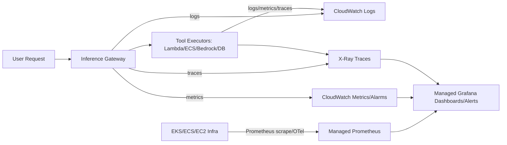

## Observability stack mental model (GenAI / agentic production)

* **Logs** answer: *“what happened?”* (inputs/outputs, tool calls, errors)
* **Metrics** answer: *“is it healthy?”* (SLIs/SLOs, rate/latency/error, cost signals)
* **Traces** answer: *“where is time spent?”* (end-to-end request + tool spans)
* In agentic systems, observability is also **auditability**: “why did the agent do that?”, “what did it call?”, “can I replay?”

---

## Production “minimum viable observability” checklist (GenAI/agents)

* **Correlation ID everywhere**: request_id propagated to logs + traces + tool calls.
* **Redaction policy**: never log secrets/PII; sample payloads only with explicit gate.
* **Three dashboards**:

  1. Golden signals (RPS/latency/errors)
  2. Dependency health (vector DB, LLM provider, tools)
  3. Cost signals (token usage, cache hit rate, retries)
* **Paging alarms**: error-rate + p95 latency + queue age + DLQ > 0.
* **Tracing**: sample baseline + 100% on errors/timeouts.

---
