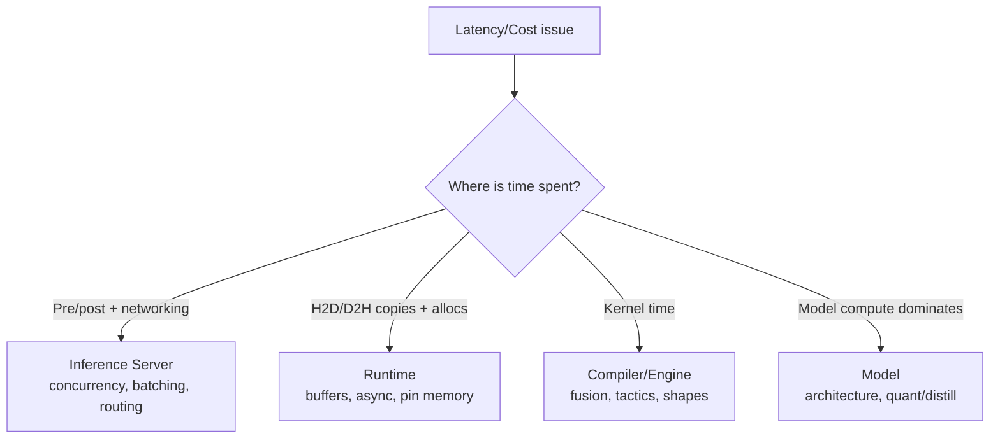

## Inference Stack (Serialize → Optimize → Compile → Runtime → Server)

### The core mental model

Inference performance and reliability come from **layered responsibility**:

1. **Serialization** (portable artifact)
2. **Optimization** (smaller/faster model representation)
3. **Compiler** (hardware-specific plan/engine)
4. **Runtime** (executes plan on hardware)
5. **Inference server** (operational layer: APIs, batching, scaling, versioning, observability)

If you’re debugging latency/cost, first locate *which layer owns the bottleneck*.

---

# 1) What each layer does (don’t mix them up)

| Layer                | Primary job                               | Typical output                                | “You know you need it when…”                           |
| -------------------- | ----------------------------------------- | --------------------------------------------- | ------------------------------------------------------ |
| **Serialize**        | Make model portable + loadable            | SavedModel / TorchScript / ONNX / safetensors | training and serving environments differ               |
| **Optimize**         | Reduce size/latency/power                 | quantized/pruned/distilled model              | SLA/cost/edge constraints exist                        |
| **Compile**          | Turn model graph into HW-tuned executable | TensorRT engine, OpenVINO IR, XLA compiled    | GPUs/TPUs and tight p99/QPS matter                     |
| **Runtime**          | Load + execute compiled/optimized model   | predictions                                   | you need efficient kernel dispatch + memory mgmt       |
| **Inference server** | Production service mgmt                   | HTTP/gRPC API + batching + metrics            | multi-model, autoscaling, dynamic batching, governance |

**Rule:** A great compiler doesn’t replace an inference server; it replaces slow kernels.

---

# 2) End-to-end flow (reference architecture)

```mermaid
flowchart TD
  A[Trained model] --> B[Serialize\n(ONNX / SavedModel / TorchScript)]
  B --> C{Need compression?}
  C -->|Yes| D[Optimize\nquantize/prune/distill]
  C -->|No| E[Keep as-is]
  D --> F[Compile\n(TensorRT / OpenVINO / XLA / TVM)]
  E --> F
  F --> G[Engine/Plan\nHW-specific artifact]
  G --> H[Runtime\n(ORT/TRT/OpenVINO/TFLite)]
  H --> I[Inference Server\n(Triton/TF Serving/TorchServe/KServe/Bento)]
  I --> J[Clients\nHTTP/gRPC]
```

---

# 3) Serialization choices (production-oriented rules)

### Safe defaults

* **Interoperability goal** → **ONNX**
* **TensorFlow ecosystem** → **SavedModel**
* **PyTorch deploy outside Python** → **TorchScript (script > trace when control-flow exists)**
* **Weights from untrusted sources** → **safetensors** (avoid pickle risks)

**Heuristic:** choose serialization based on downstream toolchain compatibility (compiler/runtime/server), not just “what’s easiest to save”.

---

# 4) Compression: when and what to use (decision heuristics)

## Quantization (most common)

* **PTQ** (post-training): fastest to adopt; requires calibration data for static INT8
* **QAT**: use when PTQ accuracy drop is unacceptable or you need aggressive low-bit

**Rule of thumb**

* latency/cost pressure + tolerant accuracy → PTQ
* strict accuracy + need INT8/INT4 → QAT or distillation-assisted quant

## Pruning

* **Structured pruning** is more likely to yield real speedups on commodity runtimes.
* **Unstructured** often needs specialized sparse kernels/hardware to see latency gains.

## Distillation

* best when you can train a smaller student to preserve teacher quality while cutting latency/cost.

**Heuristic:** start with **quantization**, then consider **distillation**, then pruning if the runtime/hardware can exploit it.

---

# 5) Compilers: what they really do (and why it matters)

Compilers perform graph + HW optimizations:

* operator fusion (reduce kernel launches + memory traffic)
* constant folding / dead-code elimination
* layout transformations
* kernel/tactic selection (often empirical, per GPU type)

### Practical implications

* compiler outputs are often **hardware + version specific**

  * e.g., TRT engine built for one GPU arch may not be portable to another
* compilation becomes part of CI/CD (or build pipeline), not “a one-time trick”

**Heuristic:** if you care about p99 latency at scale on GPUs, compilation is usually worth it.

---

# 6) Runtime engines: what to watch

Runtimes own:

* model/engine loading
* device memory planning
* kernel dispatch
* H2D/D2H copies (often a hidden cost)
* async execution primitives

### Runtime selection heuristic

* **ONNX Runtime** is a strong “default runtime” because it can use multiple execution providers (CPU/CUDA/TensorRT/OpenVINO) under one API.
* Use **TensorRT Runtime** directly when you want max NVIDIA GPU performance and have stable shapes/tooling.

**Rule:** profile runtime-level overhead (copies, allocations, sync points) before blaming “the model”.

---

# 7) Inference servers: when you outgrow “FastAPI + model()”

You need a dedicated inference server when you need:

* dynamic batching and request coalescing (GPU utilization)
* multi-model hosting + versioning
* model lifecycle mgmt (hot reload, staged rollouts)
* standardized metrics + health checks
* high QPS with predictable p99

### Server choice cheat sheet

* **Triton**: best-in-class for NVIDIA GPUs, multi-backend, batching, ensembles
* **TF Serving / TorchServe**: framework-native and solid defaults
* **KServe/Seldon**: Kubernetes-native platform features (canary, scale-to-zero, graphs)
* **BentoML**: developer-friendly packaging + flexible deploy paths

**Heuristic:** if GPU utilization is low and latency is high under load, you likely need better batching and concurrency—often via Triton/KServe.

---

# 8) The debugging playbook (find the bottleneck fast)

### Step 1: classify symptom

* **High p99 latency** under load → queueing/batching/concurrency issues (server) or memory copies (runtime)
* **Low throughput** on GPU → batch sizing, dynamic batching, kernel inefficiency (compiler/runtime)
* **Latency spikes** → cold starts, model load, GC pauses, autoscaling churn (server/infra)
* **Accuracy drop** after optimization → quantization calibration/QAT issues (optimization)

### Step 2: locate the layer



### Step 3: typical fixes by layer

* **Server:** enable dynamic batching, increase model instances, tune queue delay, switch REST→gRPC, add backpressure
* **Runtime:** reuse buffers, avoid per-request allocations, pin memory, async pipelines, reduce sync points
* **Compiler:** rebuild with correct shapes/profiles, enable FP16/INT8, adjust tactic sources, re-export ONNX cleanly
* **Model:** quantize/distill, reduce input size, multi-stage cascades

---

# 9) Design patterns that win in production

### A) Multi-stage inference (cheap → expensive)

Use when candidate set is large or p99 is strict.


### B) Hybrid execution providers (ORT)

Start with ORT CPU → switch to CUDA EP → optionally TensorRT EP for best perf.

### C) Build once, promote artifacts

* build serialized + compiled artifacts in CI
* validate in staging on target hardware
* promote identical artifacts to prod

**Rule:** don’t rebuild engines between staging and prod.

---

# 10) Inference stack readiness checklist (copy/paste)

* [ ] serialization format chosen based on downstream toolchain
* [ ] optimization objectives defined (latency/cost/size) + acceptable accuracy loss
* [ ] compile step reproducible and tied to target hardware/versions
* [ ] runtime profiled (copies, allocations, syncs)
* [ ] inference server supports batching/concurrency/versioning/metrics
* [ ] rollout plan (shadow/canary) + rollback validated
* [ ] monitoring: p50/p95/p99, QPS, errors, GPU util, queue delay, prediction drift

---

