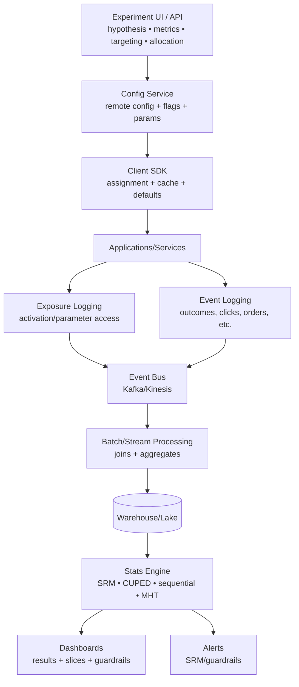

## A/B Testing — Industry Lessons

### The meta-lesson

Top companies treat experimentation as **critical infrastructure** (like payments or observability). The win is not “run tests,” it’s **increase trustworthy experiment velocity**: more experiments per week, with fewer invalid tests, faster decisions, safer rollouts.

---

# 1) Platform evolution: Crawl → Walk → Run (repeats everywhere)

### Crawl (ad-hoc)

* Experiments are coded manually (`user_id % 1000`) with no central governance.
* Definitions scattered across repos; analysis is manual.
* Release is tied to deploys → slow + error-prone.

**Failure pattern:** scaling leads to unreliable conclusions (SRM, logging gaps, inconsistent metrics).

### Walk (centralized execution + UI)

* Central UI for config, targeting, allocations, lifecycle.
* Remote config / feature flags integrated with experiments.
* Better logging (exposure), basic SRM checks.

**Win:** democratization + repeatability.

### Run (platform as a product)

* Decoupled definitions via DSL or parameterization (code doesn’t “know” experiments).
* Real-time ramp/kill switches without deploys.
* Standardized statistical engine + automated analysis.
* Guardrails, overlapping experiments (layers/domains), global holdouts, sequential testing.

**Heuristic:** If your test definition requires a service deploy, you’re stuck in Crawl/Walk.

---

# 2) Architecture patterns that show up in mature systems

## A) Experiments ride on top of remote config / feature flags

A common “correct-by-design” abstraction:

* **Parameters** are what code reads (e.g., `ranking_boost_weight`)
* Experiments override parameter values by cohort

**Why it wins**

* decouples deploys from experiment changes
* reduces “treatment parameter hygiene” issues
* enables layered/orthogonal experiments

---

## B) Deterministic hashing is the standard assignment engine

Most platforms do:

* hash(`experiment_id + unit_id + salt`) → bucket [0..N)
* map buckets → variants

**Why it wins**

* no need to store per-user assignments
* stable across sessions
* fast and consistent across services

### The advanced add-on: “salt management”

At high experiment velocity, “salt machines” (tree of salts) allow reshuffling for new experiments without breaking ongoing ones.

---

## C) Exposure logging is more important than assignment

Mature orgs log when treatment is **actually activated** (or parameter accessed), not merely assigned.

**Why it matters**

* prevents “overtracking” (counting users who never saw the treatment)
* reduces variance and speeds decisions
* makes results more interpretable

**Heuristic:** If you can’t explain the difference between *assignment* and *exposure*, your metrics will lie.

---

## D) Scalable analytics pipelines are built around “metric computation units”

Instead of “metric × experiment” queries (doesn’t scale), compute:

* aggregates per user/time
* join with exposures
* roll up into dashboards

This is why most platforms end up with:

* stream ingestion (Kafka-like)
* batch compute (Spark-like)
* serving store for results (SQL/NoSQL)
* UI dashboards

---

# 3) Correctness & validity: the checks elite teams automate

### Always-on validity checks (high signal)

* **SRM detection** (sample ratio mismatch) with alerts
* pre-exposure bias checks (A/A style health signals)
* flicker tests (assignment instability)
* crash/latency guardrails

**Rule:** SRM = “invalid experiment until fixed,” not “note in the report.”

---

# 4) Advanced experiment designs that become necessary at scale

## A) Interference / network effects (marketplaces, social, logistics)

When one unit’s treatment affects others, naive user-level randomization breaks.

Industry solutions:

* **switchback / time-split** (region/time window gets same treatment, then switches)
* **cluster randomization** (graph clusters)
* **geo experiments + synthetic controls / DiD**

**Heuristic:** If you’re in a two-sided marketplace, you’ll end up with switchbacks.

---

## B) Overlapping experiments: layers/domains + collisions

At high velocity, you can’t make everything mutually exclusive.

Pattern:

* define **layers** (orthogonal parameter spaces)
* allow users to be in multiple experiments if they touch different parameters
* enforce collision checks automatically

---

## C) Sequential testing (peeking safely)

Leaders implement sequential methods (e.g., mSPRT-style) for:

* faster detection of outages/regressions
* early stopping without inflating false positives

**Rule:** peeking without sequential methods is just generating false wins.

---

# 5) Statistics & analysis: what best teams invest in

## A) Central statistical engine (standardization = trust)

Top orgs consolidate stats into a shared engine so results are:

* comparable across teams
* repeatable
* less dependent on “who analyzed it”

## B) Variance reduction becomes a force multiplier

Widely adopted:

* **CUPED** (use pre-period metric as covariate)
* **CUPAC** (use ML predictions as covariate)
* regression adjustment, triggered analysis (exposed-only)

**Heuristic:** If your org is “experiment-rich,” variance reduction is the cheapest way to increase throughput.

## C) Go beyond average treatment effects

Common expansions:

* quantile treatment effects (e.g., p95 ETA)
* heterogeneous treatment effects / uplift modeling for personalization

---

# 6) Measuring long-term and cumulative impact (the “holdout” pattern)

Multiple companies use **global / domain holdouts**:

* keep a small % out of all (or category) changes for months/quarters
* measure the *true cumulative impact* of shipped features

Why it’s necessary:

* summed individual uplifts often **overestimate** true long-run impact (novelty fades, cannibalization).

**Rule:** Without long-term holdouts, orgs tend to over-ship “local winners” that don’t compound.

---

# 7) Experiment velocity is a capacity management problem

What leaders do to scale:

* better sensitivity (variance reduction)
* better allocation management (salts/layers)
* “fail-fast” culture with weekly cadence for high-churn domains
* standardized templates, guided workflows, pre-registered hypotheses

**Heuristic:** The bottleneck is rarely “running the test.” It’s **capacity + validity + analysis time**.

---

# 8) The industry reference architecture (canonical)

---

# 9) “If you only copy 10 lessons from top companies”

1. Decouple experiments from deploys (remote config / parameters).
2. Deterministic hashing + consistent assignment across services.
3. Log **exposure**, not just assignment.
4. SRM checks are mandatory and automated.
5. Guardrails are first-class (latency, crashes, safety).
6. Standardize stats and metrics in a central engine/repo.
7. Use variance reduction (CUPED/CUPAC) to increase velocity.
8. Handle interference explicitly (switchbacks/cluster/geo).
9. Add layering/domains to scale overlapping experiments.
10. Measure long-term cumulative impact with global/domain holdouts.

---

# 10) Practical “build order” (what to implement first)

### Phase 1 (fast ROI)

* deterministic assignment + stable bucketing
* exposure logging + minimal dashboard
* SRM + guardrail alerts
* guided experiment setup (hypothesis + primary + guardrails)

### Phase 2

* standardized metrics repository
* CUPED
* collision detection + layers/domains
* shadow/canary integration with experimentation routing

### Phase 3

* sequential testing (for outage detection)
* switchback + geo experiments
* holdouts for cumulative impact
* HTE/uplift + quantile effects

---

