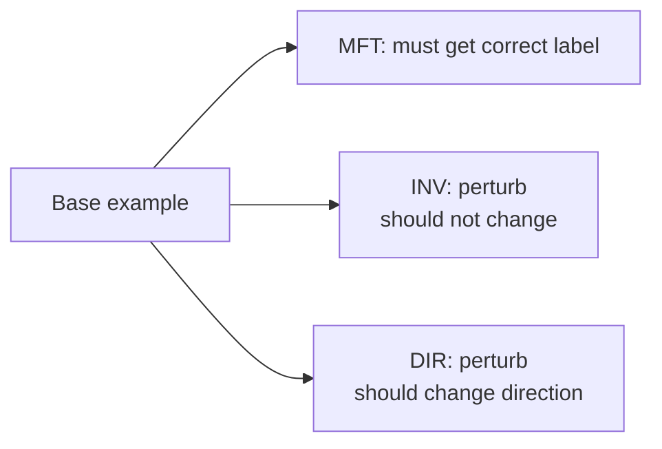

## Testing ML Systems (Code + Pipelines + Data + Model + Infra)

### The core mental model

ML testing isn’t just “does the code run?” It’s **trust engineering for a probabilistic, data-driven system**.
You test:

* **written logic** (code/pipelines/infra) and
* **learned logic** (model behavior),
  and you treat **monitoring as online testing**.

---

# 1) Why ML systems fail differently (and what testing must catch)

**Common ML failure modes**

* **Silent failures:** drift/skew degrades predictions without crashing.
* **Data is a liability:** a small upstream change can corrupt the entire system.
* **Good offline, bad online:** proxy mismatch, skew, selection bias, feedback loops.
* **Non-determinism:** training isn’t bitwise reproducible; tests must assert properties, not exact numbers.

**Heuristic:** If a failure can reach production without raising an exception, it needs a *data/model* test + a monitor.

---

# 2) The MLOps test pyramid (adapted)

Push tests down for speed and debuggability; keep E2E few.

```mermaid
flowchart TB
  U[Many: Unit tests\n(feature transforms, utilities,\nmodel components)] --> I[Some: Integration tests\n(pipeline stages, FS writes,\nmodel load + invoke)]
  I --> E[Few: E2E tests\n(full pipeline on sample data\nor staging replay)]
  E --> O[Always-on: Online tests\n(monitoring as tests:\nfreshness, drift, latency,\nquality proxies)]
```

**Rule:** If an E2E test is flaky, replace it with 2–3 lower-level contract + integration tests.

---

# 3) What to test (the “quadrants”)

Think across **Artifact** × **Stage**.

| Artifact             | Offline / Development                                                                     | Online / Production (monitoring as tests)                               |
| -------------------- | ----------------------------------------------------------------------------------------- | ----------------------------------------------------------------------- |
| **Code & Pipelines** | unit + integration + pipeline E2E + contract tests                                        | pipeline health, dependency change monitoring                           |
| **Data**             | schema, integrity, distribution checks, leakage, PII checks                               | data quality monitors, drift/skew, anomalies in streams                 |
| **Model**            | pre-train sanity, behavioral tests, robustness, slices/fairness, calibration, regressions | quality (GT/proxies), skew, concept drift, numerical stability, latency |
| **Infra**            | model spec tests, pipeline integration, canary/rollback tests                             | serving availability, load/latency, rollout monitoring                  |

---

# 4) Code & pipeline testing playbook (written logic)

## A) Unit tests (fast, lots)

Test atomic logic:

* feature transforms (date parsing, bucketing, normalization)
* schema/contract utilities
* custom layers/losses
* encoding/decoding, post-processing

**Heuristic:** Refactor notebooks into functions first; otherwise you can’t test.

## B) Integration tests (some)

Test interfaces between components:

* raw → processed → feature store write
* model package load + inference in a container
* training pipeline stages with mocks/stubs for external deps

**Make integration tests robust**

* assert **coarse properties** (schema, row counts, non-null rates), not exact row values
* mock unstable external services (DB/API) unless you’re explicitly testing them

## C) Contract tests (critical in microservices)

If your feature service/model service consumes upstream APIs:

* validate request/response shape, status codes, types
* consumer-driven contracts (Pact-like) are ideal when multiple teams deploy independently

---

# 5) Data testing playbook (the fuel)

### Minimum viable “DQ gates” (run before training / before insert)

* schema/types match expected
* null-rate thresholds
* row-count bounds
* value ranges (min/max/date bounds)
* uniqueness / dedupe keys
* set membership / regex patterns (categoricals/IDs)
* leakage checks (train/test overlap, time-travel)

**Heuristic:** Convert EDA findings into DQ tests—otherwise they vanish.

### Drift vs skew (don’t conflate)

* **Drift:** live data distribution changes over time
* **Skew:** train vs serve mismatch (schema/feature/distribution differences)

**Heuristic:** Alert first on *freshness + null spikes + schema breaks* (highest signal, fastest to act).

---

# 6) Model testing playbook (learned logic)

## A) Pre-train sanity checks (cheap, catches big bugs)

* output shape matches labels/task
* probabilities valid (sum-to-1, in [0,1]) where applicable
* loss decreases after a single gradient step on a batch
* can overfit a tiny dataset / one batch

**Rule:** If you can’t overfit a tiny batch, stop: pipeline/model is broken.

## B) Post-train behavioral tests (beyond accuracy)

Use three kinds of tests (especially for NLP, but applies broadly):

* **MFT (Minimum Functionality Tests):** simple known cases must pass
* **INV (Invariance):** perturbations that shouldn’t change prediction (typos, synonyms, minor brightness change)
* **DIR (Directional expectation):** perturbations that should move prediction in a direction (add “not”, increase price, etc.)



## C) Sliced evaluation (mandatory)

Always report metrics on critical segments (geo/device/user cohorts/rare classes).

**Heuristic:** If overall metric improves but a key slice regresses, treat it as a failed release unless explicitly accepted.

## D) Calibration tests (if thresholds/probabilities drive actions)

* check reliability / calibration error
* calibrate on validation only (Platt/isotonic) and track stability

## E) Model regression tests (your best long-term ROI)

Every production bug becomes:

* a stored failing example
* a test case that prevents recurrence

**Rule:** Incidents must generate tests. Otherwise you will repeat them.

---

# 7) Infra + deployment testing playbook

* model spec tests: artifact loads, signature/schema present, deps pinned
* canary tests in staging: model loads, endpoints respond, latency within bounds
* rollback tests: prove you can revert quickly and safely

**Heuristic:** A rollback plan that hasn’t been tested is not a rollback plan.

---

# 8) CI/CD wiring (how to run tests without blocking forever)

### Fast gates (every PR)

* unit tests
* lightweight data tests (schema + basic expectations on sample)
* model sanity checks (shape, probabilities, overfit-batch on tiny data)
* build + import/packaging checks

### Slower gates (merge to main / nightly)

* integration tests with real dependencies
* pipeline E2E on small representative dataset
* behavioral tests suite expansion (generated cases)
* load/perf smoke (latency + throughput baseline)

### Release gates (promotion to prod)

* metric floors vs baseline/champion
* key slice floors
* latency/cost ceilings
* canary/shadow monitoring window

---

# 9) Handling nondeterminism (don’t write brittle tests)

Instead of asserting exact metrics, assert:

* **ranges** (AUC ≥ X, loss decreases, calibration within band)
* **monotonic expectations** (bigger input → higher score)
* **statistical properties** across runs (mean within band)

**Heuristic:** Your tests should fail on real regressions, not random seeds.

---

# 10) Prioritization (where to invest first)

Use Impact × Likelihood:

* **P0:** high-impact, high-likelihood → must test thoroughly (data schema/freshness, skew checks, rollback)
* **P1:** high-impact, medium-likelihood → comprehensive tests (slices, integration, contracts)
* **P2:** targeted scenario tests (robustness, specific edge cases)
* **P3/P4:** basic smoke/minimal optional

**Rule:** Spend most effort preventing the failures that can silently ship.

---

# 11) Debugging flow (when something breaks)

```mermaid
flowchart TD
  A[Alert / Degradation] --> B{Infra issue?\n(latency/errors)}
  B -->|Yes| C[Check serving health\nCPU/Mem, timeouts,\ndeps, rollback]
  B -->|No| D{Data issue?\n(schema/null/freshness)}
  D -->|Yes| E[Trace upstream change\nschema contracts,\nDQ dashboards,\nbackfill/replay]
  D -->|No| F{Skew/Drift?\ntrain vs serve}
  F -->|Yes| G[Parity checks\nfeature recompute,\nPIT joins,\ntransform codepaths]
  F -->|No| H[Model behavior regression]
  H --> I[Slice analysis + regression set\nadd failing examples\nto tests + retrain]
```

---

## “If you only implement 8 things”

1. Unit tests for feature transforms + utilities
2. Integration test for “model loads + predicts” in container
3. Schema + null-rate + range checks as **gates**
4. Drift/skew monitoring in production
5. Pre-train sanity checks (shape, prob bounds, overfit-batch)
6. Slice metrics with hard floors for critical segments
7. Regression set for production bugs (always grows)
8. Canary + rollback **tested**, not just documented

