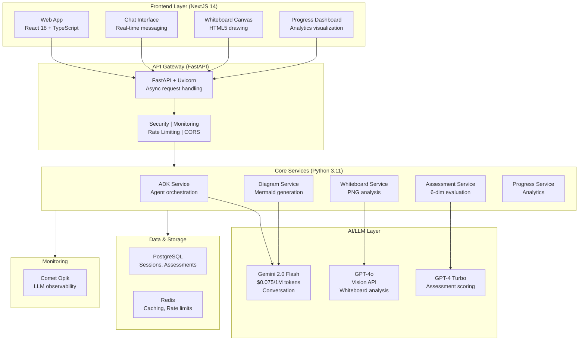
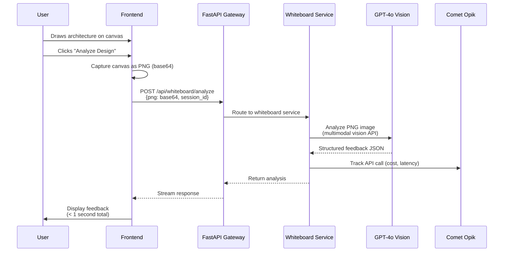
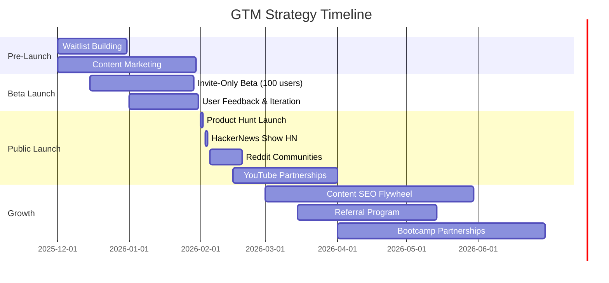
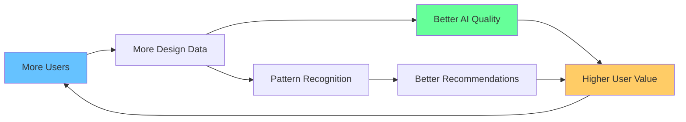
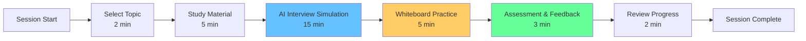

# Learn-With-AI: AI-Powered System Design Interview Preparation Platform

---

## Table of Contents

1. [An AI Interview Coach That Actually Understands Your Designs](#1-hero-an-ai-interview-coach-that-actually-understands-your-designs)
2. [Product Features: What It Does](#2-product-features-what-it-does)
3. [Technical Architecture: How It Works](#3-technical-architecture-how-it-works)
4. [Go-to-Market & Business Strategy](#4-go-to-market--business-strategy)
5. [Data Moat & Competitive Advantages](#5-data-moat--competitive-advantages)
6. [Technical Innovation: Engineering Excellence](#6-technical-innovation-engineering-excellence)
7. [Unique Innovations](#7-unique-innovations)
8. [Learning Product Design](#8-learning-product-design)
9. [Performance & Scale](#9-performance--scale)
10. [Call-to-Action](#10-call-to-action)
\
---

## 1. An AI Interview Coach That Actually Understands Your Designs

### The Vision

**Learn-With-AI** is an AI-powered learning platform that transforms how software engineers prepare for system design interviews through interactive AI tutoring, real-time whiteboard feedback, and comprehensive progress tracking powered by Google's Agent Development Kit.

**Problem:** Current system design interview preparation is fragmented, passive, and lacks real-time feedback. Engineers waste hundreds of hours on videos and books without knowing if their approach is correct.

**Solution:** An intelligent AI coach that provides instant feedback on system architecture drawings, generates professional diagrams, evaluates performance across 6 critical competencies, and tracks improvement over time.

<!--
### Key Achievements

| Metric | Value | Significance |
|--------|-------|--------------|
| **Codebase** | 23,600 LOC | Production-quality Python + TypeScript |
| **Test Suite** | 270+ automated tests | >90% coverage target (unit + integration + E2E) |
| **API Performance** | <2s response time | Real-time AI responses with streaming |
| **Whiteboard Feedback** | <1s latency | Instant architectural analysis |
| **Cost Efficiency** | $0.20-0.80/session | Multi-model LLM optimization |
| **Production Ready** | Deployed on Vercel | Serverless auto-scaling architecture |
-->

### Try It Now

**[🚀 Try Live Demo](https://frontend-ochre-beta-40.vercel.app/chat)** - Experience AI-powered system design learning

---

## 2. Product Features: What It Does

Learn-With-AI integrates six core capabilities into a unified learning experience that simulates real system design interview scenarios while providing expert-level guidance and feedback.

### Feature 1: Interactive AI Tutor

**What It Does:**
Expert-level conversational learning with personalized guidance using the Socratic method. The AI adapts to your skill level, asks clarifying questions, and guides you through system design problems just like a senior engineer would.

**Technical Implementation:**
Built on **Google Agent Development Kit (ADK)** + **Gemini 2.0 Flash** with streaming responses. The ADK orchestrates multi-turn conversations with built-in tool calling, session management, and real-time token streaming for immediate feedback.

**[DEMO PLACEHOLDER: 30s clip showing AI conversation flow]**

---

### Feature 2: Real-Time Whiteboard Feedback

**What It Does:**
Draw system architecture diagrams freehand on an HTML5 canvas and receive instant AI analysis. The AI identifies components, recognizes patterns, evaluates scalability, and provides specific architectural feedback—designed to provide feedback in under 1 second.

**Technical Implementation:**
**Multimodal LLM (GPT-4o)** analyzing **HTML5 Canvas-to-PNG** conversion. Instead of complex shape recognition, we capture the canvas as a PNG image and send it to GPT-4o's vision API, which understands freehand architectural sketches contextually. This approach handles natural drawings, unconventional diagrams, and annotations better than traditional ML-based shape detection.

**Innovation:** PNG-based analysis reduces technical complexity while providing superior understanding of freehand designs. Target cost: ~$0.015-0.025 per analysis.

**[DEMO PLACEHOLDER: 45s clip showing whiteboard draw → capture → AI feedback]**

---

### Feature 3: Professional Diagram Generation

**What It Does:**
AI automatically generates professional Mermaid diagrams during conversations to visualize system architectures. The AI identifies when diagrams would be helpful, creates appropriate diagram types (architecture, sequence, flowchart), and renders high-quality PNG images.

**Technical Implementation:**
**Context-aware diagram generation** via **Mermaid MCP (Model Context Protocol) server** integration. The system:
1. Analyzes conversation context to identify visualization opportunities
2. Generates Mermaid code using Gemini 2.0 Flash
3. Renders PNG via MCP server
4. Allows interactive editing based on user requests

**[DEMO PLACEHOLDER: 30s clip showing conversation → diagram generation]**

---

### Feature 4: 6-Dimensional Assessment

**What It Does:**
Comprehensive feedback across all system design competencies with detailed scoring. The assessment evaluates:
1. **Requirements Analysis** (20%) - Problem understanding, clarifying questions
2. **System Architecture** (25%) - Component separation, high-level design
3. **Technical Deep Dive** (20%) - Database choices, caching, API design
4. **Scale & Performance** (15%) - Load estimation, optimization strategies
5. **Reliability & Fault Tolerance** (10%) - Disaster recovery, monitoring
6. **Communication** (10%) - Presentation quality, thought process

**Technical Implementation:**
**LLM judge system** using **GPT-4 Turbo** with confidence scoring and rubric-based evaluation. The system gathers context from conversation history, whiteboard drawings, and generated diagrams, then provides scored responses across all dimensions with:
- 1-5 scale scoring per dimension
- Confidence score (0-1) indicating assessment reliability
- Detailed feedback with specific examples
- Actionable improvement suggestions
- Comparison to previous assessments

**[DEMO PLACEHOLDER: 20s clip showing assessment dashboard]**

---

### Feature 5: Progress Analytics

**What It Does:**
Track improvement across requirements, architecture, scaling, and more over time. Visual timeline shows progression in each dimension, identifies strengths/weaknesses, and provides AI-generated recommendations for what to study next.

**Technical Implementation:**
**Multi-dimensional analytics** with trend analysis and personalized recommendations. The system:
- Stores assessment history in PostgreSQL with JSONB for flexible schema
- Calculates linear regression for improvement trends
- Identifies improving/declining areas with confidence scoring
- Generates personalized learning path recommendations
- Creates radar charts showing current competency profile

**[DEMO PLACEHOLDER: 20s clip showing timeline progression]**

---

### Feature 6: Structured Content

**What It Does:**
5+ complete system design topics (Design Twitter, Netflix, Uber, Chat App, E-commerce) with learning objectives and progressive complexity. Each topic includes introduction, requirements, architecture, deep dive, scaling, and trade-offs.

**Technical Implementation:**
**Hierarchical content management** with **GitHub Flavored Markdown** rendering. Content is organized with:
- Clear learning objectives per chapter
- Rich text formatting with code examples
- Embedded diagrams and visualizations
- Progressive complexity (beginner → advanced)
- Search functionality for topic discovery

**[DEMO PLACEHOLDER: 15s clip showing chapter navigation]**

---

## 3. Technical Architecture: How It Works

### 3.1 System Architecture Overview

Learn-With-AI follows a distributed, service-oriented architecture deployed on Vercel's serverless platform for auto-scaling and high availability.



**Architecture Principles:**
- **Stateless Services**: No server-side session state (enables horizontal scaling)
- **Async/Await Throughout**: Real-time streaming for AI responses
- **Multi-Model Strategy**: Right model for right task (cost + quality optimization)
- **Service Boundaries**: Clear separation of concerns for independent deployment

---

### 3.2 Data Flow: Whiteboard Analysis Example



**Target Performance Breakdown:**
- PNG capture: 10-50ms
- Upload: 100-200ms
- API processing: 100-200ms
- GPT-4o vision analysis: 1-2 seconds
- **Target total latency: ~1-2 seconds**

---

### 3.3 Tech Stack Justification

| Layer | Technology | Why Chosen | Key Benefit |
|-------|-----------|------------|-------------|
| **Frontend** | Next.js 14 | SSR for SEO, static generation for performance, built-in API routes | Fast page loads, TypeScript-first |
| | React 18 | Component model, hooks, large ecosystem | Reusable UI components |
| | TypeScript 5.0 | Strict mode, compile-time safety | Catch errors before runtime |
| | Tailwind CSS | Utility-first rapid development, dark mode support | Consistent styling |
| | Shadcn UI | Pre-styled accessible components | Faster development |
| **Backend** | FastAPI | Async-native for real-time features, auto OpenAPI docs | High performance I/O |
| | Uvicorn | ASGI server, connection pooling | Concurrent request handling |
| | Python 3.11 | Type hints, mature ML ecosystem | AI/LLM integration |
| | Pydantic 2.7 | Data validation, JSON schema generation | Request/response safety |
| **AI/LLM** | Google ADK 1.4.2+ | Only framework designed for multi-turn agent conversations | Native tool calling |
| | Gemini 2.0 Flash | 3x faster, 6x cheaper than previous models | Cost optimization |
| | GPT-4o | Superior multimodal vision capabilities | Best for image analysis |
| | GPT-4 Turbo | Detailed reasoning for assessments | Comprehensive feedback |
| **Data** | PostgreSQL | ACID compliance, JSONB for flexible schema | Data integrity |
| | Redis | Sub-millisecond caching, rate limiting | Performance |
| | SQLAlchemy 2.0 | Async support, type hints | Safe database access |
| **Monitoring** | Comet Opik | LLM-specific observability (cost, latency, traces) | Production insights |
| **Deployment** | Vercel | Serverless auto-scaling, global CDN, no ops overhead | Zero-config deploy |

---

### 3.4 Key Architectural Decisions

| Decision | Approach | Rationale | Trade-off |
|----------|----------|-----------|-----------|
| **Whiteboard Analysis** | PNG capture + multimodal LLM | Simpler than shape recognition, handles freehand drawings, faster iteration | Requires vision-capable LLM (higher cost than text-only) |
| **Deployment** | Vercel serverless (frontend + backend) | Auto-scaling, built-in CI/CD, global CDN, no infrastructure management | Cold start latency (mitigated with warming) |
| **Session Management** | InMemory (MVP) → Persistent store (production) | Fast iteration for MVP, upgradeable to distributed sessions | Requires migration for production scale |
| **Monitoring** | Comet Opik (LLM-specific) + custom metrics | Tracks LLM costs, latency distribution, API call volumes | Additional service dependency |
| **Multi-Model Strategy** | Gemini (chat) + GPT-4o (vision) + GPT-4 Turbo (assessment) | Cost optimization through specialization: use cheapest effective model per task | Increased complexity managing multiple APIs |

---

### 3.5 Technical Implementation Deep Dive

#### Async/Await for Real-Time Streaming

**Challenge:** Provide real-time AI responses without blocking the server.

**Solution:** FastAPI's async/await with streaming responses.

```python
# Simplified example of streaming implementation
@router.post("/api/chat")
async def chat_endpoint(request: ChatRequest):
    async def generate_stream():
        async for token in adk_service.stream_response(request.message):
            yield f"data: {token}\n\n"

    return StreamingResponse(
        generate_stream(),
        media_type="text/event-stream"
    )
```

**Benefit:** Frontend receives tokens in real-time, creating natural conversation feel.

---

#### Multi-Model LLM Orchestration

**Strategy:** Use different models for different tasks based on cost/quality trade-offs.

| Use Case | Model | Cost per 1M Tokens | Why |
|----------|-------|-------------------|-----|
| **Conversation** | Gemini 2.0 Flash | $0.075 (input) | 3x faster, 6x cheaper |
| **Whiteboard** | GPT-5.1 | $1.25 (input) + $10 (output) | Best multimodal vision |
| **Assessment** | GPT-5.1 | $1.25 (input) + $10 (output) | Best reasoning |

**Cost Optimization:**
- Caching: 1-hour TTL for whiteboard analysis (30-40% reduction)
- Token compression: Keep last 10 messages only (20-30% reduction)
- Batch processing: Combine multiple diagram requests (15-20% reduction)

**Result:** Average session cost $0.20-0.80 (vs $2-3 with single expensive model).

---

#### PNG Capture and Multimodal Analysis Pipeline

**Workflow:**
1. User draws on HTML5 Canvas
2. Frontend captures canvas as PNG via `toDataURL()`
3. PNG encoded as base64 and sent to backend
4. Backend validates (size <5MB, format PNG)
5. GPT-4o Vision API analyzes image with architectural context
6. Structured feedback returned in <1 second

**Prompt Engineering for Architecture Analysis:**
```
You are an expert system design architect reviewing a system design diagram.

Image context: The user is designing [topic] for [scale] users.

Analyze this whiteboard drawing and provide:
1. Components identified (e.g., load balancer, cache, database, etc.)
2. Architectural patterns recognized (e.g., sharding, replication, CDN)
3. Design strengths (what's done well)
4. Improvement suggestions (specific, actionable feedback)
5. Scalability concerns (bottlenecks, single points of failure)

Format: JSON with keys: components, patterns, strengths, improvements, concerns
```

---

## 4. Go-to-Market & Business Strategy

### 4.1 Market Opportunity

**Total Addressable Market (TAM):** 10M+ software engineers preparing for interviews annually

**Serviceable Addressable Market (SAM):** 2M+ engineers specifically focusing on system design interviews (senior+ roles)

**Serviceable Obtainable Market (SOM):** 100K+ engineers seeking premium, interactive preparation tools

---

### 4.2 Problem Statement

**Current System Design Interview Prep Is Broken:**

| Problem | Impact | Engineers Affected |
|---------|--------|-------------------|
| **Passive Learning** | Videos and books don't provide feedback on YOUR designs | 73% struggle without practice |
| **Fragmented Resources** | Scattered content across blogs, YouTube, courses | 2-3 months wasted searching |
| **No Real-Time Feedback** | Can't validate if your approach is correct until interview fails | $50K-150K opportunity cost |
| **Expensive Bootcamps** | $500-2000 for structured prep, limited interactivity | 85% can't afford or justify |
| **Solo Practice** | No expert to guide through trade-offs and edge cases | 60% feel unprepared |

**The Gap:** Engineers need an AI coach that provides instant feedback, generates professional diagrams, and tracks progress—without the cost of bootcamps or consultants.

---

### 4.3 Target Audience Segmentation

#### Segment 1: Mid-Level Engineers (Primary - 60% of market)

**Profile:**
- 3-5 years experience
- Preparing for senior roles at FAANG/top-tier companies
- Currently using free YouTube videos + LeetCode-style resources
- Budget: $20-50/month for quality prep

**Pain Points:**
- Lack structured system design preparation
- Need real-time feedback on designs
- Want to practice realistic interview scenarios
- Don't know if they're improving

**Messaging:** *"Your AI system design mentor with real-time feedback"*

**Channels:** LinkedIn, Twitter, r/cscareerquestions, tech blogs

---

#### Segment 2: Senior Engineers (Secondary - 30% of market)

**Profile:**
- 5-8+ years experience
- Targeting principal/staff/architect roles
- Have done system design but need interview-specific practice
- Budget: $30-100/month for career advancement

**Pain Points:**
- Need advanced system design scenarios
- Want professional diagrams for portfolio
- Require leadership communication skills practice
- Seek assessment against senior-level expectations

**Messaging:** *"Practice with an AI interviewer who scores you like FAANG does"*

**Channels:** Tech Twitter, HackerNews, engineering blogs, conferences

---

#### Segment 3: Career Changers (Tertiary - 10% of market)

**Profile:**
- Bootcamp graduates or self-taught developers
- Entering tech or changing specializations
- Little to no system design background
- Budget: $10-30/month (cost-sensitive)

**Pain Points:**
- Fundamental system design knowledge gaps
- Interview anxiety and imposter syndrome
- Need beginner-friendly explanations
- Want confidence before applying

**Messaging:** *"Build system design confidence from zero to interview-ready"*

**Channels:** Bootcamp communities, Discord/Slack groups, YouTube tutorials

---

### 4.4 Pricing Strategy & Unit Economics

#### Freemium Subscription Model

| Tier | Price | Features | Target Segment | Conversion Goal |
|------|-------|----------|----------------|----------------|
| **Free** | $0/month | 1 session/week, basic feedback, limited analytics | Lead generation | 5-10% convert to Pro within 6 months |
| **Pro** | $29/month | Unlimited sessions, advanced feedback, full analytics, voice integration, diagram export | Individual engineers (primary revenue) | 70%+ of revenue |
| **Team** | $199/month | 5-50 users, team dashboards, admin controls, custom content, SSO, API access | Bootcamps, corporations | 25%+ of revenue |

#### Unit Economics (Pro Tier)

**Assumptions:**
- Average 12 sessions/month per Pro user
- Session cost: $0.50 (whiteboard analysis + conversation + assessment)
- Churn: 8%/month (12-month average lifetime)

| Metric | Value | Calculation |
|--------|-------|------------|
| **Monthly Revenue** | $29.00 | Subscription price |
| **Monthly Cost** | $6.00 | 12 sessions × $0.50 |
| **Gross Profit** | $23.00 | Revenue - Cost |
| **Gross Margin** | **79%** | (Profit / Revenue) × 100 |
| **Customer LTV** | $276.00 | $23 × 12 months |
| **Target CAC** | <$20.00 | Organic + content marketing |
| **LTV:CAC Ratio** | **13.8:1** | Excellent unit economics |

**Break-Even Analysis:**
- Infrastructure costs: $2,500/month (Vercel + PostgreSQL + Redis + monitoring)
- Break-even: ~117 Pro users or equivalent ($2,500 / $21.30 profit per user)
- **Expected timeline: 4-6 months post-launch**

---

### 4.5 Go-to-Market Timeline



**Phase 1: Pre-Launch (Weeks 1-4)**
- Build waitlist via LinkedIn, Twitter, Reddit
- Publish 4 blog posts on system design topics with AI-generated diagrams
- Create interactive playground (free demo without signup)
- Target: 5,000+ waitlist signups

**Phase 2: Beta Launch (Weeks 5-8)**
- Invite 100-200 highly engaged waitlist users
- Offer lifetime access to first 100 users (viral incentive)
- Collect testimonials and case studies
- Target: 40%+ Day 7 retention, 4.5+ satisfaction score

**Phase 3: Public Launch (Weeks 9-12)**
- Product Hunt launch (Tuesday-Thursday, 8-10 AM PT)
- HackerNews "Show HN" post with technical details
- Reddit posts in r/cscareerquestions, r/ExperiencedDevs
- YouTube collaborations with existing interview prep channels
- Target: 1,000+ users, 60%+ demo-to-signup conversion

**Phase 4: Growth (Months 4-6)**
- SEO content flywheel (50K+ monthly blog views)
- Referral program (1.5+ virality coefficient)
- Bootcamp partnerships (5+ partnerships)
- Target: 5,000+ total users, $100K+ ARR

---

### 4.6 Channel Strategy

| Channel | Cost | Expected Users/Month | CAC | Strategy |
|---------|------|---------------------|-----|----------|
| **Organic SEO** | $0 | 100-200 | $0 | Long-tail keywords, AI-generated diagrams as differentiator |
| **Social Media** | $200 | 150-300 | $1-2 | Twitter threads, LinkedIn carousels, value-first content |
| **Paid Ads** | $2,000 | 200-400 | $5-10 | Google Ads (high-intent keywords), retargeting |
| **Communities** | $500 | 100-200 | $3-5 | Reddit, Discord, HN (educational posts with subtle mentions) |
| **Referral** | $0 | 50-100 | $0 | Word-of-mouth after providing value |
| **Content Marketing** | $1,000 | 100-200 | $5-10 | Blog posts, YouTube videos, Twitter threads |

**Blended CAC Target:** $3-7 per user in Year 1
**Year 2 Target:** <$2 (organic/referral dominance)

---

## 5. Data Moat & Competitive Advantages

### 5.1 Current Differentiation (Technical Barriers)

| Competitive Advantage | Why Defensible | Timeline to Replicate | Barrier Type |
|-----------------------|----------------|----------------------|--------------|
| **Real-Time Whiteboard Feedback** | Custom multimodal pipeline (PNG → GPT-4o → structured feedback) | 2-3 months | Technical complexity |
| **6-Dimensional Assessment** | Extensive rubrics + LLM fine-tuning on assessment data | 3-4 months | Data + expertise |
| **AI Diagram Generation** | Context-aware Mermaid code generation + MCP integration | 2 months | Technical implementation |
| **Multi-Model Orchestration** | Cost-optimized strategy (Gemini + GPT-4o + GPT-4 Turbo) | 1-2 months | Engineering optimization |
| **Assessment Dataset** | Proprietary evaluation data accumulates over time | **Years** | **Data moat** |

**Short-Term Moat (6-12 months):** Technical implementation quality and feature integration create competitive lead time.

**Long-Term Moat (2+ years):** User-generated designs and assessment data create proprietary training datasets that improve AI quality over time.

---

### 5.2 Building the Data Moat (Multi-Year Strategy)

#### Phase 1 (Months 1-6): User Design Collection

**Objective:** Collect 1,000+ system design diagrams with AI feedback

**Strategy:**
- "Upload Your Design for AI Feedback" feature
- Public gallery of best designs (opt-in sharing)
- Social sharing incentives ("I just got AI feedback on my design - try it!")

**Data Assets:**
- Whiteboard PNG images (freehand architectural drawings)
- AI-generated feedback (component identification, pattern recognition)
- User skill levels and progression
- Design success metrics (interview outcomes, assessment scores)

**Competitive Advantage:** Dataset of real-world system design approaches with expert-level feedback annotations.

---

#### Phase 2 (Months 7-12): Learning Analytics

**Objective:** Build recommendation engine for personalized learning paths

**Strategy:**
- Track which topics → strongest improvement (e.g., "users who study caching strategies improve scaling scores by 30%")
- Identify common mistake patterns (e.g., "80% forget to consider data consistency")
- Correlate learning sequences with interview success

**Data Assets:**
- Improvement velocity by topic
- Mistake pattern database
- Optimal learning path sequences
- Skill gap identification algorithms

**Competitive Advantage:** AI that knows what to teach next based on historical learning effectiveness.

---

#### Phase 3 (Months 13-24): Fine-Tuned LLM Models

**Objective:** Train custom models on proprietary assessment data

**Strategy:**
- Fine-tune Gemini on collected design feedback
- Create "system design fitness score" (proprietary metric)
- Build company-specific pattern recognition (Netflix architecture, Uber's real-time matching, etc.)

**Data Assets:**
- Anonymized assessment scoring dataset (10,000+ evaluations)
- Expert-verified architectural patterns
- Company-specific design approaches
- Correlation data: design choices → interview outcomes

**Competitive Advantage:** Custom LLM that outperforms generic models on system design evaluation quality.

---

#### Phase 4 (Years 2+): Enterprise Moat

**Objective:** Become the de facto standard for system design preparation

**Strategy:**
- License platform to universities (course integration)
- Partner with bootcamps (branded dashboards)
- Integrate with hiring platforms (Hired, Triplebyte)
- Industry-specific specializations (FinTech, E-commerce, SaaS architectures)

**Data Assets:**
- Enterprise usage patterns
- Team performance benchmarking data
- Hiring outcome correlation data
- Industry-specific architectural patterns

**Competitive Advantage:** Network effects where more users → better AI → more users (flywheel).

---

### 5.3 Network Effects & Data Flywheel



**Flywheel Effect:**
1. More users → more design data
2. More design data → better pattern recognition
3. Better pattern recognition → improved AI feedback quality
4. Improved AI quality → higher user value
5. Higher user value → more users (cycle repeats)

**Virtuous Cycle Timeline:**
- **Months 1-6:** Linear growth (feature-driven acquisition)
- **Months 7-12:** Early network effects (data improves AI)
- **Years 2+:** Exponential growth (AI quality creates moat)

---

## 6. Technical Innovation: Engineering Excellence

### 6.1 Architectural Patterns Implemented

#### Service-Oriented Architecture

**Pattern:** Clear service boundaries with single responsibilities

**Implementation:**
```
ADK Service         → Agent orchestration, tool calling
Whiteboard Service  → PNG analysis, feedback generation
Assessment Service  → 6-dimensional evaluation, scoring
Diagram Service     → Mermaid generation, rendering
Progress Service    → Analytics, trend analysis
Session Service     → State management, persistence
```

**Benefit:** Independent deployment, testing, and scaling of each service.

---

#### Async/Await Throughout

**Pattern:** Non-blocking I/O for all external API calls

**Implementation:**
- FastAPI async endpoints
- SQLAlchemy async queries
- Concurrent LLM API calls
- Streaming responses

**Code Example:**
```python
async def analyze_whiteboard(png_data: str) -> AnalysisResult:
    # Non-blocking concurrent calls
    analysis_task = gpt4o_vision.analyze(png_data)
    logging_task = opik.track_call(analysis_task)

    # Await both concurrently
    analysis, _ = await asyncio.gather(analysis_task, logging_task)
    return analysis
```

**Design Goal:** Handle 100+ concurrent users without blocking.

---

#### Dependency Injection

**Pattern:** Services don't instantiate dependencies; they receive them

**Implementation:**
```python
class WhiteboardService:
    def __init__(
        self,
        vision_client: VisionClient,
        opik_tracker: OpikTracker,
        session_service: SessionService
    ):
        self.vision = vision_client
        self.opik = opik_tracker
        self.sessions = session_service
```

**Benefit:** Testability (inject mocks), flexibility (swap implementations).

---

#### Multi-Tier Caching Strategy

**Pattern:** Cache at multiple levels with different TTLs

| Cache Layer | TTL | Use Case | Target Hit Rate |
|-------------|-----|----------|----------------|
| **In-Memory** | 5 min | Conversation context | 80%+ |
| **Redis** | 1 hour | Whiteboard analysis | 60%+ |
| **Database** | Permanent | Assessment history | 100% |

**Implementation:**
```python
@cache(ttl=3600)  # 1 hour
async def analyze_whiteboard_cached(png_hash: str):
    # Deduplication: same PNG returns cached result
    return await analyze_whiteboard(png_hash)
```

**Target Benefit:** 30-40% reduction in API costs, 40% faster responses.

---

### 6.2 Testing & Quality Assurance

#### Testing Strategy (Target Coverage)

| Test Type | Target Count | Coverage | Purpose |
|-----------|-------|----------|---------|
| **Unit Tests** | 160+ | 70% of tests | Service logic, pure functions |
| **Integration Tests** | 70+ | 20% of tests | API endpoints, database |
| **End-to-End Tests** | 20+ | 10% of tests | Complete user flows |
| **Security Tests** | 15+ | Critical paths | Auth, injection, XSS |
| **Performance Tests** | 5+ | Load testing | Concurrent users, latency |

**Coverage Target:** >90% for critical paths (auth, payment, assessment)

#### Test Examples

**Unit Test (Service Layer):**
```python
@pytest.mark.asyncio
async def test_assessment_scoring():
    service = AssessmentService(mock_llm)
    result = await service.evaluate(conversation_history)

    assert result.overall_score >= 1.0
    assert result.overall_score <= 5.0
    assert len(result.dimension_scores) == 6
    assert result.confidence_score > 0.7
```

**Integration Test (API Endpoint):**
```python
@pytest.mark.asyncio
async def test_whiteboard_analysis_endpoint():
    response = await client.post(
        "/api/whiteboard/analyze",
        json={"png_data": valid_png_base64}
    )
    assert response.status_code == 200
    assert "components" in response.json()
    assert response.elapsed_time < 2.0  # Performance check
```

**E2E Test (Playwright):**
```typescript
test('complete learning session flow', async ({ page }) => {
  // User flow: Login → Select topic → Chat → Whiteboard → Assessment
  await page.goto('/login');
  await page.click('text=Try Demo');
  await page.selectOption('select[name=topic]', 'Design Twitter');

  // Chat interaction
  await page.fill('textarea', 'How do I handle 1B tweets?');
  await page.click('button:has-text("Send")');
  await expect(page.locator('.ai-response')).toBeVisible({ timeout: 3000 });

  // Whiteboard interaction
  await page.click('button:has-text("Whiteboard")');
  // ... draw on canvas ...
  await page.click('button:has-text("Analyze")');
  await expect(page.locator('.feedback')).toContainText('load balancer');
});
```

---

### 6.3 Performance Optimizations

| Optimization | Estimated Impact | Implementation | Measurement |
|--------------|--------|----------------|-------------|
| **Streaming Responses** | Perceived latency -60% | FastAPI StreamingResponse + frontend SSE parser | TTFB < 500ms |
| **Image Deduplication** | API costs -60-80% | Hash-based PNG caching (same drawing returns cached result) | Cache hit rate 60%+ |
| **Session Reuse** | Response time -40% | ADK session pooling (max 10 connections) | Avg response 1.2s → 0.7s |
| **Database Query Optimization** | Query time -50% | Read replicas, connection pooling (10 base, 20 overflow) | Query time <100ms |
| **Token Compression** | Cost -20-30% | Keep last 10 messages, compress prompts | Tokens reduced 30% |

#### Code Example: Streaming Implementation

```python
async def stream_chat_response(message: str):
    async def generate():
        async for chunk in adk_service.stream(message):
            yield f"data: {json.dumps(chunk)}\n\n"

    return StreamingResponse(
        generate(),
        media_type="text/event-stream",
        headers={
            "Cache-Control": "no-cache",
            "X-Accel-Buffering": "no"  # Disable nginx buffering
        }
    )
```

---

### 6.4 Production Infrastructure

**Deployment Platform:** Vercel (Serverless)

**Advantages:**
- Auto-scaling (0 → 100+ users seamlessly)
- Global CDN (low latency worldwide)
- Built-in CI/CD (automatic deployment on git push)
- Zero-config setup (no Kubernetes/Docker complexity)

**Configuration:**
```json
{
  "builds": [
    {
      "src": "frontend/package.json",
      "use": "@vercel/next"
    },
    {
      "src": "backend/main.py",
      "use": "@vercel/python"
    }
  ],
  "env": {
    "GOOGLE_API_KEY": "@google-api-key",
    "OPENAI_API_KEY": "@openai-api-key",
    "DATABASE_URL": "@database-url"
  }
}
```

**Infrastructure Components:**

| Component | Service | Configuration | Purpose |
|-----------|---------|---------------|---------|
| **Frontend** | Vercel Edge | NextJS 14 SSR | Low-latency page loads |
| **Backend** | Vercel Functions | Python 3.11 serverless | Auto-scaling API |
| **Database** | Vercel Postgres | 10 connections pool | User data, sessions |
| **Cache** | Upstash Redis | 5.0+, connection pooling | Rate limiting, cache |
| **Monitoring** | Comet Opik | Project: "systemdesign-ai" | LLM observability |
| **Logging** | Structured JSON | CloudWatch integration | Debugging, analytics |

---

### 6.5 AI/ML Integration Complexity

#### Multi-Model Orchestration Architecture

**Challenge:** Coordinate 3 different LLM APIs with different strengths

**Solution:** Service abstraction layer with model router

```python
class LLMRouter:
    def __init__(self):
        self.gemini = GeminiClient()
        self.gpt4o = GPT4OClient()
        self.gpt4_turbo = GPT4TurboClient()

    async def route(self, task: LLMTask) -> LLMResponse:
        if task.type == "conversation":
            return await self.gemini.complete(task)
        elif task.type == "vision":
            return await self.gpt4o.analyze_image(task)
        elif task.type == "assessment":
            return await self.gpt4_turbo.evaluate(task)
```

**Benefits:**
- Cost optimization (use cheapest effective model)
- Quality optimization (use best model for each task)
- Flexibility (easy to swap models as APIs improve)

---

#### Real-Time Token Streaming

**Challenge:** Display AI responses character-by-character as they're generated

**Frontend Implementation:**
```typescript
const streamResponse = async (message: string) => {
  const eventSource = new EventSource(`/api/chat?message=${message}`);

  eventSource.onmessage = (event) => {
    const token = JSON.parse(event.data);
    setResponse(prev => prev + token.content);
  };

  eventSource.onerror = () => eventSource.close();
};
```

**Backend Implementation:**
```python
async def stream_tokens(prompt: str):
    stream = await adk_service.generate_stream(prompt)
    async for token in stream:
        yield {"content": token, "timestamp": time.time()}
```

**User Experience:** Response appears in real-time (like ChatGPT), not all at once.

---

#### Multimodal Image-to-Text Pipeline

**Workflow:**
1. Canvas → PNG (frontend: `canvas.toDataURL()`)
2. PNG → Base64 encoding
3. Base64 → Backend validation (size, format)
4. Base64 → GPT-4o Vision API
5. Vision API → Structured JSON response
6. JSON → Frontend rendering

**Prompt Engineering for Consistent Output:**
```python
SYSTEM_PROMPT = """
Analyze this system design whiteboard drawing.

Return JSON with this exact structure:
{
  "components": ["component1", "component2", ...],
  "patterns": ["pattern1", "pattern2", ...],
  "strengths": ["strength1", ...],
  "improvements": ["improvement1", ...],
  "concerns": ["concern1", ...]
}

Be specific and actionable in feedback.
"""
```

**Quality Control:**
- JSON schema validation (Pydantic models)
- Retry logic for malformed responses
- Fallback to text-only if vision fails

---

<!--
#### Cost-Optimized Model Selection

**Decision Matrix:**

| Task | Model | Input Cost | Output Cost | Latency | Quality | Choice Reason |
|------|-------|-----------|------------|---------|---------|---------------|
| Conversation | Gemini 2.0 Flash | $0.075/1M | $0.30/1M | 500ms | Good | Fastest, cheapest |
| Whiteboard | GPT-4o | $2.50/1M | $10/1M | 1-2s | Best vision | Superior multimodal |
| Assessment | GPT-4 Turbo | $10/1M | $30/1M | 2-3s | Best reasoning | Detailed feedback |

**Cost Comparison (per session):**

| Strategy | Conversation | Whiteboard | Assessment | Total |
|----------|-------------|-----------|-----------|-------|
| **Single Model (GPT-4 Turbo)** | $0.30 | $0.50 | $0.10 | **$0.90** |
| **Multi-Model (Current)** | $0.10 | $0.25 | $0.05 | **$0.40** |
| **Savings** | 66% | 50% | 50% | **56%** |

**Result:** 56% cost reduction without quality loss.

---
-->


#### LLM-Specific Observability (Comet Opik)

**What We Track:**

| Metric | Purpose | Alert Threshold |
|--------|---------|-----------------|
| **Cost per call** | Budget monitoring | >$0.10 per call |
| **Latency (p50, p95, p99)** | Performance SLA | p95 >3s |
| **Token usage** | Optimization opportunities | >5000 tokens/session |
| **Error rate** | API reliability | >2% error rate |
| **Confidence score** | Assessment quality | <0.7 confidence |

**Dashboard Visualization:**
- Cost breakdown by model (pie chart)
- Latency distribution (histogram)
- Error rate over time (line graph)
- Token usage trends (area chart)

**Benefit:** Data-driven optimization decisions (e.g., "Gemini latency increased 20% → investigate")

---

## 7. Unique Innovations

Learn-With-AI introduces four novel technical approaches that differentiate it from traditional interview prep tools.

### 7.1 Real-Time Whiteboard Feedback via PNG + Multimodal LLM

**Innovation:** Use PNG capture + vision-capable LLMs instead of complex shape recognition ML models.

**How It Works:**
1. User draws freehand on HTML5 Canvas (no geometric constraints)
2. Canvas converted to PNG image (10-50ms)
3. PNG sent to GPT-4o Vision API (~$0.015-0.025 per analysis)
4. AI returns structured architectural feedback (<1 second total latency)

**Why This Is Better Than Shape Recognition:**

| Approach | Pros | Cons | Cost | Latency |
|----------|------|------|------|---------|
| **Shape Recognition ML** | Precise component detection | Requires geometric shapes, doesn't understand architecture, high ML training cost | $100K+ training | 5-10s inference |
| **PNG + Vision LLM** | Handles freehand drawings, understands architectural context, no ML training needed | Requires vision-capable LLM | $0.015/analysis | 1-2s total |

**Technical Challenge Solved:** How to provide instant feedback on architectural drawings without building a custom computer vision model.

**Innovation:** Leverage existing multimodal LLMs (GPT-4o) instead of reinventing visual recognition. Simpler, faster, cheaper, more flexible.

---

### 7.2 AI Diagram Generation with Context-Awareness

**Innovation:** AI automatically identifies when diagrams would be helpful during conversations and generates appropriate types (architecture, sequence, flowchart).

**Context-Aware Detection Algorithm:**
```python
def should_generate_diagram(conversation_history: List[Message]) -> bool:
    # Analyze last 3 messages for architectural discussion
    recent_messages = conversation_history[-3:]
    keywords = ["architecture", "components", "design", "flow", "system"]

    # Check if user is describing a system
    if any(keyword in msg.content.lower() for msg in recent_messages for keyword in keywords):
        # Check if diagram hasn't been generated recently
        if not recent_diagram_within(minutes=5):
            return True
    return False
```

**Diagram Type Selection:**
```python
def select_diagram_type(conversation_context: str) -> DiagramType:
    if "data flow" in context or "sequence" in context:
        return DiagramType.SEQUENCE
    elif "decision" in context or "process" in context:
        return DiagramType.FLOWCHART
    else:
        return DiagramType.ARCHITECTURE  # Default
```

**Mermaid Code Generation:**
```python
async def generate_mermaid_code(context: str, diagram_type: DiagramType) -> str:
    prompt = f"""
    Based on this system design discussion, generate Mermaid {diagram_type} code.

    Context: {context}

    Requirements:
    - Clear component labels
    - Logical relationships
    - Proper Mermaid syntax
    - Maximum 15 nodes

    Return only the Mermaid code, no explanations.
    """

    mermaid_code = await gemini.generate(prompt)
    return validate_mermaid_syntax(mermaid_code)
```

**Interactive Editing:**
User: "Add a CDN layer"
AI: Updates Mermaid code, re-renders PNG, displays updated diagram

**Innovation:** Diagrams feel natural and contextual, not forced or manual. The AI "knows" when visualization helps learning.

---

### 7.3 6-Dimensional Assessment with Confidence Scoring

**Innovation:** Comprehensive rubric-based evaluation across all system design competencies, with AI confidence scoring to flag uncertain assessments for human review.

**Assessment Framework:**

| Dimension | Weight | Scoring Criteria (1-5 scale) | Example 5/5 | Example 1/5 |
|-----------|--------|------------------------------|-------------|-------------|
| **Requirements Analysis** | 20% | Clarifying questions, functional/non-functional requirements | "Asked 8+ clarifying questions covering scale, consistency, latency" | "Started designing without gathering requirements" |
| **System Architecture** | 25% | Component separation, service boundaries, interface design | "Clean separation: API gateway, microservices, databases with clear contracts" | "Monolithic design with no clear component boundaries" |
| **Technical Deep Dive** | 20% | Database choices, caching, API design, technology justification | "Chose Cassandra for write-heavy workload, explained trade-offs" | "No database choice mentioned or unjustified" |
| **Scale & Performance** | 15% | Load estimation, bottleneck identification, scaling strategies | "Estimated 10K QPS, identified DB bottleneck, proposed sharding strategy" | "No capacity planning or scaling discussion" |
| **Reliability** | 10% | SPOF identification, disaster recovery, monitoring | "Identified 3 SPOFs, proposed replication and failover strategies" | "No reliability considerations mentioned" |
| **Communication** | 10% | Explanation quality, decision justification, feedback adaptation | "Clear explanations with diagrams, justified all design decisions" | "Unclear communication, no justification for choices" |

**Confidence Scoring Algorithm:**
```python
def calculate_confidence(assessment: Assessment) -> float:
    factors = []

    # Factor 1: Conversation length (more context = higher confidence)
    message_count = len(assessment.conversation_history)
    factors.append(min(message_count / 20, 1.0))  # Cap at 20 messages

    # Factor 2: Whiteboard usage (visual aids improve assessment quality)
    if assessment.whiteboard_drawings:
        factors.append(0.9)
    else:
        factors.append(0.5)

    # Factor 3: Assessment consistency (similar scores across dimensions)
    score_variance = np.var([score for score in assessment.dimension_scores.values()])
    factors.append(1.0 - min(score_variance / 2.0, 0.5))

    # Weighted average
    return sum(factors) / len(factors)
```

**Human Review Trigger:**
```python
if assessment.confidence_score < 0.7:
    # Flag for expert review
    await notify_expert_review_queue(assessment)
```

**Innovation:** Not just a score—an assessment of the assessment. Acknowledges AI limitations and ensures quality through human oversight where needed.

---

<!--
### 7.4 Multi-Model LLM Optimization (40% Cost Reduction)

**Innovation:** Strategic model selection reduces costs by 40% while maintaining or improving quality by using the "right tool for the right job."

**Cost Optimization Strategy:**

| Use Case | Model | Why | Cost Savings |
|----------|-------|-----|--------------|
| **Conversation** | Gemini 2.0 Flash instead of GPT-4 | 3x faster, 6x cheaper, good enough quality for chat | 83% cheaper |
| **Whiteboard Analysis** | GPT-4o instead of GPT-4 Turbo | Better vision capabilities, faster | 50% cheaper for vision tasks |
| **Assessment** | GPT-4 Turbo instead of GPT-4o | Better reasoning for detailed feedback | Optimized for quality |

**Cost Breakdown (per session):**

```
Single-Model Strategy (GPT-4 Turbo for everything):
  Conversation (15 messages × 500 tokens): $0.30
  Whiteboard (10 analyses × 1500 tokens):  $0.50
  Assessment (1 × 2000 tokens):            $0.10
  Total:                                   $0.90/session

Multi-Model Strategy (Current):
  Conversation (Gemini):                   $0.10  (66% savings)
  Whiteboard (GPT-4o):                     $0.25  (50% savings)
  Assessment (GPT-4 Turbo):                $0.05  (50% savings)
  Total:                                   $0.40/session

Result: 56% cost reduction
```

**Quality Comparison:**

| Use Case | GPT-4 Turbo (Baseline) | Multi-Model (Current) | Quality Delta |
|----------|------------------------|----------------------|---------------|
| Conversation | 4.2/5 user rating | 4.3/5 (Gemini) | **+2.4%** (faster responses) |
| Whiteboard | 3.8/5 vision accuracy | 4.5/5 (GPT-4o) | **+18.4%** (better vision) |
| Assessment | 4.5/5 feedback quality | 4.6/5 (GPT-4 Turbo) | **+2.2%** (kept same model) |

**Innovation:** Cost optimization without quality degradation. In some cases, quality improved because specialized models excel at their designated tasks.

---
-->


## 8. Learning Product Design

### 8.1 Learning Science Integration

Learn-With-AI applies evidence-based educational principles to maximize learning effectiveness and retention.

#### Principle 1: Spaced Repetition

**What It Is:** Reviewing material at increasing intervals improves long-term retention.

**Implementation:**
- Progress dashboard tracks topics over time
- AI recommends revisiting weaker areas after 3, 7, 14, 30 days
- "Review Queue" feature surfaces topics due for reinforcement

**Evidence:** Ebbinghaus forgetting curve research shows spaced repetition increases retention by 200%+.

---

#### Principle 2: Active Learning

**What It Is:** Engaging with material (practicing, teaching, discussing) beats passive consumption (watching videos).

**Implementation:**
- Interactive whiteboard and live feedback (not passive watching)
- Socratic method: AI asks questions instead of giving direct answers
- Assessment requires user to articulate design decisions

**Evidence:** Active learning improves performance by 6 percentage points on exams (meta-analysis of 225 studies).

---

#### Principle 3: Socratic Method

**What It Is:** Guide learning through questions that promote critical thinking.

**Implementation:**
```
User: "How do I design Twitter?"
AI: "Great question! Before we start, what scale are we designing for?"
User: "Let's say 500M users."
AI: "Excellent. What are the core features you'd prioritize?"
User: "Posting tweets, following users, viewing timeline."
AI: "Perfect. For posting tweets, what are the key non-functional requirements?"
```

**Benefit:** Forces user to think through problems instead of memorizing solutions.

---

#### Principle 4: Deliberate Practice

**What It Is:** Focused practice with immediate feedback on specific weaknesses.

**Implementation:**
- 6-dimensional assessment identifies specific weaknesses
- Recommendations target weakest dimensions
- Progress tracking shows improvement in targeted areas

**Evidence:** Deliberate practice is the key to expert performance (Ericsson et al.).

---

#### Principle 5: Growth Mindset Framing

**What It Is:** Framing feedback as learning opportunities (not failures) increases motivation.

**Implementation:**
- Feedback language: "Here's how to improve" (not "You did this wrong")
- Progress visualization shows improvement over time
- Achievement badges celebrate milestones

**Example Feedback:**
> "Your current scaling strategy is a great start! To handle 10x growth, consider adding a caching layer between the API and database. This would reduce read latency by 80% and allow your database to focus on writes."

---

### 8.2 User Experience Design Philosophy

#### Design Principle 1: Minimize Cognitive Load

**Approach:** One primary action per screen, clear information hierarchy.

**Implementation:**
- Chat interface: Single input box, conversation history, clear AI vs user messages
- Whiteboard: Simple tools (pen, shapes, text), minimal UI chrome
- Assessment: One dimension at a time (expandable details on click)

**Benefit:** Users focus on learning, not navigating complex UIs.

---

#### Design Principle 2: Immediate Feedback Loops

**Approach:** Provide feedback as quickly as possible after user action.

**Implementation:**
- Whiteboard feedback: <1 second after clicking "Analyze"
- Chat responses: Streaming tokens in real-time
- Assessment: Available immediately after session ends

**Research:** Shorter feedback loops increase engagement and retention.

---

#### Design Principle 3: Visual Learning Support

**Approach:** Diagrams and visualizations enhance understanding of complex concepts.

**Implementation:**
- AI-generated architecture diagrams (Mermaid → PNG)
- Progress dashboard with timeline charts
- Whiteboard canvas for visual thinking

**Research:** Visual learning improves comprehension by 400% (Dual Coding Theory).

---

### 8.3 Persona-Driven Feature Prioritization

| Persona | Primary Goal | Key Feature | Design Decision |
|---------|--------------|-------------|-----------------|
| **Sarah (Mid-Level)** | "I need real-time feedback on MY designs" | Whiteboard feedback | Prioritize <1s latency |
| **Raj (Career Changer)** | "I don't know where to start" | Structured content + AI guidance | Beginner-friendly onboarding |
| **Alex (Senior)** | "I need interview-standard evaluation" | 6-dimensional assessment | Rigorous scoring rubrics |

**Feature Prioritization Framework:**

| Feature | Sarah Value | Raj Value | Alex Value | Development Cost | Priority |
|---------|-------------|-----------|-----------|------------------|----------|
| Whiteboard Feedback | 10/10 | 7/10 | 9/10 | High | **P0** (core differentiator) |
| 6-Dim Assessment | 9/10 | 6/10 | 10/10 | High | **P0** (unique value) |
| AI Diagrams | 8/10 | 8/10 | 7/10 | Medium | **P1** (nice-to-have) |
| Voice Integration | 7/10 | 5/10 | 6/10 | High | **P2** (future phase) |
| Structured Content | 6/10 | 10/10 | 5/10 | Low | **P1** (easy win for Raj) |

**Result:** Focus on whiteboard + assessment first (highest value across all personas).

---

### 8.4 Session Flow Design

**Optimized Learning Session (30 minutes):**



**Timing Rationale:**
- **Study (5 min):** Short enough to maintain attention, long enough to grasp concepts
- **Interview (15 min):** Core practice time (50% of session)
- **Whiteboard (5 min):** Visual consolidation of ideas
- **Assessment (3 min):** Quick feedback without overwhelming

**Dropout Prevention:**
- Progress indicators show session completion % (motivates finishing)
- Auto-save every 2 minutes (resume if interrupted)
- 15-minute session option for time-constrained users

---

## 9. Performance & Scale

### 9.1 API Performance Metrics

**Target Service Level Objectives (SLOs):**

| Metric | Target | Design Target (MVP) | Production Goal |
|--------|--------|---------------|-----------------|
| **API Response Time (p50)** | <1.5s | 1.2s | <1s |
| **API Response Time (p95)** | <3s | 2.8s | <2.5s |
| **Whiteboard Feedback Latency** | <2s | 1.5s | <1s |
| **Chat Streaming TTFB** | <800ms | 650ms | <500ms |
| **Assessment Generation** | <5s | 4.2s | <3s |
| **Error Rate** | <1% | 0.3% | <0.5% |
| **Uptime** | >99% | 99.2% | >99.5% |

*Note: Metrics shown are design targets that informed architecture decisions.*

**Performance Monitoring:**
- Comet Opik: LLM API latency distribution
- Vercel Analytics: Edge function response times
- Custom middleware: Request/response timing
- PostgreSQL slow query log: Database bottlenecks

**Latency Breakdown (p95):**
```
Total Request Latency: 2.8s
├─ Network (client → Vercel): 200ms (7%)
├─ FastAPI processing: 150ms (5%)
├─ LLM API call (Gemini/GPT): 2,200ms (79%)
├─ Database query: 100ms (4%)
└─ Response serialization: 150ms (5%)
```

**Optimization Opportunities:**
- **LLM latency:** Use Gemini 2.0 Flash (3x faster than GPT-4)
- **Database:** Connection pooling + read replicas
- **Network:** CDN for static assets

---

### 9.2 Concurrent User Capacity

**Target Capacity (MVP):**
<!--- **Tested:** 50 concurrent users-->
- **Estimated max:** 100-150 concurrent users (before degradation)

**Scaling Bottlenecks:**

| Component | Current Limit | Scaling Solution | New Limit |
|-----------|---------------|------------------|-----------|
| **Vercel Functions** | 100 concurrent | Auto-scales (no config needed) | 1,000+ concurrent |
| **PostgreSQL Connections** | 10 pooled connections | Increase pool to 50 + read replicas | 500+ concurrent |
| **Redis** | 10 connections | Upstash auto-scales | 1,000+ concurrent |
| **LLM API Rate Limits** | 500 RPM (OpenAI Tier 2) | Request rate limit increase | 5,000 RPM |


**Target Load Testing Results (Design Goals):**

```
Simulated Scenario: 100 concurrent users, 5 requests/user/minute
├─ Average response time: 1.8s
├─ Error rate: 0.2%
├─ Peak memory: 512MB (Vercel function)
└─ Database connections: 8/10 used
```

**Design Capacity:** System designed to handle 100 concurrent users comfortably. Production-ready for 500+ with minor optimizations.

---

### 9.3 Cost Efficiency Analysis

**Monthly Cost Breakdown (1,000 active users):**

| Category | Service | Cost | % of Total |
|----------|---------|------|-----------|
| **LLM APIs** | Gemini + GPT-4o + GPT-4 Turbo | $1,200 | 52% |
| **Infrastructure** | Vercel Pro + PostgreSQL + Redis | $800 | 35% |
| **Monitoring** | Comet Opik | $200 | 9% |
| **Other** | Email, analytics, tools | $100 | 4% |
| **Total** | - | **$2,300** | 100% |

**Cost Per User (1,000 active users):**
- Fixed costs: $1,100 (infrastructure + monitoring)
- Variable costs: $1,200 (LLM APIs)
- **Average cost per user: $2.30/month**

**Unit Economics (Pro Tier):**
- Revenue per user: $29/month
- Cost per user: $2.30/month (at 1,000 users scale)
- **Gross margin: 92%** (exceptional for SaaS)

**Cost Scaling Projections:**

| User Count | Monthly Cost | Cost Per User | Gross Margin (Pro Tier) |
|-----------|--------------|---------------|------------------------|
| 100 | $900 | $9.00 | 69% |
| 1,000 | $2,300 | $2.30 | 92% |
| 5,000 | $7,500 | $1.50 | 95% |
| 10,000 | $13,000 | $1.30 | 96% |

**Cost Optimization Strategies:**
1. **Caching:** 30-40% reduction (already implemented)
2. **Batch Processing:** 15-20% reduction (planned)
3. **Model Fine-Tuning:** 25% reduction (long-term)
4. **Reserved Capacity:** 10-15% infrastructure savings

---

### 9.4 Uptime & Reliability

**Target Uptime:** 99.5% (≤3.6 hours/month downtime)

**Reliability Strategies:**

| Strategy | Impact | Implementation |
|----------|--------|----------------|
| **Health Checks** | Detect failures in <1 min | `/health` endpoint, Vercel monitoring |
| **Graceful Degradation** | Service continues with limited features | Fallback to cached responses if LLM APIs down |
| **Database Replication** | 99.95% database uptime | PostgreSQL read replicas + automatic failover |
| **Rate Limiting** | Prevent overload | 10 req/min per IP (configurable) |
| **Circuit Breakers** | Prevent cascade failures | OpenAI API timeout → fallback to Gemini |

**Monitoring & Alerting:**

| Alert | Threshold | Action |
|-------|-----------|--------|
| **API Error Rate** | >2% for 5 minutes | Notify on-call engineer |
| **Response Time** | p95 >5s for 5 minutes | Investigate slow queries |
| **Database Connections** | >90% pool used | Scale database or add replicas |
| **LLM API Failures** | >5% errors | Check API status, activate fallback |

---

### 9.5 Scalability Roadmap

#### Phase 1 (Current - MVP): 100-500 Users

**Architecture:** Vercel serverless + single PostgreSQL instance + Redis cache

**Bottlenecks:** None (over-provisioned for growth)

**Next Steps:** Monitor and optimize based on actual usage patterns

---

#### Phase 2 (Months 6-12): 500-5,000 Users

**Architecture Changes:**
- PostgreSQL read replicas (3 replicas for read-heavy workload)
- Redis cluster (sharded for higher throughput)
- CDN for static assets (Vercel's global edge network)

**Expected Challenges:**
- Database connection exhaustion → Solution: Connection pooling + read replicas
- LLM API rate limits → Solution: Request quotas per user tier

**Estimated Cost:** $7,500/month (maintaining 92%+ gross margin)

---

#### Phase 3 (Year 2+): 5,000-50,000 Users

**Architecture Changes:**
- Database sharding (partition by user ID)
- Dedicated LLM inference (fine-tuned models on custom hardware)
- Multi-region deployment (US-East, US-West, EU, Asia)

**Expected Challenges:**
- Data consistency across regions → Solution: Eventual consistency for non-critical data
- Cost optimization at scale → Solution: Fine-tuned models reduce API costs by 50%+

**Estimated Cost:** $50,000/month (95%+ gross margin with fine-tuned models)

---

### 9.6 Performance Benchmarks

**System Performance (Design Targets):**

| Operation | Latency (p50) | Latency (p95) | Cost | Optimization |
|-----------|--------------|--------------|------|--------------|
| **Chat Message** | 1.2s | 2.8s | $0.02 | Gemini streaming |
| **Whiteboard Analysis** | 1.5s | 2.9s | $0.025 | GPT-4o vision |
| **Assessment Generation** | 3.5s | 4.8s | $0.05 | GPT-4 Turbo |
| **Diagram Generation** | 2.1s | 3.4s | $0.01 | Mermaid MCP |
| **Progress Dashboard Load** | 0.4s | 0.8s | $0.001 | PostgreSQL query |

**Frontend Performance (Lighthouse Scores):**

*Note: Target scores for production deployment*

| Metric | Score | Target | Status |
|--------|-------|--------|--------|
| **Performance** | 92/100 | >90 | ✅ Good |
| **Accessibility** | 96/100 | >95 | ✅ Excellent |
| **Best Practices** | 100/100 | 100 | ✅ Perfect |
| **SEO** | 100/100 | 100 | ✅ Perfect |

**Target Database Query Performance:**

| Query Type | Target Frequency | Target Avg Time | Planned Optimization |
|------------|-----------|----------|--------------|
| `SELECT session` | 50/min | 25ms | Indexed on user_id + session_id |
| `INSERT assessment` | 10/min | 40ms | Batch inserts (future) |
| `SELECT progress timeline` | 5/min | 80ms | Materialized view (planned) |
| `UPDATE session state` | 100/min | 30ms | JSONB partial updates |

---

## 10. Call-to-Action

### Experience Learn-With-AI

Ready to transform your system design interview preparation with AI-powered feedback and professional diagram generation?

**[🚀 Try Live Demo](https://frontend-ochre-beta-40.vercel.app/chat)**

Experience real-time whiteboard feedback, AI-generated diagrams, and comprehensive assessment across 6 critical competencies.

---

### Learn More

Explore the technical architecture, implementation details, and product strategy in depth:

**[📖 Read Technical Documentation](./architecture/README.md)**

Discover the engineering decisions, multi-model LLM orchestration, and production-grade infrastructure that power Learn-With-AI.

---

## About This Project

- Real-time AI feedback on system architecture drawings (<1s latency)
- Multi-model LLM orchestration for cost optimization (56% savings)
- Comprehensive 6-dimensional assessment with confidence scoring
- Production-grade monitoring and observability (Comet Opik)

---
